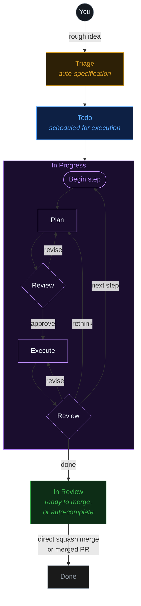

# Fusion

AI-orchestrated task board — specify, execute, and deliver tasks automatically.

Like Trello, but your tasks get specified, executed, and delivered by AI — powered by [pi](https://github.com/badlogic/pi-mono).


**Fusion** turns rough ideas into production code. Describe a task, and an AI agent writes the spec, plans the implementation, writes the code in an isolated git worktree, and merges it — with automatic code review at every step. Manage a single project or coordinate across multiple repositories from one dashboard.

## Documentation

For detailed guides, see the [Documentation Index](./docs/README.md).

| Guide | What it covers |
|---|---|
| [Getting Started](./docs/getting-started.md) | Installation and onboarding |
| [Dashboard Guide](./docs/dashboard-guide.md) | Board/list views, terminal, git manager |
| [Task Management](./docs/task-management.md) | Task lifecycle and CLI commands |
| [Settings Reference](./docs/settings-reference.md) | Configuration options |
| [Architecture](./docs/architecture.md) | System internals |
| [Agents](./docs/agents.md) | Agent management, spawning, heartbeat |
| [Workflow Steps](./docs/workflow-steps.md) | Quality gates, templates, phases |
| [Missions](./docs/missions.md) | Mission hierarchy, planning, autopilot |
| [Multi-Project](./docs/multi-project.md) | Central registry, isolation modes |

For Docker deployment, see [docs/docker.md](./docs/docker.md).

## Quick Start

1. **Install:**
   ```bash
   npm i -g @gsxdsm/fusion
   ```

2. **Initialize (or just start the dashboard):**
   ```bash
   fn dashboard
   ```

3. **Open** [http://localhost:4040](http://localhost:4040) — create tasks from the board or the CLI.

### First-run Setup

On first launch, Fusion automatically opens the **onboarding wizard** with three guided steps:

1. **AI Setup** — Connect an AI provider and choose a default model
2. **GitHub (Optional)** — Connect GitHub for issue import and PR management
3. **First Task** — Create your first task or import from GitHub

The wizard is **dismissible and non-blocking** — click **Skip for now** to dismiss it and use the dashboard immediately. You can also re-trigger onboarding later from **Settings → Authentication → Reopen onboarding guide**.

### Prerequisites

The AI engine uses [pi](https://github.com/badlogic/pi-mono) under the hood:

1. `npm i -g @mariozechner/pi-coding-agent`
2. Run `pi` and use `/login`, or set `ANTHROPIC_API_KEY`

Fusion reuses your existing pi authentication.

### Mobile

For Capacitor + PWA workflow, see [MOBILE.md](./MOBILE.md).

## Mailbox

Fusion includes a **Mailbox** feature for async messaging between users and agents. Unlike the realtime chat view, Mailbox provides email-like asynchronous messaging:

- **Inbox** — View messages grouped by conversation with unread indicators
- **Outbox** — Track sent messages
- **Agents** — Send messages directly to agents
- **Unread Badge** — Header shows unread count without opening Mailbox

Navigate to Mailbox via the header view toggle or mobile bottom nav tab.

## Workflow



Tasks with dependencies are processed sequentially. Independent tasks run in parallel.

In **Triage**, an AI agent reads your project, understands context, and writes a full `PROMPT.md` specification — steps, file scope, acceptance criteria. Optionally require manual approval before tasks move to **Todo** (`requirePlanApproval` setting).

## Core Features

- **AI Specification** — Triage agent generates detailed `PROMPT.md` with steps, file scope, and acceptance criteria
- **Step-by-step Execution** — Plan → Review → Execute → Review cycle for each task step
- **Git Worktree Isolation** — Each task runs in its own worktree (`fusion/{task-id}` branch)
- **Workflow Steps** — Configurable quality gates (pre-merge: blocks merge; post-merge: informational)
- **GitHub Integration** — Import issues, create PRs, real-time PR/issue badges
- **Dashboard** — Real-time kanban board, agent management, terminal, git manager, mission planner
- **Missions** — Hierarchical planning (Mission → Milestone → Slice → Feature → Task) with autopilot
- **Multi-Project** — Manage multiple projects from a single installation with project isolation
- **Inter-Agent Messaging** — Built-in messaging for coordination between agents and users

### Model System

Fusion uses a dual-scope model hierarchy with five independent lanes. Global settings define baseline defaults, and project settings provide per-project overrides.

**Lanes:**

| Lane | Purpose | Global Baseline Keys | Project Override Keys |
|------|---------|---------------------|----------------------|
| Executor | Task execution agent | `executionGlobalProvider` + `executionGlobalModelId` | `executionProvider` + `executionModelId` |
| Planning/Triage | Task specification agent | `planningGlobalProvider` + `planningGlobalModelId` | `planningProvider` + `planningModelId` |
| Validator | Plan/code reviewer | `validatorGlobalProvider` + `validatorGlobalModelId` | `validatorProvider` + `validatorModelId` |
| Title Summarization | Auto-title generation | `titleSummarizerGlobalProvider` + `titleSummarizerGlobalModelId` | `titleSummarizerProvider` + `titleSummarizerModelId` |
| Workflow Step Refinement | AI prompt refinement | (uses `defaultProvider`/`defaultModelId`) | (uses `modelProvider`/`modelId` on WorkflowStep) |

**Per-Task Overrides:** Tasks can override the executor, validator, and planning lanes with per-task model fields (`modelProvider`/`modelId`, `validatorModelProvider`/`validatorModelId`, `planningModelProvider`/`planningModelId`).

**Precedence:** Per-task → Project override → Global lane → `defaultProvider`/`defaultModelId` → Automatic resolution.

For full settings documentation, see [Settings Reference](./docs/settings-reference.md).

### Quick Examples

```bash
fn task create "Fix the login bug"                    # Quick entry → triage
fn task plan "Build auth system"                      # AI-guided planning
fn task import owner/repo --labels bug               # Import GitHub issues
fn task show FN-001                                  # View task details
fn task logs FN-001 --follow                         # Stream execution logs
fn task steer FN-001 "Use TypeScript"               # Guide the agent mid-execution

fn project add my-app /path/to/app                   # Register a project
fn project list                                      # List all projects

fn settings set maxConcurrent 4                      # Configure settings
fn settings export                                   # Export configuration

fn mission create "Auth System" "Build auth"         # Create mission
fn mission activate-slice <slice-id>                # Activate a slice
```

## Packages

| Package | Description |
|---------|-------------|
| `@fusion/core` | Domain model — tasks, board columns, SQLite store |
| `@fusion/dashboard` | Web UI — Express server + kanban board with SSE |
| `@fusion/engine` | AI engine — triage, execution, scheduling, workflow steps |
| `@fusion/tui` | Terminal UI — Ink-based CLI components |
| `@gsxdsm/fusion` | CLI + pi extension — published to npm |

## Development

```bash
pnpm install                  # Install dependencies
pnpm build                    # Build all packages
pnpm dev dashboard            # Run dashboard + AI engine
pnpm dev:ui                   # Dashboard only (no AI engine)
pnpm lint                     # Lint all packages
pnpm typecheck                # Type-check all packages
pnpm test                     # Run all tests
```

### Building a Standalone Executable

Build a single self-contained `fn` binary using [Bun](https://bun.sh/):

```bash
pnpm build:exe                # Build for current platform
pnpm build:exe:all            # Cross-compile for all platforms
```

## Releases

Packages are published to npm automatically via GitHub Actions and [changesets](https://github.com/changesets/changesets).

```bash
npm install -g @gsxdsm/fusion
```

See [RELEASING.md](./RELEASING.md) for the full workflow.

## License

ISC
