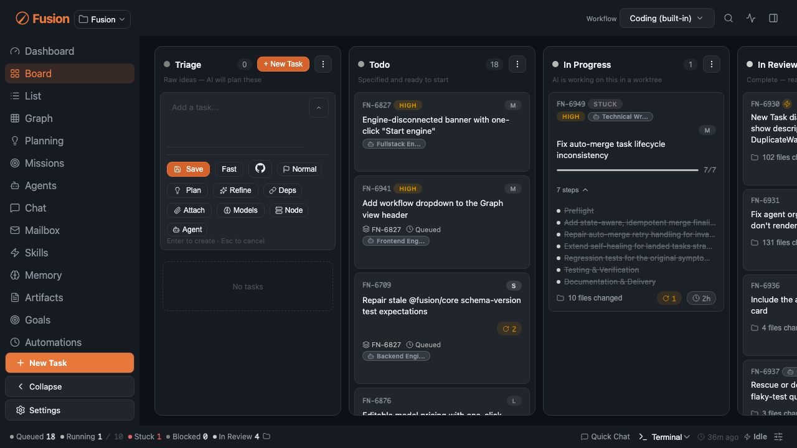
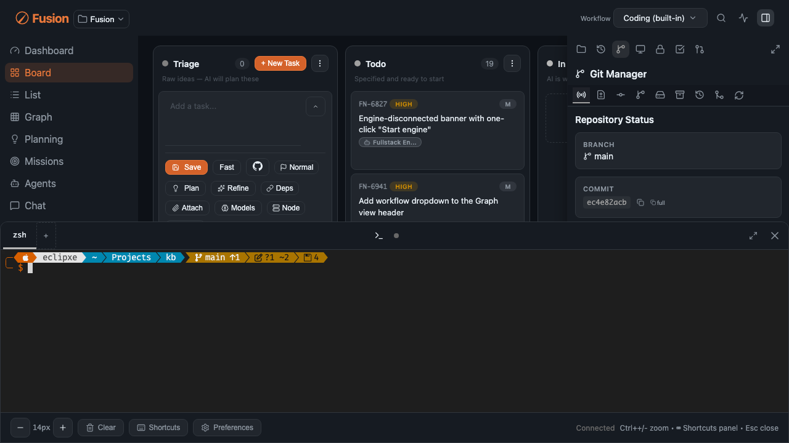
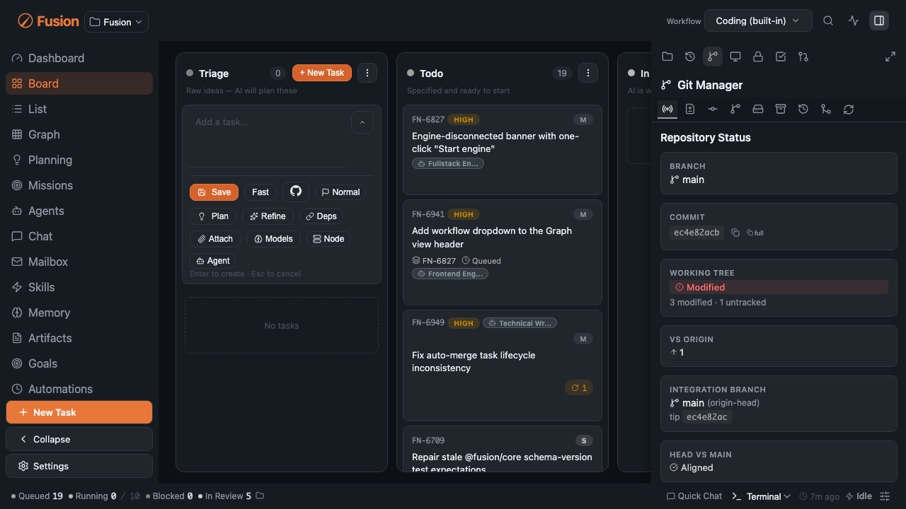
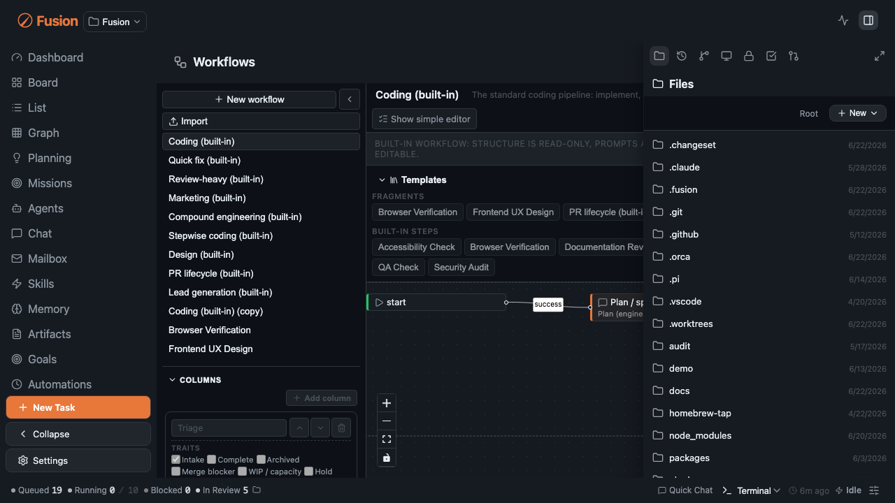
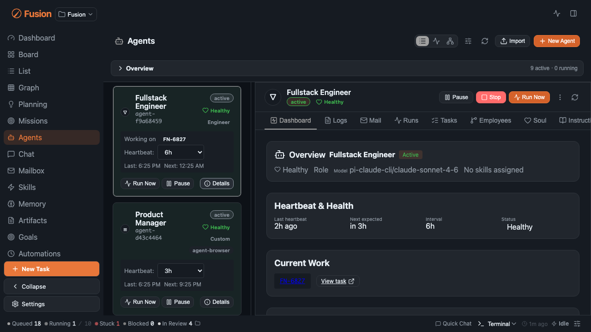
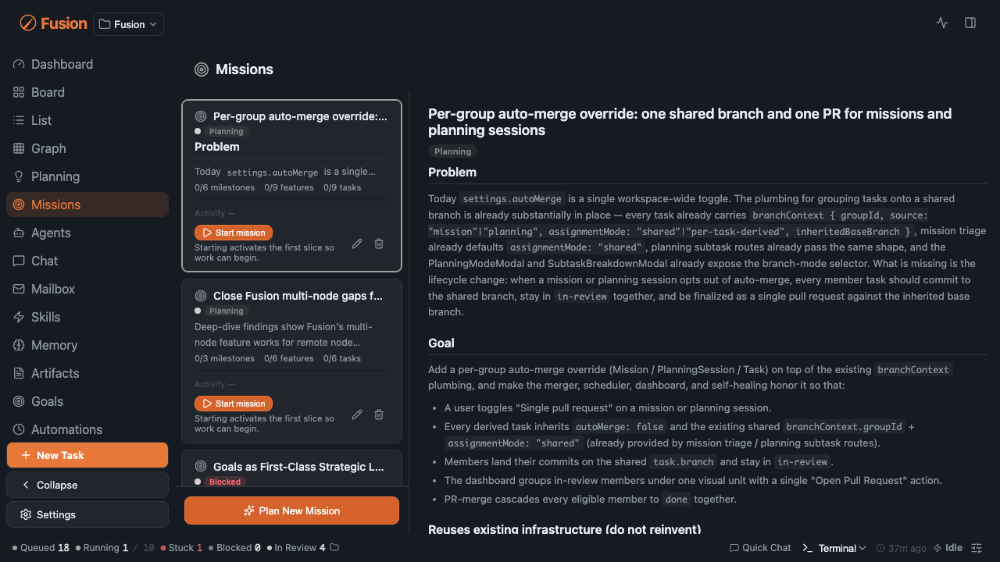
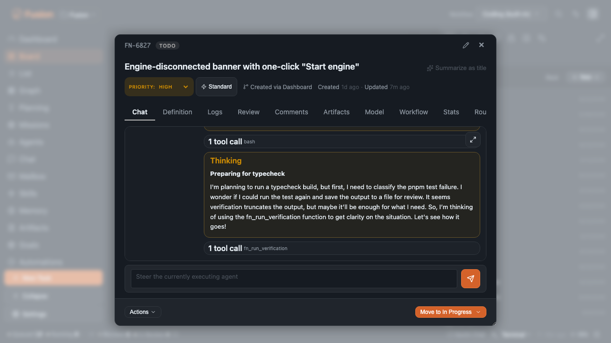

# Dashboard Guide

[← Docs index](./README.md)

The Fusion dashboard is the main control plane for tasks, agents, missions, settings, logs, and repository operations.

## Board View

Board view is the kanban surface for day-to-day operation.

Features:

- Drag-and-drop between lifecycle columns
- Search/filter tasks
- Column visibility controls
- Inline quick entry creation
- PR/issue badges with live updates

## List View

List view is optimized for dense task management.

Features:

- Grouping modes (for example by column/size)
- Inline title editing
- Duplicate task actions
- Quick scanning of metadata without card expansion

## Interactive Terminal

Fusion embeds a terminal using xterm.js.

Features:

- Multiple terminal tabs
- PTY-backed shell sessions
- Mobile-aware virtual keyboard handling and auto-refit behavior

## Git Manager

Git manager centralizes repo operations in the dashboard.

Features:

- Branch/worktree visibility
- Commit and diff browsing
- Push/pull/fetch actions
- Remote editing controls

## File Browser and Editor

Built-in file tools allow quick inspection and edits.

Features:

- Browse project root and task worktrees
- Open files in an editor with syntax highlighting
- Navigate artifacts generated during task execution

## Activity Log

The activity log tracks task/system events over time.

Features:

- Event type filtering
- Auto-refresh updates
- Operational traceability for task moves, merges, settings updates, and errors

## Theme System

Visual customization includes:

- Theme mode: dark/light/system
- **30 color themes** (including Ocean, Forest, Nord, Dracula, Gruvbox, Tokyo Night, and more)

Theme preferences are stored in global settings.

## Usage Dialog

Usage view shows provider consumption and limits.

Features:

- Progress bars by provider/model
- Reset window visibility
- Helps diagnose capacity/rate-limit conditions

## Spec Editor

The spec editor lets you edit `PROMPT.md` directly.

Features:

- Manual prompt edits
- AI revision requests
- Rebuild/regenerate flows when task intent changes

## Planning Mode

Planning mode is an AI interview workflow for shaping task scope.

Features:

- Clarification Q&A
- Summary generation
- Two final actions: **Create Task** or **Break into Tasks**
- Multi-task creation uses key deliverables and dependency linking

### Session Lifecycle

- **Send to Background** — Hides the modal but preserves the session server-side. The session continues running and can be resumed from the Background Sessions panel.
- **Close (X button or Escape)** — Explicitly abandons the session on the server. The AI stops processing and the session is terminated. Use this when you want to cancel without saving progress.
- **Session Persistence** — Planning sessions that are actively running (generating, awaiting input, complete, or error) appear in the Background Sessions panel and can be resumed.

## Subtask Breakdown Dialog

The subtask dialog supports structured decomposition before creation.

Features:

- AI-generated subtasks
- Drag-and-drop reordering
- Keyboard reordering controls
- Dependency linking constrained to earlier items

### Session Lifecycle

- **Send to Background** — Hides the modal but preserves the session server-side. The session continues running and can be resumed from the Background Sessions panel.
- **Close (X button or Cancel)** — Explicitly abandons the session on the server. The AI stops processing and the session is terminated. Confirmation is shown if there are unsaved changes.

## Settings Modal

Central place for model/provider config, execution behavior, notifications, backups, and UI preferences.

## Workflow Step Manager

Create and manage reusable quality gates for tasks.

## Agents View

Inspect agents, runtime status, run history, and configuration.

## Mission Manager

Manage mission hierarchy and progression state.

## Task Detail Modal

Inspect logs, step progress, workflow outcomes, and model overrides.

