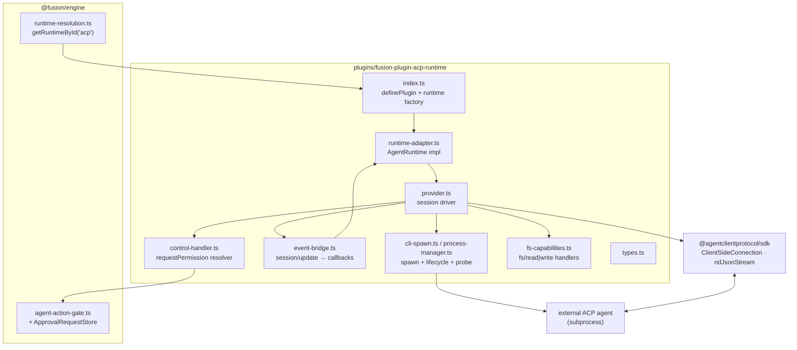
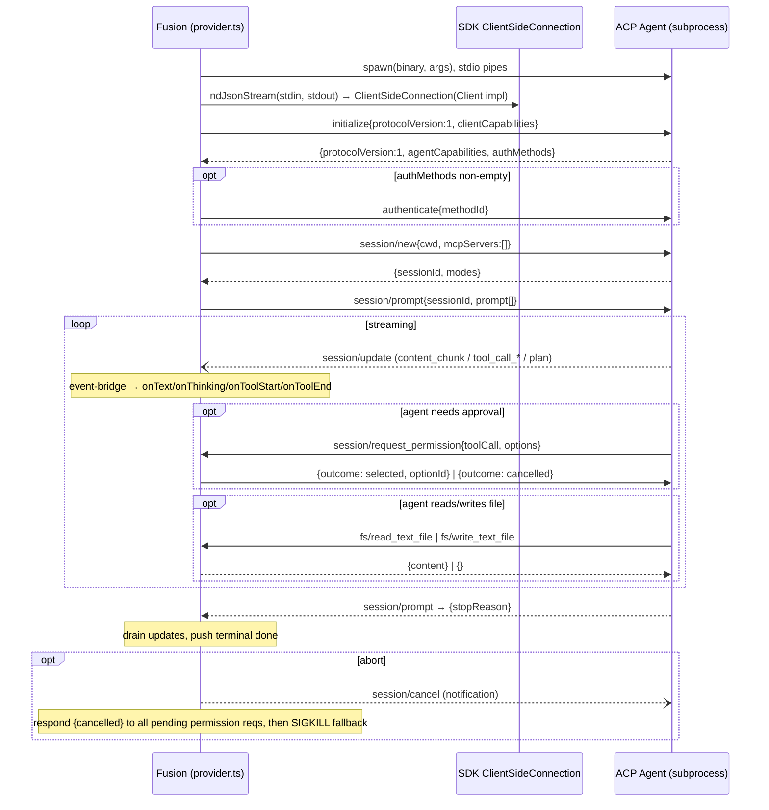

# feat: Add ACP (Agent Client Protocol) client integration

## Summary

Add a new `plugins/fusion-plugin-acp-runtime` plugin that lets Fusion drive **any** external Agent-Client-Protocol agent over JSON-RPC/stdio: spawn the agent subprocess, negotiate the `initialize` handshake, open and prompt sessions, stream `session/update` notifications into Fusion's runtime callbacks, and route the agent's `session/request_permission` requests into Fusion's permission/approval surface. Built generically against the official `@agentclientprotocol/sdk` (no single reference agent), validated in CI against the SDK's example echo agent.

---

## Problem Frame

Fusion's thesis (see `STRATEGY.md`) is to be the model- and surface-agnostic orchestration layer, with a plugin ecosystem so it adapts as agents evolve. Today every agent integration is bespoke: `plugins/fusion-plugin-droid-runtime` drives the Droid CLI, `fusion-plugin-cursor-runtime` drives Cursor, `fusion-plugin-hermes-runtime`, `fusion-plugin-openclaw-runtime`, and `packages/pi-claude-cli` (now a thin shim) each hand-roll a subprocess transport, a stdout parser, and an event bridge for one specific tool.

ACP is an open, versioned protocol (Zed Industries; protocol version `1`) that standardizes exactly this client↔agent contract. A single ACP-client integration unlocks **every** ACP-compatible agent — Gemini CLI, the Claude Code ACP adapter, and any future agent that speaks the protocol — through one well-specified surface instead of N bespoke ones. This is the highest-leverage expression of the "ecosystem breadth" and "neutral by design" tracks.

Two facts from research make this a distinct shape from the existing integrations:

1. Every current integration is **one-shot / request-scoped** (write one NDJSON turn, read stdout, force-kill). ACP is a **persistent, bidirectional JSON-RPC peer** over stdio: the agent calls *back into the client* mid-turn (permission prompts, filesystem reads). The transport core is genuinely new.
2. The official `@agentclientprotocol/sdk` (TypeScript, Apache-2.0, production-stable) provides the transport, framing, connection classes, and types — so the new work is integration and mapping, not protocol plumbing from scratch.

This plan covers the **client** direction only (Fusion drives external agents). The reverse direction (Fusion exposing *itself* as an ACP agent for editors like Zed) is explicitly out of scope.

---

## Requirements

- **R1** — Fusion can launch a configured ACP agent binary as a subprocess and complete the `initialize` capability handshake, including integer protocol-version negotiation and a readiness timeout.
- **R2** — Fusion can open a session (`session/new`), send a user turn (`session/prompt`), and receive the terminal `stopReason`.
- **R3** — Streaming `session/update` notifications (agent text, reasoning, tool calls, plan) are mapped onto the existing `AgentRuntime` callbacks (`onText`, `onThinking`, `onToolStart`, `onToolEnd`) so ACP agents appear in Fusion's UI/logs identically to existing runtimes.
- **R4** — The agent's `session/request_permission` requests are answered according to Fusion's agent permission policy, with correct cancellation semantics.
- **R5** — Run teardown (engine stuck-task detection / executor timeout) invokes the runtime's `dispose()` and force-kills the subprocess; no orphaned processes survive. A best-effort `session/cancel` + pending-permission drain runs first when teardown timing allows, but the **process-registry SIGKILL is the authoritative no-orphan / no-deadlock guarantee** — see KTD4a.
- **R6** — The plugin ships inside the published `@runfusion/fusion` CLI and is discoverable/selectable via the existing plugin-runtime resolution path (`runtimeId: "acp"`).
- **R7** — The integration is validated in CI with no API keys or network: the SDK example echo agent covers handshake + text passthrough, and a small **controllable in-repo fixture agent** deterministically exercises the security-floor paths the echo agent never reaches — `session/request_permission` (allow/deny/post-cancel), `fs/read|write`, `tool_call_*` updates, full-replace `plan` updates, and cancel-mid-prompt. Real agents (Gemini CLI, the Claude-adapter) remain manual e2e.
- **R8** — Third-party-integration evidence (upstream repo, docs, release, binary name, checksum/marker) is recorded per `AGENTS.md`.

**Success criteria:** a user can configure an ACP agent, assign a Fusion task/agent to `runtimeId: "acp"`, and watch the agent stream text + tool calls and honor the user's permission policy — with the same lifecycle guarantees (abort, no orphans) as the Droid/Cursor runtimes.

---

## Key Technical Decisions

- **KTD1 — Build as a runtime plugin (`plugins/fusion-plugin-acp-runtime`), not a `packages/*-cli` package.** Research confirmed the `packages/pi-claude-cli` / `droid-cli` packages are now thin compatibility shims; the canonical integration shape is a first-class plugin under `plugins/` using `@fusion/plugin-sdk`'s `definePlugin` with a `runtime` manifest + `AgentRuntime` adapter (see `plugins/fusion-plugin-droid-runtime` and `fusion-plugin-cursor-runtime`). This is the resolution of the planning-time "integration shape" fork: follow the established plugin-runtime pattern for consistency and discovery (`getRuntimeById`). The dashboard `uiSlots` cards (settings/onboarding) are available via the same shape but are deferred to follow-up in v1 (see Scope Boundaries) — the runtime is selectable without them.

- **KTD2 — Depend on `@agentclientprotocol/sdk` (Apache-2.0), API-verified at install; do not hand-roll JSON-RPC or vendor schema.** The SDK provides `ClientSideConnection`, the `Client` interface, `ndJsonStream`, the `PROTOCOL_VERSION` constant, and all request/response types tracking the canonical schema. Hand-rolling newline-delimited JSON-RPC framing or vendoring types would duplicate a maintained dependency. **Caveat:** the SDK is v0.24.0, released 2026-06-02 and not yet installed here — "stable" is an external claim, not verified locally. Pin the version and **verify the named exports at install (U1) before designing against them** — a breaking export collapses U2 and the no-plumbing premise, so it is a U1 blocker. License is compatible with the repo (MIT workspace). Per `AGENTS.md` external-integration evidence, the dependency and the agent binaries it targets must be cited in PROMPT.md. _(see external research: agentclientprotocol.com, npm `@agentclientprotocol/sdk`.)_

- **KTD3 — Consume the gate context Fusion already threads into every runtime; no contract change.** The ACP `Client.requestPermission` handler must answer synchronously (the agent blocks on it). The engine's canonical `AgentRuntimeOptions` (`packages/engine/src/agent-runtime.ts:35-106`) **already carries `actionGateContext?: AgentActionGateContext`** (line 103), it is **already populated per-run** at every call site via `buildActionGateContext(...)` (`executor.ts:4303/4720/3630`, `agent-heartbeat.ts:2579`, `step-session-executor.ts`), and it **already reaches the runtime** through the single funnel `createResolvedAgentSession` (`agent-session-helpers.ts:335`). `AgentActionGateContext` (`agent-action-gate.ts:30`) already bundles `permissionPolicy` plus the closures the HITL flow needs (`createApprovalRequest`, `findApprovalByDedupeKey`, `pauseForApproval`, `markApprovalCompleted`). So the ACP runtime simply **reads `options.actionGateContext`** in `createSession`, persists it on the session, and the `requestPermission` handler classifies each call via `evaluateAgentActionGate` + `resolveGateOutcome`. _(This corrects an earlier premise that the shared contract had no permission channel — it does, and `plugins/fusion-plugin-droid-runtime/src/types.ts:110` is a plugin-local structural copy the engine never imports. The discarded alternative of adding an `onPermissionRequest?` callback to the contract is unnecessary and would create a redundant second channel to the same approval store.)_ To keep the boundary clean, the plugin depends on a **narrow local `PermissionGate` interface** (the closures + policy it uses), accepting the structurally-compatible `actionGateContext` rather than importing `@fusion/engine` internals.

- **KTD3a — Per-category gating is the v1 floor, not a deferred enhancement (security-critical).** Fusion's shipped default policy is `unrestricted` (`DEFAULT_AGENT_PERMISSION_POLICY_PRESET_ID = "unrestricted"`), which maps every action category to `allow`. A naive preset→outcome mapping would therefore auto-approve **every** tool call of an untrusted external subprocess the moment a user selects the ACP runtime without changing policy. The `requestPermission` floor (U5) must classify each `toolCall.kind` into a gate category and consult the **per-category disposition** (`permissionPolicy.rules[category]`), never the preset id: categories set to `block` reject, `require-approval` either routes to the HITL approval flow or — when no human channel is available — **default-denies**, and only categories explicitly `allow` auto-approve. ACP's `toolCall.kind` is agent-defined, optional, and partial (U4); a **missing or unmappable `kind` must map to the most-restrictive category and default-deny**, never fall through to allow — otherwise an unclassifiable call under the `unrestricted` default reopens S1. See Risk S1.

- **KTD4 — Reuse the proven subprocess hardening conventions verbatim.** Self-cleaning process registry (`registerProcess`/`killAllProcesses` on `exit`), async non-blocking presence/auth probes (resolve timeout code `124` / ENOENT `127`), stderr buffering surfaced on non-zero exit, and a high inactivity ceiling (the engine's `StuckTaskDetector` is the authoritative aborter). `killAll` is scoped to agent subprocesses only — never the dashboard/port-4040 (per existing kill-guard conventions).

- **KTD4a — Teardown enters via synchronous `dispose()`, not a threaded `AbortSignal`; graceful cancel is opportunistic.** The canonical `AgentRuntime` contract (`packages/engine/src/agent-runtime.ts`) carries **no** `AbortSignal`, and the engine invokes teardown as an **unawaited synchronous `session.dispose()`** (`StuckTaskDetector`, executor timeout race) plus the `process.on("exit")` registry kill — the Droid adapter's `promptWithFallback` ignores its options arg entirely. So ACP cannot rely on an `AbortSignal` arriving via `promptWithFallback`. The ACP `dispose()` issues a best-effort `session/cancel` and resolves already-pending `requestPermission` promises with `{ cancelled }` synchronously, but because `dispose()` is not awaited, the JSON-RPC notification flush and any grace window may not complete — **the real guarantee is the registry SIGKILL.** "No agent deadlock" rests on the kill, not the drain; the drain is opportunistic cleanup. The plan does not assume a graceful round-trip the engine cannot await.

- **KTD5 — v1 passes an empty `mcpServers` at `session/new`; Fusion-custom-tool forwarding via MCP is deferred.** Keeps v1 bounded. The agent operates over its `cwd` (the task worktree). Forwarding Fusion's custom pi-tools to the ACP agent (reusing the `mcp-config.ts` + `mcp-schema-server.cjs` schema-server machinery) is follow-up work. _(Confirmed scope decision.)_

- **KTD6 — Filesystem client capabilities are config-gated and default to a conservative posture (security-critical).** Many ACP agents rely on client-side `fs/read_text_file` / `fs/write_text_file` when sandboxed, but granting an untrusted subprocess read+write into the worktree by default is the wrong posture. Therefore: capabilities are advertised in `initialize` **only when the resolved settings enable them** (U2 reads the toggle, never hardcodes `true`); **`writeTextFile` defaults OFF** (opt-in per agent/project); `fs/write_text_file` is treated as a `file_write_delete` action-gate category (subject to the same permission policy as U5), not a free capability; and path access is confined by a dedicated realpath-resolving jail (see KTD6a). Terminal capabilities (`terminal/create`, `terminal/output`, …) are deferred — see KTD6b for the trust-boundary consequence.

- **KTD6a — Filesystem confinement uses a real symlink-resolving jail, not a string-prefix check.** `packages/core/src/project-root-guard.ts` is a `.fusion`-suffix / git-worktree string check, **not** a path jail — it must not be reused for fs confinement. A dedicated `assertPathWithinCwd` helper must: resolve the real path with `fs.realpath` (following all symlinks), verify it is within the realpath of the session `cwd`, perform the check and the open atomically (`O_NOFOLLOW` on the final component or open-then-`fstat`-validate) to close TOCTOU, reject absolute paths / NUL bytes / separator tricks, and apply a **deny-list regardless of cwd membership**: hard-reject writes to `.git/**` (esp. `.git/hooks`, `.git/config` → RCE/token surface) and deny or gate reads of secret patterns (`.env*`, `*.pem`, `*.key`, `.npmrc`, `.netrc`, `id_*`, `credentials`) that legitimately live inside the worktree. See Risk S3.

- **KTD6b — The agent's native syscalls are NOT sandboxed in v1; state the real trust boundary.** ACP permissions (U5) and fs confinement (U7) constrain only *protocol-mediated* actions. The agent subprocess runs with Fusion's user privileges and can spawn child processes and reach the network directly (and would fall back to that if it needed the deferred `terminal/*`). v1 mitigations: `cli-spawn.ts` builds the subprocess `env` from an **allow-list**, not inherited `process.env` (strip secret-bearing vars). OS-level sandboxing of the agent process (restricted uid / seccomp / `sandbox-exec` / container) is recommended but deferred. See Risk S6.

---

## High-Level Technical Design

### Component shape

The plugin mirrors the `fusion-plugin-droid-runtime` module split, with the bespoke NDJSON transport replaced by the ACP SDK connection.



### Protocol lifecycle (one prompt turn)



_Diagrams render authoritative design intent; prose governs on any disagreement._

---

## Output Structure

```
plugins/fusion-plugin-acp-runtime/
├── manifest.json                 # id + runtime{ runtimeId:"acp" }
├── package.json                  # @agentclientprotocol/sdk dep; pi peerDeps; private
├── tsconfig.json
├── vitest.config.ts
├── README.md                     # integration notes + UPSTREAM evidence
├── src/
│   ├── index.ts                  # definePlugin: manifest + runtime factory + uiSlots
│   ├── runtime-adapter.ts        # AgentRuntime: createSession/promptWithFallback/describeModel/dispose
│   ├── provider.ts               # ACP session driver (connection, prompt, lifecycle)
│   ├── cli-spawn.ts              # resolveCliSettings (binary, args, acp flag)
│   ├── process-manager.ts        # spawn, registry, dispose→cancel→kill, stderr, idle timeout
│   ├── probe.ts                  # async presence/handshake readiness probe + failure taxonomy
│   ├── prompt-builder.ts         # build ACP ContentBlock[] from prompt (text/image)
│   ├── event-bridge.ts           # session/update → AgentRuntime callbacks (+ output bounds)
│   ├── tool-mapping.ts           # ACP tool kind/title → display name; arg normalization
│   ├── control-handler.ts        # requestPermission: per-category gate resolver + HITL
│   ├── fs-capabilities.ts        # fs/read_text_file + fs/write_text_file handlers
│   ├── path-jail.ts              # assertPathWithinCwd: realpath jail + deny-list
│   ├── sanitize.ts               # strip ANSI/control from untrusted agent strings
│   ├── types.ts                  # ACP-adjacent local types + local PermissionGate
│   └── __tests__/                # one *.test.ts per module
└── (no mcp-schema-server.cjs in v1 — MCP forwarding deferred, KTD5)
```

The per-unit `**Files:**` lists are authoritative; this tree is the scope declaration.

---

## Implementation Units

### U1. Scaffold the `fusion-plugin-acp-runtime` plugin and wire it into the workspace

**Goal:** A loadable, empty-but-valid runtime plugin registered as `runtimeId: "acp"`, with the ACP SDK dependency installed.

**Requirements:** R6, R8 (partial)

**Dependencies:** none

**Files:**
- `plugins/fusion-plugin-acp-runtime/manifest.json` (new)
- `plugins/fusion-plugin-acp-runtime/package.json` (new) — add `@agentclientprotocol/sdk` dependency, `@fusion/plugin-sdk` workspace dep, pi peerDeps, `private: true`, `keywords: ["fusion-plugin","acp","runtime"]`
- `plugins/fusion-plugin-acp-runtime/tsconfig.json`, `vitest.config.ts` (new)
- `plugins/fusion-plugin-acp-runtime/src/index.ts` (new) — `definePlugin({ manifest, runtime: { metadata, factory }, uiSlots })`
- `plugins/fusion-plugin-acp-runtime/src/runtime-adapter.ts` (new) — `AgentRuntime` skeleton
- `plugins/fusion-plugin-acp-runtime/src/types.ts`, `cli-spawn.ts` (new)
- `pnpm-workspace.yaml` (modify) — add `plugins/fusion-plugin-acp-runtime`
- `plugins/fusion-plugin-acp-runtime/src/__tests__/index.test.ts` (new)

**Approach:** **First, verify the SDK.** `@agentclientprotocol/sdk` v0.24.0 was released 2026-06-02 (the plan's authoring day) and is not yet installed in the workspace — so before anything is designed against it, install it and add a smoke-import test asserting the load-bearing exports exist with the assumed shapes (`ClientSideConnection`, `ndJsonStream`, `PROTOCOL_VERSION`, the `Client` interface). A missing/renamed export is a **U1 blocker**, not a late surprise in U2 — the whole "no protocol plumbing from scratch" premise (KTD2) depends on these. Then mirror `plugins/fusion-plugin-droid-runtime/src/index.ts` and `manifest.json`: runtime metadata `{ runtimeId: "acp", name: "ACP Runtime", … }`; `runtime-adapter.ts` implements the **full** `AgentRuntime` interface (`plugins/fusion-plugin-droid-runtime/src/types.ts:128`) — `createSession`, `promptWithFallback`, **`describeModel` (required — returns e.g. the agent binary name + negotiated mode)**, and `dispose` — with stubs that throw `not_implemented` until later units. `cli-spawn.ts` provides `resolveCliSettings(settings)` returning `{ binaryPath, args, env }` from plugin settings.

**Patterns to follow:** `plugins/fusion-plugin-droid-runtime` (index, manifest, package.json, runtime-adapter shape including `describeModel`).

**Test scenarios:**
- **SDK smoke-import:** `ClientSideConnection`, `ndJsonStream`, and `PROTOCOL_VERSION` are importable from `@agentclientprotocol/sdk` and have the expected shapes; a missing export fails the test (blocks the unit).
- Plugin module default-export is a valid `FusionPlugin`; `manifest.runtime.runtimeId === "acp"`.
- `definePlugin` does not throw at import; `runtime.factory(ctx)` returns an object conforming to `AgentRuntime` (has `id`, `name`, `createSession`, `promptWithFallback`, **`describeModel`**).
- `resolveCliSettings` returns defaults when given `undefined` and honors an explicit `binaryPath`/`args` override.
- Test expectation for stubs: `createSession`/`promptWithFallback` reject with a recognizable `not_implemented` marker (placeholder until U3).

---

### U2. ACP transport, handshake, and subprocess lifecycle

**Goal:** Spawn the agent, establish a `ClientSideConnection`, complete `initialize` with version negotiation and a readiness timeout, and provide hardened spawn/abort/teardown with a presence probe.

**Requirements:** R1, R5

**Dependencies:** U1

**Files:**
- `plugins/fusion-plugin-acp-runtime/src/process-manager.ts` (new) — `spawnAgent`, process registry (`registerProcess`/`killAllProcesses`), `forceKill`, stderr capture, idle timeout
- `plugins/fusion-plugin-acp-runtime/src/probe.ts` (new) — async `validateAgentPresence` / `validateAcpReadiness`
- `plugins/fusion-plugin-acp-runtime/src/provider.ts` (new, partial) — `connect()`: `spawn` → `ndJsonStream(Writable.toWeb(stdin), Readable.toWeb(stdout))` → `new ClientSideConnection(clientImpl, stream)` → `initialize`
- `plugins/fusion-plugin-acp-runtime/src/__tests__/process-manager.test.ts`, `probe.test.ts`, `provider-handshake.test.ts` (new)
- `package.json` (modify) — devDependency on the ACP SDK example agent (or pin a tiny in-repo echo agent fixture)
- `plugins/fusion-plugin-acp-runtime/src/__tests__/fixtures/controllable-agent.ts` (new) — a deterministic in-repo ACP agent that, on command, issues `session/request_permission`, `fs/read|write`, `tool_call_*`, `plan` replacement, and a post-cancel permission request, so U5/U6/U7 security-floor tests run against a real callback-capable peer (R7)

**Approach:** Spawn with `stdio: ["pipe","pipe","pipe"]`, building the subprocess `env` from an **allow-list** (not inherited `process.env`) so secret-bearing vars are not handed to the untrusted agent (KTD6b). Wrap Node streams via `Writable.toWeb`/`Readable.toWeb` for `ndJsonStream`. Send `initialize{ protocolVersion: PROTOCOL_VERSION, clientCapabilities: { fs: <gated> } }` where the `fs` capability flags are **read from resolved settings, never hardcoded `true`** — advertise `readTextFile`/`writeTextFile` only when enabled, and only because the U7 handlers exist (KTD6). Compare the agent's returned integer `protocolVersion`; if unsupported, close and surface a typed error (do not assume the agent errors first). Guard `initialize()` with a timeout (research notes Gemini-on-macOS and Claude-adapter stalls). For `authMethods` requiring interactive credentials, surface to the user rather than auto-supplying from ambient env; the auth handler must **not** read credentials from `process.env` (the env allow-list strips the *subprocess* env, not Fusion's own handler), credentials collected interactively are held **in-memory for the session lifetime only** (never written to disk), and **tokens/auth payloads are redacted from the stderr buffer and logs** (KTD4's stderr-on-failure surfacing would otherwise leak auth errors verbatim — Risk S8). If no interactive auth surface exists in v1, reject with a descriptive error rather than building an undeclared UI. Process registry self-cleans on `proc.on("exit")`; `process.on("exit", killAllProcesses)` registered in `index.ts`. Teardown is registry-SIGKILL-authoritative with best-effort `session/cancel` (KTD4a); the registry kill is what removes the process, not the cancel round-trip. Idle ceiling high (engine is authoritative aborter). Probe failure taxonomy: missing binary (`127`), handshake timeout (`124`), incompatible protocol version, unauthenticated.

**Execution note:** Start with a failing integration test driving the SDK example echo agent through `initialize`.

**Patterns to follow:** `plugins/fusion-plugin-droid-runtime/src/process-manager.ts` (registry, async probes, stderr buffering, kill grace); `probe.ts` failure-taxonomy pattern; `docs/cursor-cli-contract.md`.

**Test scenarios:**
- Happy path: spawning the example agent and sending `initialize` returns a compatible `protocolVersion` and agent capabilities.
- Version mismatch: agent returns an unsupported integer → connection closes with a typed `incompatible_protocol` error, no hang.
- `initialize` timeout: agent never responds → rejects with `handshake_timeout` within the bound; subprocess force-killed.
- Spawn failure: nonexistent binary → probe resolves `missing_binary` (`127`), never throws into the event loop.
- Abort during handshake: `dispose()` / registry teardown → subprocess SIGKILLed, registry entry removed (no `AbortSignal` dependency — KTD4a).
- Registry: two spawned agents both removed from the active set on exit; `killAllProcesses` reaps survivors and does **not** target the dashboard port.
- Capability gating: with fs settings disabled, `initialize` advertises `fs` as absent/false; with them enabled, advertises true.
- Env allow-list: a secret-bearing var present in `process.env` is **not** present in the spawned agent's environment unless explicitly allow-listed.
- Auth redaction: a simulated auth error containing a token does not appear verbatim in captured stderr/logs.

---

### U3. Session lifecycle and prompt driving

**Goal:** Open/reuse a session, send a prompt turn, await `stopReason`, and support cancellation and resume — exposed through the `AgentRuntime` adapter.

**Requirements:** R2, R5

**Dependencies:** U2

**Files:**
- `plugins/fusion-plugin-acp-runtime/src/provider.ts` (modify) — `session/new` (`{ cwd, mcpServers: [] }`), `session/prompt`, `session/cancel`, `session/load`/`session/resume`, `session/close`
- `plugins/fusion-plugin-acp-runtime/src/runtime-adapter.ts` (modify) — `createSession` opens the connection + `session/new`; `promptWithFallback` drives `session/prompt`; `dispose` closes session + tears down process
- `plugins/fusion-plugin-acp-runtime/src/prompt-builder.ts` (new) — build ACP `ContentBlock[]` from the prompt string (text; image passthrough where present)
- `plugins/fusion-plugin-acp-runtime/src/__tests__/provider-session.test.ts`, `runtime-adapter.test.ts`, `prompt-builder.test.ts` (new)

**Approach:** `createSession(options)` connects (U2) and issues `session/new` with `options.cwd`. Persist on the session object: `sessionId`, `cwd`, and **`options.actionGateContext`** (already populated by the engine — KTD3) so the U5 permission handler and U7 fs handlers can reach the live gate and the confinement root. `promptWithFallback(session, prompt)` sends `session/prompt`, resolving the returned promise only after `stopReason` arrives (research pitfall: `session/prompt` resolves *after* all updates are delivered — drain the bridge before reporting done). Map `stopReason` (`end_turn` | `tool_calls` | `cancelled`) to terminal completion. **Teardown enters via `dispose()` (KTD4a), not an `AbortSignal`** — `dispose()` issues a best-effort `session/cancel` **notification** (fire-and-forget; no ack), drains already-pending permission promises with `{ cancelled }` synchronously, then the registry SIGKILL is the authoritative guarantee. Because the engine calls `dispose()` unawaited, treat the cancel/drain as opportunistic, not guaranteed. Resume: prefer `session/load` (replay history) vs `session/resume` (no replay) based on whether prior transcript is needed; expose via the adapter's session-file/resume path.

**Execution note:** Drive a full turn against the example agent before adding mapping detail.

**Patterns to follow:** `plugins/fusion-plugin-droid-runtime/src/runtime-adapter.ts` (createSession/promptWithFallback shape, callback wiring); `provider.ts` terminal-event discipline.

**Test scenarios:**
- Happy path: `createSession` → `promptWithFallback("hello")` against the example agent resolves after `stopReason` with the echoed text delivered via `onText`.
- Cancellation: abort mid-prompt → `session/cancel` sent; promise resolves with a `cancelled` outcome; no further callbacks fire after resolution.
- Resume: a session opened with a prior `sessionId`/transcript uses `session/load`; a no-replay resume uses `session/resume`.
- `dispose` closes the session and tears down the subprocess; idempotent if called twice.
- `createSession` persists `actionGateContext` and `cwd` on the session; both are reachable from a mock `requestPermission` / fs handler.
- Prompt builder: plain text → single text `ContentBlock`; an image-bearing prompt produces an image block; empty prompt handled.
- Ordering: prompt promise does not resolve before the last `session/update` for the turn is drained (guard against truncation).

---

### U4. `session/update` → runtime-callback event bridge

**Goal:** Translate every relevant `session/update` variant into the `AgentRuntime` callbacks so ACP agents render identically to existing runtimes.

**Requirements:** R3

**Dependencies:** U3

**Files:**
- `plugins/fusion-plugin-acp-runtime/src/event-bridge.ts` (new) — `handleSessionUpdate(update, callbacks)`
- `plugins/fusion-plugin-acp-runtime/src/tool-mapping.ts` (new) — ACP tool `kind`/`title` → display name; arg normalization
- `plugins/fusion-plugin-acp-runtime/src/__tests__/event-bridge.test.ts`, `tool-mapping.test.ts` (new)

**Approach:** Discriminate on `sessionUpdate` tag:
- `content` / `content_chunk` (text `ContentBlock`) → `onText`. Apply delta-space normalization across split chunks (known downstream bug in existing bridges).
- thought/reasoning chunk → `onThinking`.
- `tool_call_started` (`ToolCallUpdate`) → `onToolStart(title/kind, rawInput)`; `tool_call_finished` → `onToolEnd(title, status === "failed", rawOutput/content)`. Track calls by stable `toolCallId`; updates are partial (all fields except `toolCallId` optional).
- `plan` → surface as a thinking/log line; **treat each plan update as a full-list replacement, never append** (research pitfall).
- `available_commands_update` / `current_mode_update` / `config_option_update` → store/log; no callback surface in v1.

**Patterns to follow:** `plugins/fusion-plugin-droid-runtime/src/event-bridge.ts` (tolerant partial parse, empty-args → `{}` default, "don't push done early", `normalizeStreamingDelta`).

**Test scenarios:**
- `content_chunk` sequence reconstructs the full agent message via successive `onText` calls; dropped inter-chunk space is repaired.
- A thought chunk routes to `onThinking`, not `onText`.
- Tool-call lifecycle: `tool_call_started` → `onToolStart` with mapped title; later `tool_call_finished` with `status:"failed"` → `onToolEnd(..., isError=true)`; same `toolCallId` correlates start/end.
- Plan update: two successive `plan` updates → the second fully replaces the first (no accumulation/duplication).
- Unknown/forward-compat `sessionUpdate` tag is ignored without throwing.
- Tool mapping: an `execute`-kind call with no `title` falls back to a sensible label; missing `rawInput` does not crash.

---

### U5. `session/request_permission` — per-category gate floor, HITL approval, and cancellation safety

**Goal:** Answer the agent's permission requests by classifying each call through Fusion's action gate (consuming the already-threaded `actionGateContext`), routing `require-approval` to the human approval flow, defaulting safely when no human is available, and guaranteeing pending requests are drained on cancel so the agent never deadlocks.

**Requirements:** R4, R5

**Dependencies:** U3

**Files:**
- `plugins/fusion-plugin-acp-runtime/src/control-handler.ts` (new) — pure resolver `(toolCall, gate) → decision`; defines the narrow local `PermissionGate` interface (the `permissionPolicy` + closures it uses), structurally satisfied by `AgentActionGateContext` (KTD3)
- `plugins/fusion-plugin-acp-runtime/src/provider.ts` (modify) — implement `Client.requestPermission` using the session's persisted `actionGateContext`; track in-flight permission requests; drain on `session/cancel`
- `plugins/fusion-plugin-acp-runtime/src/__tests__/control-handler.test.ts`, `provider-permission.test.ts` (new)

**Approach:** **Classify per call, not per preset (KTD3a — security-critical).** Map the incoming `toolCall.kind` to a gate category (`file_write_delete`, `command_execution`, `network_api`, …) and evaluate it against the live policy via `evaluateAgentActionGate` + `resolveGateOutcome` (from the persisted `actionGateContext`). Outcome handling:
- `allow` → select the **`allow_once`** option (never `allow_always`/`reject_always` — Fusion must re-evaluate every request and never delegate a persisted blanket grant to the untrusted agent; Risk S2). If the expected `*_once` kind is absent from the agent-supplied `options`, fall back to reject — never silently up-grade to an `*_always` option.
- `block` → select the `reject_once` option.
- `wait-for-approval` → run the HITL flow: `createApprovalRequest` → `pauseForApproval` → await the engine's decision (resume via the approval store) → map the decision back to `allow_once` / `reject_once`. On timeout/dismiss, answer `{ outcome: "cancelled" }`. Reuse a prior decision for an identical call via `findApprovalByDedupeKey`.
- **No human channel available** (gate context absent, or a `require-approval` category with no resolvable approver): **default-deny** with a logged reason. Auto-allow is never the fallback.

Respond `{ outcome: { outcome: "selected", optionId } }` or `{ outcome: { outcome: "cancelled" } }`. Maintain a set of pending permission promises; on `session/cancel` (and on subprocess exit), resolve every pending request with `{ outcome: "cancelled" }` before/while tearing down (research pitfall: an in-flight `requestPermission` can arrive after cancel; failing to answer deadlocks the agent).

**Execution note:** This is the security floor for an untrusted subprocess — implement the per-category classification and default-deny test-first; do not ship a preset-level shortcut.

**Patterns to follow:** `plugins/fusion-plugin-droid-runtime/src/control-handler.ts` (pure decision function); `packages/engine/src/agent-action-gate.ts` (`evaluateAgentActionGate`, `resolveGateOutcome`, the `kind`→category mapping); `packages/engine/src/pi.ts` `wrapToolsWithActionGate` for the evaluate→approve→resume shape; `docs/spawn-agent-approval-evaluation.md` (reuse the existing approval flow, don't build parallel infra).

**Test scenarios:**
- Default `unrestricted` policy but a `custom` rule that `block`s `command_execution`: a `command_execution`-kind tool call is **rejected** (per-category honored, not preset-level allowed). _(Covers Risk S1.)_
- A category set to `allow` → resolver selects the `allow_once` option; the `allow_always` option is **never** selected even when offered. _(Covers Risk S2.)_
- `require-approval` category with the HITL flow wired: creates an approval request, `requestPermission` blocks until the decision resolves; granted → `allow_once`, rejected/timeout → `reject_once`/`cancelled`.
- `require-approval` category with **no** resolvable approver / absent gate context → default-deny with logged reason (never auto-allow).
- A tool call with a **missing or unmappable `kind`** → mapped to the most-restrictive category and denied (not allowed), even under the default `unrestricted` preset.
- The `actionGateContext` HITL closures (`pauseForApproval`, `findApprovalByDedupeKey`, `markApprovalCompleted`) are optional on the interface — when absent, the `require-approval` branch default-denies rather than throwing.
- Dedupe: a repeated identical tool call reuses the prior approval decision via the dedupe key.
- An options list missing the expected `*_once` kind → safe fallback to reject, never an `*_always` option, no throw.
- Cancellation drain: two in-flight permission requests + `session/cancel` → both resolved with `{ outcome: "cancelled" }`; a request arriving *after* cancel is answered `cancelled` immediately.

---

### U6. Untrusted-input hardening: output bounds and string sanitization

**Goal:** Bound and sanitize everything the untrusted agent emits so a flooding or malicious agent cannot exhaust resources or inject into Fusion's logs/UI/paths.

**Requirements:** R3, R5

**Dependencies:** U4

**Files:**
- `plugins/fusion-plugin-acp-runtime/src/event-bridge.ts` (modify) — cumulative per-turn `session/update` byte/count caps; per-chunk size cap; truncate-and-flag beyond ceiling instead of unbounded buffering
- `plugins/fusion-plugin-acp-runtime/src/sanitize.ts` (new) — strip ANSI/control sequences from agent-supplied text/titles before logging or rendering; bound identifier length
- `plugins/fusion-plugin-acp-runtime/src/provider.ts` (modify) — never use agent-supplied `sessionId`/`toolCallId` as a filesystem path component without validation (relevant to U3 resume-file path)
- `plugins/fusion-plugin-acp-runtime/src/__tests__/event-bridge-bounds.test.ts`, `sanitize.test.ts` (new)

**Approach:** The agent is untrusted input; the high inactivity ceiling (KTD4) does **not** bound an *actively* flooding agent. Cap cumulative `session/update` volume and per-chunk size at the bridge (Risk S5); cap log volume written from agent text. Treat all agent-supplied strings (`title`, `kind`, plan text, `sessionId`, `toolCallId`, command lists) as untrusted: sanitize control/ANSI sequences before logging/rendering (Risk S7); bound identifier length; never interpolate an agent-supplied id into a filesystem path unvalidated.

**Patterns to follow:** `plugins/fusion-plugin-droid-runtime/src/event-bridge.ts` (delta accumulation) for where the caps slot in.

**Test scenarios:**
- A `session/update` stream exceeding the per-turn byte cap is truncated-and-flagged; memory does not grow unbounded.
- An oversized single content chunk is capped.
- A tool `title` containing ANSI/control escapes is sanitized before it reaches the log/callback.
- An agent-supplied `sessionId` containing path separators is rejected/normalized before any resume-file path uses it.
- The `toolCallId` correlation map is bounded — a flooding agent supplying unbounded unique ids does not grow the map without limit (entries are capped/evicted, not just length-limited).

---

### U7. Client filesystem capabilities with a real path jail (`fs/read_text_file`, `fs/write_text_file`)

**Goal:** Let opted-in agents read/write within the task `cwd` behind a symlink-resolving path jail, with writes subject to the permission policy and a deny-list protecting secrets and git internals.

**Requirements:** R3 (capability surface), R4 (writes gated)

**Dependencies:** U2 (capabilities advertised only when enabled), U3 (session `cwd` + gate context), U5 (write-permission gating)

**Files:**
- `plugins/fusion-plugin-acp-runtime/src/fs-capabilities.ts` (new) — `readTextFile({ path, line?, limit? })`, `writeTextFile({ path, content })`
- `plugins/fusion-plugin-acp-runtime/src/path-jail.ts` (new) — dedicated `assertPathWithinCwd` helper (realpath + atomic open + deny-list); **not** `project-root-guard.ts`
- `plugins/fusion-plugin-acp-runtime/src/provider.ts` (modify) — register handlers on the `Client` impl only when the capability is enabled in settings
- `plugins/fusion-plugin-acp-runtime/src/__tests__/fs-capabilities.test.ts`, `path-jail.test.ts` (new)

**Approach:** Confinement uses the KTD6a jail, not lexical normalization alone: resolve the **real** path via `fs.realpath` (following symlinks), verify it sits within the realpath of session `cwd`, and perform the check and open atomically (`O_NOFOLLOW` final component or open-then-`fstat`) to close TOCTOU. Reject absolute paths, NUL bytes, and separator/encoding tricks. Apply the deny-list regardless of cwd membership: hard-reject writes to `.git/**`; deny or gate reads of secret patterns (`.env*`, `*.pem`, `*.key`, `.npmrc`, `.netrc`, `id_*`, `credentials`). `readTextFile` honors `line`/`limit` **and** a hard byte ceiling when `limit` is absent/huge (Risk S5); returns `{ content }`. `writeTextFile`: **default OFF** (KTD6) — only registered/advertised when settings enable it; enforce a max `content` size; route the write through the action gate as a `file_write_delete` category (U5) so `approval-required`/`locked-down` policies cover it; write atomically within `cwd`; returns `{}`. If a capability is disabled, the agent MUST NOT call it; a call returns a JSON-RPC error (never silently succeed).

**Execution note:** The jail is a security boundary — write `path-jail.ts` test-first, covering symlink escape and TOCTOU, not just `../`.

**Patterns to follow:** **not** `project-root-guard.ts` (it is a `.fusion`-suffix string check, not a path jail — KTD6a); model the deny-list/realpath approach on standard path-confinement practice and the action-gate category mapping in `packages/engine/src/agent-action-gate.ts`.

**Test scenarios:**
- Read within `cwd` returns content; `line`/`limit` window returns the requested slice; an unbounded read is capped at the hard ceiling.
- Lexical escape (`../../etc/...`) → typed `path_outside_cwd` error.
- **Symlink escape:** a symlink inside `cwd` pointing to `/etc` (or `~/.ssh`) is rejected by realpath resolution, not just `..` checks.
- **Git/secret protection:** write to `.git/hooks/pre-commit` is hard-rejected; read of `.env` is denied/gated.
- Write within `cwd` (capability enabled) persists and reads back; an oversized write is rejected.
- Write under `locked-down`/`approval-required` policy is gated through U5 (blocked or pending), not free.
- Capability misuse: fs disabled but the agent calls `fs/read_text_file` → JSON-RPC error, no read.

---

### U8. Packaging into the published CLI, dashboard surface, and integration evidence

**Goal:** Ship the plugin inside `@runfusion/fusion`, expose it consistently in the dashboard, and record the required third-party-integration evidence.

**Requirements:** R6, R7, R8

**Dependencies:** U1 (and is the integration cap for U2–U7)

**Files:**
- `pnpm-workspace.yaml` (already added in U1; verify)
- `packages/cli/tsup.config.ts` (modify) — **required, load-bearing:** add `"fusion-plugin-acp-runtime"` to the hardcoded `RUNTIME_PLUGIN_IDS` array (`:11-17`); the `onSuccess` loop only stages ids in this list — without it the plugin is never bundled. Do **not** add to `RUNTIME_PLUGINS_WITH_MCP_SCHEMA_SERVER` (`:19-22`) — no `.cjs` in v1 (KTD5)
- `packages/cli/package.json` `files` — **no change** (already globs `dist/plugins/**`)
- **Install path — committed: on-demand / experimental.** Add a `BUILTIN_PLUGINS` catalog entry in `packages/cli/src/commands/plugin.ts:28-73` with `experimental: true` (Droid-style), so the runtime is installed deliberately rather than auto-enabled. This is the right posture for the first integration that runs an untrusted callback-capable subprocess (KTD6b) — auto-install (Cursor-style `BUNDLED_PLUGIN_IDS`) is **not** used in v1. `getRuntimeById("acp")` makes it engine-selectable once installed; no `useDroidCli`-style toggle is needed.
- **Default-policy safety task (Risk S1):** because the shipped default is `unrestricted`, gate ACP-runtime selection behind an explicit permission-policy acknowledgement, or default the ACP runtime to `approval-required` in the dashboard. This is a **required** task of this unit, not advisory — it is the most likely first-run misconfiguration path. (Surface in the `settings-provider-card` / selection flow.)
- `packages/dashboard/src/routes.ts` `BUNDLED_PLUGIN_RUNTIMES` (`:61-89`, optional) — for pre-install dashboard visibility (Droid/Cursor omit it and appear only post-install)
- `docs/acp-contract.md` (new) — launch command, handshake-as-readiness, failure taxonomy (mirror `docs/cursor-cli-contract.md`)
- `plugins/fusion-plugin-acp-runtime/README.md` (new) — UPSTREAM evidence block
- `.changeset/<name>.md` (new) — `"@runfusion/fusion": minor`
- Tests: add a new `it(...)` block to `packages/cli/src/__tests__/bundle-output.test.ts` (mirror the Droid block at `:241-249`)

**Approach:** Bundling is **not** automatic via the workspace glob — the load-bearing edit is adding the plugin id to `RUNTIME_PLUGIN_IDS` in `tsup.config.ts`. The `package.json files` whitelist already covers `dist/plugins/**`, so no edit there. Install posture is committed to on-demand/experimental (above); the default-policy acknowledgement is a required safety task. No `mcp-schema-server.cjs` ships in v1 (KTD5). Record external-integration evidence in `README.md`/PROMPT.md: ACP upstream repo (`github.com/agentclientprotocol`), docs homepage (`agentclientprotocol.com`), the SDK release (`@agentclientprotocol/sdk` on npm), and the validation agent binary name (the SDK example agent) with a checksum or `upstream-pending-verification` marker — never invented.

**Execution note:** External-integration evidence is a blocking `AGENTS.md` requirement — populate it from verified sources, never fabricated URLs/binaries/hashes.

**Patterns to follow:** `plugins/fusion-plugin-droid-runtime` packaging; `packages/cli/src/commands/plugin.ts` `BUILTIN_PLUGINS`; `docs/cursor-cli-contract.md`; `.changeset/*.md` format.

**Test scenarios:**
- Bundle test: a built CLI includes `dist/plugins/fusion-plugin-acp-runtime/` and it resolves via `getRuntimeById("acp")`.
- Install-path test: the `BUILTIN_PLUGINS` catalog entry is present (`experimental: true`) so the runtime is installable on demand.
- Default-policy safety: selecting the ACP runtime without an explicit policy acknowledgement does **not** silently run under `unrestricted` — the acknowledgement gate or `approval-required` default applies. _(Covers Risk S1.)_
- Changeset present and targets `@runfusion/fusion` only (not the private `@fusion/*` packages).
- Test expectation: none for the `docs/acp-contract.md` / README evidence (documentation) — beyond a presence check in the integration-evidence lint if one exists.

---

## Scope Boundaries

### In scope
- ACP **client** integration: drive external ACP agents (U1–U8).
- Generic validation against the SDK example agent.
- Per-category permission gating (consuming the engine's existing `actionGateContext`) with HITL approval and default-deny floor.
- `fs/read|write` client capabilities behind a realpath path-jail, writes default-OFF and policy-gated.
- Untrusted-input bounds and sanitization.

### Deferred to Follow-Up Work
- **Forwarding Fusion's custom tools to ACP agents via MCP** (`session/new` `mcpServers` populated from Fusion's pi-tools using the `mcp-config.ts` + `mcp-schema-server.cjs` schema-server machinery). v1 sends empty `mcpServers`. _(Confirmed deferral.)_ **Capability caveat:** v1 ACP agents operate over the worktree (code work via their own tools + the gated `fs` capabilities) but cannot reach Fusion's orchestration pi-tools — they reach feature parity with the bespoke runtimes only once this lands. **Security precondition for lifting the deferral:** before forwarding any `mcpServers` to the untrusted agent, define whether server configs may carry bearer tokens/OAuth credentials (and, if so, a scope-limited credential mechanism), a minimum-fields-forwarded principle, and failure behavior for an unavailable/malicious MCP server.
- **Terminal client capabilities** (`terminal/create`, `terminal/output`, `terminal/wait_for_exit`, `terminal/kill`, `terminal/release`).
- **Dashboard `uiSlots` cards** (settings/onboarding/recommendation) mirroring Droid. v1 ships the runtime selectable without dashboard cards; the cards are polish.
- **A multi-agent ACP registry** (declaring several ACP agents as `customProviders` entries via `packages/engine/src/custom-providers.ts` + `customProviderRegistryKey`). v1 follows the single-runtime `definePlugin` shape; a per-agent registry is a later extension.
- **Capturing a `docs/solutions/`-style learning** documenting the first persistent bidirectional JSON-RPC transport in the codebase, once it lands.

### Outside this product's identity
- **The ACP *server*/agent direction** — Fusion exposing itself as an ACP agent so external editors (Zed, JetBrains) drive Fusion. This inverts the orchestration model and is a separate initiative.

---

## System-Wide Impact

- **No shared-contract change.** The permission integration consumes the engine's **existing** `AgentRuntimeOptions.actionGateContext` (`packages/engine/src/agent-runtime.ts:103`), already populated at every run call site and already funneled to runtimes via `createResolvedAgentSession` (`agent-session-helpers.ts:335`). No other runtime (Droid, Cursor, Hermes, OpenClaw, Paperclip) is touched, and `AgentRuntimeOptions` is not modified — so the earlier "touches every runtime" risk does not apply. The plugin couples only to a narrow local `PermissionGate` interface, not `@fusion/engine` internals.
- **Registration lists that must be edited (not auto-discovered).** Shipping a runtime plugin requires explicit entries beyond the workspace glob: `RUNTIME_PLUGIN_IDS` in `packages/cli/tsup.config.ts` (bundling), the chosen install list (`BUILTIN_PLUGINS` in `packages/cli/src/commands/plugin.ts`, or `BUNDLED_PLUGIN_IDS` in `bundled-plugin-install.ts` + `packages/dashboard/src/routes.ts`), and optionally `BUNDLED_PLUGIN_RUNTIMES` for pre-install dashboard visibility. Enumerated in U8.
- **New trust boundary.** This is the first integration that runs an **untrusted external subprocess that calls back into Fusion** (permissions, filesystem). The security floor (U5 per-category gate, U6 input bounds, U7 path jail, KTD6b env allow-list) is load-bearing, not polish — see Risks S1–S7.
- **Deliberate adoption-vs-safety bet.** ACP is positioned as the highest-leverage move for the strategy's "ecosystem breadth" track, yet v1 ships **experimental / on-demand** (U8) — a discovery barrier that suppresses the very metric (unique plugins active per user) the integration exists to move. This is an intentional security-first bet for v1: validate the trust-boundary floor against the SDK example agent plus one real agent, then promote ACP to a more discoverable install posture. The trigger and owner for that promotion are a follow-up decision, not a v1 deliverable.

---

## Risks & Dependencies

- **S1 — Default `unrestricted` policy → auto-allow of an untrusted subprocess [CRITICAL].** Fusion's shipped default is `unrestricted` (allow-all). A preset-level permission mapping would auto-approve every tool call the moment a user selects the ACP runtime. _Mitigation:_ U5 classifies **per call** via `evaluateAgentActionGate` and honors `rules[category]`, never the preset id; `require-approval` with no human channel **default-denies** (KTD3a). Recommend the dashboard default the ACP runtime to `approval-required`, or gate selection behind an explicit policy acknowledgement.
- **S2 — `allow_always` persists a blanket grant inside the agent [HIGH].** Selecting an `*_always` ACP option delegates the policy decision to untrusted code and loses Fusion's per-call interception. _Mitigation:_ U5 selects `allow_once`/`reject_once` only; an absent `*_once` option falls back to reject, never `*_always`.
- **S3 — Filesystem path-confinement bypass [HIGH].** Symlink escape, TOCTOU, and secrets/git-internals inside `cwd` defeat a naive prefix check; `project-root-guard.ts` is not a jail. _Mitigation:_ U7/KTD6a realpath jail + atomic open + `.git`/secrets deny-list, with symlink-escape and `.git/hooks` tests.
- **S4 — fs capabilities default-ON would over-grant [HIGH].** _Mitigation:_ KTD6 — writes default OFF, advertisement config-gated, `fs/write` routed through the action gate as `file_write_delete`.
- **S5 — Unbounded agent output / oversized fs content [MEDIUM].** The high inactivity ceiling does not bound an *actively* flooding agent. _Mitigation:_ U6 caps `session/update` volume; U7 caps read/write byte sizes.
- **S6 — Agent native syscalls are unmediated [MEDIUM].** ACP permissions + fs jail constrain only protocol-mediated actions; the agent can spawn processes / reach the network directly. _Mitigation:_ KTD6b — env allow-list in `cli-spawn.ts`; document the real trust boundary; OS-level sandboxing recommended (deferred).
- **S7 — Untrusted agent strings (titles, ids, paths) [MEDIUM].** Log/ANSI injection; ids used as map/path keys. _Mitigation:_ U6 sanitizes control/ANSI sequences and validates ids before any filesystem use.
- **S8 — `authenticate` credential handling [LOW-MED].** _Mitigation:_ U2 surfaces interactive auth to the user, redacts tokens from stderr/logs.
- **External dependency maturity.** `@agentclientprotocol/sdk` is young (v0.24.x). _Mitigation:_ pin the version; protocol version is a stable integer (`1`); validate against the SDK's example agent so CI needs no third-party binaries.
- **Cancellation/permission deadlock.** An unanswered in-flight `requestPermission` after `session/cancel` hangs the agent. _Mitigation:_ explicit pending-request drain (U5), test-covered.
- **Agent-specific startup quirks.** Gemini-on-macOS OAuth prompts; Claude-adapter `session/new` stalls. _Mitigation:_ bounded `initialize`/`session/new` timeouts + typed failure taxonomy (U2).
- **Streaming ordering.** `session/prompt` resolves only after all updates are delivered; plan updates are full-replace. _Mitigation:_ drain-before-done (U3), replace-not-append (U4), test-covered.
- **Packaging/bundle drift.** A plugin missing from `RUNTIME_PLUGIN_IDS` is silently never bundled. _Mitigation:_ the U8 bundle-output test asserts the plugin's presence in `dist/plugins/`.

---

## Alternatives Considered

- **Hand-roll the JSON-RPC transport instead of using the SDK.** Rejected (KTD2): duplicates a maintained dependency, and the newline-delimited framing + bidirectional call handling is exactly what the SDK's `ClientSideConnection`/`ndJsonStream` provide. Revisit only if the SDK proves unmaintained.
- **Build as a `packages/acp-cli` package mirroring `pi-claude-cli`.** Rejected (KTD1): that pattern is now a thin shim; the runtime-plugin shape is canonical and gives discovery + dashboard parity for free.
- **Per-agent provider registration (one provider id per ACP agent) up front.** Deferred: a single `runtimeId: "acp"` runtime is enough for v1; a multi-agent registry via `customProviders` is the natural follow-up if users need several ACP agents side by side.
- **Add an `onPermissionRequest?` callback to the shared `AgentRuntimeOptions` contract.** Rejected (KTD3): the contract **already** carries `actionGateContext`, already populated and threaded to runtimes — a new callback would be a redundant second channel to the same approval store and would needlessly touch the interface every runtime consumes. The ACP plugin consumes the existing field instead.
- **Pass the gate via the plugin runtime factory `ctx`.** Rejected: `PluginContext` is built once *per plugin*, not per run; the gate context is per-run/per-session. Threading it through `ctx` is a lifetime/scope mismatch. Per-session `options.actionGateContext` is the correct vehicle.
- **Preset-level permission mapping (map the policy preset directly to an ACP outcome).** Rejected (KTD3a / Risk S1): the default preset is `unrestricted`, so this silently auto-allows an untrusted subprocess and ignores per-category `block` rules. Per-call category classification is the v1 floor, not a deferred enhancement.

---

## Sources & Research

- **ACP protocol & SDK** (external, load-bearing for KTD2/KTD5/KTD6 and U2–U5): agentclientprotocol.com (introduction, schema, transports, initialization, tool-calls, agent-plan); `@agentclientprotocol/sdk` (npm, Apache-2.0, `ClientSideConnection`, `ndJsonStream`, `PROTOCOL_VERSION`); `github.com/agentclientprotocol/typescript-sdk`; validation agents — SDK example echo agent (CI), `@agentclientprotocol/claude-agent-acp` and `gemini --acp` (manual e2e).
- **Repo patterns** (local): `plugins/fusion-plugin-droid-runtime/` (canonical runtime-plugin shape, module split, `uiSlots`); `plugins/fusion-plugin-cursor-runtime/`; `packages/engine/src/runtime-resolution.ts` (`getRuntimeById`, factory wrapping); `plugins/fusion-plugin-droid-runtime/src/types.ts:110-135` (`AgentRuntime`/`AgentRuntimeOptions`); `packages/engine/src/agent-action-gate.ts`, `packages/core/src/agent-permission-policy.ts`, `packages/core/src/approval-request-store.ts` (permission/approval surfaces); `packages/cli/tsup.config.ts` + `packages/cli/package.json` `files` (bundling); `docs/cursor-cli-contract.md`, `docs/PLUGIN_AUTHORING.md` §9, `docs/spawn-agent-approval-evaluation.md`.
- **Conventions** (`AGENTS.md`): external-integration evidence (R8/U8), changeset rules (`@runfusion/fusion: minor`), publish/bundle model, sibling `__tests__/` test layout.
