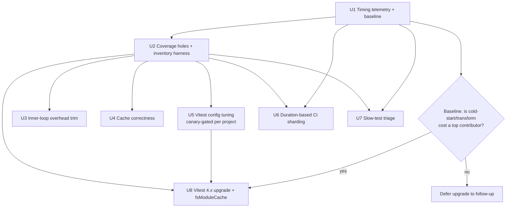
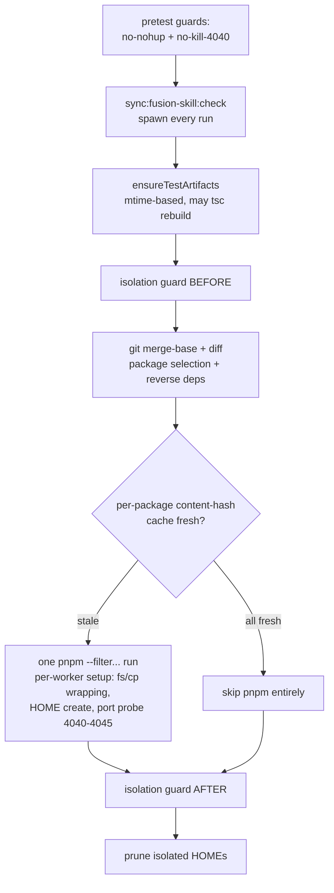

# perf: Speed up test suite across inner loop, full suite, and CI

## Summary

Cut test wall-clock across all three paths — changed-only inner loop to ~30s, local full suite to ~5min, and CI-to-green meaningfully faster — by measuring first (per-file timing telemetry), closing two latent coverage holes so the numbers are honest, trimming fixed per-run overhead, fixing cache correctness, tuning vitest config within frozen worker caps, rebalancing CI shards by duration, triaging the slowest tests, and (gated on baseline evidence) upgrading to Vitest 4.x for its cross-run filesystem module cache.

---

## Problem Frame

Tests are slowing all development velocity. The repo has ~1,826 test files across 11 packages and 14 plugins, with ~25 separate vitest configs. Prior measurements (`docs/test-speed-audit-FN-5048.md`) put dashboard at ~360s, engine at ~93s, core at ~26s, cli at ~14s for full per-package runs. Beyond raw suite cost, every `pnpm test` invocation pays fixed overhead (skill-sync check, artifact rebuild check, double isolation guard, isolated-HOME lifecycle, per-worker port probes), CI shards are balanced by file count rather than duration (3–4× wall-time skew is possible), and Vitest 3.2 has no way to share transform cost across the ~25 separate `vitest run` processes — each pays full cold start.

Two constraints shape everything: worker-count raises are **policy-forbidden** (FN-5048 standing rule — speedups must come from per-unit-of-work cost reduction, not fan-out), and existing guardrails (port-4040 kill guards, isolation checks, "do not add slow tests") must survive intact.

Research also surfaced two latent silent-coverage holes this work would otherwise collide with: the dashboard `test` script runs only hand-curated allowlist projects (unlisted test files run nowhere — locally or in CI), and the `engine-slow` tier runs in no automated gate at all. Both are confirmed in scope: the speed targets apply to honest coverage, not to a suite that quietly runs less than believed.

---

## Requirements

**Speed**

- R1. A changed-only `pnpm test` run for a typical leaf-package change completes in ~30s or less (warm cache, fast path hit). Core-package changes that cascade to reverse-dependents get as close as per-package speedups allow; file-level selection is explicitly deferred.
- R2. `pnpm test:full` completes in ~5min or less wall-clock on a developer machine.
- R3. CI test wall-clock to green is measurably reduced; shard durations are balanced within a stated tolerance using real timing data.

**Measurement**

- R4. Per-file test durations are captured machine-readably in both local full runs and CI, persisted with a defined staleness policy, and aggregatable across shards.
- R5. The inner loop reports *why* it chose its execution mode (changed-set vs full-suite fallback), so the 30s target is measured against actual fast-path hits.

**Coverage honesty**

- R6. No coverage lost: after every optimization unit, the executed-test inventory is a superset of the pre-change baseline (enforced by an inventory-diff harness, not by inspection).
- R7. The dashboard curated-gate hole is closed: a guard fails when a dashboard test file exists that no executed project includes (modulo an explicit, reviewed skip-list), and the currently-skipped files are either added to the gate or explicitly skip-listed.
- R8. `engine-slow` (and any tier tests get demoted into) runs in an automated gate with a non-empty-execution assertion.

**Safety and guardrails**

- R9. Worker-count caps stay frozen (FUSION_TEST_TOTAL_WORKERS / FUSION_TEST_CONCURRENCY / workspace-concurrency defaults unchanged); no lever raises fan-out.
- R10. Port-4040 kill guards, isolation checks, and the no-nohup guard remain enforced; any environment-conditional relaxation (e.g., skipping port probes in CI) is explicit and guard-tested.
- R11. Cache behavior is correct under dependency changes: a package is not cache-skipped when a workspace dependency it consumes has changed; a `--no-cache` escape hatch exists and is documented.

---

## Key Technical Decisions

- **Measurement-first sequencing.** Telemetry (U1) lands before any optimization that depends on knowing where time goes; duration-based sharding (U6), slow-test triage (U7), and the Vitest 4 upgrade (U8) are all gated on baseline data. Rationale: no per-test timing exists today; optimizing blind risks effort on the wrong 80%.
- **Coverage honesty before optimization.** The coverage-hole fixes and the inventory-diff harness (U2) land immediately after telemetry, and every subsequent unit must pass the superset check. Rationale: selection/tiering levers amplify silent-skip holes; fixing them late would invalidate earlier speed numbers.
- **Evolve `scripts/test-changed.mjs`, don't replace it.** No turborepo/nx adoption. Rationale: the script already implements git-blob-hash caching and reverse-dependent expansion correctly at package granularity; the gaps (dep-aware invalidation, overhead) are incremental fixes, and off-the-shelf task caching would re-litigate the guardrail integrations (isolation guard, isolated HOME, kill-guards).
- **Per-unit-of-work cost reduction only; worker caps frozen.** All speedups come from doing less work per test/file/process (isolation tuning, environment swap, transform caching, overhead removal), never from more parallelism. Rationale: FN-5048 standing rule; raising fan-out masks slowness and destabilizes shared machines.
- **Vitest 4.x upgrade is in scope but gated.** U8 fires only if the U1 baseline shows cold-start/transform cost is a top contributor blocking targets. Rationale: `experimental.fsModuleCache` (4.0.11+) is the only cross-process transform cache — reported ~4.8× re-transform speedup — but a major-version bump across ~25 configs carries migration risk (`workspace`/`poolMatchGlobs`/`environmentMatchGlobs` removals), so it must earn its place with data. U5 does the deprecation migrations early to shrink that future delta.
- **Config-tuning changes are canary-gated per project.** Any `isolate: false` flip or jsdom→happy-dom swap requires running the affected project both ways and diffing the pass/fail set before adoption. Rationale: the shared vitest-setup mutates `fs`/`child_process`/`process.cwd`/HOME per worker (module-level state shared across files when isolation is off), and the suites are mock-heavy; contamination is a real, observed failure class (see origin notes in `packages/engine/vitest.config.ts` comments).
- **Timing data persists as a committed JSON snapshot** (e.g., `scripts/test-timings.json`), refreshed from CI blob-reporter merges, with a staleness policy (TTL + drift threshold) and file-count fallback for untimed packages. Rationale: committed snapshot keeps `ci-test-shard.mjs` deterministic and reviewable; CI-artifact-only storage would make local shard planning and PR review of balance changes opaque.

---

## High-Level Technical Design

Directional guidance, not implementation specification.

### Delivery pipeline and gates

### Inner-loop anatomy (`pnpm test`) — where the fixed overhead lives

U3 attacks B (condition on changed inputs), C (content-hash instead of mtime), D/I (single guard pass), and the per-worker probe; U4 attacks F's correctness (dep-aware hash); U5/U8 attack H's per-worker and per-file cost.

---

## Implementation Units

### U1. Per-file timing telemetry and baseline report

- **Goal:** Capture machine-readable per-file (and per-test) durations from local full runs and CI shards; aggregate into a single timing snapshot; produce a written baseline identifying the top wall-clock contributors per package; add execution-mode telemetry to the inner loop.
- **Requirements:** R4, R5
- **Dependencies:** none
- **Files:** `scripts/test-changed.mjs` (mode-decision logging), `scripts/ci-test-shard.mjs` (blob reporter wiring), `scripts/aggregate-test-timings.mjs` (new), `scripts/test-timings.json` (new snapshot), `scripts/__tests__/aggregate-test-timings.test.mjs` (new), `.github/workflows/pr-checks.yml` (blob upload + merge step), `docs/test-speed-audit-FN-5048.md` (append refreshed baseline or link successor doc)
- **Approach:** Use vitest's blob reporter (`--reporter=blob`) on CI shards and `--merge-reports` + json reporter to aggregate per-file durations across shards; locally, allow an opt-in env/flag on `test:full` that adds the json reporter with `--outputFile`. The aggregation script merges shard blobs (or local json) into `scripts/test-timings.json` with capture date and per-package per-file durations. Inner-loop telemetry: `test-changed.mjs` already decides mode via `decideExecutionPlan` — emit a one-line structured reason (`mode=changed|full reason=...`) so fast-path hit rate is observable. Reporter additions must not slow the runs they measure (blob/json reporters are cheap; keep `dot` for console).
- **Patterns to follow:** existing `decideExecutionPlan` structure in `scripts/test-changed.mjs`; node test style of `scripts/__tests__/*.test.mjs`; the manual aggregation precedent in `docs/test-speed-audit-FN-5048.md`.
- **Test scenarios:**
  - Aggregator merges two synthetic shard blobs/json fixtures into one snapshot with per-file durations summed per package (happy path).
  - Aggregator tolerates a missing/corrupt blob from one shard: warns, emits snapshot from remaining shards, exits zero (failure path).
  - Snapshot schema includes capture date; aggregator refuses to overwrite a newer snapshot with older data (edge case).
  - Mode-decision log line appears for: changed-set run, full fallback due to missing merge-base, full forced by infra change — each with distinct reason strings (happy path + edge).
  - A package with zero test files yields no snapshot entry rather than a zero-duration entry (edge case).
- **Verification:** A baseline timing snapshot exists covering every package with tests; the top-10 slowest files per major package are listed in the refreshed audit doc; running `pnpm test` prints the mode/reason line.

### U2. Close coverage holes and build the inventory-diff harness

- **Goal:** Make the executed-test set honest and verifiable: close the dashboard curated-gate hole, wire `engine-slow` into an automated gate, and build the inventory-superset harness every later unit must pass.
- **Requirements:** R6, R7, R8
- **Dependencies:** U1 (timing data informs where the newly-executed files land without blowing budgets)
- **Files:** `packages/dashboard/vitest.config.ts` (curated includes or skip-list), `packages/dashboard/package.json` (gate scripts if lanes change), `scripts/check-test-inventory.mjs` (new harness), `scripts/__tests__/check-test-inventory.test.mjs` (new), `.github/workflows/pr-checks.yml` (engine-slow job + inventory guard), `packages/dashboard/src/__tests__/` or config-level guard test for curated completeness, `docs/testing.md` (document the guard and skip-list policy)
- **Approach:** First *quantify* the dashboard delta: diff `vitest list` over the broad `dashboard-app`/`dashboard-api` projects against the union of `*-quality` project includes (including the `-t` name-filtered settings lanes). Triage the gap: add files to the gate, or place them on an explicit reviewed skip-list with reasons. Add a guard (script or test) asserting union-of-executed ⊇ all test files minus skip-list, so the hole cannot silently reopen. Wire `engine-slow` into CI — either a dedicated job in `pr-checks.yml` or a shard-planner entry — with an assertion that the project lists >0 tests and they executed. The inventory harness captures `vitest list` output per package/project into a normalized inventory and diffs two inventories, failing on regression; it becomes the standard verification step for U3–U8.
- **Execution note:** Start by measuring the curated-vs-broad delta before deciding gate-vs-skip-list per file; the delta size determines whether the added CI time needs offsetting within this unit (e.g., placing newly-included files in a cheaper lane).
- **Test scenarios:**
  - Curated-completeness guard passes on the repaired config; fails when a synthetic new dashboard test file is created without being added to any executed project or the skip-list (happy + failure path).
  - Guard respects the skip-list: a skip-listed file does not trip it; an empty-reason skip-list entry is rejected (edge case).
  - Inventory harness: superset comparison passes when after ⊇ before; fails listing the exact missing test IDs when a test disappears (happy + failure path).
  - Inventory harness treats renamed files as remove+add (documented behavior; the diff output makes the rename reviewable) (edge case).
  - CI engine-slow gate: job fails if `engine-slow` project resolves zero test files (guard against silent exclusion drift).
  - Settings `-t` name-filter lanes: guard detects a `describe` block whose name matches no lane filter (the routes-auth/SettingsModal filtering hole) — or the lanes are restructured to file-level includes so the case is impossible (edge case; pick one, document).
- **Verification:** Inventory snapshot before vs after shows the dashboard delta either executed or explicitly skip-listed; `pr-checks.yml` runs engine-slow; the harness is invocable as a single command and documented in `docs/testing.md`.

### U3. Trim inner-loop fixed overhead

- **Goal:** Drive the constant per-run cost of `pnpm test` toward zero for the cache-fresh and small-change cases.
- **Requirements:** R1, R10
- **Dependencies:** U1 (overhead measured), U2 (harness available)
- **Files:** `scripts/test-changed.mjs`, `scripts/ensure-test-artifacts.mjs`, `scripts/check-test-isolation.mjs` (only if its interface needs a combined mode), `packages/core/src/__test-utils__/vitest-setup.ts` (port-probe conditioning), `scripts/__tests__/test-changed.test.mjs` (extend), `docs/testing.md`
- **Approach:** Candidate cuts, each measured before/after: (a) run `sync:fusion-skill:check` only when its input files changed (same git-blob-hash technique as the test cache) instead of every run; (b) replace `ensureTestArtifacts` mtime staleness with content hashing so branch switches don't trigger spurious `tsc` rebuilds inside the 30s budget; (c) collapse the before+after isolation guard to one guard pass where semantics allow (the before-pass primes state for the after-diff — investigate whether a single post-run diff against a cached pre-state file preserves detection); (d) condition the per-worker 4040–4045 port probe: skip in CI (no live dashboard) via explicit env, keep locally — with a guard test pinning the asymmetry; (e) bound the isolated-HOME prune scan. Never weaken what the guards detect — only when they run.
- **Patterns to follow:** git-blob-SHA hashing in `computePackageHash` (`scripts/test-changed.mjs`); `FUSION_TEST_SKIP_PORT_PROBE` precedent in `packages/core/src/__test-utils__/vitest-setup.ts`.
- **Test scenarios:**
  - Skill-sync check: skipped when sync inputs unchanged (cache hit), runs when a skill tool file changes (happy path both directions).
  - Artifact staleness: branch switch that changes mtimes but not content does not trigger rebuild; a real source edit in a dist-consumed package does (happy + edge).
  - Isolation guard consolidation: a test that deliberately leaks an artifact (temp file in guarded location) is still detected post-run (failure path — guard strength preserved).
  - Port probe: with CI env set, setup performs zero fetches (assert via probe-count hook or mock); locally with a reserved port responding, kill-guard set still includes it (happy + guard asymmetry test).
  - Cache-fresh fast path: when all packages are fresh, total `pnpm test` subprocess spawns are bounded to the guard set (no pnpm, no sync spawn) (happy path).
- **Verification:** Measured fixed overhead for a cache-fresh `pnpm test` (no package work) drops to a stated budget (target: ≤5s); isolation/kill-guard detection behavior demonstrably unchanged via the failure-path tests; inventory harness shows no coverage change.

### U4. Cache correctness: dependency-aware invalidation and escape hatches

- **Goal:** Make the per-package pass-cache trustworthy enough to lean on: invalidate dependents when a workspace dependency changes, and give developers visible escape hatches.
- **Requirements:** R11, R1
- **Dependencies:** U1; independent of U3 (parallel-safe)
- **Files:** `scripts/test-changed.mjs`, `scripts/__tests__/test-changed.test.mjs` (extend), `docs/testing.md`
- **Approach:** Extend `computePackageHash` to fold in the hashes of all transitive workspace dependencies (their tracked-file blob hashes, already computable with the same `git ls-files -s` technique), so a core change invalidates engine/dashboard/cli cache entries even when their own files are untouched. Decide TTL: with dep-aware hashing, the 7-day TTL can likely stay (it guards against environmental drift, not staleness). The `--no-cache` flag already exists in `scripts/test-changed.mjs` (parsed and threaded into the cache plan; `test:full` already uses it) — the remaining work is documenting it in `docs/testing.md`, not implementing it. Also confirm the `shouldForceFullSuite` whitelist covers shared `__test-utils__` edits (research flagged that `packages/core/src/__test-utils__/vitest-setup.ts` matches a test-file heuristic and may not invalidate all packages) — dep-aware hashing largely subsumes this, but verify.
- **Test scenarios:**
  - Mutating a tracked file in core invalidates the cached entries of packages depending on core (transitively), not unrelated packages (happy path).
  - Mutating only a dependency's `dist/` (untracked) does not bypass detection: either dist is excluded from hashing because src-hash covers it, or the artifact-ensure rebuild keys align — assert a dependent re-runs after a real dep source change lands through any path (failure path from the flow analysis).
  - Editing `packages/core/src/__test-utils__/vitest-setup.ts` invalidates every package's cache entry (edge case).
  - `--no-cache` flag forces re-run of cache-fresh packages without clearing the cache file; a subsequent normal run still hits cache (happy path).
  - Cache format version bump: old-format cache file is discarded, not crashed on (edge case).
  - Flaky-pass scenario documented: cache stores the pass; the documented recovery (`--no-cache`) re-runs it (documentation assertion, not code).
- **Verification:** The cache-correctness fuzz from the flow analysis passes: dep-change → dependent re-runs; cache hit rate telemetry (log line) confirms hits still occur for genuinely-unchanged packages.

### U5. Vitest config tuning within frozen caps (canary-gated)

- **Goal:** Reduce per-file and per-worker cost via vitest 3.2-compatible config: isolation downgrades where provably safe, jsdom→happy-dom where API surface permits, deps optimizer, and deprecation migrations that pre-pay the 4.x upgrade.
- **Requirements:** R1, R2, R9
- **Dependencies:** U1 (baseline identifies which projects matter), U2 (canary + inventory harness)
- **Files:** `packages/dashboard/vitest.config.ts`, `packages/engine/vitest.config.ts`, `packages/core/vitest.config.ts`, `packages/cli/vitest.config.ts`, selected `plugins/*/vitest.config.ts`, `packages/core/src/__test-utils__/vitest-setup.ts` (only if shared-state assumptions need hardening for isolate:false), `scripts/canary-isolation-diff.mjs` (new, or a documented manual procedure), `docs/testing.md`
- **Approach:** Per-project, in descending baseline-cost order: (a) trial `isolate: false` on threads-pool projects whose files don't mutate shared module state — engine-default and dashboard quality lanes are candidates but are mock-heavy; the canary (run project with isolation on and off, diff pass/fail sets and flake rate over N runs) decides; forks-pool packages (core, cli) keep isolation because per-fork `process.chdir` is the reason they're on forks at all. (b) Trial happy-dom for dashboard lanes file-by-file via `// @vitest-environment happy-dom` docblocks or a dedicated project split — jsdom API gaps are the risk; canary decides per lane. (c) Enable `deps.optimizer` for jsdom projects if the baseline shows import overhead. (d) Migrate deprecated `poolMatchGlobs`/`environmentMatchGlobs`/workspace-file usage to `projects` config now (removed in 4.x — shrinks U8's delta). Skip `vmThreads`/`vmForks` entirely (documented memory-cache leak at this file count; cannot disable isolation).
- **Execution note:** One project per commit, canary evidence attached; revert any flip whose canary shows pass-set drift or flake-rate increase.
- **Test scenarios:**
  - Canary tool/procedure: identical pass sets across isolated/non-isolated runs → eligible; injected cross-file contamination fixture (test A sets module global, test B asserts clean) flags ineligibility (happy + failure path).
  - happy-dom lane: full lane passes under happy-dom with zero test-body changes, or the lane is reverted — no partial "fixed the tests to fit the environment" middle state without explicit review (happy + edge policy).
  - Worker caps: after all config changes, effective worker counts per package are unchanged (assert `computeMaxWorkers` outputs / config snapshots) (R9 guard).
  - Inventory harness passes after each project flip (no files dropped by project restructuring) (R6 guard).
  - Deprecation migration: `poolMatchGlobs`/`environmentMatchGlobs` no longer appear in any config; behavior-equivalent projects verified by inventory equality before/after (happy path).
- **Verification:** Measured per-package wall-clock deltas recorded against the U1 baseline (target: dashboard and engine each meaningfully down; numbers land in the audit doc); zero canary regressions shipped; FN-5048 cap audit clean.

### U6. Duration-based CI shard balancing and dashboard shard compatibility

- **Goal:** Balance the 4 CI shards by measured duration instead of file count, and fix the dashboard virtual-shard incompatibility.
- **Requirements:** R3, R4
- **Dependencies:** U1 (timing snapshot), U2 (engine-slow gate exists; inventory harness)
- **Files:** `scripts/ci-test-shard.mjs`, `scripts/__tests__/ci-test-shard.test.mjs` (extend), `scripts/test-timings.json` (consumed), `.github/workflows/pr-checks.yml`, `docs/testing.md`
- **Approach:** Replace file-count weights with durations from the committed timing snapshot, falling back to file count for untimed/new packages; keep best-fit-decreasing bin-packing. Define the staleness policy: snapshot older than a threshold or drifted beyond a tolerance (merged-blob durations vs snapshot) triggers a refresh PR (manual or scheduled). Fix the dashboard problem the flow analysis found: dashboard's `test` is a chain of ~14 vitest invocations, so `--shard=X/Y` forwarding is broken/ambiguous — either exclude dashboard from virtual slicing and instead distribute its *lanes* (the 14 sub-scripts) across shards as separately-weighted units, or restructure so slicing applies to a single vitest invocation. Lane-level distribution is the likely shape: lanes are already separate processes with separately measurable durations. Also correct dashboard's shard weight (currently counts all 706 files including never-run ones).
- **Test scenarios:**
  - Bin-packing with synthetic durations: known-skewed inputs produce shards within the variance tolerance; the same inputs under file-count weighting demonstrate the skew (happy path + motivation fixture).
  - Untimed package falls back to file-count weight with a logged warning (edge case).
  - Stale snapshot (older than threshold): planner warns; drift beyond tolerance fails or flags per policy (edge case).
  - Dashboard lanes: every lane is assigned to exactly one shard; union of lanes across shards equals the full lane list (no lane dropped, none duplicated) (failure path the flow analysis flagged).
  - Shard-coverage invariant: union of `vitest list` across planned shards equals the full inventory (integration with U2 harness).
- **Verification:** CI run shows shard durations within tolerance of each other (record before/after spread); no lane/test lost per the inventory invariant; snapshot staleness policy documented.

### U7. Slow-test triage: rewrite or demote the top offenders

- **Goal:** Attack the heaviest individual tests surfaced by the baseline — rewrite to be fast (fake timers, less real-process work) or demote to the slow tier, which now has a CI gate.
- **Requirements:** R1, R2, R3
- **Dependencies:** U1 (offender list), U2 (slow tier gated, inventory harness)
- **Files:** offender test files per baseline — expected candidates from prior audit: `packages/dashboard/app/components/__tests__/SettingsModal.test.tsx`, `packages/dashboard/app/components/__tests__/ChatView.test.tsx`, `packages/dashboard/src/__tests__/routes-auth.test.ts`, `packages/engine/src/__tests__/merger-overlap-guard.slow.test.ts` neighbors and remaining heavy real-git suites; `packages/engine/vitest.config.ts` (tier membership), `docs/testing.md`
- **Approach:** Work the baseline's top-N list (cut at the point of diminishing returns, e.g., files >10s). Preferred order per test: (1) replace real `setTimeout`/polling with fake timers per the FN-2707 recipe; (2) reduce repeated heavy setup (per-test `git init`/multi-commit fixtures → shared per-file fixture where isolation semantics allow); (3) demote to `*.slow.test.ts` tier as last resort — the test still runs in the U2 CI gate, but off the inner-loop/full-run critical path. Hard constraints: the FN-5048 "keep unconditionally" rule for real-SQLite/worker-pool/spawned-process integration tests — those may be demoted but not gutted; no net coverage loss (inventory harness).
- **Execution note:** Characterization-first for any behavioral rewrite of legacy tests — confirm what the test actually asserts before changing its mechanics.
- **Test scenarios:** (this unit modifies tests; scenarios are about the meta-properties)
  - Each rewritten test still fails when its guarded behavior is broken (mutate the subject or fixture to prove the assertion still bites — at minimum for the top-3 rewrites) (failure path).
  - Each demoted test appears in the slow-tier inventory and the CI slow gate executes it (R8 integration).
  - Per-file duration after rewrite is recorded and lands under the slow-test threshold used by reporters (happy path).
  - No offender is deleted or skipped: inventory superset holds across the unit (R6 guard).
- **Verification:** Top-N offender list shows measured before/after durations in the audit doc; full-suite wall-clock delta attributable to this unit is recorded; inventory harness clean.

### U8. Vitest 4.x upgrade with filesystem module cache (gated)

- **Goal:** If the U1 baseline shows cold-start/transform cost is a top blocker for the 30s/5min targets, upgrade vitest 3.2.4 → 4.x across the workspace and enable `experimental.fsModuleCache` to share transform cost across runs and processes.
- **Requirements:** R1, R2 (conditional on gate)
- **Dependencies:** U1 (gate evidence), U5 (deprecation migrations done), U2 (inventory harness for the migration proof)
- **Files:** root `package.json` + all package/plugin `package.json` vitest versions, `pnpm-lock.yaml`, all ~25 `vitest.config.ts` files (residual migration), `packages/core/src/__test-utils__/vitest-setup.ts` and `vitest-teardown.ts` (API drift), `docs/testing.md`
- **Approach:** Single coordinated bump (vitest pins are per-package but the shared setup file couples them — mixed major versions are not worth supporting). Pre-migration in U5 should have removed `poolMatchGlobs`/`environmentMatchGlobs`/workspace-file usage; this unit handles remaining 4.x breaking changes per the official migration guide, then enables `experimental.fsModuleCache` and measures cold-vs-warm transform cost per package. Treat the cache as experimental: keep a single env/config switch to disable it, and verify cache invalidation on source change (stale-transform bugs would be silent and nasty — the engine dist/ history in this repo is a cautionary precedent).
- **Test scenarios:**
  - Full inventory equality before/after the upgrade (not just superset — nothing new should appear or vanish from the executed set) (R6, strongest form).
  - Pass/fail set identical before/after on a full run (migration didn't change semantics) (happy path).
  - fsModuleCache: second run measurably faster than first (record numbers); editing a source file invalidates its transform (no stale module served — assert by editing a module and seeing the dependent test observe the change) (happy + failure path).
  - Cache-disable switch: with the switch off, behavior matches pre-cache baseline (escape hatch works) (edge case).
  - Guard suite (port-4040, isolation, no-nohup) green under 4.x (R10).
- **Verification:** Gate decision recorded with baseline evidence (proceed or defer); if proceeded: measured cold/warm deltas per package in the audit doc, all guards green, inventory equality proven. If deferred: a one-line entry in Scope Boundaries' deferred list with the evidence.

---

## Scope Boundaries

**In scope:** the three flows (`pnpm test`, `pnpm test:full`, `pr-checks.yml`), `scripts/test-changed.mjs` and `scripts/ci-test-shard.mjs` evolution, vitest configs across packages/plugins, the two coverage holes, slow-test rewrites/demotions, gated vitest 4.x upgrade.

**Non-goals:**

- No turborepo/nx or other task-runner adoption — the bespoke scripts stay.
- No raising worker counts, concurrency caps, or CI runner sizes beyond the existing 4-shard matrix; CI *may* gain the engine-slow job (coverage honesty), but not extra fan-out for speed.
- No deleting tests or weakening assertions to hit targets; FN-5048 "keep unconditionally" classes are untouchable except for tier placement.
- No changes to the guard semantics (port-4040, no-nohup, isolation detection) — only to when/how often they execute.

### Deferred to Follow-Up Work

- File-level (sub-package) test selection in `test-changed.mjs`. Highest-risk lever (runtime deps, dynamic imports, dist artifacts make file-level dependency tracking unreliable); revisit only if package-level + U3–U8 leave the core-change cascade above target.
- A persistent local watch/daemon mode for the inner loop (vitest watch reuses the module graph in-process; integrating that with the multi-package orchestrator is its own project).
- `ci.yml` (disabled, workflow_dispatch-only) modernization — only `pr-checks.yml` is in scope.
- Vitest 4.x upgrade — *if* the U8 gate decides against it now.

---

## Risks & Dependencies

- **`experimental.fsModuleCache` is experimental (4.x).** Stale-transform bugs would silently mask real failures — mitigated by the explicit invalidation test in U8, a kill switch, and this repo's prior experience with stale-artifact masking (engine src emit history).
- **`isolate: false` contamination.** The shared vitest-setup wraps `fs`/`child_process` and manages HOME/cwd per worker; non-isolated files share that module state. Mitigated by per-project canary gating and the contamination fixture; expected outcome is that only some projects qualify.
- **happy-dom API gaps.** Dashboard suites are waitFor-heavy React tests; lane-by-lane trial with full-lane revert policy avoids a half-migrated state.
- **Timing snapshot rot.** Duration-based sharding degrades as the suite drifts; mitigated by the staleness/drift policy in U6. Residual risk accepted: balance degrades gracefully toward today's status quo, not below it.
- **Coverage-hole fix adds CI time before optimizations land.** U2 may temporarily push CI wall-clock up (newly-executed dashboard files, engine-slow job). Sequenced intentionally: honesty first; U5–U7 claw it back. If the U2 delta is large, its triage step offsets within the unit.
- **Worker-cap policy tension.** Pool changes must not effectively raise concurrency past FN-5048 caps (e.g., threads→forks flips changing `computeMaxWorkers` math) — pinned by the U5 cap-audit test.

---

## Sources & Research

- `docs/test-speed-audit-FN-5048.md` — prior per-package baselines (dashboard ~360s, engine ~93s, core ~26s, cli ~14s) and top offenders; this plan's U1 refreshes it.
- `scripts/test-changed.mjs`, `scripts/ci-test-shard.mjs`, `scripts/ensure-test-artifacts.mjs`, `packages/core/src/__test-utils__/vitest-setup.ts` — current selection/cache/shard/guard mechanics (read during research; facts cited inline above).
- `AGENTS.md` + `docs/testing.md` — FN-5048 worker-cap freeze, "Do Not Add Slow Tests" standing rule, FN-2707 fake-timers recipe, curated-gate gotcha, sibling `__tests__/` layout.
- Vitest v3 docs: improving-performance guide, config reference (isolate, pools, deps.optimizer, blob/json reporters, `--shard`/`--merge-reports`), environment docblocks — https://v3.vitest.dev/guide/improving-performance, https://v3.vitest.dev/config/
- Vitest 4.x: `experimental.fsModuleCache` (4.0.11+; reported ~4.8× re-transform speedup), 4.0 removals of `workspace`/`poolMatchGlobs`/`environmentMatchGlobs` — https://vitest.dev/config/experimental.html, https://vitest.dev/guide/migration
- Known issues shaping decisions: vmThreads ESM memory caching (avoid at this scale), `vi.fn` memory accumulation under `isolate: false` (vitest-dev/vitest#9492).
