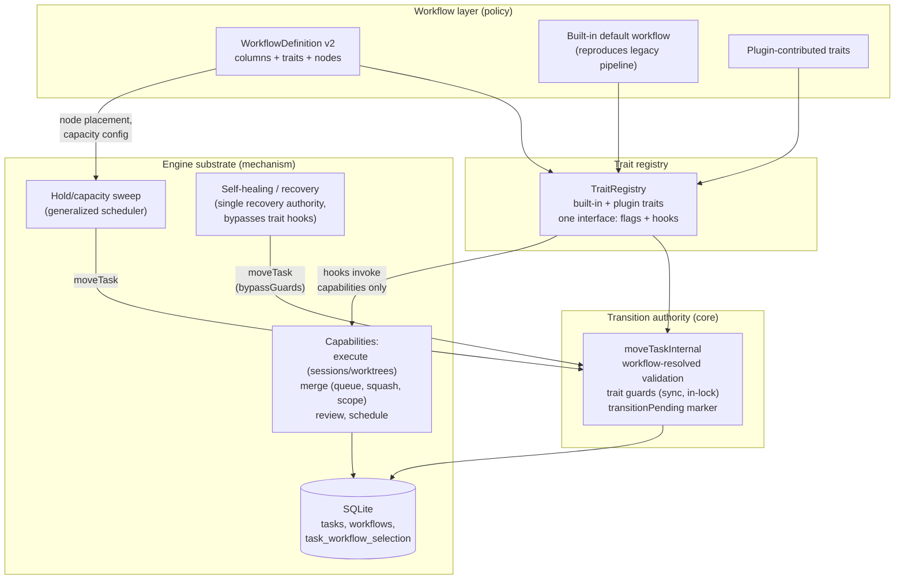
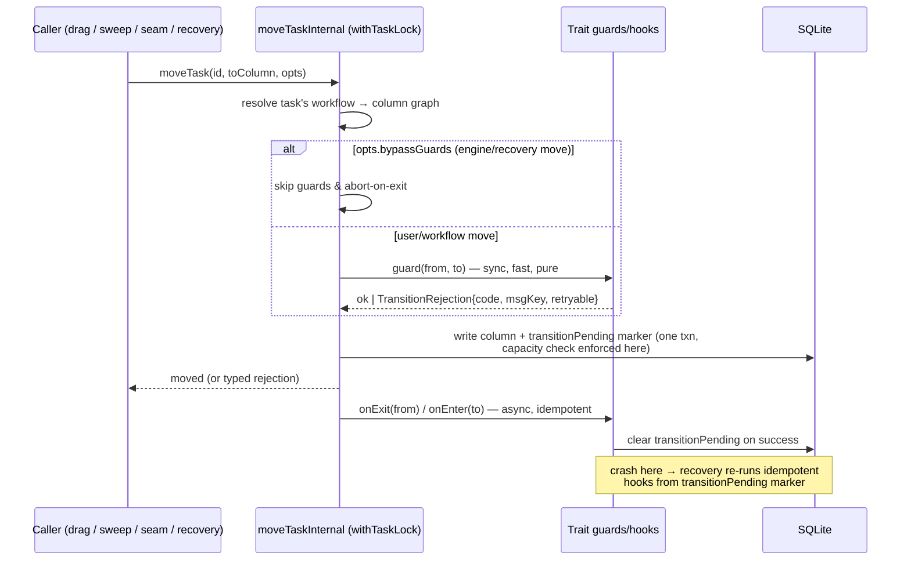

# feat: Workflow-defined custom columns — engine as substrate, workflows as operating logic

## Summary

Invert the architecture: the engine becomes a **capability substrate** (worktree/git/session mechanics, persistence, crash recovery, audit, resource ceilings) and **workflows become the operating logic**. Columns become first-class, workflow-defined task state carrying **composable, pluggable traits** (declarative flags + executable lifecycle hooks). All policy — state transitions, retries, WIP/capacity, hold/dwell states, drag semantics, merge/PR orchestration, merge strategy, squash contract, file-scope guards — moves into workflows as trait configuration over substrate capabilities. The dashboard board becomes multi-lane (one lane per workflow in use, each rendering its workflow's columns). Today's fixed `triage → todo → in-progress → in-review → done → archived` pipeline is recast as a built-in **default workflow** whose trait configuration reproduces current behavior verbatim, with a flag-gated, additive-only migration. Workflow graphs additionally gain **parallel fan-out/join branches** (`split`/`join` nodes), and the built-in trait vocabulary is fully defined in this plan (see Trait Vocabulary).

---

## Problem Frame

The executable-custom-workflows MVP (origin: `docs/plans/2026-06-03-001-feat-executable-custom-workflows-node-editor-plan.md`, completed) shipped persisted `WorkflowIr` definitions, a React Flow node editor, and per-task workflow selection. The interpreter-cutover track (plan 002, M-A–M-C implemented behind the `workflowGraphExecutor` flag) lets a graph drive execute → review → merge sequencing through seams. But both stop at the same ceiling: **the board model is still the engine's**. Columns are a closed enum (`COLUMNS`, `packages/core/src/types.ts:18`), the transition graph is a hardcoded constant (`VALID_TRANSITIONS`), scheduling is a hardcoded "pull from todo, run N agents" loop, and every reliability invariant is keyed to literal column names across ~158 files.

Consequences:

- A workflow cannot express its own lifecycle — e.g., a passive "Planning" holding column, planning processing in "Todo", then capacity-limited pickup into execution. The graph can only decorate the fixed pipeline.
- Custom workflows have no board presence: every task renders into the same six columns regardless of what its workflow actually does.
- Policy and mechanism are fused: `store.moveTask` (`packages/core/src/store.ts`, `moveTaskInternal`) hardcodes transition validity, merge-blocker gating, timing accounting, and reopen semantics in one branch-per-column-name function; the scheduler hardcodes WIP policy; the merger hardcodes merge policy alongside merge mechanics.

The user has explicitly waived the FN-4359 reliability freeze for this track (carried over from plan 002's waiver). The five lifecycle invariants remain the correctness bar — but as **trait configuration of the default workflow**, not as hardcoded law.

---

## Scope Boundaries

### In scope

- Workflow-defined columns with composable traits (flags + lifecycle hooks); trait registry with built-in and plugin-contributed traits sharing one interface; the full built-in trait vocabulary (see Trait Vocabulary).
- In-graph parallelism: `split`/`join` node kinds with `all | any | quorum(n)` join modes, fail-fast or collect failure policies, and per-branch crash-recoverable run state (U13).
- Policy inversion: transitions, retries, WIP/capacity, hold/release, drag semantics, merge/PR orchestration, merge strategy, squash contract, file-scope guard configuration — all workflow-expressed.
- Substrate hardening: the engine keeps mechanisms (worktree/git/session ops, `AgentSemaphore`/leases, persistence, crash recovery, audit, machine resource ceilings) exposed as capabilities traits bind.
- Built-in default workflow reproducing today's pipeline and invariants verbatim; flag-gated cutover; one-time additive migration.
- Multi-lane dashboard board; node-editor support for columns, traits, and hold nodes.
- Graceful degradation for CLI TUI and mobile surfaces that don't yet understand custom columns.

### Deferred to Follow-Up Work

- **Removing the legacy engine pipeline code** — only after graduation (U12) proves parity in the field; tracked as the absorbed FN-5719 Phase 4 follow-up.
- Workflow/trait versioning and history, import/export, cross-project workflow sharing.
- Mobile/desktop native surfaces — the mobile app embeds the dashboard web UI and inherits the multi-lane board from U9; `packages/mobile/` contains only native-shell bridging plugins (no task-list views), so there is no mobile degradation work in this plan. Any future native task-list surface is follow-up work.
- Concurrent execution of `execute`/`merge` seam nodes within parallel branches — one worktree/session per task and exclusive merge are physical constraints; the U1 validator rejects such graphs.

### Outside this product's identity

- A general-purpose BPM engine: traits exist to run *coding-agent task lifecycles*, not arbitrary business processes. No human-task assignment systems, SLAs, or cross-system orchestration.
- Runtime plugin code isolation/sandboxing beyond the existing install-time trust model — plugin trait hooks route through the existing prompt-session/script machinery (KTD-7); a vm-level sandbox is a separate product decision.

---

## Key Technical Decisions

- **KTD-1 — Default workflow column IDs are the legacy enum values.** The default workflow's columns are `triage`, `todo`, `in-progress`, `in-review`, `done`, `archived` — byte-identical to today's `tasks."column"` values. Migration therefore rewrites **zero task rows**: a task with no workflow selection resolves to the default workflow, and its stored column value is already a valid column ID in it. `Column` widens from a closed union to `string` validated against the task's workflow definition.

- **KTD-2 — A trait is declarative flags + optional executable lifecycle hooks, with two guard classes.** Hook points: `guard(move)`, `gate(move)`, `onEnter(task)`, `onExit(task)`, `releaseCondition(task)`. **Sync guards** run inside `withTaskLock`/`moveTaskInternal` and must be fast and pure (DB reads only) — **built-in traits only**. **Async gates** (script/prompt verdicts) are evaluated *before* the move is attempted, outside the lock; the verdict is recorded and re-checked cheaply (a DB read) in-lock at move time — this is the plugin-facing gate surface, and it removes any path where plugin code can block or wedge the task lock. Enter/exit effects run **post-commit, async, idempotent**, tracked by a persisted `transitionPending` marker so crash-mid-transition is recoverable by re-running the idempotent hook (see KTD-9); `transitionPending` recovery reads **exclusively from SQLite** (the authoritative store per ADR-0001 — `task.json` is a follower written post-commit and may be stale across a crash). A hook failure degrades that column's behavior with an audit event — it never strands the card or wedges the task lock.

- **KTD-3 — `moveTaskInternal` remains the single transition authority.** It swaps its `VALID_TRANSITIONS` lookup for workflow-resolved column-graph validation plus trait guards, but stays the only sanctioned path — all 40+ self-healing call sites, the scheduler, drag handlers, and seams keep calling it. Guard rejections become a **typed `TransitionRejection`** (reason code, user-facing message key, retryable flag) replacing today's thrown strings, so dashboard drops, CLI, and recovery share one rejection contract.

- **KTD-4 — The mechanism/policy line.** Substrate (engine-owned, not workflow-configurable): `AgentSemaphore`, checkout leases (409 = hard conflict), worktree/git/session operations, SQLite persistence + WAL, crash-recovery machinery, audit trail, machine resource ceilings (a global max-sessions cap survives as physical governance). Policy (workflow/trait-owned): everything currently keyed on a column literal — transition validity, WIP counts and where they apply, retries, hold/release, drag meaning, merge strategy, squash posture, file-scope enforcement mode. This is DAG ADR-0001's enqueue-only posture generalized: traits *configure and invoke* capabilities; they never reimplement them.

- **KTD-5 — No reserved column names; completion and archival are trait flags.** `complete: true` and `archived: true` trait flags replace string equality on `done`/`archived` everywhere: dependency satisfaction (`scheduler` gating becomes "dependency's task is in a `complete`-flagged column"), archive log, board filters, `clearDoneTransientFields`. Per FN-5719, scheduler dependency checks dual-accept (explicit handoff marker OR complete-flag column) with audit-diff logging during the transition window.

- **KTD-6 — Merge is a trait that enqueues; it never awaits inside a graph walk.** The merge trait binds the persisted merge-request queue (`enqueueMergeQueue` / `pickNextMergeTaskId` / `ProjectEngine.onMerge` resolver) and configures policy: merge strategy (squash / merge-commit / rebase / PR-only), squash-contract posture, file-scope enforcement (`strict` / `warn` / `off` / custom scope rules), conflict strategy. The substrate merge capability keeps its mechanics (staging allowlist, deterministic subject, audit). The three 2026-05-23 lost-work guards are **capability-level and non-configurable**: never resolve a merge target to a sibling `fusion/fn-*` branch, line-anchored commit attribution only, never clear `modifiedFiles` on a no-op finalize that claimed work. **Identity note — the deliberate power-over-safety-floor posture:** integrity guarantees (the lost-work trio, git-state safety, crash recovery, audit) are non-configurable; *enforcement-mode* protections (`fileScope`, squash posture, review gates) are user-lowerable, but only inside an explicitly authored workflow — never as ambient settings — and the editor surfaces lowered floors visibly. A workflow *can* author itself footguns; it cannot author data loss.

- **KTD-7 — Plugin traits follow the PluginRunner contribution pattern.** Plugins declare traits in their manifest (flags + hook descriptors), aggregated/cached/invalidated by `PluginRunner` exactly like `PluginWorkflowStepContribution`. Executable hooks route through the existing prompt-session/script/verdict machinery (readonly-tool-policy aware) — traits never get raw in-process execution. Plugin traits get **async hook points only** (`gate`, `onEnter`, `onExit`, `releaseCondition`); the sync `guard` hook point is built-in-only (KTD-2). **Restricted flags**: `complete`, `archived`, and sync-guard capability cannot be declared by plugin traits — a plugin trait declaring `complete: true` could silently satisfy dependencies and poison scheduling; plugins needing those semantics compose alongside the built-in traits on the same column. Disabling/uninstalling a plugin whose trait has live dependents (cards currently in columns using it) is blocked with a clear error, mirroring the built-in-workflow deletion block (`store.ts` `isBuiltinWorkflowId` guard); a force path degrades affected columns to passive (hooks become no-ops, audit event emitted, cards remain movable).

- **KTD-8 — Flag-gated cutover; legacy path retained until graduation.** A new `experimentalFeatures.workflowColumns` flag gates the whole model. Off: the legacy enum/`VALID_TRANSITIONS` path runs untouched. On: workflow-resolved columns drive everything. The default workflow's parity is machine-checked (extending `compareWorkflowRunObservations` / `workflow-parity.ts` and a dedicated transition-parity suite) before the flag defaults on. This plan **supersedes plan 002**: its M-A–M-C implementations (seams, handlers, runner, executor wiring) are this plan's foundation; its M-D graduation criteria are absorbed into U12.

- **KTD-9 — Single recovery authority; engine-sourced moves bypass trait hooks.** Self-healing keeps exclusive ownership of recovery transitions (FN-5335 triple-proof, FN-5704 non-oscillation). Moves with `moveSource: "engine"` bypass trait guards and `abort-on-exit` effects (the generalization of today's `skipMergeBlocker`), carrying an explicit `bypassGuards` field in the move options so the bypass is visible in audit. A workflow and self-healing never both claim transition authority over the same task: trait hooks observe engine moves (for bookkeeping like WIP counters, which must stay consistent) but cannot veto or side-effect them.

- **KTD-10 — Capacity is enforced under the store transaction, not by trait code, and is never bypassable.** WIP limits are trait *configuration*; enforcement is a substrate capability: a per-(workflow, column) active-count check inside `moveTaskInternal`'s transaction plus the existing `AgentSemaphore` for session slots. The in-txn capacity check is **not a guard** — it runs regardless of `bypassGuards`, so engine/recovery/sweep moves honor it too. Hold release is a substrate sweep (the generalized scheduler) that evaluates `releaseCondition`s and calls `moveTask` with a distinct `moveSource: "scheduler"` — releases serialize through the same transaction-time check, so two holds can't release into one slot. Ordering contract with out-of-txn resources: the sweep **reserves worktree + semaphore slots before issuing the move** and releases the reservation if the move's capacity check rejects — a card is never moved into a processing column it cannot actually start in. The scheduler's three-gate diagnostic (`computeConcurrencyGateDiagnostic`) is preserved, generalized to report per-column capacity gates.

- **KTD-11 — Fan-out runs branches concurrently; the card's board position does not fork.** `split` launches all outgoing edges concurrently; `join` synchronizes with `mode: all | any | quorum(n)` and `onBranchFailure: fail-fast` (cancel siblings via the abort machinery) or `collect` (wait for all, evaluate at join). During parallel execution the card **stays in the split node's column** with per-branch progress surfaced on the card; on join resolution it proceeds to the join's column — one-card-one-position (R16) holds by construction. `execute` and `merge` seam nodes are **forbidden inside branches** (one worktree/session per task; merge is exclusive — physics, not policy); prompt/script/gate nodes are allowed and stay bounded by `AgentSemaphore` + node capacity. Per-branch run state persists in SQLite so a crashed branch resumes where it died (ADR-0001).

---

## Trait Vocabulary

A trait is declarative flags + config + optional hooks (KTD-2's two guard classes: sync guards built-in-only; async gates are the plugin surface). The built-in set ships in U2:

| Trait | Category | Config | Hooks | Notes |
|---|---|---|---|---|
| `intake` | identity | `autoTriage?` | — | Where new cards land; exactly one per workflow (validated) |
| `complete` | identity | — | — | Terminal success; satisfies dependencies. **Restricted flag** |
| `archived` | identity | — | — | Hidden from board; global semantics. **Restricted flag** |
| `merge-blocker` | gate | — | sync guard | Generalized FN-5147: entry to `complete`-bound columns blocked until the merge-class node completed (reads `getTaskMergeBlocker`) |
| `wip` | flow | `limit`, `countPending?` | — | Substrate-enforced in-txn (KTD-10); never bypassable |
| `hold` | flow | `release: manual \| timer \| capacity \| dependency \| external-event` | releaseCondition | Passive dwell; `external-event` = webhook/API release |
| `human-review` | gate | `approvers?`, `checklist?` | sync guard (exit) | Card cannot leave until explicit human approval (approval state is a DB read — sync-safe). **Not on the default workflow** — legacy in-review has no human gate; adding one would break R12 parity |
| `gate` | gate | `gateMode: blocking \| advisory`, prompt/script | async gate | Workflow-step gate semantics generalized to columns; the plugin-facing gate surface; blocking gates fail closed |
| `merge` | capability | `strategy`, `fileScope`, `squash`, `conflictStrategy` | onEnter (enqueues), onExit (dequeues) | KTD-6; `onExit` absorbs `dequeueMergeQueueOnColumnExit` |
| `abort-on-exit` | lifecycle | `direction: backward \| any`, `confirm?` | onExit | Generalized hard-cancel; bypassed by engine-sourced moves (KTD-9) |
| `reset-on-entry` | lifecycle | `preserveProgress?` | onEnter | Legacy reopen-to-todo field/step resets |
| `timing` | lifecycle | — | onEnter/onExit | `cumulativeActiveMs` accounting generalized |
| `stall-detection` | observability | `timeoutMs`, `action: annotate \| notify \| move` | (sweep-evaluated) | In-review stall signals generalized to any column |
| `notify` | observability | events, channel | onEnter/onExit | Basic notifications; richer notification traits are the canonical plugin example |

**Default workflow mapping** (reproduces legacy behavior verbatim, R12): `triage` = `intake`; `todo` = `hold(capacity)` + `reset-on-entry`; `in-progress` = `wip(maxConcurrent)` + `abort-on-exit` + `timing`; `in-review` = `merge-blocker` + `stall-detection` + `merge`; `done` = `complete`; `archived` = `archived`.

**Extension contract:** the plugin-facing `PluginTraitContribution` carries a **versioned hook-descriptor schema** so the vocabulary can grow additively (new flags, hook points, config fields) without breaking published plugin traits.

---

## High-Level Technical Design

### Component topology — substrate, traits, workflows



### Transition sequence — guard in-lock, effects post-commit



### Worked example — the "Planning hold" workflow (directional)

```
[Planning col]            [Todo col]                          [In-Progress col]      [Review col]      [Done col]
 traits: hold              traits: wip(planning), hold         traits: wip(2),        traits:           traits:
                                                               abort-on-exit          human-review      complete
  hold ──(manual)──► prompt: plan ──► hold ──(capacity)──► seam: execute ──► seam: review ──► seam: merge ──► end
                                                                                                (merge trait enqueues)
```

Cards rest in Planning untouched → manual promote releases them → the planning prompt runs while the card sits in Todo → card rests as "ready" → pulled into In-Progress when a WIP slot frees → review under a human-review-trait column → merge trait enqueues onto the merge-request queue → card lands in the `complete`-flagged column. This sketch is directional guidance, not implementation specification.

---

## Requirements

**Column & workflow model**

- R1. A workflow defines an ordered list of columns; each column has an ID, display name, and a set of trait configurations.
- R2. Workflow nodes are placed in columns; a card's board position derives from its current column (persisted in `tasks."column"`), which the workflow's graph and traits drive.
- R3. A `hold` node kind expresses passive dwell, with release conditions: manual promote, timer, downstream capacity available.
- R4. Column validity is workflow-scoped: the closed `Column` union and `VALID_TRANSITIONS` constant are replaced by per-workflow column graphs (legacy path retained behind the flag until graduation).

**Traits**

- R5. A trait is composable configuration: declarative flags plus optional lifecycle hooks (`guard`, `onEnter`, `onExit`, `releaseCondition`).
- R6. Built-in and plugin-contributed traits register through one registry interface; plugins declare traits via manifest contributions.
- R7. The built-in trait set is the Trait Vocabulary table: `intake`, `complete`, `archived`, `merge-blocker`, `wip`, `hold`, `human-review`, `gate`, `merge`, `abort-on-exit`, `reset-on-entry`, `timing`, `stall-detection`, `notify`.
- R8. Trait composition is validated at workflow save time; conflicting combinations are rejected with actionable messages.

**Policy inversion**

- R9. State transitions, retries, WIP/capacity limits, hold/release, and drag semantics are workflow-expressed; no engine code keys policy off literal column names when the flag is on.
- R10. Merge strategy, squash posture, and file-scope enforcement mode are workflow-configurable via the merge trait; the three lost-work guards remain capability-level and non-configurable.
- R11. The substrate retains mechanisms only: worktree/git/session operations, semaphore/leases, persistence, crash recovery, audit, machine resource ceilings.

**Invariant preservation**

- R12. The built-in default workflow reproduces current behavior verbatim: `VALID_TRANSITIONS` parity, FN-5147 terminal-until-merged, `in-progress → todo` hard-cancel, in-review stall detection, file-scope guard, squash contract — machine-checked by parity tests before graduation.
- R13. `moveTaskInternal` remains the single transition authority; guard rejections are typed (`TransitionRejection`) across all surfaces.
- R14. Engine-sourced moves (`moveSource: "engine"`) bypass trait guards and abort-on-exit effects; self-healing remains the single recovery authority.
- R15. No card is ever stranded: trait hook failure, plugin disable, workflow edit/delete, and crash mid-transition all have defined recovery paths.

**Board & surfaces**

- R16. The dashboard board renders one lane per workflow in use by visible cards (tasks without a selection appear in the default-workflow lane); every card appears in exactly one lane.
- R17. Drag-and-drop semantics are trait-defined; rejected drops surface the typed rejection reason to the user.
- R18. The CLI TUI degrades gracefully: cards in columns it doesn't recognize map by trait flags into its existing buckets or a read-only "other" bucket — never silently disappear. (Mobile embeds the dashboard web UI and inherits R16/R17.)

**Migration & rollout**

- R19. Migration is additive-only, forward-only, idempotent, and rewrites zero task rows (KTD-1); the whole model is gated by `experimentalFeatures.workflowColumns`.
- R20. Workflow edit/delete/switch with live cards follows a defined reconciliation policy (U5); no operation leaves a card in a column its workflow doesn't define.

**Parallelism & trait governance**

- R21. Workflow graphs support `split`/`join` parallel branches per KTD-11: join modes `all | any | quorum(n)`, fail-fast or collect failure policies, per-branch crash-recoverable state, seam nodes forbidden inside branches, and the card's board position never forks.
- R22. Plugin traits are restricted to async hook points (`gate`, `onEnter`, `onExit`, `releaseCondition`); the sync `guard` hook point and the `complete`/`archived` flags are built-in-only (KTD-2, KTD-7).

---

## Implementation Units

Phased for independent landability. Phases A–C make the model real behind the flag; D–E extend policy coverage; F ships the surfaces; G migrates and graduates.

### Phase A — Column & trait model (core)

### U1. WorkflowIr v2: columns, node placement, hold nodes

- **Goal:** Extend the IR so workflows define columns and place nodes in them, with a `hold` node kind and release conditions plus `split`/`join` parallel-branch nodes, while v1 graphs keep parsing.
- **Requirements:** R1, R2, R3, R4 (model half), R21 (IR half)
- **Dependencies:** none
- **Files:** `packages/core/src/workflow-ir-types.ts`, `packages/core/src/workflow-ir.ts`, `packages/core/src/workflow-definition-types.ts`, `packages/core/src/builtin-coding-workflow-ir.ts`, `packages/core/src/builtin-workflows.ts`, `packages/core/src/__tests__/workflow-ir.test.ts`, `packages/core/src/__tests__/builtin-workflows.test.ts`
- **Approach:** Bump IR to `version: "v2"` (FN-5769 froze v1 — this is the explicit, budgeted contract change). Add `columns: [{id, name, traits: [{trait, config}]}]`, `node.column` placement, `kind: "hold"` with `release: manual | timer | capacity | dependency | external-event` config, and `kind: "split"` / `kind: "join"` (join config: `mode: all | any | quorum(n)`, `onBranchFailure: fail-fast | collect`). Validator rules for parallelism (KTD-11): every split has a reachable matching join (recursively for nested splits); `execute`/`merge` seam nodes inside a branch reject with a named error. `parseWorkflowIr` upgrades v1 graphs by synthesizing default-workflow columns and placing nodes by their seam (execute → `in-progress`, review → `in-review`, merge → `in-review`, others → `todo`) — this read-path upgrade also covers v1 IR JSON already persisted in `workflows` rows (no row rewrite; upgraded shape persists on next save). Extend `BUILTIN_CODING_WORKFLOW_IR` into the full default workflow: six columns whose IDs are the legacy enum values (KTD-1), traits matching legacy semantics, intake/hold/seam nodes reproducing the current pipeline.
- **Patterns to follow:** existing `parseWorkflowIr` validation + `WorkflowIrError` shape; `builtin:` ID prefix and read-only semantics from `builtin-workflows.ts`.
- **Test scenarios:**
  - v2 graph with columns/placement/hold parses; node referencing an undefined column ID rejects with a named error.
  - v1 graph parses and upgrades: nodes land in synthesized default columns by seam; round-trips through the editor mapping unchanged.
  - Hold node with each release kind (manual/timer/capacity/dependency/external-event) parses; unknown release kind rejects.
  - Split/join: balanced split-join parses (incl. one nested level); split without reachable join rejects; execute or merge seam node inside a branch rejects with the seam-in-branch error; quorum(n) with n exceeding branch count rejects.
  - Default workflow: column IDs exactly equal the legacy enum values, in legacy order; built-in remains non-editable/non-deletable.
  - Duplicate column IDs within a workflow reject at parse.
- **Verification:** `pnpm test` green in core; v1 fixtures from existing tests still parse.

### U2. Trait registry and built-in trait definitions

- **Goal:** One registry resolving trait IDs to definitions (flags + hooks) for both built-ins and (later) plugins; ship the built-in set.
- **Requirements:** R5, R6, R7, R8
- **Dependencies:** U1
- **Files:** `packages/core/src/trait-types.ts` (new), `packages/core/src/trait-registry.ts` (new), `packages/core/src/builtin-traits.ts` (new), `packages/core/src/__tests__/trait-registry.test.ts` (new), `packages/core/src/__tests__/builtin-traits.test.ts` (new)
- **Approach:** `TraitDefinition { id, flags, hooks? }` with flags like `countsTowardWip`, `complete`, `archived`, `hiddenFromBoard`, `abortOnExit`, `humanReview`, `intake`, and hook descriptors per KTD-2 (two guard classes: sync guard built-in-only; async gate for plugins). Built-ins: the full Trait Vocabulary table (`merge` config stub here; behavior in U7). Restricted-flag enforcement: registry rejects non-builtin registrations declaring `complete`/`archived`/sync-guard (R22). Save-time composition validator (R8): reject nonsense combos (e.g., `complete` + `countsTowardWip`, two capacity traits on one column) with named reason codes; re-validate persisted workflows at load and degrade (audit + advisory) rather than brick definitions that predate a newly added rule. Registry follows the DI/static-import conventions (no dynamic `@fusion/engine` imports; engine registers hook implementations into core's registry the way `setCreateFnAgent` does).
- **Patterns to follow:** `createDefaultNodeHandlers(seams, runCustomNode)` handler-injection shape in `packages/engine/src/workflow-node-handlers.ts`; core→engine DI seam (`setCreateFnAgent`).
- **Test scenarios:**
  - Registering a duplicate trait ID rejects; `builtin:` namespace cannot be overridden by a non-builtin registration.
  - Composition validator: each documented conflict pair rejects with its reason code; a valid default-workflow column set passes.
  - Flag resolution: a column's effective flags are the merged flags of its traits; conflicting boolean flags reject at save, not at runtime.
  - Hook descriptor without a registered implementation resolves to a no-op with an audit warning (degraded, not crashed).
  - Restricted flags: a plugin-namespace registration declaring `complete: true` (or `archived`, or a sync guard) rejects with the restricted-flag reason code.
  - Load-time re-validation: a persisted workflow violating a newly added composition rule loads degraded with an audit event, not an error.
- **Verification:** core tests green; default workflow's columns validate through the composition validator.

### U3. Typed transition contract and `transitionPending` marker

- **Goal:** The shared transition rejection type and the crash-safe hook protocol, before any behavior moves.
- **Requirements:** R13, R15
- **Dependencies:** U1
- **Files:** `packages/core/src/transition-types.ts` (new), `packages/core/src/db.ts` (migration slot: `tasks.transitionPending` JSON column via `addColumnIfMissing`), `packages/core/src/__tests__/transition-types.test.ts` (new)
- **Approach:** `TransitionRejection { code, messageKey, retryable }` + a `TransitionResult` union; reason codes for guard-rejected, capacity-exhausted, unknown-column, workflow-mismatch, merge-blocked. `transitionPending` persists `{toColumn, hooksRemaining, startedAt}` written in the same transaction as the column change (KTD-2); cleared when post-commit hooks complete. Happy-path dispatch owner: `moveTaskInternal` itself schedules the hook runner immediately after commit (fire-and-forget with audit); the recovery sweep is the backstop for crashes, not the primary driver. Additive-only migration in the next version-gated slot.
- **Patterns to follow:** `addColumnIfMissing` migration pattern in `packages/core/src/db.ts`; existing typed-error conventions.
- **Test scenarios:**
  - Each rejection code serializes/deserializes across the API boundary shape.
  - Marker lifecycle: set in-txn with the move, cleared after hooks; a simulated crash (hooks never run) leaves the marker recoverable with `hooksRemaining` intact.
  - SQLite-authoritative recovery (KTD-2): crash between the SQLite commit and the post-txn `task.json` write — recovery reconciles from the SQLite row, not the stale JSON.
  - `hooksRemaining` referencing a now-uninstalled plugin hook: recovery clears the entry with a degraded-hook audit event and completes the marker — the card is never stuck waiting for a missing handler.
  - Migration is idempotent (runs twice without error) and a no-op on a fresh DB.
- **Verification:** core tests green; schema fingerprint compatibility check passes.

### Phase B — Transition authority cutover

### U4. Workflow-resolved transitions in `moveTaskInternal` + default-workflow parity

- **Goal:** Replace `VALID_TRANSITIONS` lookup with workflow column-graph validation plus trait guards, behind the flag, with the default workflow proving verbatim parity.
- **Requirements:** R4, R9 (transition half), R12, R13, R14
- **Dependencies:** U1, U2, U3
- **Files:** `packages/core/src/store.ts` (`moveTaskInternal`, `handoffToReview`), `packages/core/src/board.ts`, `packages/core/src/task-merge.ts` (terminal-guard reads `getTaskMergeBlocker`), `packages/core/src/workflow-parity.ts`, `packages/core/src/__tests__/move-task-workflow.test.ts` (new), `packages/core/src/__tests__/transition-parity.test.ts` (new)
- **Approach:** Flag on: resolve the task's workflow (null selection → default workflow), validate the move against its column graph, run trait guards sync-in-lock, enforce capacity in-txn (KTD-10 — enforcement lands fully in U6; the txn-time check slot is created here), write `transitionPending`, run effects post-commit. Flag off: legacy path byte-identical. Engine moves carry `bypassGuards` (KTD-9), subsuming `skipMergeBlocker` — the terminal-guard trait on `in-review` reads the same `getTaskMergeBlocker`, and `handoffToReview`'s bypass maps onto `bypassGuards`. Legacy per-column side effects (timing/`cumulativeActiveMs`, reopen field resets, autoMerge stamping + merge-queue enqueue) become the default workflow's trait hook implementations — moved, not duplicated. **Worktree allocation is explicitly NOT migrated to hooks**: it stays a substrate capability invoked synchronously by the scheduler *before* the move (the scheduler depends on allocation-before-session ordering; a post-commit async hook would break it). `bypassGuards` is engine-internal: API move endpoints hardcode it off and never forward a caller-supplied value (same posture as the existing hardcoded `moveSource: "user"`).
- **Execution note:** Characterization-first. Before changing `moveTaskInternal`, add a characterization suite capturing current `VALID_TRANSITIONS` outcomes and side effects for every (from, to, moveSource) combination that has a call site; the trait-driven path must reproduce it exactly.
- **Test scenarios:**
  - Transition-parity: for every legacy (from, to) pair, flag-on default-workflow validation matches `VALID_TRANSITIONS` exactly (allowed and rejected sets identical).
  - FN-5147: `autoMerge:false` task in `in-review` — engine-sourced backward moves rejected/annotation-only exactly as today; user move to `done` blocked by the terminal-guard with the merge-blocked rejection code.
  - Hard-cancel: user drag `in-progress → todo` triggers abort-on-exit (session abort) and sets `userPaused`; engine-sourced same move bypasses abort-on-exit and does not set `userPaused`.
  - `handoffToReview` succeeds with `bypassGuards` mapping; autoMerge stamping + merge-queue enqueue fire via the default workflow's onEnter hook identically to legacy.
  - Guard rejection returns typed `TransitionRejection` (not a thrown string); legacy flag-off path still throws the legacy strings (no behavior change while off).
  - Crash-mid-transition: marker present, hooks re-run idempotently on recovery sweep; double-running onEnter is a no-op.
  - Unknown column for the task's workflow → `unknown-column` rejection, card untouched.
  - Worktree ordering: under the flag, a scheduled pickup allocates the worktree before the move commits and before session start (the not-a-hook classification above).
  - `bypassGuards` hardening: the HTTP move endpoint ignores a caller-supplied `bypassGuards: true`.
  - Capacity deliberately unenforced until U6: a documenting test asserts the U4 capacity-check slot is a pass-through, and no U4 flag-on test exercises a WIP-constrained scenario (prevents misleading green between U4 and U6 landings).
  - Handoff enqueue exactly-once: simulated crash between the column commit and the merge-enqueue onEnter hook → recovery re-runs the hook and the queue holds exactly one entry.
- **Verification:** characterization + parity suites green flag-on and flag-off; full existing store/self-healing/scheduler suites green with flag off (zero behavior change) and with flag on (parity).

### U5. Workflow lifecycle reconciliation: switch, edit, delete with live cards

- **Goal:** Defined behavior whenever a card's column could stop existing under it.
- **Requirements:** R15, R20
- **Dependencies:** U4
- **Files:** `packages/core/src/store.ts` (workflow CRUD + selection paths, `deleteWorkflowDefinition`), `packages/core/src/workflow-reconciliation.ts` (new), `packages/core/src/__tests__/workflow-reconciliation.test.ts` (new), `packages/dashboard/src/routes/register-workflow-routes.ts`, `packages/dashboard/src/routes/register-task-workflow-routes.ts`
- **Approach:** Policy: (a) **workflow switch** — card maps to the new workflow's entry (intake-flagged or first) column unless the new workflow defines a column with the same ID, which is preserved; in-flight processing nodes are aborted via the same abort-on-exit machinery first. (b) **workflow edit removing an occupied column** — save is blocked with a typed error listing occupant counts, plus an explicit "save and re-home occupants to column X" option in the API contract. (c) **workflow delete** — extends the existing cascade (`deleteWorkflowDefinition`): blocked for built-ins as today; for custom workflows, occupants re-home to the default workflow's entry column with selection rows cleared, one audit event per card. No path leaves a card in an undefined column (invariant test).
- **Test scenarios:**
  - Switch with same-ID column preserves position; without, lands in entry column; active session aborted first.
  - Edit removing occupied column blocks with occupant count; re-home option moves all occupants and emits audits.
  - Delete with occupants re-homes to default entry, clears selection, preserves task fields (`preserveProgress` semantics).
  - Property-style invariant: after any sequence of switch/edit/delete operations, every task's column exists in its resolved workflow.
  - Concurrent move-vs-delete: task lock ordering means the card ends either moved-then-re-homed or re-homed; never lost.
- **Verification:** reconciliation suite green; existing workflow CRUD tests green.

### Phase C — Scheduling & capacity

### U6. Capacity enforcement and the hold/release sweep (generalized scheduler)

- **Goal:** WIP/capacity as trait config enforced in-txn; hold release conditions evaluated by a substrate sweep; dependency satisfaction via complete-flag.
- **Requirements:** R3 (behavior half), R9 (capacity half), R11
- **Dependencies:** U4
- **Files:** `packages/engine/src/scheduler.ts`, `packages/engine/src/concurrency.ts`, `packages/core/src/store.ts` (in-txn capacity check), `packages/engine/src/hold-release.ts` (new), `packages/engine/src/__tests__/hold-release.test.ts` (new), `packages/engine/src/__tests__/scheduler.test.ts`
- **Approach:** Flag on, the scheduler becomes the hold/release sweep: for each workflow in use, evaluate hold nodes' release conditions (manual flags, timers via fake-timer-friendly clock, capacity-available against per-column WIP config) and call `moveTask` for eligible cards — releases serialize through the in-txn capacity check (KTD-10), with `AgentSemaphore` still gating actual session starts. Legacy `maxConcurrent` maps to the default workflow's `in-progress` WIP config so settings carry over. Sweep moves carry `moveSource: "scheduler"` and reserve worktree + semaphore before issuing the move, releasing the reservation on a capacity rejection (KTD-10). Dependency gating switches to complete-flag with FN-5719 dual-accept (handoff marker OR complete column) + audit-diff logging; the dual-accept window **closes at graduation** (U12), and any marker/column disagreement above zero during the observation period blocks graduation rather than just logging. The hold/release sweep inherits the scheduler's existing poll-interval setting. `computeConcurrencyGateDiagnostic` generalizes to per-column capacity gates, preserving the three-gate report shape.
- **Test scenarios:**
  - Two holds, one slot: exactly one releases (txn-time check); the other releases on the next sweep after the slot frees.
  - Timer release fires at its deadline under fake timers; manual release only on the explicit promote call.
  - Capacity-available release respects downstream WIP including cards mid-`transitionPending`.
  - Dependency in a custom workflow's complete-flagged column unblocks a dependent in another workflow; dual-accept logs a diff when marker and column disagree.
  - Legacy parity: flag-on default workflow with `maxConcurrent: 2` schedules identically to flag-off legacy scheduler (same pickup order, same gating diagnostics).
  - Paused/recovery-backoff tasks (`nextRecoveryAt`) are skipped exactly as today.
  - Sweep release into a full column is rejected by the in-txn capacity check even though `moveSource: "scheduler"` bypasses trait guards — capacity is not a guard.
  - Interleaving: column capacity check passes but the semaphore is exhausted — the reservation-first ordering means the move never commits; reservation released, card stays held.
  - In-txn WIP count includes cards mid-`transitionPending` (they hold their destination slot from commit time).
- **Verification:** scheduler + hold-release suites green; no slow tests (fake timers per FN-5048).

### U13. Fan-out/join branch execution

- **Goal:** `WorkflowGraphExecutor` walks `split`/`join` graphs concurrently with crash-recoverable per-branch state.
- **Requirements:** R21
- **Dependencies:** U1, U4
- **Files:** `packages/engine/src/workflow-graph-executor.ts` (extend existing), `packages/engine/src/workflow-graph-task-runner.ts` (extend existing), `packages/core/src/db.ts` (per-branch run-state persistence, additive), `packages/engine/src/__tests__/workflow-graph-fanout.test.ts` (new)
- **Approach:** Branch walking via concurrent node execution per branch with per-branch persisted state (branch id, current node, status) written through the existing run-state path so a restart resumes each branch where it died (ADR-0001 reconstructibility). Join synchronization per KTD-11 (`all | any | quorum(n)`); `fail-fast` cancels sibling branches through the same abort machinery as `abort-on-exit`; `collect` waits and exposes branch outcomes to the join's outgoing edge conditions. The card's column stays at the split's column during parallel execution, advancing on join resolution (KTD-11); branch progress is exposed on the task record for U9's per-branch badges. Branch node sessions remain bounded by `AgentSemaphore` + node capacity.
- **Test scenarios:**
  - Two-branch split, `mode: all`: both branches complete (any order, fake timers), join fires once, card advances to the join's column.
  - `mode: any`: first branch completion fires the join; the slower branch is cancelled (fail-fast) or allowed to finish without re-firing the join (collect).
  - `quorum(2)` of 3: join fires on the second completion; third branch handled per failure policy.
  - Branch failure under `fail-fast`: siblings receive aborts; join routes the failure edge. Under `collect`: all branches finish; join evaluates combined outcomes.
  - Crash mid-branch: restart resumes the incomplete branch from its persisted node without re-running completed branches' nodes (idempotency assertion).
  - Card position invariant: task's column equals the split's column for the entire parallel window, never a branch node's column.
  - Concurrency bound: branches queue on `AgentSemaphore` when slots are exhausted rather than oversubscribing.
- **Verification:** fan-out suite green; existing sequential-walk executor tests unchanged (no regression for linear graphs).

### Phase D — Merge & policy traits

### U7. Merge trait: enqueue-only orchestration with configurable policy

- **Goal:** Merge/PR orchestration, merge strategy, squash posture, and file-scope mode become merge-trait configuration over the substrate merge capability.
- **Requirements:** R10
- **Dependencies:** U4
- **Files:** `packages/engine/src/merge-trait.ts` (new), `packages/engine/src/merger.ts` (read policy from trait config; mechanics untouched), `packages/engine/src/__tests__/merge-trait.test.ts` (new), `packages/core/src/builtin-traits.ts` (merge trait config schema)
- **Approach:** The merge trait's onEnter enqueues onto the persisted merge-request queue and resolves via the queue's completion callback — never awaited inside a graph walk or a transition (KTD-6, the deadlock hazard plan 002 flagged). Config: `strategy` (maps onto existing `directMergeCommitStrategy` values + PR-only), `fileScope` (`strict`/`warn`/`off`/custom rules → feeds the existing `FileScopeViolationError` check and `scopeOverride` path), `squash` posture, `conflictStrategy`. Existing settings knobs become the default workflow's merge-trait config (settings read-through for back-compat). The merge trait's `onExit` absorbs the existing `dequeueMergeQueueOnColumnExit` behavior (leaving the merge column dequeues a pending request) — moved, not duplicated. The `fileScope: "warn"` audit event carries the violating file list (same payload as `FileScopeViolationError`); `fileScope: "off"` still emits one per-merge audit event recording that scope enforcement was disabled by workflow config, and per-task `scopeOverride` is a documented no-op in that mode. The three lost-work guards stay in `merger.ts` mechanics, unreachable from config.
- **Test scenarios:**
  - Each strategy value routes to the existing merger behavior it names; PR-only enqueues a PR flow without direct merge.
  - `fileScope: "off"` skips the violation throw; `"warn"` logs + proceeds; `"strict"` matches today; custom rules evaluated.
  - Lost-work regression trio: sibling `fusion/fn-*` merge target rejected regardless of config; attribution remains line-anchored; no-op finalize with claimed work blocks and preserves `modifiedFiles` (moves back with progress, emits `task:finalize-lost-work-blocked`).
  - Merge completion drives the card to the next column via the queue callback, not inline; a queued merge surviving restart resumes from SQLite state.
- **Verification:** merge-trait + existing merger suites green; lost-work regression tests in place.

### Phase E — Pluggable traits

### U8. Plugin-contributed traits

- **Goal:** Plugins declare traits; hooks execute through existing machinery; live-dependent protection.
- **Requirements:** R6, R15 (plugin half)
- **Dependencies:** U2, U4
- **Files:** `packages/core/src/plugin-types.ts` (`PluginTraitContribution`), `packages/engine/src/plugin-runner.ts` (aggregation + disable guard), `packages/plugin-sdk/src/index.ts` (re-exports), `packages/engine/src/__tests__/plugin-traits.test.ts` (new), `docs/PLUGIN_AUTHORING.md`
- **Approach:** `PluginTraitContribution { traitId, name, flags, schemaVersion, hooks: {gate?, onEnter?, onExit?, releaseCondition?} }` (async hook points only, R22; restricted flags rejected at validation) with a **versioned hook-descriptor schema** so the vocabulary extends additively without breaking published traits. Validated like `PluginWorkflowStepContribution`; `PluginRunner` aggregates/caches/invalidates on `plugin:registered/unregistered`. Hook execution routes through the prompt-session/script/verdict machinery with `gateMode` semantics for gates (advisory vs blocking, fail-closed for blocking gates per the existing gate handler) — gates evaluate pre-move outside the lock per KTD-2. Disable/uninstall with live dependents → blocked with occupant detail; force → columns degrade to passive with audit (KTD-7).
- **Test scenarios:**
  - Contribution validation rejects malformed trait manifests; valid ones resolve through the same registry lookup as built-ins.
  - Plugin gate in blocking mode rejects a move via its pre-evaluated verdict (typed rejection); advisory mode records and allows; a plugin contribution declaring a sync `guard` hook rejects at validation.
  - Disable with cards in a plugin-trait column blocks; force-disable degrades the column (hooks no-op, audit emitted, cards still movable).
  - Plugin trait throwing inside onEnter: card stays in column, `transitionPending` cleared with a degraded-hook audit, no wedged lock. Assert against real engine wiring, not mocks of nonexistent methods (branch-group dead-wiring lesson).
- **Verification:** plugin-trait suite green; `docs/PLUGIN_AUTHORING.md` documents the contribution.

### Phase F — Surfaces

### U9. Multi-lane dashboard board

- **Goal:** Lane per workflow in use; workflow-defined columns; trait-aware drag with typed rejection feedback.
- **Requirements:** R16, R17
- **Dependencies:** U4, U5
- **Files:** `packages/dashboard/app/components/Board.tsx`, `packages/dashboard/app/components/Column.tsx`, `packages/dashboard/app/components/TaskCard.tsx`, `packages/dashboard/app/components/Lane.tsx` (new), `packages/dashboard/app/utils/taskSorting.ts`, `packages/dashboard/app/hooks/useTasks.ts`, `packages/dashboard/src/routes/register-task-routes.ts` (typed rejection in move endpoint), `packages/dashboard/app/components/__tests__/Board.test.tsx`, `packages/dashboard/app/components/__tests__/Lane.test.tsx` (new)
- **Approach:** Flag on: group visible tasks by resolved workflow (null → default lane); `Lane.tsx` renders one workflow's columns from its definition; `Board.tsx`'s `COLUMNS.map` becomes lanes-of-columns. **Lanes stack vertically** — each lane is a full-width row containing its own horizontally-scrollable columns (contains the existing iOS scroll-stabilization behavior per lane instead of compounding it). **Zero-card lanes are hidden**; lanes are **collapsible with persisted collapse state** (the lane-density mitigation for many-workflow boards — the default lane stays primary). Lane header shows the workflow name + card count. Flag off: current single-lane board unchanged. Drag rejections: deterministic guard/capacity rejections are **no-move** (the card never renders in the target column); async merge-blocked rejections use optimistic move + snap-back, both surfacing the typed rejection's `messageKey` via i18n. Archived-flagged columns hidden per lane. Hold columns show a promote affordance with explicit states: loading/disabled during the call, capacity-exhausted shows inline column feedback (not a toast — multiple holds can promote concurrently), success moves optimistically; the promote/release endpoint ships in this unit's route file. **Workflow-switch UI**: switching a card's workflow with an active session shows a confirmation warning of abort + re-home (parallels the existing preserve-progress confirm in `Column.tsx`). `Column.tsx` bulk actions re-key from column-ID literals to trait-flag predicates. Cross-lane drag is rejected with a `workflow-mismatch` rejection pointing at the workflow-switch flow (drag never implicitly switches workflows). Cards in a parallel window render per-branch progress badges (U13's exposed branch state). SSE/`useTasks` flow unchanged; lane grouping is client-side derivation. All new strings `t()`-wrapped; follow existing lazy-load/CSS-token conventions (no new monolith CSS).
- **Test scenarios:**
  - Tasks with no selection render in the default lane; each card appears in exactly one lane (R16 invariant test over a mixed fixture).
  - Lane renders its workflow's columns in order; archived-flagged column hidden.
  - Rejected drop (guard/capacity/merge-blocked) shows the translated rejection and snaps back; allowed drop optimistically moves.
  - Manual-release promote button releases a hold card (calls the promote endpoint); capacity-exhausted promote shows inline feedback and re-enables.
  - Zero-card lane is hidden; collapse state persists across reloads; lane header shows workflow name + count.
  - Cross-lane drag rejects with the workflow-mismatch message; workflow switch with an active session shows the abort-warning confirmation.
  - Flag off renders the legacy board byte-identically (snapshot).
- **Verification:** dashboard tests green; i18n extract shows no unwrapped strings; manual smoke via the running dashboard (do not kill the live instance on port 4040).

### U10. Node editor: columns, traits, and hold nodes

- **Goal:** Author columns/traits/placement in the existing React Flow editor.
- **Requirements:** R1, R2, R3 (authoring), R8 (surfacing validation)
- **Dependencies:** U1, U2
- **Files:** `packages/dashboard/app/components/WorkflowNodeEditor.tsx`, `packages/dashboard/app/components/nodes/WorkflowNodeTypes.tsx`, `packages/dashboard/app/utils/workflow-flow-mapping.ts`, `packages/dashboard/app/components/WorkflowColumnPanel.tsx` (new), `packages/dashboard/app/components/__tests__/workflow-flow-mapping.test.ts`
- **Approach:** Columns render as React Flow group/swimlane backgrounds; dragging a node into a column band sets `node.column`. A column panel manages add/rename/reorder and trait assignment (trait picker fed by the registry's catalog endpoint — same session-scoped access pattern as existing workflow routes, no new auth surface). Hold node type with release-condition config UI; split/join node types with join-mode and failure-policy config. Save round-trips `flowToIr`/`irToFlow` through `parseWorkflowIr` + the composition validator. Error surfacing: column-level violations render on the offending column; **unplaced-node errors render as an inline badge on the node** and block save with a summary count — both use the same error-state component. Read-only built-in banner replaces the save/edit toolbar with "Duplicate to customize" as its primary action, canvas stays inspectable.
- **Test scenarios:**
  - `irToFlow`/`flowToIr` round-trips v2 columns, placement, hold config, and split/join config losslessly.
  - Seam-in-branch validation error renders on the offending node at save.
  - Dropping a node into a column band updates placement; saving a node outside any column is rejected with the parse error surfaced.
  - Trait conflict from the validator renders on the column; save blocked until resolved.
  - Editing the built-in default workflow remains blocked (read-only banner), with "duplicate to customize" affordance.
- **Verification:** mapping + editor tests green; manual editor smoke creating the worked-example workflow.

### U11. CLI TUI graceful degradation

- **Goal:** The TUI never drops cards in custom columns.
- **Requirements:** R18
- **Dependencies:** U4
- **Files:** `packages/cli/src/commands/dashboard-tui/app.tsx` (`KANBAN_COLUMNS` reconciliation), `packages/cli/src/commands/dashboard-tui/__tests__/app.test.tsx`
- **Approach:** Map unknown columns by trait flags into the TUI's existing buckets (wip-flagged → in-progress bucket, human-review/merge-blocker → in-review, complete → done, hold/intake → todo) and add a read-only **"Other (custom)"** bucket — ordered after in-review, before done — for unmapped ones; cards in it show their actual column name as a secondary label so users keep the real position. Moves from the TUI into custom columns it can't express are disabled with a hint. (Mobile embeds the dashboard web UI and inherits U9; `packages/mobile/` has no task-list views — see Scope Boundaries.)
- **Test scenarios:**
  - Fixture with cards in custom columns: every card visible in some bucket; none dropped (the silent-disappearance regression test).
  - Trait-flag mapping places each built-in trait correctly; unmapped column lands in "Other (custom)" with its column name as secondary label, in the in-review→done position.
  - TUI move of a card in an unexpressible column is disabled with hint text.
- **Verification:** CLI tests green; TUI manual smoke (`fn` dashboard view; never SIGKILL live processes per repo policy).

### Phase G — Migration & graduation

### U12. Flag-gated cutover, migration, parity graduation, and supersession cleanup

- **Goal:** Ship the model end-to-end behind `workflowColumns`, migrate, prove parity, default the flag on; absorb plan 002's M-D.
- **Requirements:** R12 (graduation half), R19
- **Dependencies:** U4–U11, U13
- **Files:** `packages/core/src/db.ts` (final migration slot), `packages/core/src/types.ts` (legacy constants marked deprecated, retained while flag exists), `packages/engine/src/workflow-parity-observer.ts` (extend existing), `packages/core/src/workflow-parity.ts` (extend existing), `docs/architecture.md`, `docs/workflow-steps.md`, `CONCEPTS.md`, `packages/core/src/__tests__/migration-workflow-columns.test.ts` (new)
- **Approach:** Migration: additive schema only (already landed incrementally in U3/U6); zero task-row rewrites (KTD-1); null selection resolves to default workflow at read time, so "migration" is mostly the resolution rule plus an idempotent integrity pass that audits any task whose stored column isn't valid in its resolved workflow (re-homing via U5's policy). Graduation: dual-observe on real runs via the extended parity machinery; flip `workflowColumns` default when the parity suite and field observations show zero drift across the five invariants + transition parity, **and** zero dual-accept marker/column disagreements (U6) over the observation period — closing the dual-accept window at graduation. Update `docs/architecture.md`, `docs/workflow-steps.md`, and `CONCEPTS.md` (new concepts: column, trait, lane, hold, default workflow); mark plan 002 superseded. Legacy-pipeline code removal is deferred follow-up.
- **Test scenarios:**
  - Migration idempotent; fresh DB and aged fixture DB (tasks in every legacy column, some with workflow selections) both resolve every task to a valid (workflow, column) pair.
  - Tasks in `done`/`archived` untouched by the integrity pass.
  - Flag off after migration: legacy board and engine behavior fully intact (rollback safety).
  - Parity drift injected deliberately (e.g., altered default-workflow guard) is caught by the parity suite — proving the graduation gate actually gates.
- **Verification:** full `pnpm test` + `pnpm verify:workspace` green flag-on and flag-off; graduation checklist documented in the plan-execution notes; changeset added (published `@runfusion/fusion` is affected via CLI).

---

## System-Wide Impact

- **Affected surfaces (FN-5893 Surface Enumeration):** engine (store/scheduler/self-healing/merger/executor), dashboard board + editor + API routes, CLI TUI, mobile list views, plugin SDK, docs. Any invariant change must be asserted across all of them; U4/U6/U9/U11 carry the per-surface tests.
- **Data lifecycle:** `tasks."column"` semantics widen from enum to workflow-scoped ID (values unchanged for default-workflow tasks); new `transitionPending` column; no destructive schema change (DB-corruption history makes additive-only non-negotiable).
- **Recovery:** self-healing remains the single recovery authority (KTD-9); the `transitionPending` marker adds one new recovery responsibility (complete-or-rerun idempotent hooks), wired into the existing sweep.
- **Performance:** guard hooks run in-lock — they must stay sync/fast (KTD-2); the hold-release sweep replaces the scheduler poll at the same cadence, so steady-state load is comparable.

---

## Risks & Dependencies

- **~200-file literal-column surface** (initial grep: ~158 in research, closer to ~198 including dashboard components). The flag means flag-off behavior never changes, but flag-on coverage depends on finding every policy-bearing literal. Mitigation: U4's characterization suite, trait-flag predicate helpers (`isCompleteColumn(task)` style) replacing string equality, and a lint/grep audit gate in U12 for remaining literals on flag-on paths.
- **Fan-out branch state is new recovery machinery.** Per-branch persisted state (U13) adds a second recovery responsibility beyond `transitionPending`. Mitigation: same SQLite-reconstructible posture (ADR-0001), crash-resume tests per branch, and the seam-in-branch prohibition keeps worktree/merge mechanics out of the concurrent paths entirely.
- **Flag-on/flag-off dual maintenance until graduation.** Both paths must stay in sync for engine bugfixes during the window. Mitigation: the transition-parity suite runs on both paths in CI for every change (not only at graduation), so a fix landed on one path that diverges the other fails fast.
- **Merge rewiring regression risk (lost-work class).** Mitigation: KTD-6 keeps the three guards capability-level + U7's regression trio; merger mechanics are read-only in this plan.
- **Hook protocol is the new invariant.** `transitionPending` + idempotent hooks is the one genuinely novel reliability contract. Mitigation: U3/U4 crash-simulation tests; hooks observable in audit; degraded-not-stranded posture everywhere.
- **Long-lived-branch risk.** Mitigation: every unit lands independently behind the flag; phases A–C are merge-safe with zero flag-off behavior change.
- **IR v1 freeze (FN-5769).** v2 is a deliberate, budgeted contract change; v1 parse compatibility (U1) is the containment.
- **Dependency:** plan 002's M-A–M-C implementations (`workflow-graph-executor.ts`, `workflow-node-handlers.ts`, `workflow-graph-task-runner.ts`, executor wiring) are assumed present and stay load-bearing; this plan supersedes only its remaining M-D milestone.

---

## Sources & Research

- `docs/plans/2026-06-03-001-feat-executable-custom-workflows-node-editor-plan.md` — completed MVP this builds on (IR, editor, selection).
- `docs/plans/2026-06-03-002-feat-workflow-interpreter-cutover-plan.md` — superseded; its seam characterization (review/merge plug-and-play; execute needed `runImplementationPhase` extraction; never compose full `execute()`) and KTDs are carried forward.
- `docs/rfcs/FN-5719-decouple-executor-merger.md` — handoff marker + persisted merge-request queue; the two enforcement points that must migrate (scheduler dependency satisfaction, in-review overlap leases) with dual-accept posture.
- `docs/dag/adr-0001-dag-orchestration.md` + `docs/dag/milestone-b-schema-migration-plan.md` — enqueue-only boundary; additive/forward-only migration rules; SQLite-reconstructible state.
- `docs/workflow-steps.md` — invariant bar and `gateMode` semantics generalized by trait hooks.
- `docs/incidents/2026-05-23-lost-work-tasks.md` — the three non-configurable merge guards (KTD-6).
- `docs/self-healing-backward-move-audit.md` (FN-5335) — triple-proof rule; single recovery authority (KTD-9).
- `docs/solutions/architecture-patterns/mass-migration-agent-fleet-orchestration.md` — behavior-invariant migration + clean-baseline diff triage.
- `docs/solutions/integration-issues/branch-group-single-pr-synthetic-id-dead-wiring.md` — no mock-masked engine assertions (U8 test posture).
- Key code anchors: `packages/core/src/types.ts:18` (`COLUMNS`), `packages/core/src/store.ts` (`moveTaskInternal`, workflow CRUD), `packages/engine/src/scheduler.ts` (`computeConcurrencyGateDiagnostic`), `packages/engine/src/workflow-node-handlers.ts` (handler-injection precedent for the trait registry), `packages/engine/src/plugin-runner.ts` (contribution aggregation precedent), `packages/cli/src/commands/dashboard-tui/app.tsx` (`KANBAN_COLUMNS`).
