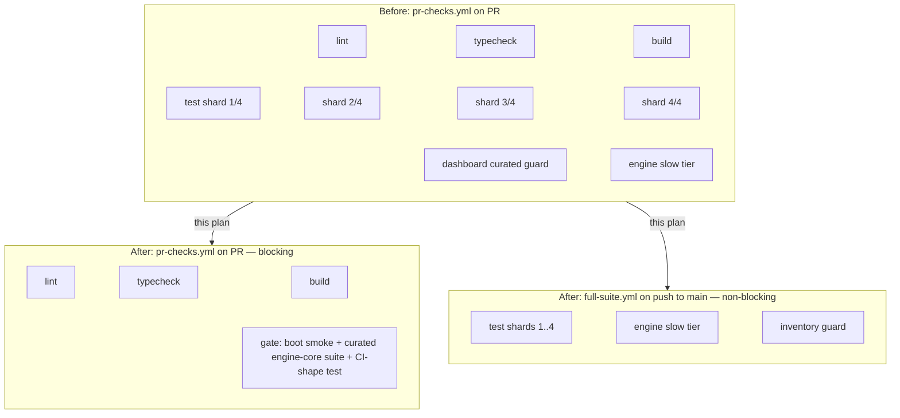
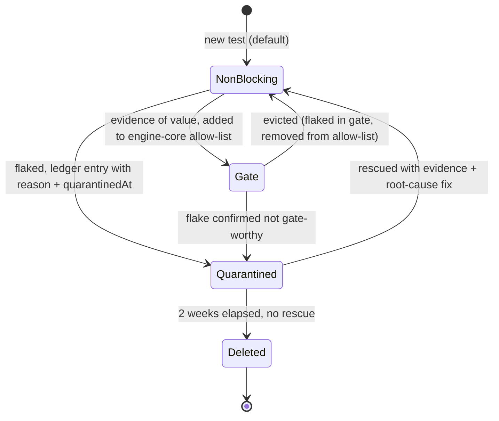

---

title: "refactor: Shrink PR merge gate to a fast trusted set with a deletion ratchet"
type: refactor
status: completed
date: 2026-06-04
origin: docs/brainstorms/2026-06-04-fast-trusted-test-gate-requirements.md

---

# refactor: Shrink PR merge gate to a fast trusted set with a deletion ratchet

## Summary

Replace the current 9-runner PR gate (lint, typecheck, build, 4 test shards, dashboard curated-gate guard, engine slow tier) with a thin trusted gate — 4 blocking checks: lint, typecheck, build, and a gate job combining boot smoke + the curated `engine-core` suite, with the gate job's test run under ~1 minute. (Lint is preserved from the existing gate as status quo; origin R1 does not name it.) Everything else moves to a non-blocking workflow on push to main. A quarantine ledger plus 2-week deletion ratchet (written policy, minimal mechanics) keeps flaky tests from re-accumulating, and local `pnpm test` is re-defaulted so developers cannot OOM.

---

## Problem Frame

PR failures are mostly flaky/infra and consume ~70% of maintainer shipping time in an agent-fix-and-rerun loop; no recalled PR test failure caught a real user-facing bug (see origin: docs/brainstorms/2026-06-04-fast-trusted-test-gate-requirements.md). Research corrected one origin assumption: there is **no double shard run** — `.github/workflows/ci.yml` is trigger-disabled (`workflow_dispatch` only, per FN-1541). The live gate is `.github/workflows/pr-checks.yml` alone. The local OOM path is also pinned: `shouldForceFullSuite` in `scripts/test-changed.mjs` (~line 431) escalates almost any shared-file change to a full-suite run at `--workspace-concurrency=2`, with dashboard lanes requesting 6GB heaps.

---

## Key Technical Decisions

- **The gate gets a dedicated command (`pnpm test:gate`); CI never invokes `pnpm test`.** `scripts/test-changed.mjs` hard-forces the full suite when `CI === "true"` (~line 1064), so any gate job calling `pnpm test` silently expands to everything. A dedicated command is the only way the ~1 min target is structurally guaranteed.
- **Gate membership is an explicit allow-list, not a glob.** A new `engine-core` vitest project in `packages/engine/vitest.config.ts` with an enumerated include list (precedent: the existing `engine-default`/`engine-reliability`/`engine-slow` project split). Recorded membership makes R10 (tests earn their way in) enforceable, and lets a flaky gate test be evicted by editing the list — no need for the flaky test itself to pass (resolves the chicken-and-egg eviction problem).
- **The non-blocking tier is a separate workflow file, not jobs inside `pr-checks.yml`.** A red full-suite run must not paint the gate's workflow red, or "red means real" dies on day one. New `full-suite.yml` triggered on push to main carries the 4 shards, engine slow tier, and inventory guard.
- **`ci.yml` is deleted and `packages/cli/src/__tests__/ci-workflow.test.ts` is rewritten in the same unit.** That test hard-asserts the current CI shape (ci.yml exists, 3-shard matrix, pr-checks 4-shard matrix, `docs/contributing.md` gate wording). Deleting the workflow without rewriting the test makes the change self-inconsistent. The rewritten test guards the *new* gate shape and is admitted to the gate suite — a test that guards the gate's own shape earns blocking status.
- **Quarantine ledger is a dated JSON file modeled on `scripts/lib/dashboard-curated-skiplist.json`, with `check-test-inventory.mjs --diff` left unwired.** The dashboard skiplist (entries with mandatory `reason`, shared between a guard script and vitest excludes) is the proven template; the ledger adds `quarantinedAt` so the 2-week clock is computable. `--diff` would fail CI on any test deletion — the exact opposite of the ratchet — so it stays unwired, documented as a deliberate exemption.
- **Quarantine stays on-sight (origin decision), with a product-race escalation note in the policy.** Institutional learning (`docs/solutions/ui-bugs/skill-autocomplete-highlight-reset-on-swr-revalidation.md`) documents a flake "stabilized" three times that was a real product race. The policy keeps on-sight quarantine but states: a second quarantine in the same subsystem is a product-race smell worth a look before the deletion clock runs out. No triage gate, no machinery.
- **Local `pnpm test` = gate suite + affected-package tests, with the force-full fallback removed.** Keeps the value of changed-code coverage (the affected-package expansion in `test-changed.mjs` already works) while deleting the OOM path: `shouldForceFullSuite` no longer escalates to a full recursive run locally; shared-infra changes run the gate suite plus a bounded affected set instead. `pnpm test:full` remains the explicit opt-in full suite.

---

## High-Level Technical Design

CI topology before → after:

Test lifecycle state machine (where each state is recorded):

State recording: **Gate** = presence in the `engine-core` include list (or gate job steps); **Quarantined** = entry in `scripts/lib/test-quarantine.json`; **NonBlocking** = default for everything else; **Deleted** = git history.

---

## Requirements

Carried from origin (R-IDs below are the origin's; see origin doc for full text).

**Merge gate**

- R1–R3. Gate = typecheck, build, boot smoke, curated `engine-core` suite; gate job's test run ~1 min; only merge-blocking test signal. (Lint stays as a separate pre-existing blocking check — status-quo preservation, not new scope from R1.)
- R4. Boot smoke is greenfield — verified that nothing real exists (`packages/cli/src/commands/__tests__/serve.test.ts` mocks `listen`; the only artifact smoke lives in the disabled `ci.yml`).

**CI de-duplication (revised by research)**

- R5 (revised). No double run exists; the work is deleting dead `ci.yml` and consolidating the gate in `pr-checks.yml`.
- R6. Non-gate tests run non-blocking in `full-suite.yml` on push to main; failures never block a PR.

**Deletion ratchet**

- R7–R10. Quarantine on sight; delete after 2 weeks unless rescued; policy in `AGENTS.md` including the agent appeasement ban; gate admission requires evidence.

**Local development**

- R11–R12. `pnpm test` cannot OOM (gate + bounded affected set, no force-full); bigger runs are explicit opt-ins.

---

## Implementation Units

### U1. Curated `engine-core` gate suite and `test:gate` command

- **Goal:** A single fast command that runs the gate's test content, locally and in CI.
- **Requirements:** R1, R2, R10.
- **Dependencies:** none.
- **Files:** `packages/engine/vitest.config.ts`, `packages/engine/package.json`, `package.json` (root), `scripts/test-timings.json` (read-only input for selection).
- **Approach:** Add an `engine-core` vitest project with an explicit include list. Selection criteria: deterministic (no module-level shared-state bleed, no real timers/network), fast (use `scripts/test-timings.json` per-file data; total budget ~60s single-threaded, leaving headroom under 1 min with boot smoke), and covering invariants the KB marks regression-prone: merge-queue trigger-gate eligibility, shared-branch-group landing/promotion idempotency, fork-point/files-changed attribution, executor/scheduler core paths. Exclude `reliability-interactions/**` and `*.slow.test.ts` outright (heaviest, single-threaded). Root script `test:gate` runs the `engine-core` project plus the rewritten CI-shape test from U3. Exact file list is execution-time discovery against timing data — the criteria above are binding, the list is not pre-enumerable here.
- **Patterns to follow:** the existing three-project split in `packages/engine/vitest.config.ts` (lines ~50–95).
- **Test scenarios:** Test expectation: none — config/selection unit; its verification is the gate run itself (below).
- **Verification:** `pnpm test:gate` passes locally in under ~1 min cold; running it 5× consecutively produces 5 green runs (flake screen); it executes only the allow-listed files (verify via vitest `list`).

### U2. Boot smoke check

- **Goal:** A real "the app starts and serves" check — greenfield (R4).
- **Requirements:** R1, R4.
- **Dependencies:** none.
- **Files:** `scripts/boot-smoke.mjs` (new), `package.json` (root, `test:gate` integration or separate `smoke:boot` script).
- **Approach:** Script builds nothing itself (gate job already runs after `pnpm build` artifacts exist or reuses the build job's dist cache — mirror the dist-artifact cache steps in `pr-checks.yml` lines ~86–121). It starts the dashboard server on an ephemeral port (respect `FUSION_RESERVED_PORTS`; never touch port 4040 — see the kill-guard conventions in `scripts/check-no-kill-4040.mjs`), polls an HTTP endpoint until 200 or a hard timeout (~60s), asserts the CLI binary answers `--help`, then shuts down cleanly. Exit code is the verdict.
- **Patterns to follow:** the packaged `--help` smoke in `scripts/release.mjs`; server-start handling in `packages/cli/src/commands/serve.ts` (the real one, not the mocked test).
- **Test scenarios:**
  - Happy path: server starts → 200 within timeout → clean shutdown → exit 0.
  - Error path: server fails to bind / crashes → nonzero exit with captured stderr.
  - Error path: port already in use → picks another ephemeral port rather than failing or killing anything.
- **Verification:** `node scripts/boot-smoke.mjs` exits 0 on a built workspace and nonzero when the dashboard entry point is deliberately broken.

### U3. Delete `ci.yml`, rewrite the CI-shape test, update CONTRIBUTING wording

- **Goal:** Remove the dead workflow without leaving the repo self-inconsistent.
- **Requirements:** R5 (revised).
- **Dependencies:** U4 (the new pr-checks shape must be settled so the test asserts it; land in the same PR).
- **Files:** `.github/workflows/ci.yml` (delete), `packages/cli/src/__tests__/ci-workflow.test.ts` (rewrite), `docs/contributing.md`, `README.md` (command block the test pins, if affected).
- **Approach:** The test's first describe block loads `ci.yml` in `beforeAll` — deleting the workflow without removing that block crashes the entire suite at setup, not just one assertion. Delete the whole CI-workflow describe block; rewrite the PR-checks describe block (drop the 4-shard-matrix and no-pre-test-build assertions, add the new invariants); **preserve** the unrelated version.yml/release.yml/test-release.yml/code-signing describe blocks sharing the file. New invariants: `pr-checks.yml` contains the gate jobs (lint, typecheck, build, gate) and no shard matrices; `full-suite.yml` exists, triggers only on push to main, and contains the demoted jobs; `docs/contributing.md` names `pnpm test:gate` as the merge gate (the old "canonical pre-merge gate" string lives at `docs/contributing.md:83`). This test joins the gate suite (via U1's `test:gate`).
- **Patterns to follow:** the existing assertion style in `ci-workflow.test.ts` (YAML load + structural expectations).
- **Test scenarios:** (this unit IS a test)
  - Asserts gate job set and absence of shard matrices in `pr-checks.yml`.
  - Asserts `full-suite.yml` trigger is push-to-main only (no `pull_request`).
  - Asserts `docs/contributing.md` gate wording matches the new commands.
- **Verification:** rewritten test passes against the new workflows and fails if a shard matrix is reintroduced into `pr-checks.yml`.

### U4. Rework `pr-checks.yml` and create `full-suite.yml`

- **Goal:** The blocking gate becomes lint + typecheck + build + gate; demoted jobs move to a separate non-blocking workflow.
- **Requirements:** R1, R2, R3, R6.
- **Dependencies:** U1, U2.
- **Files:** `.github/workflows/pr-checks.yml`, `.github/workflows/full-suite.yml` (new).
- **Approach:** `pr-checks.yml` keeps `lint`, `typecheck`, `build`, and gains a `gate` job (boot smoke + `pnpm test:gate`) reusing the dist-artifact cache; it loses `test-shards`, `test-slow`, and `test-inventory-guard`, and its `push: main` trigger (post-merge signal moves to full-suite.yml). `full-suite.yml` runs on `push: branches: [main]` with the 4-shard matrix, engine slow tier, and inventory guard moved verbatim, keeping the per-shard timing artifact upload. Keep the `pretest` guards (`check-no-nohup`, `check-no-kill-4040`) on any path that runs tests. Cutover (manual admin step, do immediately after merge): update branch protection required checks to exactly `Lint`, `Typecheck`, `Build`, `Gate` — stale names like `Test shard 1/4` left required will block every PR forever ("Expected — waiting for status"). Open PRs must rebase onto post-change main before merging.
- **Test scenarios:** covered by U3's rewritten CI-shape test (Covers AE2: a red `full-suite.yml` run does not affect PR mergeability — verify once live by observing a PR merge during a red main run).
- **Verification:** a test PR shows only the 4 gate checks, total wall-clock under ~5 min; a deliberate failure in a demoted test does not block that PR.

### U5. Quarantine ledger

- **Goal:** A single recorded place for quarantined tests, feeding both vitest excludes and the 2-week clock.
- **Requirements:** R7, R8.
- **Dependencies:** none.
- **Files:** `scripts/lib/test-quarantine.json` (new), vitest configs of packages that gain quarantined entries (exclude entries maintained by hand), `scripts/check-test-inventory.mjs` (doc comment only — `--diff` exemption note).
- **Approach:** Schema per entry: `{ "file": "<repo-relative test path>", "reason": "<why, link to failing run>", "quarantinedAt": "YYYY-MM-DD" }` — modeled on `scripts/lib/dashboard-curated-skiplist.json` but with the date the ratchet needs. **No loader module, no CLI flag** (a shared module wired into vitest configs would itself be new test machinery — the failure mode the origin rejected). Quarantining a test = add the ledger entry AND add a matching one-line `exclude` entry to that package's vitest config, by hand, in the same commit; the ledger is the dated record, the config exclude is the mechanism. The 2-week sweep is performed by whoever (human or agent) touches the suite, per policy in U7 — an entry is expired when `quarantinedAt` is older than 14 days. Document that `check-test-inventory.mjs --diff` stays unwired because it would fail on ratchet deletions.
- **Patterns to follow:** `scripts/lib/dashboard-curated-skiplist.json` (data file with mandatory `reason`, mirrored by config excludes).
- **Test scenarios:** Test expectation: none — a data file plus hand-maintained config excludes; no executable surface to test. (Covers AE1: a quarantined file listed in the ledger with its config exclude no longer appears in the package's vitest run — verify via vitest `list`.)
- **Verification:** adding a real test file to the ledger plus its config exclude removes it from `pnpm test:gate` and shard discovery without editing the test file itself.

### U6. Local `pnpm test` re-default

- **Goal:** Developers cannot OOM from the default command (R11), and changed-code coverage is preserved.
- **Requirements:** R11, R12.
- **Dependencies:** U1.
- **Files:** `scripts/test-changed.mjs`, `package.json` (root).
- **Approach:** `pnpm test` becomes: run `test:gate`, then affected-package tests via the existing changed-file → package → reverse-dependents expansion. Remove the local full-suite escalation: `shouldForceFullSuite` (~line 431) no longer triggers a recursive full run — shared-infra changes now run gate + a bounded affected set, with a printed note naming `pnpm test:full` for the full sweep. The `CI === "true"` force-full branch (~line 1064) is removed (CI no longer calls this script). `test:full`, `test:serial`, `test:fast`, `verify:workspace` keep their current full-suite semantics as explicit opt-ins; docs reposition `verify:workspace` as the deep pre-release check, not the pre-merge gate.
- **Execution note:** characterization-first — `scripts/__tests__/` has existing coverage of test-changed behavior; capture the current selection behavior you're keeping before removing the escalation paths.
- **Test scenarios:** (extend `scripts/__tests__/`)
  - Changed file in one package → that package + reverse-dependents selected (unchanged behavior).
  - Changed shared-infra file (e.g. `.github/workflows/x.yml`) → no full-suite escalation; gate + affected set only, hint printed.
  - `--full` flag still runs the full suite (opt-in preserved).
- **Verification:** `pnpm test` after touching a workflow file completes without spawning the recursive full run; memory stays bounded (no 6GB dashboard lanes invoked).

### U7. Policy docs: ratchet, appeasement ban, gate semantics

- **Goal:** The policy is written where humans and agents actually look (R9).
- **Requirements:** R7, R8, R9, R10.
- **Dependencies:** U1–U6 (documents the shipped reality).
- **Files:** `AGENTS.md`, `docs/testing.md`.
- **Approach:** `AGENTS.md`: rewrite line ~69 ("Tests are required. Typechecks/manual checks are not substitutes.") to describe the gate-vs-non-blocking split; add the ratchet as a standing rule adjacent to FN-5048 (~lines 79–85): quarantine on sight via ledger entry; delete after 2 weeks unless rescued with evidence and a root-cause fix; **agents must never appease a flaky test** (no widened timeouts, added retries, loosened assertions — quarantine instead); a flake *inside the gate* is evicted from the allow-list, not skipped; a second quarantine in the same subsystem is a product-race smell — look before the clock runs out (see `docs/solutions/ui-bugs/skill-autocomplete-highlight-reset-on-swr-revalidation.md`). `docs/testing.md`: new section with ledger schema, rescue procedure, gate admission criteria (evidence of value), and the known blind spot stated honestly: the gate does not run the union suite a merge creates — logic regressions outside the curated set land non-blocking by design. Mind the AGENTS.md add/add pointer-line merge convention (`docs/solutions/best-practices/merge-conflict-extraction-vs-semantics-and-parallel-bootstrap.md`).
- **Test scenarios:** Test expectation: none — documentation unit. (AE3 — agent consults AGENTS.md and quarantines instead of appeasing — is enforced by the policy text this unit writes; U3's test pins the CONTRIBUTING wording.)
- **Verification:** AGENTS.md and docs/testing.md describe the shipped gate accurately; no remaining references to the 4-shard PR gate or `verify:workspace` as "the canonical pre-merge gate".

---

## Scope Boundaries

- No new test machinery: no auto-quarantine, no flake-scoring, no test-value telemetry, no quarantine loader module (see origin). The ledger JSON + hand-maintained vitest config excludes are the entire mechanical surface.
- No root-cause fixing of existing flaky tests; flakes exit via quarantine and deletion.
- Healthy non-gate tests survive indefinitely in `full-suite.yml`; no mass deletion.
- Release pipelines untouched: `version.yml`/`release.yml` already run zero tests (verified), so nothing weakens; the consequence — regressions can reach main and ship behind build+typecheck+smoke — is the accepted thesis of this change.
- Coverage tooling untouched.

### Deferred to Follow-Up Work

- Capturing the vitest auto-kill incident, port-4040 kill guards, and `.slow` split conventions into `docs/solutions/` (learnings researcher flagged these exist only in auto-memory/AGENTS.md).
- A scheduled `--write-timings` refresh if shard balance in `full-suite.yml` degrades once PR-driven timing uploads stop (accept staleness initially).
- Extending the `.slow`-style project split to non-engine packages if their non-blocking lanes ever need tiering.

---

## Risks & Dependencies

- **Branch-protection cutover is the sharpest edge.** Required checks are matched by job name; leaving a removed name required blocks all PRs indefinitely. Mitigation: U4 names the exact new check set; do the admin update immediately after merge; audit open PRs and require rebase.
- **Gate blind spot (deliberate).** Typecheck + build + smoke + curated suite does not test the union a merge creates; documented honestly in U7.
- **Curated suite quality risk.** If the allow-list admits a latent flake, the gate loses trust fast. Mitigation: 5×-consecutive-green screen in U1 verification; eviction rule in U7.
- **Timing snapshot staleness** once shards leave PRs (deferred above) — affects only non-blocking shard balance.
- **Branch protection settings are server-side** — unverifiable from the repo; the actual required-check list at cutover time must be read from GitHub settings, not assumed.