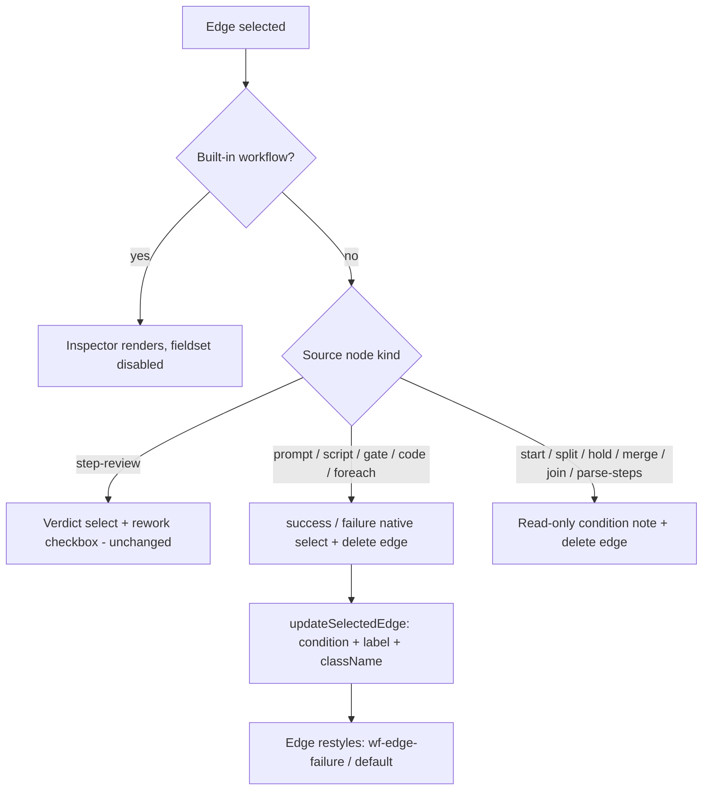

# feat: Node editor visual redesign + success/failure edge authoring

## Summary

Upgrade the workflow node editor's authoring experience: redesign graph nodes from small icon+label pills into larger card-style nodes with kind accent colors and config summaries; generalize edge-condition authoring so success/failure is selectable on regular edges (today only step-review edges are editable) with distinct visual styling; and round out editor power/polish — safe node/edge deletion, proper dialogs replacing `window.prompt`/`window.confirm`, inline rename/description, dirty-state guard, auto-layout, and a real empty/onboarding state. UI/authoring layer only — no engine, IR-schema, or compiler-semantics changes.

---

## Problem Frame

The editor (`packages/dashboard/app/components/WorkflowNodeEditor.tsx`, built on `@xyflow/react`) has grown to 13 editor node kinds with swimlane columns and an edge inspector, but the authoring surface lags the capability underneath:

- **Nodes are unreadable at a glance.** `NodeShell` (`packages/dashboard/app/components/nodes/WorkflowNodeTypes.tsx`) renders icon + label + tiny badges. A prompt node configured with a model, an agent, or a CLI command looks identical to an unconfigured one; users must click every node to see what it does.
- **Failure edges exist everywhere except the editor.** The IR accepts any `edge.condition` (`parseWorkflowIr` never validates condition values), and the graph executor natively traverses `failure` edges (`shouldTraverseEdge`, `packages/engine/src/workflow-graph-executor.ts:385-392`). But `onConnect` hardcodes every new edge to `success`, and the edge inspector only offers condition controls when the source node is `step-review`. There is no way to author the branching the engine already supports.
- **Authoring chrome is crude.** `window.prompt` for workflow names, `window.confirm` for deletes, no keyboard deletion, no dirty tracking (switching workflows silently discards edits), no auto-layout, and a bare "Select or create a workflow" empty state.

---

## Scope Boundaries

### In scope
- Card-style node redesign with config summaries and kind accent colors.
- Success/failure edge-condition authoring on regular edges, with distinct edge styling and an honest "interpreter-only" presentation when branching makes the graph non-compilable to the linear step engine.
- Deletion UX (keyboard + buttons) with explicit cascade semantics.
- Dialogs, inline rename/description, dirty-state guard, auto-layout, empty/onboarding state.

### Deferred to Follow-Up Work
- Undo/redo history for the canvas.
- Workflow import/export, versioning, templates gallery.
- Localizing edge condition labels (kept as canonical IR tokens — see KTD-8).
- Auto-layout inside `foreach` template groups beyond the existing seeded row.

### Outside this product's identity
- Changing edge/branching **execution** semantics. The graph interpreter, `parseWorkflowIr` graph validation, and the linear-step compiler keep their current behavior; this plan only lets users author what they already support and presents their limits honestly.

---

## Requirements

**Visual**
- R1 — Graph nodes render as card-style nodes: kind accent color, icon, label, and a config-summary line (model/agent/skill/CLI for prompt nodes; script name; gate mode; hold release; join mode; parser; review type), with a defined header-overflow priority and truncation; existing badges and error badges preserved.
- R2 — Success, failure, and rework edges are distinguishable by at least two independent visual channels: the condition label is always rendered, and failure edges use a distinct dash pattern from success edges; color (token-only, both themes) is a third channel, never the only one.

**Edge authoring**
- R3 — A user can set a regular edge's condition to `success` or `failure` from the edge inspector via a native `<select>` in the inspector's natural tab order; new edges still default to `success`. The control appears only for source-node kinds where failure is meaningful (see KTD-2).
- R4 — A node can carry parallel `success` and `failure` edges to different targets (forward of the source — see KTD-9); both survive save/load round-trip.
- R5 — When a saved graph fails the linear-step compile because of branching, the editor presents an informational "runs on the graph interpreter only" state rather than an error-toned failure banner; genuinely invalid graphs — including those rejected by `parseWorkflowIr`'s graph validation at save (illegal cycles, disconnected nodes) — still error.

**Editor UX**
- R6 — Deleting a node (button or keyboard) cascades its incident edges; deleting a `foreach` group cascades its template children and intra-template edges; `start`/`end` remain non-deletable; no automatic edge bridging. After keyboard deletion, focus moves to the canvas container.
- R7 — Workflow create uses a proper named dialog with inline validation (empty/duplicate names) and focus return to its trigger on close; workflow delete uses `ConfirmDialog`; workflow name and description are editable inline in the editor; unsaved changes prompt a discard confirmation on workflow switch or editor close (all dismissal paths, including Escape).
- R8 — An auto-layout action arranges nodes left-to-right by graph order; in v2 workflows it preserves each node's column (y stays within its band, staggering x when a band row fills); in v1 it lays out freely; `foreach` template children are left untouched.
- R9 — The no-workflow and trivial-graph (start→end only, user-owned) states show onboarding guidance with clear calls to action.

**Cross-cutting**
- R10 — Every new control (edge condition selector, delete buttons, keyboard delete, rename/description, auto-layout) is inert for built-in workflows; all new user-facing strings go through i18next.

---

## Key Technical Decisions

- KTD-1 — **Failure-edge authoring is a UI-gating change, not an engine change.** `updateSelectedEdge` already handles arbitrary conditions and `flowEdgeToIr`/`irEdgeToFlow` already round-trip `condition`; `parseWorkflowIr` accepts `failure` as a condition value; the graph executor traverses it. The work is widening the inspector beyond step-review-sourced edges and styling the result. No changes under `packages/engine/` or to `packages/core/src/workflow-ir.ts`. Note: `parseWorkflowIr` still runs its graph-shape validation on save (cycle/disconnection rules) — see KTD-9 for the author-time guard.
- KTD-2 — **Failure option gated by source-node kind allowlist.** Offer success/failure on edges sourced from `prompt`, `script`, `gate`, `code`, and `foreach` (kinds whose execution genuinely emits failure outcomes). `step-review` edges keep the verdict/rework controls; `start`, `split`, `hold`, `merge`, `join`, and `parse-steps` sources don't get the selector (split fan-out is success-semantics by design; hold releases aren't failures; parse-steps failures route via its dedicated `outcome:parse-error` condition). Rationale: prevents authoring graphs that are neither compilable nor coherently interpretable, per flow analysis.
- KTD-3 — **Conditioned edges are appended directly, bypassing `addEdge`.** React Flow's `addEdge` dedupes via `connectionExists`, which compares only source/target/handles and ignores `id` — a custom id alone would NOT permit the core "success edge + failure edge from the same node" case. `onConnect` constructs the edge with an explicit unique id (mirroring the `newNodeId` pattern) and appends via `setEdges((eds) => [...eds, edge])`, reimplementing the basic source/target sanity checks `addEdge` provided.
- KTD-4 — **Compile-failure presentation splits "interpreter-only" from "broken," keyed on the shared message suffix.** `validateLinearity` emits more than one interpreter-deferred rejection (branch fan-out and off-main-path nodes); both carry the suffix `require the workflow interpreter (deferred)`. Compile errors matching that suffix render an info-tone banner; other compile errors keep the warning treatment. The banner states (1) the workflow still runs, (2) why: branching can't compile to the linear step engine — using the info token, not the warning token. Save-time `parseWorkflowIr` rejections (cycles, disconnected nodes) are a separate, earlier layer and remain hard errors with the existing node-attribution treatment. The compiler itself is untouched; the string coupling is a named risk.
- KTD-5 — **Hand-rolled auto-layout, no new dependency.** No dagre/elk anywhere in the repo, and the column-band constraint (node y determines its column via `columnForY`/`strictColumnForY`) makes generic rank-based layout actively harmful. Layout = topological layering from `start` for x, and y preserved per column band (v2) or assigned by within-layer index (v1). When same-layer/same-band nodes exceed the band's vertical capacity, overflow staggers horizontally (extra x offset) rather than escaping the band. `foreach` group interiors are skipped (children already seed in a row; `extent: "parent"` clamps them).
- KTD-6 — **Config summaries derive from a pure helper with raw-id fallback.** A `nodeConfigSummary(data, catalogs)` helper (testable without React Flow) maps `config` → summary text. Models/agents/skills catalogs are prefetched once on editor open so summaries show names; until loaded (or on fetch failure) summaries show raw ids — never blank.
- KTD-7 — **Dialogs reuse existing primitives; no new component file.** Delete and discard-confirm use the existing `useConfirm`/`ConfirmDialog` (provider already mounted app-wide). The create-workflow name dialog is a local component inside `WorkflowNodeEditor.tsx` built on the shared `.modal` primitives (precedent: `NewTaskModal`); extraction to a shared text-input dialog waits for a second consumer. Rename/description use inline editing (KTD-10), so no rename modal exists.
- KTD-8 — **Edge labels stay canonical IR tokens (`success`/`failure`/verdicts), not localized.** They name IR vocabulary, match the current verbatim display of conditions, and keep mapping-layer label logic (`shortConditionLabel`) locale-free. Surrounding inspector chrome is localized as usual.
- KTD-9 — **Author-time guard against failure back-edges.** `validateNoIllegalCycles` exempts only `rework` edges; a failure edge targeting an ancestor forms an illegal cycle and would be rejected at save with a confusing server error. The editor blocks connecting an edge whose target is an ancestor of its source (simple reachability walk at connect time) with an explanatory toast, keeping the first-class failure-edge UX from dead-ending on the parse layer. Server validation remains authoritative.
- KTD-10 — **Rename is inline, not modal.** The active workflow's name renders in the canvas header strip; clicking it activates an inline input (Enter commits, Escape cancels, blur commits); the description is an adjacent field in the same strip. This avoids a second modal and keeps the create dialog (KTD-7) the only name modal.

---

## High-Level Technical Design

### Edge inspector gating (decision flow)



### Auto-layout constraints (directional)

```
v2 (columns present):                v1 (no columns):
x: topological layer * spacing       x: topological layer * spacing
y: KEPT inside the node's current    y: layer-local index * row height
   column band (bandTop..+220);         (free vertical placement)
   band-row overflow staggers x
foreach groups: positioned as one    foreach template children:
   unit; children untouched             untouched (parent-relative)

Invariant: layout never changes any node's column assignment and
never produces unplaced nodes (which would block save).
```

*Directional guidance, not implementation specification.*

---

## Implementation Units

### U1. Card-style node redesign

**Goal:** Replace the pill `NodeShell` with a larger card layout showing kind accent, icon, label, badges, and a config-summary line.
**Requirements:** R1, R10.
**Dependencies:** none. **Consumed by:** U5 (card max-width / foreach group constants must be finalized here and exported as named constants so U5 imports them rather than duplicating numbers).
**Files:**
- `packages/dashboard/app/components/nodes/WorkflowNodeTypes.tsx` (modify) — card layout in `NodeShell`; summary line; keep testids and `WorkflowNodeErrorBadge`.
- `packages/dashboard/app/components/nodes/node-summary.ts` (new) — pure `nodeConfigSummary(data, catalogs)` helper.
- `packages/dashboard/app/components/nodes/__tests__/node-summary.test.ts` (new).
- `packages/dashboard/app/components/WorkflowNodeEditor.tsx` (modify) — prefetch models/agents/skills on open; pass catalog name-lookup into node data or context.
- `packages/dashboard/app/components/workflow-flow-mapping.ts` (modify) — exported card-dimension constants; grow `FOREACH_GROUP_WIDTH/HEIGHT` + child offsets if needed for card fit.
- `packages/dashboard/app/components/WorkflowNodeEditor.css` (modify) — card classes, per-kind accent tokens (`color-mix` over existing status/accent tokens), truncation, max card width.
**Approach:** Card = header row (icon, label, badges) + summary row. Header overflow priority: icon fixed-width; label flex-shrinks first (ellipsis at a defined max-width); badges `flex-shrink: 0`, flush right; the error badge always holds the rightmost slot; the summary row truncates independently. Summary derivation per executor mode: model → `provider/modelId`, agent/skill → name from prefetched catalog with raw-id fallback, cli → truncated command or script name, plus gate mode, hold release, join mode, parser, review type. Foreach group rendering unchanged except header polish; keep children inside the group box. Token-only CSS; `--duration-*` tokens for any animation.
**Patterns to follow:** existing `wf-node-*` classes; `docs/dashboard-guide.md` styling guide (tokens, button-freeze, `color-mix` precedent at `WorkflowNodeEditor.css:337`).
**Test scenarios:**
- `nodeConfigSummary`: model-executor prompt → `provider/modelId`; agent executor with catalog loaded → agent name; catalog missing → raw id; cli command → truncated command; script node → script name; gate node → gate-mode text; unconfigured prompt → "not configured" text; hold/join/parse-steps/step-review summaries.
- Rendered card shows summary line for a configured prompt node (jsdom node rendering works; assert via testid).
- Foreach child card fits group: constants test asserting child offsets + card max width ≤ group dimensions.
- Long label/summary truncates (class presence assertion); error badge renders in rightmost slot alongside other badges.

### U2. Generalized edge-condition authoring

**Goal:** Author success/failure on regular edges with distinct styling; parallel conditioned edges; cycle guard; honest interpreter-only banner.
**Requirements:** R2, R3, R4, R5, R10.
**Dependencies:** none (parallel with U1).
**Files:**
- `packages/dashboard/app/components/WorkflowNodeEditor.tsx` (modify) — `onConnect` direct-append with explicit unique edge ids (KTD-3) + ancestor-cycle guard (KTD-9); edge inspector success/failure native `<select>` gated per KTD-2 inside the existing disabled fieldset; compile-banner suffix match + info tone (KTD-4); `interactionWidth` on edges for a forgiving hit target (touch + pointer).
- `packages/dashboard/app/components/workflow-flow-mapping.ts` (modify) — edge `className` for failure edges in `irEdgeToFlow`; always-rendered condition labels; dash styling hooks; ancestor-reachability helper for the cycle guard.
- `packages/dashboard/app/components/WorkflowNodeEditor.css` (modify) — `.wf-edge-failure` (distinct dash pattern + `--ws-error`-derived stroke), success default styling, info-tone banner.
- `packages/dashboard/app/components/__tests__/workflow-flow-mapping.test.ts` (extend) — mapping-level edge tests.
- `packages/dashboard/app/components/__tests__/WorkflowNodeEditor.test.tsx` (extend) — inspector gating tests.
**Approach:** Edge-level behavior is tested at the mapping layer (React Flow doesn't render edges under jsdom). The inspector reuses `updateSelectedEdge` unchanged — only the rendering gate widens, and the condition control is a native `<select>` in the inspector's tab order. Failure edges from step-review sources remain impossible (verdict controls instead); rework stays intra-template-only (server-enforced). Banner content per KTD-4: states the workflow still runs and why, info token.
**Test scenarios:**
- Covers R3: failure condition set via `updateSelectedEdge` round-trips `flowToIr` → IR edge `condition: "failure"`; reload re-applies label + `wf-edge-failure` class.
- Covers R4: two edges from one node (success + failure) with distinct ids both survive `flowToIr`/`irToFlow` round-trip; two sequential connects between the same pair don't collide or silently drop.
- Covers KTD-9: connecting an edge whose target is an ancestor of its source is blocked with a toast; a rework edge inside a foreach template is still allowed.
- Inspector shows success/failure select for a prompt-sourced edge; verdict controls (not the selector) for step-review-sourced; read-only note for split- and parse-steps-sourced.
- Built-in workflow: edge inspector fieldset disabled (selector inert).
- Compile rejection carrying the `require the workflow interpreter (deferred)` suffix (both the fan-out and off-main-path variants) → info-tone banner state; other compile errors → existing warning banner.
- Default on connect remains `success` with a unique id.

### U3. Deletion UX with cascade semantics

**Goal:** Keyboard and button deletion for nodes and edges with explicit, safe cascades.
**Requirements:** R6, R10.
**Dependencies:** none (parallel; the delete-edge button touches the same inspector section as U2 but different fields — coordination, not a technical gate).
**Files:**
- `packages/dashboard/app/components/WorkflowNodeEditor.tsx` (modify) — `deleteKeyCode` (null when builtin), delete-node button in node inspector, delete-edge button in edge inspector, focus-to-canvas after keyboard deletion.
- `packages/dashboard/app/components/workflow-flow-mapping.ts` (modify) — `cascadeDelete(nodes, edges, ids)` pure helper (this module owns the pure node/edge transformation layer; its test file already covers it).
- `packages/dashboard/app/components/__tests__/workflow-flow-mapping.test.ts` (extend).
- `packages/dashboard/app/components/__tests__/WorkflowNodeEditor.test.tsx` (extend).
**Approach:** Deleting a node removes all incident edges; no auto-bridge. Deleting a `foreach` group removes its `parentId` children and their intra-template edges (React Flow does not cascade parents → handle explicitly). `start`/`end` stay `deletable: false` and the keyboard path must honor per-node `deletable`. Deleting the last template child leaves the group with its existing `templateEmpty` hint (save-time validation, not delete-time block). After keyboard deletion, focus moves to the React Flow canvas container.
**Test scenarios:**
- Covers R6: cascade helper — deleting a mid-chain node removes its 2 incident edges and does not create a bridge edge.
- Deleting a foreach group removes group + children + template edges.
- Deleting the seeded step-execute child → group remains with `templateEmpty` rendering.
- `start`/`end` not deletable via helper or keyboard config.
- Builtin: `deleteKeyCode` null / delete buttons absent or disabled.

### U4. Dialogs, inline rename/description, dirty guard

**Goal:** Replace `window.prompt`/`window.confirm`; inline-editable name + description; confirm-on-discard across all dismissal paths.
**Requirements:** R7, R10.
**Dependencies:** none (parallel).
**Files:**
- `packages/dashboard/app/components/WorkflowNodeEditor.tsx` (modify) — local create-workflow dialog component (KTD-7), inline rename/description in the canvas header strip (KTD-10), dirty tracking, single dismissal guard.
- `packages/dashboard/app/components/WorkflowNodeEditor.css` (modify).
- `packages/dashboard/app/components/__tests__/WorkflowNodeEditor.test.tsx` (extend).
**Approach:** `useConfirm` for workflow delete and dirty-discard (provider mounted app-wide; tests must wrap in `ConfirmDialogProvider` or assert the no-op fallback = cancel). Dirty = normalized comparison — serialize both sides through `flowToIr` (loaded snapshot vs current) plus name/description, so mapping-layer defaults (e.g. `condition: "success"` materialized on load) don't produce spurious dirt; auto-layout position changes do count as dirty (they are persisted layout changes). **Dismissal guard design:** `useOverlayDismiss` handles only overlay clicks and its `onClose` is synchronous — it cannot await a confirm. Route every dismissal path (overlay click, X button, and a dedicated Escape keydown handler — Escape is NOT covered by `useOverlayDismiss`) through one synchronous guard that, when dirty, opens the `useConfirm` dialog and performs the real close only in the confirm callback. Guard the sidebar workflow switch the same way; built-ins are never dirty. Create dialog: inline error for empty/whitespace name; server-side duplicate-name rejection surfaces in-dialog without losing input; focus returns to the "New workflow" button on close (NewTaskModal pattern). Rename/description persist through the existing `updateWorkflow` PATCH on save.
**Test scenarios:**
- Covers R7: create flow — empty name shows inline error, valid name calls `createWorkflow` and activates it; server 4xx surfaces in-dialog.
- Delete uses confirm: without provider (fallback false) delete does not fire; with provider + confirm, `deleteWorkflow` called.
- Dirty guard: edit node → switch workflow → confirm dialog; cancel keeps edits, confirm discards and switches.
- Escape on a dirty editor triggers the same confirm (dedicated keydown path); close with no edits → no prompt.
- Inline rename: click name → input; Enter commits into save payload; Escape cancels; description round-trips.
- Load→no-edit→close produces no spurious dirty prompt (normalized-compare regression test).

### U5. Auto-layout

**Goal:** One-click left-to-right tidy that never re-columns or unplaces nodes.
**Requirements:** R8, R10.
**Dependencies:** U1 (imports the exported card-dimension constants for spacing).
**Files:**
- `packages/dashboard/app/components/workflow-auto-layout.ts` (new) — pure `autoLayout(nodes, edges, columns)` returning new positions.
- `packages/dashboard/app/components/__tests__/workflow-auto-layout.test.ts` (new).
- `packages/dashboard/app/components/WorkflowNodeEditor.tsx` (modify) — toolbar button (hidden/disabled for builtin), apply positions, mark dirty.
**Approach:** Topological layering from `start` (cycle-safe: rework edges and unreachable nodes handled — unreachables appended in a trailing layer). x = layer × spacing (spacing from the U1 card-width constant). v2: y = clamp to the node's current column band (`bandTop(i)`..`+220`), stacking same-layer/same-band nodes vertically until the band's capacity is reached, then staggering further nodes horizontally (extra x offset) so nothing escapes its band; v1: y = within-layer index × row height. Foreach groups move as a unit; children positions untouched (parent-relative). Pure function per the no-slow-tests rule.
**Test scenarios:**
- Covers R8: linear chain → strictly increasing x, stable y band per node (v2 fixture) — `strictColumnForY` unchanged for every node before/after.
- Branching graph (success+failure) → branches occupy distinct rows, no overlaps at same x/y.
- Dense column: more same-layer/same-band nodes than fit a 220px band → all stay in-band (column unchanged), overflow staggered in x, no two nodes share a position.
- v1 graph (no columns) → layered positions, no NaN, deterministic output.
- Foreach group: group repositioned, children's relative positions identical.
- Unreachable node still receives a position (no node lost off-canvas).

### U6. Empty/onboarding states

**Goal:** Helpful empty states with clear CTAs.
**Requirements:** R9, R10.
**Dependencies:** none (parallel; each unit U1–U5 adds its own i18n keys to `packages/i18n/locales/en/app.json` and runs `pnpm i18n:extract && pnpm i18n:sync && pnpm i18n:types` as part of its own change — U6 adds only the empty-state strings).
**Files:**
- `packages/dashboard/app/components/WorkflowNodeEditor.tsx` (modify) — no-workflow empty state with create CTA; trivial-graph (start→end only) canvas hint pointing at the palette.
- `packages/dashboard/app/components/WorkflowNodeEditor.css` (modify).
- `packages/i18n/locales/en/app.json` (modify) — empty-state keys.
- `packages/dashboard/app/components/__tests__/WorkflowNodeEditor.test.tsx` (extend).
**Approach:** Empty states are presentation-only (no new data fetches). The sidebar "New workflow" button remains the always-available create entry (including when a built-in is selected); the empty-state canvas message appears only when no workflow is loaded at all; the trivial-graph palette hint appears only for user-owned (non-builtin) workflows and disappears once any user node exists. Surface enumeration: no workflows / workflows-but-none-selected / trivial graph (user-owned) / builtin selected (read-only banner already exists; no hint, no canvas CTA) / mobile breakpoint reachability of toolbar actions.
**Test scenarios:**
- No workflows → empty state with create CTA; clicking opens the U4 dialog.
- Trivial graph (user-owned) → palette hint rendered; hint absent once a user node exists; hint absent for builtins.
- New i18n keys resolve (English defaults render; `pnpm i18n:lint` passes).
- Test expectation for pure CSS additions: none — covered by the token/animation guard tests.

---

## Risks & Dependencies

- **Compile-banner string coupling.** KTD-4 keys the info-tone banner on the compiler's `require the workflow interpreter (deferred)` message suffix. If that wording changes, the banner silently reverts to warning tone with no failing test — add a mapping-level test that imports/copies the literal suffix and a comment at the compiler message site noting the dashboard dependency.
- **Two-layer server rejection.** `parseWorkflowIr` graph validation (illegal cycles, disconnected nodes) rejects at save, before compile. KTD-9's author-time cycle guard covers the common back-edge case; remaining parse-layer rejections keep the existing hard-error treatment by design (R5).
- **Foreach group fit.** Larger cards may overflow the fixed 520×200 group; U1 adjusts the group constants and asserts fit in tests. Watch `extent: "parent"` clamping silently mangling layouts.
- **jsdom can't render edges.** All edge styling/condition behavior must be asserted at the mapping layer; browser verification is the only proof edges render — see the stale-bundle note below.
- **Stale-bundle trap.** `fn dashboard` serves the CLI's bundled client, not fresh dashboard builds; new node types render as `react-flow__node-default` and look like source bugs. Use `FUSION_CLIENT_DIR=$PWD/packages/dashboard/dist/client` (per `docs/solutions/developer-experience/browser-testing-dashboard-from-worktree-safely.md`); never port 4040, never `fn daemon` from a worktree.
- **CSS token shape (IACVT).** Any animation must use `--duration-*` tokens; `--transition-*` as a bare duration silently kills the declaration (`docs/solutions/ui-bugs/css-animation-frozen-by-transition-token-shape-mismatch.md`); guarded by `animation-duration-tokens.css.test.ts`.
- **Dashboard bundle constraint.** `@fusion/core` is types-only in the app build — any shared condition list/constant must be inlined in the dashboard (existing precedent: `STEP_REVIEW_VERDICTS`).
- **Theme spread.** Edge colors derive from status tokens across 54 themes; the two-channel rule (R2: label + dash) keeps failure edges distinguishable even in low-contrast themes.
- **Changeset.** This is user-facing behavior shipped via the bundled CLI; add a `@runfusion/fusion` changeset following the precedent of `.changeset/workflow-graph-editor-and-bundled-plugins.md` (AGENTS.md forbids changesets for the private packages themselves).

---

## System-Wide Impact

- **Engine/core:** none — no executor, compiler, IR-schema, or store changes.
- **Published CLI:** dashboard UI changes reach `@runfusion/fusion` via the bundled client (changeset, no new dependency).
- **Affected parties:** workflow authors get a substantially better editor; existing saved workflows render unchanged semantically (layout positions and conditions round-trip as before).

---

## Sources & Research

- `packages/dashboard/app/components/WorkflowNodeEditor.tsx` — `onConnect` (~241), `updateSelectedEdge` (~359), edge inspector gating (~1306-1360), `handleSave` banner split (~431-494), `window.prompt`/`confirm` (~382, ~400).
- `packages/dashboard/app/components/workflow-flow-mapping.ts` — `irEdgeToFlow` (~145), `flowEdgeToIr` (~382), band math (`bandTop`/`columnForY`/`strictColumnForY`, ~56-93), foreach constants (~198).
- `packages/core/src/workflow-ir-types.ts:29-37` (free-form `condition`), `packages/core/src/workflow-ir.ts` (no condition-value validation; `validateNoIllegalCycles` exempts only rework edges — basis for KTD-9), `packages/engine/src/workflow-graph-executor.ts:385-392` (`failure` traversal), `packages/core/src/workflow-compiler.ts:55-149` (linearity rejection messages keyed by KTD-4), `packages/engine/src/workflow-graph-foreach.ts` (foreach genuinely emits `outcome: "failure"` — basis for its KTD-2 allowlisting).
- `@xyflow/system` `addEdge`/`connectionExists` — dedupes on source/target/handles and ignores `id` (basis for KTD-3's direct-append).
- `packages/dashboard/app/hooks/useConfirm.ts` + `ConfirmDialog.tsx` — confirm primitive (no-op fallback without provider); `packages/dashboard/app/hooks/useOverlayDismiss.ts` — overlay-only dismissal, no Escape handling, synchronous `onClose` (basis for U4's guard design).
- `packages/dashboard/app/components/__tests__/WorkflowNodeEditor.test.tsx` (api-mock + jsdom edge limitation, documented ~407-414), `workflow-flow-mapping.test.ts` (mapping-level pattern).
- `docs/dashboard-guide.md:1065-1175` — styling guide (tokens, button-freeze, animation tokens); `AGENTS.md` — no slow tests, changeset policy, dashboard static-import constraint, surface enumeration.
- `docs/solutions/developer-experience/browser-testing-dashboard-from-worktree-safely.md`, `docs/solutions/ui-bugs/css-animation-frozen-by-transition-token-shape-mismatch.md`.
- `docs/plans/2026-06-03-001-feat-executable-custom-workflows-node-editor-plan.md` (original editor MVP), `docs/plans/2026-06-03-002-feat-workflow-interpreter-cutover-plan.md` (where branching execution lives).
