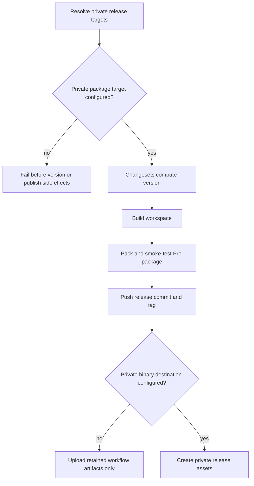

# feat: Release Fusion Pro to private locations

## Summary

Update the Fusion Pro release path so this private workspace cannot publish the public `@runfusion/fusion` npm release by default. The release flow should validate explicit private package and binary destinations before any release side effects, while retaining changesets versioning, existing build coverage, and local release ergonomics.

---

## Problem Frame

The current release process is still shaped for the open-source Fusion package: `packages/cli/package.json` and `packages/cli-alias/package.json` publish as public packages, `.changeset/config.json` declares public access, `.github/workflows/version.yml` publishes to the public npm registry with provenance, and `scripts/release.mjs` hard-codes `pnpm -r publish --access public`, npm tarball checksums, Homebrew tap updates, and public GitHub Release creation. That conflicts with the Fusion Pro strategy: Pro is a closed-source commercial edition whose release artifacts must stay in private distribution channels.

---

## Requirements

- R1. Release commands in this workspace must publish to configured private package destinations, not the public npm package path.
- R2. Package metadata must not advertise public publication or public open-source repository ownership from Pro release artifacts.
- R3. The local release script must fail closed when no private package destination is configured.
- R4. CI release workflows must authenticate and publish against the same private destination model used by local releases.
- R5. Binary and desktop artifacts must be created as private release assets or private build artifacts, not public GitHub Release assets by default.
- R6. Existing changesets version calculation, changelog sync, build, and smoke-test coverage must remain part of the release flow.
- R7. Tests must guard against accidental reintroduction of `--access public`, `registry.npmjs.org` release publishing, public repository metadata, or public GitHub Release defaults in the Pro release path.

---

## Key Technical Decisions

- **Configurable private release targets:** Introduce a release target model with separate package-registry and binary-distribution fields. GitHub Packages should be the first documented package-registry example because the repo already uses GitHub Actions and private repository permissions; other npm-compatible registries stay extension points until a concrete operator need exists.
- **Fail-closed release defaults:** Require an explicit private registry and package scope/name mapping before publishing. This prevents `pnpm release --yes` from falling back to the public npm registry on a developer machine with an existing npm login.
- **Pro metadata over public OSS metadata:** Rewrite Pro package metadata to match the private package identity and repository, rather than relying on public `@runfusion/fusion`, `runfusion.ai`, or `https://github.com/Runfusion/Fusion` values.
- **Keep changesets as the version source:** Preserve `pnpm release:version`, fixed-version behavior, changelog generation, and changeset consumption. The change is the publication destination and guardrails, not the versioning system.
- **Separate package publish from private binary distribution:** Keep the binary build workflow, but change the publish step to a private release surface or retained artifacts until a private binary distribution channel is chosen. Electron auto-publish remains disabled.

---

## High-Level Technical Design

---

## Scope Boundaries

- Keep the public OSS release process out of the Pro default path except where tests need to ensure this workspace does not call it.
- Do not design billing, entitlement checks, or customer licensing in this plan.
- Do not publish Pro artifacts to multiple destinations in one release unless the release-target abstraction makes that a natural extension.
- Do not change dashboard button behavior or mobile button responsiveness.

### Deferred to Follow-Up Work

- Customer-facing installation flows for the chosen private package destination.
- License enforcement and entitlement checks inside the runtime.
- Public OSS release hardening in the separate open-source repository.
- Provider-specific documentation for private npm or custom registries beyond the first supported private package target.

---

## System-Wide Impact

This work affects release operators, CI credentials, package consumers, and desktop/binary distribution. A mistake can leak closed-source artifacts, publish an incompatible Pro package under the public OSS name, or make a release unrecoverable because package versions are immutable once published to most registries.

---

## Implementation Units

### U1. Define Private Release Target Configuration

- **Goal:** Add a single configuration contract for the package registry, package identity, access mode, authentication expectations, and optional private binary destination.
- **Requirements:** R1, R3, R4, R5
- **Dependencies:** None
- **Files:** `scripts/release.mjs`, `scripts/__tests__/release-target-config.test.mjs` (new), `package.json`
- **Approach:** Extract the hard-coded public npm assumptions from `scripts/release.mjs` into a small release-target resolver. The resolver should validate package and binary targets before any version bump, lockfile update, build, commit, tag, push, publish, Homebrew, or release-asset side effect runs, and expose values used by both local release commands and CI command templates.
- **Execution note:** Start with failing resolver tests for missing registry, public npm registry rejection, and a valid GitHub Packages-style target.
- **Patterns to follow:** Existing script tests under `scripts/__tests__/`, existing fail-fast CLI style in `scripts/release.mjs`.
- **Test scenarios:**
  - Missing private registry input returns a release-blocking error before version bump work begins.
  - A target that resolves to `https://registry.npmjs.org` is rejected unless explicitly allowed for an OSS release mode outside this Pro path.
  - A valid npm-compatible private registry returns publish arguments with no `--access public`.
  - GitHub Packages target validation requires a scoped package name and repository metadata suitable for package linking.
  - Token-bearing values are accepted only from environment variables or CI secrets and are redacted from dry-run output, command captures, and logs.
  - Temporary `.npmrc` files, if needed, are written with restrictive permissions and removed after publish.
- **Verification:** Release dry-run displays the resolved private destination and refuses to continue when the private destination is absent.

### U2. Update Pro Package Metadata and Pack Manifest Guardrails

- **Goal:** Change Pro package metadata so packed artifacts use private package identity and cannot advertise public OSS package metadata.
- **Requirements:** R1, R2, R7
- **Dependencies:** U1
- **Files:** `packages/cli/package.json`, `packages/cli-alias/package.json`, `packages/core/package.json`, `packages/dashboard/package.json`, `packages/engine/package.json`, `.changeset/config.json`, `packages/cli/scripts/prepare-publish-manifest.mjs`, `packages/cli/src/__tests__/package-config.test.ts`, `packages/cli/src/__tests__/plugin-sdk-export.test.ts`
- **Approach:** Replace public publish metadata with Pro-safe metadata and update changesets access settings so versioning cannot carry public publish intent. The exact Pro package name and alias behavior are a blocking Open Question; once answered, U2 should encode that model consistently across manifests, prepack transforms, changesets, tests, and docs.
- **Execution note:** Characterize the current package-config assertions before changing them, then flip them to private-release expectations.
- **Patterns to follow:** `applyPrepackTransform` in `packages/cli/scripts/prepare-publish-manifest.mjs`, existing manifest assertions in `packages/cli/src/__tests__/package-config.test.ts`.
- **Test scenarios:**
  - CLI package manifest has no `publishConfig.access: "public"`.
  - Packed manifest points at the private registry or omits public registry access entirely.
  - Pro package metadata does not reference the public `Runfusion/Fusion` repository as the publish destination.
  - `.changeset/config.json` does not carry public publish access for the Pro release path.
  - Internal private packages remain private and are not accidentally included in the publish set unless the release target explicitly supports them.
  - The plugin SDK export transform still injects `./plugin-sdk` without reintroducing public metadata.
- **Verification:** Package manifest tests fail if public npm access or public repository metadata returns to Pro publishable packages.

### U3. Route Local Release Script to Private Publish and Private Distribution

- **Goal:** Update `pnpm release --yes` so local releases publish to the configured private package target and skip public npm/Homebrew/public GitHub Release side effects.
- **Requirements:** R1, R3, R5, R6, R7
- **Dependencies:** U1, U2, U5 for any behavior that pushes `v*` release tags
- **Files:** `scripts/release.mjs`, `scripts/release.cmd`, `scripts/__tests__/release-private-flow.test.mjs` (new), `scripts/lib/extract-version-notes.mjs`
- **Approach:** Keep preflight, changeset versioning, lockfile update, build, commit, smoke test, push, and tag behavior only after private targets validate. Replace `pnpm -r publish --access public --no-git-checks` with private target publish arguments. Gate or remove the Homebrew tap bump because it fetches from `registry.npmjs.org`. Change GitHub Release creation to private release behavior only when the configured binary destination supports it; otherwise record that binaries are available from workflow artifacts.
- **Execution note:** Use a command-runner seam or dry-run command capture instead of executing real network publish commands in tests.
- **Patterns to follow:** Existing `run(cmd)` and dry-run semantics in `scripts/release.mjs`; existing release smoke test that uses local tarballs before publish.
- **Test scenarios:**
  - Dry-run for a valid private target shows private registry publish intent and no public npm publish command.
  - Release command capture never includes `--access public`.
  - Homebrew tap update is skipped for private releases and does not fetch `registry.npmjs.org`.
  - GitHub Release creation is skipped or configured as private according to the target, with clear operator output.
  - `pnpm release --yes` cannot push a `v*` tag while the binary release workflow still creates public GitHub Releases.
  - Existing version override and changelog sync behavior still run before publish command assembly.
- **Verification:** Script tests cover release command assembly without network calls; dry-run output is operator-readable and names the private target.

### U4. Convert CI Version Workflow to Private Package Publishing

- **Goal:** Update the manual version workflow so CI publishes to the same private package destination as local release.
- **Requirements:** R1, R4, R6, R7
- **Dependencies:** U1, U2
- **Files:** `.github/workflows/version.yml`, `.github/actions/setup-node-pnpm/action.yml`, `packages/cli/src/__tests__/ci-workflow.test.ts`, `packages/cli/src/__tests__/version.test.ts`
- **Approach:** Replace npm public registry setup and public publish command with private registry setup. For GitHub Packages, use package write permissions and `NODE_AUTH_TOKEN` sourced from `GITHUB_TOKEN` or a configured package token, depending on whether the package links to this repository or a different private repository. For private npm, require the appropriate private token secret. Keep provenance only where supported by the target.
- **Execution note:** Update YAML tests before changing the workflow so failures show every public-release assumption that must move.
- **Patterns to follow:** YAML parsing helpers in `packages/cli/src/__tests__/ci-workflow.test.ts`; setup action `registry-url` input.
- **Test scenarios:**
  - `version.yml` does not configure `https://registry.npmjs.org` for Pro package publishing.
  - The publish step uses the configured private registry and no `--access public`.
  - GitHub Packages mode grants `packages: write` and uses an auth token route accepted by GitHub Packages.
  - Same-repository and cross-repository GitHub Packages publishing paths document minimum token permissions and fail validation when the configured token source is missing.
  - Release validation rejects or warns on overly generic token configuration when a narrower token source is detectable.
  - Private npm mode documents and checks for the required secret rather than relying on OIDC-only assumptions.
  - The workflow still runs install, build, changesets/action, and version PR behavior.
- **Verification:** CI workflow tests protect the private registry URL, permissions, and publish command shape.

### U5. Make Binary Release Outputs Private by Default

- **Goal:** Ensure CLI and desktop binaries built from Pro tags do not publish to public GitHub Releases by default.
- **Requirements:** R5, R7
- **Dependencies:** U1
- **Files:** `.github/workflows/release.yml`, `.github/workflows/test-release.yml`, `packages/desktop/src/__tests__/release-workflow.test.ts`, `packages/cli/src/__tests__/ci-workflow.test.ts`
- **Approach:** Keep build matrix, signing, checksums, and artifact upload logic. Change the final release publication step to either create a private GitHub Release in the private repository or retain build artifacts based on binary target config. Preserve `test-release.yml` as a build-only validation workflow.
- **Patterns to follow:** Existing release artifact aggregation and desktop release workflow tests.
- **Test scenarios:**
  - Tag-triggered binary workflow does not create a public release by default.
  - Private-release mode still collects CLI and desktop assets with checksums and signatures.
  - Retained workflow artifacts have an intended retention period and a documented download audience.
  - Private release asset creation checks repository visibility before calling release publication APIs.
  - Build-only validation continues to upload artifacts without creating a release.
  - Electron builder commands keep `--publish never`.
- **Verification:** Workflow tests assert private publication behavior and preserve platform artifact coverage.

### U6. Update Release Documentation and Operator Guardrails

- **Goal:** Replace public npm release instructions with private-release instructions that explain supported targets, required secrets, dry-run behavior, and rollback expectations.
- **Requirements:** R1, R3, R4, R5, R6
- **Dependencies:** U1, U3, U4, U5
- **Files:** `RELEASING.md`, `README.md`, `docs/contributing.md`, `.changeset/README.md` (if present)
- **Approach:** Rewrite release docs around the first supported private destination and keep `pnpm release --yes` as the only local release command. Update changeset guidance so Pro user-facing changes still create changesets, but public-package assumptions disappear. Document exact environment variables or secrets for the first supported target, plus the generic configuration contract for future targets.
- **Patterns to follow:** Existing release docs and project guideline that `scripts/release.mjs` remains source of truth.
- **Test scenarios:**
  - Documentation no longer says this workspace publishes public npm packages.
  - Documentation describes dry-run and fail-closed behavior.
  - Required private registry secrets are listed without committing secret values.
  - Release outputs are classified by sensitivity: committed version/changelog files, private package tarballs, checksums/signatures, workflow artifacts, and release notes.
  - Changeset docs still tell implementers when to add `.changeset/*.md`.
- **Verification:** Docs are consistent with root scripts and workflow tests.

### U7. Add Public Publish Regression Guard

- **Goal:** Add a fast, explicit regression suite that scans release-critical files for public publish footguns.
- **Requirements:** R7
- **Dependencies:** U2, U3, U4, U5, U6
- **Files:** `scripts/__tests__/release-public-guard.test.mjs` (new), `package.json`
- **Approach:** Add a low-cost Node test that inspects package manifests, release scripts, workflow YAML, and release docs for forbidden public-release strings in release-critical contexts. Keep it targeted so it does not become a brittle repo-wide text scan.
- **Patterns to follow:** Existing script tests under `scripts/__tests__/`; existing workflow string guards in `packages/cli/src/__tests__/ci-workflow.test.ts`.
- **Test scenarios:**
  - Fails when `--access public` appears in Pro publish commands.
  - Fails when `https://registry.npmjs.org` appears as a configured publish registry in Pro release workflow/script paths.
  - Fails when publishable Pro package manifests contain public access metadata.
  - Allows public npm references only in historical changelog entries or explicitly named OSS documentation carve-outs.
- **Verification:** The guard runs in the normal script or CLI test lane and remains deterministic without network access.

---

## Open Questions

- **Private package destination:** Which private package destination is authoritative for the first Fusion Pro release: GitHub Packages, private npm, or another registry? Until this is answered, U1 should implement the fail-closed resolver and GitHub Packages-shaped example, but U4 and U6 cannot finalize provider-specific publish credentials and docs.
- **Pro package identity:** What exact package name and scope should replace or wrap `@runfusion/fusion`, and should `runfusion.ai` remain unpublished in Pro or become a private alias package? This decision gates U2 metadata, changesets package names, installer docs, and package permission setup.
- **Private binary distribution:** Should binary assets be published to private GitHub Releases immediately, or retained only as workflow artifacts for the first private release? This decision gates U5 release publication behavior, artifact retention, and operator download documentation.

---

## Risks & Dependencies

- **Destination ambiguity:** "Private locations" needs a concrete first destination before implementation finishes. The plan keeps the target configurable, but release docs and CI secrets must name at least one supported target.
- **Package identity migration:** Renaming from `@runfusion/fusion` to a Pro-scoped package can affect install commands, binary names, and update paths.
- **Registry auth differences:** npm private packages, GitHub Packages, and custom registries differ in token and provenance support. Tests should validate command shape, not perform live publishes.
- **Artifact privacy:** GitHub Releases in private repositories are private to repository access, but package permissions can inherit repository access or be configured independently. That choice should be documented before the first release.
- **Credential leakage:** Private registry tokens must not appear in committed files, dry-run output, command-capture tests, or CI logs.

---

## Documentation / Operational Notes

Official npm docs state that scoped packages are private by default and that private package publishing requires 2FA or an appropriate granular access token. npm registry docs also support `publishConfig.registry` for forcing publication to an internal registry. GitHub Packages docs state that npm packages must be scoped, can use `.npmrc` or `publishConfig.registry`, default to private visibility on first publish, and require `packages: write` with `GITHUB_TOKEN` or a personal access token depending on the destination repository.

---

## Sources & Research

- `scripts/release.mjs` currently hard-codes public npm publish, npm tarball checksum fetching, Homebrew tap updates, tag push, and GitHub Release creation.
- `.github/workflows/version.yml` currently configures npm OIDC trusted publishing to `https://registry.npmjs.org` and runs `pnpm -r publish --provenance --access public`.
- `.github/workflows/release.yml` currently creates GitHub Releases from `v*` tags after binary artifact aggregation.
- `packages/cli/src/__tests__/ci-workflow.test.ts`, `packages/cli/src/__tests__/package-config.test.ts`, and `packages/desktop/src/__tests__/release-workflow.test.ts` already protect release workflow and package metadata assumptions.
- npm Docs, "Creating and publishing private packages": https://docs.npmjs.com/creating-and-publishing-private-packages/
- npm Docs, "Registry": https://docs.npmjs.com/misc/registry/
- GitHub Docs, "Working with the npm registry": https://docs.github.com/en/packages/working-with-a-github-packages-registry/working-with-the-npm-registry
- GitHub Docs, "Publishing Node.js packages": https://docs.github.com/en/actions/tutorials/publish-packages/publish-nodejs-packages
