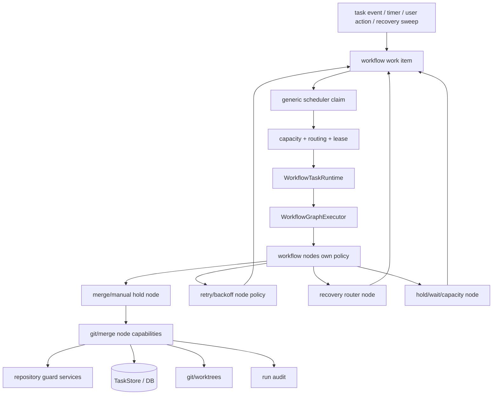

# refactor: Workflow-owned merge, retry, and scheduling policy

## Summary

Move Fusion's merge policy, retry policy, task scheduling decisions, and git operation ownership into workflow IR/runtime instead of keeping them as hidden engine behavior. The engine remains the substrate for durable storage, leases, capacity accounting, process supervision, timers, routing, and audit plumbing. Workflow nodes own the git and merge capability modules they invoke, including checkout preparation, branch integration, conflict handling, squash/finalize flows, retry routing, and manual holds.

This plan does not require rewriting the existing merger algorithms up front. The first cut relocates the merger and git helpers behind workflow node capabilities while preserving the same guard rails. The shipped target is that production lifecycle and git/merge policy is authored in built-in workflow graphs and custom workflows, not in `ProjectEngine`, `Scheduler`, self-healing sweeps, or merge queue special cases.

---

## Problem Frame

Fusion now has a workflow runtime, but merge, retry, and scheduling still leak through engine-owned control paths:

- The scheduler knows task lifecycle concepts and merge-specific eligibility instead of only claiming runnable workflow work.
- `ProjectEngine` and self-healing sweeps directly mutate task lifecycle or re-enqueue tasks for merge based on engine-side interpretations.
- The merge queue is a separate procedural control plane, so workflow state and merge state can disagree.
- Retry behavior is spread across retry helpers, task counters, rate-limit handling, manual retry reset, transient merge classification, and self-healing recovery.
- Dashboard badges can reflect stale engine classifications because the workflow run is not the single source of truth for waiting/retry/merge states.

The desired architecture is simpler: a workflow run owns task policy and git/merge operation flow. The engine supplies reliable execution mechanics and non-bypassable guard services.

---

## Requirements

- R1. Built-in workflow IR expresses default merge, retry, and scheduling policy explicitly.
- R2. Custom workflows can model their own waiting, retry, git, and merge gates using the same runtime state model and guarded node capabilities.
- R3. The engine keeps only substrate responsibilities: durable queues/work items, leases, capacity limits, timers, process supervision, persistence, routing, storage, transition guard services, and audit plumbing.
- R4. The scheduler dispatches generic runnable workflow work items. It does not decide task lifecycle policy, merge eligibility, retry routing, or self-healing outcomes.
- R5. Merge work is represented as workflow work or workflow node state, not as an independent hidden merge queue with separate lifecycle semantics.
- R6. Retry budgets are scoped to workflow nodes/runs and surfaced through workflow runtime state. Legacy task-level retry fields may remain as compatibility summaries, not policy authority.
- R7. Self-healing and restart recovery emit typed workflow recovery events or wake workflow nodes. They do not directly requeue, fail, pause, unpause, or merge tasks except through guarded workflow primitives.
- R8. Existing invariants remain non-configurable: `autoMerge:false` is terminal-until-human-merged except the shared-branch member integration exception, `moveTask(in-progress -> todo)` is a hard cancel, file-scope/squash guards remain authoritative, branch-group target rules remain intact, and user pauses are respected.
- R9. Dashboard/API/CLI surfaces show workflow-native reasons for queued, blocked, retrying, merging, manually held, stalled, failed, and recovered states.
- R10. Tests assert the invariant across default coding, stepwise coding, custom workflows, PR workflows, branch groups, auto-merge off, manual retry, pause/cancel, restart recovery, transient merge errors, and stale work recovery.
- R11. Git operations are workflow node capabilities. Engine code may supervise child processes and provide guard services, but it must not own checkout, branch integration, conflict resolution, squash, finalize, or recovery policy.

---

## Scope Boundaries

### In Scope

- Extract scheduler policy into workflow-owned runnable work item selection.
- Convert merge queue/merge request behavior into workflow run/node/work-item state.
- Add built-in merge subgraph nodes for merge gates, merge attempts, manual holds, retry branches, post-merge finalization, and recovery routing.
- Move retry budgets and retry-after decisions into workflow node policies.
- Convert self-healing from lifecycle mutation to workflow event publication and wakeup.
- Update dashboard/API/CLI state derivation to read workflow runtime state first.
- Move merger and git operation ownership into workflow node capability modules while preserving transition and repository safety guards as shared guard services.

### Out of Scope

- Rewriting the low-level git merge algorithm.
- Replacing SQLite or the task identity model.
- Removing branch groups, PR workflows, workflow steps, or custom workflow authoring.
- Redesigning the dashboard beyond the state display needed for workflow-native merge/retry/scheduling.
- Changing release mechanics.

---

## Key Technical Decisions

- KTD-1. Workflow owns policy and git operation flow; engine owns execution mechanics. A workflow node may run `prepareCheckout`, `integrateBranch`, `attemptMerge`, `finalizeSquash`, `runAgentSession`, or `scheduleRetry`, but the choice to call them and the route after success/failure belongs to workflow IR/runtime.
- KTD-2. Git and merge become workflow node capabilities. Existing files like `merger.ts`, `merger-ai.ts`, `merger-integration-worktree.ts`, `worktree-acquisition.ts`, and base-commit helpers should move behind workflow node capability modules rather than remain engine lifecycle primitives.
- KTD-3. Scheduling becomes generic runnable-work claiming. The scheduler reads workflow work items, leases one, checks capacity/routing, starts the workflow runtime, and records audit. It does not inspect task statuses to infer merge or retry policy.
- KTD-4. Retry state is node-scoped. Attempts, retry-after, transient/permanent classification, exhausted budgets, and manual retry resets live on workflow node/run/work-item state. Task-level retry summaries are projections.
- KTD-5. Recovery is event-driven. Restart recovery, stale detection, and self-healing write typed events such as `run-stale`, `merge-work-stale`, `agent-session-lost`, `retry-after-expired`, or `already-landed`; workflow recovery nodes consume them.
- KTD-6. Manual merge and `autoMerge:false` are workflow holds. The hold is visible, durable, and terminal until a human action releases or completes it.
- KTD-7. Branch groups are workflow subgraphs. Member-to-shared-branch integration and shared-branch-to-default promotion are separate merge nodes with separate auto-merge gates.
- KTD-8. Migration is staged internally, but the final shipped state has no production fallback where old engine merge/retry/scheduling policy can race the workflow runtime.
- KTD-9. Repository safety remains centralized as guard services. File-scope checks, squash overlap checks, worktree ownership checks, and branch target validation are not optional workflow author logic; nodes call guard services before mutating git state.

---

## Target Architecture

The scheduler should be boring. The interesting state transitions are encoded in the workflow graph and persisted as workflow runtime state.

---

## Implementation Units

### U1. Inventory And Ownership Map

- **Goal:** Produce a concrete source map of every merge, retry, and scheduling policy branch that must move.
- **Requirements:** R1, R3, R4, R5, R6, R7.
- **Files:** `packages/engine/src/project-engine.ts`, `packages/engine/src/scheduler.ts`, `packages/engine/src/self-healing.ts`, `packages/engine/src/merger.ts`, `packages/engine/src/group-merge-coordinator.ts`, `packages/engine/src/transient-merge-error-classifier.ts`, `packages/engine/src/retry-with-backoff.ts`, `packages/engine/src/rate-limit-retry.ts`, `packages/core/src/store.ts`, `packages/core/src/task-merge.ts`, `packages/core/src/retry-summary.ts`, `packages/core/src/manual-retry-reset.ts`, `docs/architecture.md`, `docs/workflow-steps.md`.
- **Approach:** Classify each branch as substrate, workflow policy, compatibility projection, or delete. Record non-bypassable guards separately from policy. This map becomes the checklist for later deletion gates.
- **Test scenarios:** Add a narrow characterization/search test or documented checklist that fails review if a known policy branch is left unclassified.
- **Verification:** Every existing merge queue recovery, self-healing merge requeue, scheduler retry, transient retry, manual retry, branch-group merge, and auto-merge branch has a target workflow node capability, workflow policy node, or shared guard service.

### U2. Workflow Work Items For Scheduling, Merge, Retry, And Recovery

- **Goal:** Add a durable workflow work-item model that represents runnable, held, retrying, merge, and recovery work generically.
- **Requirements:** R2, R4, R5, R6, R7, R9.
- **Files:** `packages/core/src/db.ts`, `packages/core/src/store.ts`, `packages/core/src/types.ts`, `packages/engine/src/workflow-task-runtime.ts`, `packages/engine/src/workflow-graph-executor.ts`, `packages/core/src/__tests__/central-db.test.ts`, `packages/core/src/__tests__/store-workflow-runtime.test.ts` (new), `packages/core/src/__tests__/merge-request-record.test.ts`.
- **Approach:** Introduce or consolidate a work-item table keyed by workflow run, task, node, and kind. Minimum fields should cover `kind`, `state`, `runId`, `taskId`, `nodeId`, `attempt`, `retryAfter`, `lease`, `lastError`, `blockedReason`, `createdAt`, and `updatedAt`. Existing merge request records can be migrated into or projected from this model during cutover.
- **Test scenarios:** A coding completion creates merge work; a transient merge error creates retrying merge work with `retryAfter`; `autoMerge:false` creates manual hold work; recovery events create recovery work; duplicate wakeups are idempotent; expired leases can be reclaimed; completed work cannot be re-enqueued by self-healing.
- **Verification:** Store tests prove the engine can find runnable work without inspecting task lifecycle policy.

### U3. Generic Scheduler Substrate

- **Goal:** Convert `Scheduler` into a generic workflow work dispatcher.
- **Requirements:** R3, R4, R8, R10.
- **Files:** `packages/engine/src/scheduler.ts`, `packages/engine/src/project-engine.ts`, `packages/engine/src/workflow-task-runtime.ts`, `packages/engine/src/workflow-authoritative-driver.ts`, `packages/engine/src/workflow-parity-observer.ts`, `packages/engine/src/__tests__/scheduler.test.ts`, `packages/engine/src/__tests__/workflow-work-engine-dispatch.test.ts` (new).
- **Approach:** Scheduler polling should select runnable workflow work items, apply capacity/agent routing/lease checks, and invoke the runtime. Remove special cases that decide whether `todo`, `in-progress`, `in-review`, merge-queued, retrying, or failed tasks should advance. Those decisions are represented by work-item state and workflow node outcomes.
- **Test scenarios:** Scheduler claims only due work items; capacity blocks produce held work state instead of task mutation; retry-after items are skipped until due; user-paused tasks are not claimed; hard-cancelled work is aborted and parked; engine restart reclaims stale leases; no merge-specific scheduler branch is needed.
- **Verification:** Scheduler tests use workflow work items as inputs and do not construct merge queue policy directly.

### U4. Git And Merge Node Capabilities

- **Goal:** Move checkout, branch integration, merge, squash, finalize, and conflict-handling operation ownership into explicit workflow node capability modules.
- **Requirements:** R1, R2, R5, R8, R10, R11.
- **Files:** `packages/engine/src/merger.ts`, `packages/engine/src/merger-ai.ts`, `packages/engine/src/merger-integration-worktree.ts`, `packages/engine/src/group-merge-coordinator.ts`, `packages/engine/src/merge-trait.ts`, `packages/engine/src/workflow-node-handlers.ts`, `packages/engine/src/workflow-merge-nodes.ts` (new), `packages/core/src/builtin-coding-workflow-ir.ts`, `packages/core/src/builtin-pr-workflow-ir.ts`, `packages/engine/src/__tests__/interpreter-merge-seam.test.ts`, `packages/engine/src/__tests__/dual-observe-merge-seam.test.ts`, branch-group merge tests.
- **Approach:** Define node capabilities for checkout preparation, base/fork-point capture, branch integration, merge eligibility, manual hold, merge attempt, conflict/revision routing, post-squash audit, finalize, and already-landed recovery. Move git operation orchestration out of engine lifecycle modules and into these capabilities. The capability modules call shared guard services for file-scope checks, squash checks, worktree ownership, branch target validation, and audit correlation before mutating repository state.
- **Test scenarios:** Completed implementation enters merge node; checkout preparation is driven by a workflow node; `autoMerge:false` routes to manual hold; file-scope violation fails through workflow outcome; already-on-main routes to finalize; transient merge failure routes to retry; non-transient conflict routes to revision or manual hold; branch-group member integration uses member auto-merge; group promotion uses group auto-merge; no engine lifecycle loop can perform branch integration directly.
- **Verification:** No production caller starts a merge attempt except a workflow merge node or an explicit human/manual API that records the equivalent workflow event.

### U5. Workflow-Owned Retry Policies

- **Goal:** Move retry attempts, budgets, backoff, manual retry reset, and retry exhaustion into workflow runtime state.
- **Requirements:** R2, R6, R7, R9, R10.
- **Files:** `packages/engine/src/workflow-graph-executor.ts`, `packages/engine/src/workflow-node-handlers.ts`, `packages/engine/src/retry-with-backoff.ts`, `packages/engine/src/rate-limit-retry.ts`, `packages/engine/src/transient-merge-error-classifier.ts`, `packages/core/src/retry-summary.ts`, `packages/core/src/manual-retry-reset.ts`, `packages/engine/src/__tests__/workflow-graph-executor-retry-coding-workflow.test.ts`, `packages/engine/src/__tests__/workflow-graph-step-rerun.test.ts`, `packages/engine/src/__tests__/executor-retry-storm.test.ts`, `packages/engine/src/__tests__/workflow-node-retry-policy.test.ts` (new).
- **Approach:** Attach retry policy to node definitions or built-in node configs. Persist attempt count, last error, classification, retry-after, and exhaustion on workflow node/work-item records. Manual retry clears the relevant node/run retry state and emits a workflow wake event. Keep task-level retry summary as a derived dashboard field.
- **Test scenarios:** Coding node transient failure retries within budget; merge transient failure retries merge node only; rate-limit retry uses due time; exhausted retry routes to workflow failure/manual hold; manual retry resets exactly the failed node; retry state survives engine restart; retry storm protection remains enforced by runtime substrate.
- **Verification:** Tests prove that no retry branch is controlled solely by task status/counters.

### U6. Self-Healing As Workflow Events

- **Goal:** Remove lifecycle-mutating self-healing decisions and replace them with typed workflow recovery events.
- **Requirements:** R7, R8, R9, R10.
- **Files:** `packages/engine/src/self-healing.ts`, `packages/engine/src/restart-recovery-coordinator.ts`, `packages/engine/src/recovery-policy.ts`, `packages/engine/src/workflow-task-runtime.ts`, `packages/engine/src/workflow-node-handlers.ts`, `packages/engine/src/__tests__/self-healing.test.ts`, `packages/engine/src/__tests__/reliability-interaction-backstops.test.ts`, `packages/engine/src/__tests__/workflow-recovery-events.test.ts` (new).
- **Approach:** Sweeps detect facts and publish events. Recovery nodes decide routes. Example facts: stale lease, missing session, merge work stale, already landed, no active work item, cancelled worktree, manual hold still valid, auto-merge disabled. Self-healing should no-op when workflow state already explains the task.
- **Test scenarios:** In-review merge work is not re-enqueued repeatedly; `autoMerge:false` in-review tasks remain terminal; stale running node wakes recovery node; already landed task finalizes; user-paused task is not mutated; duplicate recovery events are deduped; completed/held workflow work is not marked stalled.
- **Verification:** Existing false recovery strings like "Auto-recovered: eligible in-review task re-enqueued for merge" are replaced by workflow event audit when applicable and disappear for valid held/queued states.

### U7. Built-In Workflow Migration

- **Goal:** Encode default coding, stepwise coding, and PR workflows with explicit scheduling, retry, merge, and recovery regions.
- **Requirements:** R1, R2, R8, R10.
- **Files:** `packages/core/src/builtin-coding-workflow-ir.ts`, `packages/core/src/builtin-stepwise-coding-workflow-ir.ts`, `packages/core/src/builtin-pr-workflow-ir.ts`, `packages/core/src/builtin-workflows.ts`, `packages/core/src/workflow-ir-types.ts`, `packages/core/src/__tests__/builtin-coding-workflow-ir.test.ts`, `packages/core/src/__tests__/builtin-stepwise-coding-workflow-ir.test.ts`, `packages/core/src/__tests__/builtin-pr-workflow-ir.test.ts`.
- **Approach:** Add explicit graph regions for queue/hold, implementation retry, review, merge gate, merge retry, manual hold, branch-group integration, finalization, and recovery. Keep compatibility with existing workflow column/trait semantics.
- **Test scenarios:** Built-in workflows validate; every legacy lifecycle phase has a node; fast execution mode still preserves required post-merge checks; PR response workflow routes review/fix/merge correctly; stepwise workflow retries per-step without retrying the entire task when possible.
- **Verification:** Built-in workflow fixtures become the source of truth for default lifecycle behavior.

### U8. Branch Group And Shared Branch Workflows

- **Goal:** Model branch-group member integration and group promotion as workflow-owned merge subgraphs.
- **Requirements:** R5, R7, R8, R10.
- **Files:** `packages/engine/src/group-merge-coordinator.ts`, `packages/engine/src/merge-trait.ts`, `packages/engine/src/merger-integration-worktree.ts`, `packages/core/src/builtin-coding-workflow-ir.ts`, branch-group tests under `packages/engine/src/__tests__/`.
- **Approach:** Split merge target resolution into workflow node capability calls guarded by repository safety services, then let workflow nodes route member-to-group and group-to-default promotion. Preserve the scoped `autoMerge:false` exception for shared-branch group members.
- **Test scenarios:** Shared member integrates to group branch while global auto-merge is off; group promotion remains blocked when group/global auto-merge is off; conflicting member integration routes to recovery/revision; final group promotion uses file-scope and squash guards; group merge work is visible as workflow work.
- **Verification:** No branch-group coordinator loop owns task lifecycle independent of workflow runtime.

### U9. Dashboard, API, And CLI State Projection

- **Goal:** Show workflow-native merge, retry, waiting, and stalled reasons everywhere users inspect tasks.
- **Requirements:** R6, R7, R9.
- **Files:** `packages/dashboard/app/components/TaskCard.tsx`, task detail components, reliability views, task API routes, CLI task output files, `packages/core/src/retry-summary.ts`, `packages/core/src/task-merge.ts`, dashboard tests for task cards/reliability.
- **Approach:** Derive badges and details from workflow run/work-item state first. Keep compatibility projections for older rows during migration, but do not let stale merge queue classifications override valid workflow holds or queued merge work.
- **Test scenarios:** Merge queued shows queued/merge work state, not stalled; retrying shows attempt and retry-after; manual hold shows human action required; recovery event shows event reason; completed work hides stale stalled badges; branch-group merge work identifies target branch.
- **Verification:** UI tests cover task card and detail surfaces for queued, retrying, manual hold, merge failed, and recovered states.

### U10. Cutover And Deletion Gates

- **Goal:** Remove production engine-owned policy paths after workflow parity is proven.
- **Requirements:** R3, R4, R5, R6, R7, R10.
- **Files:** `packages/engine/src/project-engine.ts`, `packages/engine/src/scheduler.ts`, `packages/engine/src/self-healing.ts`, `packages/engine/src/merger.ts`, `packages/core/src/store.ts`, focused search tests under `packages/engine/src/__tests__/`.
- **Approach:** Delete or demote engine branches that directly requeue for merge, classify merge lifecycle, schedule task lifecycle by status, mutate retry state, or self-heal by setting terminal statuses. Add search/structure tests for forbidden production patterns where practical.
- **Test scenarios:** Search tests fail on direct merge queue lifecycle mutation from self-healing; scheduler tests fail if task-status policy reappears; merge attempts require workflow node context; retry writes require workflow run/node id; manual retry emits workflow wake event.
- **Verification:** Final branch has one lifecycle control plane: workflow runtime.

### U11. Documentation And Release Notes

- **Goal:** Update architecture and user-facing docs to match the new ownership model.
- **Requirements:** R1, R3, R9.
- **Files:** `docs/architecture.md`, `docs/workflow-steps.md`, `docs/dashboard-guide.md`, `docs/settings-reference.md`, `CONCEPTS.md`, `.changeset/<name>.md`.
- **Approach:** Document the workflow/substrate boundary, workflow work items, merge nodes, retry policy, recovery events, dashboard state meanings, and compatibility projections. Add a patch changeset if behavior changes affect published `@runfusion/fusion`.
- **Verification:** Docs mention the same state names used in API/UI tests.

---

## Acceptance Examples

- AE1. A task finishing implementation creates/continues a workflow merge node. No engine merge queue loop independently decides to merge it.
- AE2. A transient merge failure records retry state on the merge node/work item with `retryAfter`; the scheduler only wakes it when due.
- AE3. `autoMerge:false` routes the task to a visible manual merge hold and self-healing leaves it there.
- AE4. A valid queued merge item is never repeatedly marked "Auto-recovered: eligible in-review task re-enqueued for merge."
- AE5. Moving an active task from `in-progress` to `todo` aborts active workflow work and parks the workflow according to hard-cancel semantics.
- AE6. Branch-group member integration can run while shared-branch assembly is allowed, but shared-branch promotion to default remains gated by group/global auto-merge.
- AE7. A manual retry clears the failed workflow node's retry state and creates a due work item without resetting unrelated workflow progress.
- AE8. Dashboard cards and detail views show queued, retrying, manual hold, failed, and recovery states from workflow runtime state.

---

## Rollout Sequence

1. **Characterize:** Land U1 and focused tests around current merge/retry/scheduler behavior.
2. **State model:** Land U2 without changing production routing; project existing merge request state into workflow work items.
3. **Generic dispatch:** Convert scheduler to claim workflow work items while still producing equivalent behavior.
4. **Git/merge nodes:** Route built-in checkout, branch integration, merge, squash, and finalize behavior through workflow node capabilities.
5. **Retry nodes:** Move retry budgets and manual retry reset to workflow node/run state.
6. **Recovery events:** Convert self-healing to facts/events plus workflow recovery nodes.
7. **Dashboard projection:** Switch UI/API/CLI to workflow-native state.
8. **Deletion gate:** Remove old engine-owned merge/retry/scheduling policy paths and add regression/search tests.
9. **Docs and changeset:** Update docs and add a changeset if published behavior changed.

---

## Risks And Mitigations

- **Hidden merger invariants:** Start by moving existing merger code behind workflow node capabilities and characterize behavior before routing changes.
- **Queue starvation:** Make workflow work-item selection explicit and test retry-after, capacity, and lease ordering.
- **Double execution during migration:** Use idempotent work-item creation and explicit final deletion gates; do not leave two production controllers active.
- **Custom workflow expressiveness gaps:** Add built-in node kinds for non-authorable primitives rather than forcing users to script around core merge/retry mechanics.
- **State table bloat:** Add retention/pruning rules for terminal workflow work items while preserving audit.
- **Manual hold confusion:** Surface hold reason and release action consistently in dashboard/API/CLI.
- **Branch-group regressions:** Treat member integration and group promotion as separate acceptance surfaces with separate auto-merge tests.

---

## Verification Plan

- `pnpm test:gate`
- `pnpm lint`
- `pnpm build`
- Targeted engine/core suites for scheduler, workflow runtime, workflow graph executor, merge nodes, branch groups, self-healing, retry policies, manual retry reset, and dashboard task state projection.
- Manual verification with a local Fusion project:
  - one ordinary auto-merge task,
  - one `autoMerge:false` task,
  - one transient merge failure,
  - one manual retry,
  - one branch-group member integration,
  - one engine restart during queued merge work.

---

## Done Criteria

- Built-in workflows explicitly model git, merge, retry, and scheduling policy.
- Scheduler is a generic workflow work dispatcher.
- Checkout preparation, branch integration, merge attempts, squash, and finalize operations are invoked by workflow nodes or explicit human actions recorded as workflow events.
- Retry state is node/run scoped and visible through workflow runtime state.
- Self-healing emits workflow recovery events instead of directly mutating lifecycle.
- UI/API/CLI state projections come from workflow state, with compatibility fallback only for old rows.
- Production engine code no longer contains independent git/merge/retry/scheduling policy paths that can race workflow runtime.
