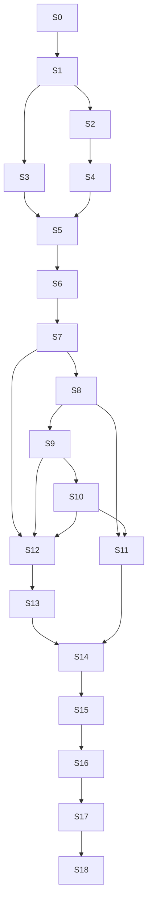

# refactor: Workflow-owned merge full migration slices

## Summary

This plan turns the workflow-owned merge/retry/scheduling architecture into a
sequence of PR-sized migration slices. The target state is unchanged from the
origin plan: workflow IR/runtime owns merge policy, retry policy, scheduling
policy, recovery routing, and git operation flow; the engine keeps substrate
responsibilities such as storage, leases, timers, process supervision, routing,
capacity, guard services, and audit plumbing.

The migration should ship in independently reviewable slices, but the final
cutover must not leave two production control planes. Compatibility projections
are allowed while slices are in flight. Production fallback paths are removed at
the deletion gates.

## Requirements Trace

- R1. Built-in workflow IR expresses default merge, retry, scheduling, and
  recovery policy explicitly.
- R2. Workflow work state replaces hidden merge queue and retry routing as the
  policy authority.
- R3. Scheduler claims generic workflow work; it does not infer task lifecycle
  advancement from columns.
- R4. Git and merge operations are workflow node capabilities guarded by shared
  repository safety services.
- R5. Retry state is node/run scoped; task retry fields are compatibility
  projections only.
- R6. Self-healing publishes typed workflow recovery facts and wakes recovery
  nodes; it does not directly mutate merge/retry lifecycle.
- R7. Dashboard/API/CLI state derives from workflow state first.
- R8. Existing invariants remain non-configurable: `autoMerge:false`, hard
  cancel on `in-progress -> todo`, file-scope/squash guards, branch-group target
  rules, and user pauses.
- R9. Branch-group member integration and group promotion are workflow-owned
  subgraphs with separate gates.
- R10. Final deletion tests fail if engine-owned merge/retry/scheduling policy
  reappears.

## Current Baseline

The starting checkpoint is `docs/workflow-policy-ownership-map.md`. It classifies
today's ownership of merge queue enqueue/dequeue, scheduler in-review policy,
merge request shadow state, git/merge procedures, retry helpers, manual retry,
self-healing recovery, built-in workflow IR, and dashboard projections.

Keep that map updated through the migration. A slice is not complete if it moves
policy without updating the map or adding the corresponding deletion gate.

## Slice Strategy

- Keep each slice mergeable and behavior-preserving unless the slice is an
  explicit cutover gate.
- Prefer characterization-first on legacy policy before moving it.
- Introduce workflow-native state and projections before changing production
  routing.
- Route one ownership surface at a time, then delete the old owner.
- Run the merge gate for every slice: `pnpm test:gate`.
- Add `pnpm lint` and `pnpm build` for every behavior-bearing slice.
- Add a changeset only when a slice changes published `@runfusion/fusion`
  behavior.

## Migration Slices

### S0. Ownership Map And Guard

- **Goal:** Keep the migration inventory explicit and enforced.
- **Status:** Done by the origin PR.
- **Files:** `docs/workflow-policy-ownership-map.md`,
  `packages/engine/src/__tests__/workflow-policy-ownership-map.test.ts`,
  `packages/engine/vitest.config.ts`.
- **Tests:** `packages/engine/src/__tests__/workflow-policy-ownership-map.test.ts`.
- **Exit gate:** Every known current policy surface is classified as
  `substrate`, `workflow-policy`, `capability`, `compat-projection`, or
  `delete-after-cutover`.

### S1. Workflow Work-Item Schema And Store API

- **Goal:** Add durable workflow work items that can represent runnable, held,
  retrying, merge, manual-hold, and recovery work without changing production
  routing yet.
- **Depends on:** S0.
- **Files:** `packages/core/src/db.ts`, `packages/core/src/store.ts`,
  `packages/core/src/types.ts`, `packages/core/src/index.ts`,
  `packages/core/src/__tests__/central-db.test.ts`,
  `packages/core/src/__tests__/store-workflow-runtime.test.ts` (new),
  `packages/core/src/__tests__/merge-request-record.test.ts`.
- **Decisions:** Work items are keyed by workflow run, task, node, and kind.
  Minimum fields: `id`, `runId`, `taskId`, `nodeId`, `kind`, `state`,
  `attempt`, `retryAfter`, `leaseOwner`, `leaseExpiresAt`, `lastError`,
  `blockedReason`, `createdAt`, `updatedAt`.
- **Test scenarios:** create runnable work; create merge work; transition to
  held/retrying/manual-required/succeeded/cancelled/exhausted; reclaim expired
  lease; duplicate wakeups are idempotent; completed work cannot be requeued.
- **Exit gate:** Store can find due runnable work without reading task columns
  for merge/retry policy.

### S2. Merge Request Projection Onto Work Items

- **Goal:** Project existing merge request records into workflow work-item state
  so dashboards and schedulers can dual-read before cutover.
- **Depends on:** S1.
- **Files:** `packages/core/src/store.ts`, `packages/core/src/task-merge.ts`,
  `packages/core/src/types.ts`,
  `packages/core/src/__tests__/merge-request-record.test.ts`,
  `packages/core/src/__tests__/store-workflow-runtime.test.ts`,
  `packages/engine/src/__tests__/dual-observe-merge-seam.test.ts`.
- **Decisions:** Existing `mergeRequestContractShadowEnabled` remains a
  compatibility switch during this slice. Work-item state is the new shape;
  merge request rows remain the old projection.
- **Test scenarios:** queued/running/retrying/manual-required/succeeded rows
  project to equivalent work items; task hard-cancel cancels active merge work;
  exhausted merge request maps to terminal failed work; projection is
  idempotent across restart.
- **Exit gate:** Every merge request state has a lossless workflow work-item
  equivalent.

### S3. Generic Scheduler Claim Path

- **Goal:** Teach `Scheduler` to claim due workflow work items while preserving
  existing task dispatch behavior.
- **Depends on:** S1.
- **Files:** `packages/engine/src/scheduler.ts`,
  `packages/engine/src/workflow-task-runtime.ts`,
  `packages/engine/src/project-engine.ts`,
  `packages/engine/src/__tests__/scheduler.test.ts`,
  `packages/engine/src/__tests__/scheduler-node-routing.test.ts`,
  `packages/engine/src/__tests__/workflow-work-engine-dispatch.test.ts` (new).
- **Decisions:** Scheduler remains substrate. It may apply capacity, routing,
  leases, global pause, engine pause, and remote-node dispatch. It must not own
  merge eligibility, retry routing, or recovery outcome.
- **Test scenarios:** claim only due runnable work; skip `retryAfter` until due;
  hold on capacity without task mutation; user-paused work is not claimed; stale
  leases are reclaimable; remote node receives workflow runtime work.
- **Exit gate:** A workflow work item can be dispatched end to end in tests
  without constructing a merge queue branch.

### S4. Built-In Merge/Retry/Recovery IR Regions

- **Goal:** Add explicit merge, retry, manual hold, branch-group, and recovery
  regions to built-in workflow IR.
- **Depends on:** S1, S2.
- **Files:** `packages/core/src/builtin-coding-workflow-ir.ts`,
  `packages/core/src/builtin-stepwise-coding-workflow-ir.ts`,
  `packages/core/src/builtin-pr-workflow-ir.ts`,
  `packages/core/src/builtin-workflows.ts`,
  `packages/core/src/workflow-ir-types.ts`,
  `packages/core/src/__tests__/builtin-coding-workflow-ir.test.ts`,
  `packages/core/src/__tests__/builtin-stepwise-coding-workflow-ir.test.ts`,
  `packages/core/src/__tests__/builtin-pr-workflow-ir.test.ts`.
- **Decisions:** Use built-in node kinds for non-authorable primitives:
  merge gate, merge attempt, manual merge hold, retry/backoff, branch-group
  member integration, group promotion, finalize, and recovery router.
- **Test scenarios:** built-in workflows validate; default coding has a merge
  gate; stepwise coding has per-step retry plus merge retry; PR workflow routes
  review/fix/merge; `autoMerge:false` routes to manual hold; branch-group member
  integration and group promotion are separate nodes.
- **Exit gate:** Built-in IR is the source of truth for all default
  merge/retry/recovery policy, even if production handlers are not wired yet.

### S5. Runtime Work-Item Driver

- **Goal:** Let `WorkflowTaskRuntime` start from a workflow work item and persist
  node/work-item outcomes.
- **Depends on:** S1, S3, S4.
- **Files:** `packages/engine/src/workflow-task-runtime.ts`,
  `packages/engine/src/workflow-graph-executor.ts`,
  `packages/engine/src/workflow-node-handlers.ts`,
  `packages/engine/src/__tests__/workflow-task-runtime.test.ts`,
  `packages/engine/src/__tests__/workflow-graph-executor-retry-coding-workflow.test.ts`,
  `packages/engine/src/__tests__/workflow-node-handlers.test.ts`.
- **Decisions:** Runtime receives `{ workItemId, runId, taskId, nodeId }` and
  returns a typed outcome that updates work item state. Task column updates are
  side effects of workflow primitives, not scheduler policy.
- **Test scenarios:** runnable work completes; failing node creates retrying
  work; manual hold node creates held work; runtime restart resumes from stored
  work; duplicate start of same work item is refused by lease.
- **Exit gate:** Runtime can progress workflow work without old merge queue
  callbacks.

### S6. Git And Merge Capability Extraction

- **Goal:** Put checkout preparation, branch integration, merge attempt, squash,
  finalize, and conflict classification behind workflow node capability modules.
- **Depends on:** S4, S5.
- **Files:** `packages/engine/src/merger.ts`,
  `packages/engine/src/merger-ai.ts`,
  `packages/engine/src/merger-integration-worktree.ts`,
  `packages/engine/src/workflow-merge-nodes.ts` (new),
  `packages/engine/src/workflow-node-handlers.ts`,
  `packages/engine/src/merge-trait.ts`,
  `packages/engine/src/__tests__/interpreter-merge-seam.test.ts`,
  `packages/engine/src/__tests__/dual-observe-merge-seam.test.ts`,
  `packages/engine/src/__tests__/workflow-merge-nodes.test.ts` (new).
- **Decisions:** This slice does not rewrite low-level merge algorithms. It
  extracts orchestration boundaries so workflow nodes call existing guarded
  operations.
- **Test scenarios:** merge node calls checkout preparation; file-scope
  violation returns workflow failure; already-on-main routes to finalize;
  transient merge error returns retry outcome; non-transient conflict routes to
  revision/manual hold; no production caller can bypass guard service in tests.
- **Exit gate:** A merge attempt can be driven by a workflow node capability in
  tests with the same guard behavior as `merger.ts`.

### S7. Completion Handoff Creates Merge Work

- **Goal:** Replace task-moved `in-review` auto-enqueue as the policy authority
  with workflow completion handoff creating merge work.
- **Depends on:** S2, S5, S6.
- **Files:** `packages/engine/src/project-engine.ts`,
  `packages/engine/src/merger.ts`,
  `packages/core/src/store.ts`,
  `packages/engine/src/__tests__/workflow-interpreter-cutover.test.ts`,
  `packages/engine/src/__tests__/completion-fanout-x-self-healing.test.ts`,
  `packages/engine/src/__tests__/merge-reuse-task-worktree.slow.test.ts`.
- **Decisions:** During this slice the old queue can remain as a projection, but
  merge work creation happens through workflow handoff. `autoMerge:false` creates
  a manual hold work item.
- **Test scenarios:** coding completion creates merge work; `autoMerge:false`
  creates manual hold and does not enqueue merge; duplicate handoff is
  idempotent; soft-deleted task cancels handoff; startup projection does not
  create duplicate merge work.
- **Exit gate:** New task completions produce workflow merge work before any old
  queue processing path runs.

### S8. Workflow-Owned Merge Queue Processing

- **Goal:** Process merge work items through workflow runtime instead of
  `ProjectEngine`'s in-memory merge queue loop.
- **Depends on:** S3, S6, S7.
- **Files:** `packages/engine/src/project-engine.ts`,
  `packages/engine/src/scheduler.ts`,
  `packages/engine/src/merger.ts`,
  `packages/core/src/store.ts`,
  `packages/engine/src/__tests__/merger-merge-lifecycle.test.ts`,
  `packages/engine/src/__tests__/merger-post-merge.test.ts`,
  `packages/engine/src/__tests__/workflow-work-engine-dispatch.test.ts`,
  `packages/engine/src/__tests__/workflow-merge-nodes.test.ts`.
- **Decisions:** Keep queue fairness and serialization as substrate leases. The
  policy route after success/failure belongs to workflow node outcomes.
- **Test scenarios:** queued merge work claims one at a time; successful merge
  finalizes task; transient failure schedules retrying merge work; permanent
  conflict routes to revision/manual hold; active merge lease blocks duplicate
  processing; hard cancel cancels running merge work.
- **Exit gate:** Production merge processing no longer depends on a hidden
  `mergeQueue` dequeue loop.

### S9. Workflow-Owned Retry State

- **Goal:** Move retry attempts, budgets, backoff, retry-after, exhaustion, and
  manual retry reset into workflow node/work-item state.
- **Depends on:** S5, S8.
- **Files:** `packages/engine/src/workflow-graph-executor.ts`,
  `packages/engine/src/workflow-node-handlers.ts`,
  `packages/engine/src/retry-with-backoff.ts`,
  `packages/engine/src/rate-limit-retry.ts`,
  `packages/engine/src/transient-merge-error-classifier.ts`,
  `packages/core/src/retry-summary.ts`,
  `packages/core/src/manual-retry-reset.ts`,
  `packages/engine/src/__tests__/workflow-node-retry-policy.test.ts` (new),
  `packages/core/src/__tests__/manual-retry-reset.test.ts`.
- **Decisions:** Task retry fields remain as derived display summaries until
  deletion. Manual retry emits a workflow wake and clears only targeted failed
  node state.
- **Test scenarios:** implementation node retry stays within budget; merge node
  retry does not reset implementation progress; rate-limit error persists due
  time; exhausted retry routes to failure/manual hold; manual retry clears only
  failed node; retry state survives restart.
- **Exit gate:** No retry branch is controlled solely by task counters.

### S10. Self-Healing Recovery Events

- **Goal:** Convert self-healing merge/retry lifecycle mutations into typed
  workflow recovery events and node wakes.
- **Depends on:** S5, S8, S9.
- **Files:** `packages/engine/src/self-healing.ts`,
  `packages/engine/src/restart-recovery-coordinator.ts`,
  `packages/engine/src/recovery-policy.ts`,
  `packages/engine/src/workflow-task-runtime.ts`,
  `packages/engine/src/__tests__/self-healing.test.ts`,
  `packages/engine/src/__tests__/workflow-recovery-events.test.ts` (new),
  `packages/engine/src/__tests__/reliability-interactions/in-review-automerge-off.test.ts`,
  `packages/engine/src/__tests__/reliability-interactions/workflow-interpreter-cutover.test.ts`.
- **Decisions:** Sweeps detect facts. Recovery nodes decide routes. Non-task
  agent/heartbeat cleanup may remain engine-owned when it is not task lifecycle
  policy.
- **Test scenarios:** mergeable in-review task gets recovery event, not direct
  requeue; stale merge status emits event; transient merge failure emits retry
  event; already landed emits finalize event; `autoMerge:false` remains terminal;
  duplicate recovery events are deduped.
- **Exit gate:** Self-healing no longer directly requeues, pauses, fails,
  unpauses, or moves merge/retry tasks except through guarded workflow
  primitives.

### S11. Branch Group Workflow Subgraphs

- **Goal:** Move branch-group member integration and group promotion into
  workflow-owned merge subgraphs.
- **Depends on:** S6, S8, S10.
- **Files:** `packages/engine/src/group-merge-coordinator.ts`,
  `packages/engine/src/merge-trait.ts`,
  `packages/engine/src/merger-integration-worktree.ts`,
  `packages/core/src/builtin-coding-workflow-ir.ts`,
  `packages/engine/src/__tests__/reliability-interactions/shared-branch-group-lifecycle.slow.test.ts`,
  `packages/engine/src/__tests__/workflow-branch-group-merge.test.ts` (new).
- **Decisions:** Member-to-shared-branch integration and shared-branch-to-default
  promotion are distinct workflow nodes with distinct auto-merge gates.
- **Test scenarios:** shared member integrates while global auto-merge is off
  under the scoped exception; group promotion remains blocked when group/global
  auto-merge is off; conflicting member integration routes to recovery/revision;
  final group promotion runs file-scope and squash guards.
- **Exit gate:** Branch-group coordinator no longer owns task lifecycle
  independent of workflow runtime.

### S12. Dashboard/API/CLI Workflow Projection

- **Goal:** Surface workflow-native queued, retrying, merging, manual-hold,
  failed, stalled, and recovered reasons across user inspection surfaces.
- **Depends on:** S1, S2, S7, S9, S10.
- **Files:** `packages/dashboard/app/components/TaskCard.tsx`,
  task detail components, reliability views, task API routes,
  CLI task output files, `packages/core/src/retry-summary.ts`,
  `packages/core/src/task-merge.ts`,
  `packages/dashboard/app/components/__tests__/TaskCard.test.tsx`,
  reliability/dashboard API tests.
- **Decisions:** Workflow state wins over stale task fields. Legacy task fields
  remain fallback for old rows only.
- **Test scenarios:** merge queued shows workflow merge work, not stalled;
  retrying shows attempt and due time; manual hold shows human action required;
  recovery event shows reason; completed work hides stale stalled badges;
  branch-group merge work identifies target branch.
- **Exit gate:** UI/API/CLI tests prove workflow state is the first projection
  source.

### S13. Scheduler Policy Deletion

- **Goal:** Delete scheduler branches that infer lifecycle, merge eligibility,
  retry routing, or in-review dependency behavior from task columns.
- **Depends on:** S3, S7, S8, S12.
- **Files:** `packages/engine/src/scheduler.ts`,
  `packages/core/src/task-merge.ts`,
  `packages/engine/src/__tests__/scheduler.test.ts`,
  `packages/engine/src/__tests__/scheduler-overlap-requeue.test.ts`,
  `packages/engine/src/__tests__/workflow-scheduler-policy-deletion.test.ts` (new).
- **Decisions:** Dependency satisfaction should use completion handoff/workflow
  state. In-review scope leases are replaced by workflow work leases and guard
  services.
- **Test scenarios:** scheduler cannot satisfy dependency only because a task is
  `in-review`; retry due time comes from work item; overlap lease comes from
  workflow work; PR monitor behavior remains as watch substrate, not lifecycle
  owner.
- **Exit gate:** Search/structure test fails if scheduler reintroduces
  task-column merge/retry policy.

### S14. ProjectEngine Merge Queue Deletion

- **Goal:** Remove production `ProjectEngine` merge queue policy and retain only
  explicit human/manual event entry points plus substrate helpers.
- **Depends on:** S8, S11, S13.
- **Files:** `packages/engine/src/project-engine.ts`,
  `packages/engine/src/runtimes/in-process-runtime.ts`,
  `packages/core/src/store.ts`,
  `packages/engine/src/__tests__/merger-merge-lifecycle.test.ts`,
  `packages/engine/src/__tests__/workflow-merge-policy-deletion.test.ts` (new).
- **Decisions:** Manual merge APIs record a workflow event or create due workflow
  work; they do not enqueue hidden engine work.
- **Test scenarios:** no startup in-review scan enqueues hidden merge work;
  unpause wakes workflow work; manual merge event wakes merge node; stale
  `mergeActive` state cannot block workflow work; old queue APIs are absent or
  compatibility-only.
- **Exit gate:** No production caller starts merge processing outside workflow
  runtime.

### S15. Self-Healing Policy Deletion

- **Goal:** Delete self-healing direct lifecycle mutations for merge/retry tasks
  after recovery events cover all cases.
- **Depends on:** S10, S11, S14.
- **Files:** `packages/engine/src/self-healing.ts`,
  `docs/self-healing-backward-move-audit.md`,
  `packages/engine/src/__tests__/self-healing.test.ts`,
  `packages/engine/src/__tests__/workflow-recovery-events.test.ts`,
  `packages/engine/src/__tests__/workflow-self-healing-policy-deletion.test.ts` (new).
- **Decisions:** Metadata reconciliation and non-task agent cleanup can remain.
  Task lifecycle repair becomes recovery events plus workflow node outcomes.
- **Test scenarios:** direct calls to `moveTask(..., "todo")`,
  `updateTask({ paused: true })`, merge requeue callbacks, and merge retry resets
  are absent for merge/retry surfaces; valid held states are no-ops; recovery
  facts carry audit context.
- **Exit gate:** Search tests fail on direct self-healing merge/retry lifecycle
  mutation patterns.

### S16. Legacy Retry Field Demotion

- **Goal:** Demote task-level retry/merge counters to projections and remove
  policy reads that still treat them as authority.
- **Depends on:** S9, S12, S15.
- **Files:** `packages/core/src/types.ts`, `packages/core/src/retry-summary.ts`,
  `packages/core/src/manual-retry-reset.ts`, `packages/core/src/store.ts`,
  `packages/engine/src/project-engine.ts`, `packages/engine/src/self-healing.ts`,
  `packages/core/src/__tests__/manual-retry-reset.test.ts`,
  `packages/engine/src/__tests__/workflow-node-retry-policy.test.ts`.
- **Decisions:** Do not remove fields until all compatibility surfaces can read
  workflow projections. Removal can be a later cleanup; this slice removes policy
  authority.
- **Test scenarios:** retry summaries derive from workflow node/work state;
  manual retry emits workflow wake; old task fields changing alone cannot cause
  scheduler/recovery/merge action.
- **Exit gate:** Task retry fields are display-only compatibility data.

### S17. End-To-End Cutover Matrix

- **Goal:** Prove the full workflow-owned invariant across all known production
  surfaces before removing dual-read compatibility.
- **Depends on:** S13, S14, S15, S16.
- **Files:** focused tests across `packages/engine/src/__tests__/`,
  reliability interactions under
  `packages/engine/src/__tests__/reliability-interactions/`, core store tests,
  dashboard projection tests, `docs/testing.md`.
- **Test matrix:** default coding auto-merge; stepwise coding; custom workflow;
  PR workflow; plugin workflow extension; `autoMerge:false`; manual retry;
  user hard cancel; engine restart during merge work; transient merge failure;
  permanent conflict; branch-group member integration; branch-group promotion;
  stale recovery; already-landed finalization; dashboard task card/detail;
  CLI task output.
- **Exit gate:** `pnpm test:gate`, `pnpm lint`, `pnpm build`, and targeted matrix
  suites pass. No old engine merge/retry/scheduling policy path can race workflow
  runtime in production.

### S18. Documentation, Settings, And Release Notes

- **Goal:** Update architecture, settings, dashboard, CLI, and testing docs for
  workflow-owned policy and compatibility projections.
- **Depends on:** S17.
- **Files:** `docs/architecture.md`, `docs/workflow-steps.md`,
  `docs/dashboard-guide.md`, `docs/settings-reference.md`, `docs/testing.md`,
  `CONCEPTS.md`, `.changeset/<name>.md`.
- **Decisions:** Document the new source of truth, remaining compatibility fields,
  recovery event vocabulary, manual hold behavior, branch-group routing, and
  deletion gates.
- **Test scenarios:** docs inventory/search tests if applicable; lazy view
  inventory unchanged unless dashboard imports change.
- **Exit gate:** User-facing docs use the same state names as API/UI tests, and a
  patch changeset exists if published `@runfusion/fusion` behavior changed.

## Dependency Graph

## Release And Merge Strategy

- **Preferred PR count:** 18 slices, one PR per slice.
- **Can combine:** S1+S2 if schema and projection are small; S13+S14 if deletion
  is purely mechanical after S8.
- **Do not combine:** S8 with S14, or S10 with S15. Route through workflow first,
  then delete old owner in a separate reviewable PR.
- **Branch policy:** Each slice branches from current `main`, not from a stale
  feature stack. Drop duplicate commits before merging.
- **Changesets:** Add only when published CLI behavior changes. Internal docs,
  CI config, and behavior-preserving refactors do not require changesets.

## Cutover Safety Gates

- Gate A after S4: built-in IR expresses all planned policy regions.
- Gate B after S8: workflow runtime can process merge work without hidden queue
  ownership.
- Gate C after S10: self-healing emits recovery events for merge/retry surfaces.
- Gate D after S12: dashboard/API/CLI read workflow state first.
- Gate E after S17: deletion tests and end-to-end matrix prove no production
  legacy control plane remains.

## Rollback Strategy

- Before S13, rollback is disabling workflow work dispatch and relying on legacy
  projections.
- After S13, rollback is revert-by-slice, not runtime fallback. Do not ship a
  production dual-controller fallback after deletion gates begin.
- Keep old fields as compatibility projections through S17 so data downgrade is
  not required for ordinary slice rollback.

## Verification Commands

- `pnpm test:gate`
- `pnpm lint`
- `pnpm build`
- Targeted suites named in each slice.
- `pnpm test:full` only for explicit final matrix verification or release-adjacent
  confidence, not as the normal merge gate.

## Done Criteria

- Workflow work items are the durable source of runnable, held, retrying, merge,
  and recovery work.
- Built-in workflows express default merge, retry, scheduling, branch-group, and
  recovery policy.
- Scheduler dispatches generic workflow work only.
- Git/merge operations are invoked by workflow nodes or explicit human/manual
  events recorded as workflow events.
- Retry budgets and manual retry reset are node/run scoped.
- Self-healing publishes recovery facts and wakes workflow recovery nodes.
- Dashboard/API/CLI projections read workflow state first.
- Deletion tests prevent reintroducing engine-owned merge/retry/scheduling
  policy.
