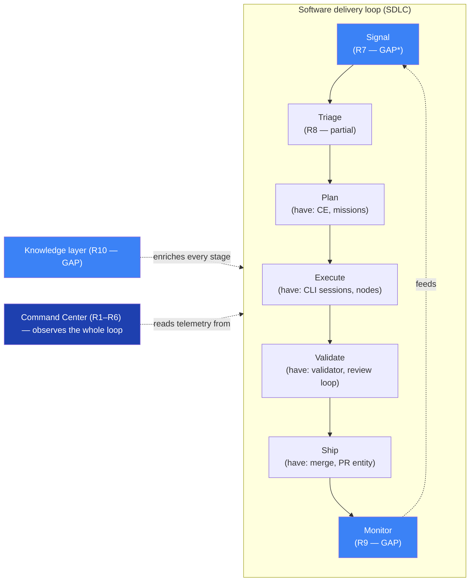

# feat: Command Center dashboard + software-delivery-loop gap-fill

## Summary

Build a **Command Center** for the Fusion dashboard — a combined **historical analytics**
surface (tokens, tools, activity, productivity, ecosystem, per-agent/per-node breakdowns
over selectable date ranges, with CSV + OpenTelemetry export) **and a live Mission-Control
panel** (concurrent sessions, active nodes, what each agent is doing right now, SDLC funnel
throughput). Then close the gaps between Fusion and an end-to-end software-delivery system —
the **Signal → Triage → Plan → Execute → Validate → Ship → Monitor** loop — by adding the
stages Fusion does not yet cover (external signal ingestion, monitoring/incident response,
persistent knowledge layer) and the cross-cutting capabilities the loop implies (a **Fusion Model Router** that auto-selects the
cheapest-capable model per task, auto-triage of inbound issues **and PRs**, auto-resolution of
PR review comments, and surfacing external signals as dashboard metrics).

This plan is intentionally large because the user asked for full implementation coverage of
all gaps. It is organized into three phases so it can land incrementally: **Phase A** (metrics
foundation) and **Phase B** (the Command Center itself) deliver the branch's headline feature;
**Phase C** (SDLC gap-fill) is sequenced after, and several of its units are large enough that
the plan flags them as candidates to spin into their own brainstorm before execution.

---

## Problem Frame

Fusion is the model- and surface-agnostic orchestration layer for a developer driving many
agent sessions across nodes and surfaces (see `STRATEGY.md`). Two problems:

1. **There is no observability surface.** A developer juggling 10+ agents across machines has
   no single place to answer "how much am I spending, on which models, across which nodes,
   what's running right now, and what did all this work actually ship?" Fusion captures the
   raw data (per-task token columns, agent runs, activity log, commit associations, PRs, CLI
   sessions) but exposes only fragmentary panels (`ReliabilityView`, `AgentTokenStatsPanel`).
   Fusion's own `STRATEGY.md` key metrics (concurrent sessions, active nodes, ecosystem
   breadth, task completion rate, LOC shipped) are precisely what such a view should make
   observable.

2. **Fusion covers the middle of the SDLC loop but not the ends.** The end-to-end delivery
   loop is self-reinforcing: *Signal → Triage → Plan → Execute → Validate → Ship → Monitor*.
   Fusion is strong on Plan/Execute/Validate/Ship and has partial Triage (GitHub issue
   ingestion). It has **no Signal ingestion beyond GitHub, no Monitor stage, and no persistent
   knowledge layer** — the parts that make the loop close and compound.

This plan addresses both: the Command Center (Phases A–B) and the missing stages (Phase C).

---

## Requirements

Traceability is to Fusion's `STRATEGY.md` key metrics (KM) and the external feature set the
user asked us to match (external research, no formal requirements doc).

- **R1 — Historical analytics.** Surface token consumption (by model, provider, node, agent,
  time), tool usage and autonomy ratio, activity (sessions/messages/active-nodes over time),
  productivity (files, commits, PRs, LOC), and ecosystem breadth (unique models + plugins).
  (KM: all five.)
- **R2 — Date-range filtering.** All analytics support a selectable range (presets + custom),
  mirroring `agent-token-usage.ts`'s windowed aggregation extended to arbitrary ranges.
- **R3 — Live Mission Control.** A real-time panel: concurrent agent sessions, active nodes,
  per-agent current activity, and an SDLC funnel (triage→todo→in-progress→in-review→done)
  with live throughput. (KM: concurrent agent sessions, active nodes, task completion rate.)
- **R4 — Export.** CSV export of any analytics table, and OpenTelemetry (OTLP) export of the
  metrics, for shipping to Datadog/Grafana/etc.
- **R5 — Analytics API.** Programmatic endpoints (activity, tokens, tools, productivity) so an
  agent can pull metrics.
- **R6 — Cost.** Derive USD cost from token counts × a model pricing map (Fusion stores tokens
  but not cost today).
- **R7 — Signal ingestion.** Ingest external signals beyond GitHub (error trackers / alerting:
  Sentry, Datadog, PagerDuty, generic webhook) into triageable tasks.
- **R8 — Triage stage.** Auto-classify and decompose incoming signals/issues into board tasks.
- **R9 — Monitor stage.** Track deployments and production incidents, compute MTTR, and feed
  Monitor signals back into the funnel (closing the loop).
- **R10 — Knowledge layer.** A persistent, incrementally-refreshed knowledge index downstream
  agents can query.
- **R13 — Fusion Model Router.** Automatic per-task / per-request model selection across
  providers (route routine steps to fast/cheap models, reserve stronger models for hard
  reasoning), with fallback, prompt-cache awareness, and respect for existing model controls —
  a direct expression of Fusion's model-agnostic thesis.
- **R14 — Auto-triage of incoming issues *and* pull requests.** Triage applies to inbound PRs
  (external contributions, dependabot, etc.), not just issues/signals — classify, label, and
  route or open a follow-up task.
- **R15 — Auto-resolution of PR review comments.** Build on Fusion's existing **Review-response
  loop** so PR review threads are acted on automatically (fix + push + reply, or disagree with
  reasoning) as a first-class, surfaced capability.
- **R16 — External signals in dashboard metrics.** The Command Center surfaces external signals
  (errors, alerts, incidents from R7 sources) as a metric area and in Mission Control, not only
  as task-creating triggers.

---

## Key Technical Decisions

### KTD1 — Mirror the built-in view pattern; no router, no plugin
Register `command-center` as a `BuiltInTaskView` (`useViewState.ts`), lazy-load `CommandCenter`
in `App.tsx`, and add the nav entry in `Header.tsx`, exactly mirroring `reliability`. The
dashboard has **no URL router** (view state is `?view=` + `localStorage`); do not introduce
one. Ship as a built-in view (optionally behind an `experimentalFeatures.commandCenter` flag
like `insights`/`memoryView`), **not** a plugin — it is core product surface.

### KTD2 — Aggregation lives in `packages/core`; the route is a thin adapter
Put all metric math in new `packages/core/src/*-analytics.ts` modules (so engine/CLI can reuse
it), mirroring `agent-token-usage.ts`. The dashboard exposes it via an `ApiRouteRegistrar`
(`register-command-center-routes.ts`) registered in `routes.ts`, mirroring
`register-usage-routes.ts`. Do **not** import the engine into the React frontend; everything
goes over HTTP/SSE.

### KTD3 — A queryable telemetry/events table is required (the data is not all queryable today)
Token counts live on `tasks` (queryable) but **tool calls live in per-task JSONL agent logs**
and messages/sessions are spread across `chat_room_messages`/`cli_sessions`. The Tools area
and autonomy ratio need a queryable source. Decision: introduce a `usage_events` table in
`packages/core/src/db.ts` (migration in the same file) fed from the **store-level event seams**
(task-execution `appendAgentLog`, heartbeat/run `appendRunLog`, and the CLI/chat
`chat_room_messages` writer), rather than parsing JSONL at query time. This is the single
highest-risk change — see Risks for the SCHEMA_VERSION trap. **Tool calls are NOT all funneled
through one writer:** task execution, heartbeat agents (`appendRunLog`, callback-mode — bypasses
the file store), and CLI/chat (`chat_room_messages`, not tool-granular today) are distinct paths,
so a dual-write at `agent-log-file-store.ts` alone would silently undercount. The design must
instrument all three OR explicitly scope `usage_events` to task-execution and document the
exclusion. *Alternative (open — see Open Questions):* a lazy-materialization / cache table
populated on first query per time-bucket — viable because R1/R2/R5 state no sub-second
requirement, and it avoids coupling the agent hot-path write to a SQLite transaction.

### KTD4 — Charting: extend the house "hand-rolled CSS bars" style, do not add a chart lib (default)
The codebase has **zero** charting dependencies and a strong convention of hand-built CSS-bar
histograms (`ReliabilityView.tsx:199-207`). Default to extending that style with a small set of
reusable primitives (bar, sparkline, stacked bar, funnel) under
`packages/dashboard/app/components/command-center/charts/`. Adding a dependency (Recharts) is a
notable departure requiring a changeset + maintainer sign-off; surfaced as a call-out, not
assumed. *Rationale:* keeps bundle lean, matches existing code, avoids a lazy-loaded chart
vendor in a view that already lazy-loads. Revisit only if a chart type (e.g. multi-series time
series) proves impractical by hand.

### KTD5 — Live data uses push + poll convergence, throttled deltas
The Mission-Control panel follows the documented live-data pattern: an SSE event triggers an
immediate refetch while a poll interval (e.g. 5s) runs as a fallback **only while work is
in-flight**; high-frequency updates are throttled server-side. Historical analytics use plain
query + SWR (no streaming machinery). (See `docs/solutions/architecture-patterns/observable-long-running-agent-turns-through-blocking-plugin-route-seam.md`.)

### KTD6 — Cost via a versioned pricing map, never persisted as truth
Cost is derived at read time from token columns × a `model-pricing.ts` map (input/output/cache
rates per `modelProvider`+`modelId`), not stored. Unknown models surface tokens with cost
marked unavailable rather than guessing. Keeps historical rows correct when prices change and
avoids a migration to backfill cost. The map carries a `pricingAsOf` date and per-entry source
link; the UI shows "prices as of <date>" and marks entries older than a threshold low-confidence,
so stale-but-present rates (which the unknown-model guard does not catch) are visible rather than
silently wrong.

### KTD7 — SDLC stages map onto existing workflow columns + new trait-tagged columns
Phase C does not invent a parallel pipeline. Signal/Triage/Monitor attach to the existing
workflow-column system (`Column`, `Trait`, `Workflow Extension` in `CONCEPTS.md`): a `signal`
intake column, a `triage` trait that auto-decomposes, and a `monitor` trait that watches
deployments. This reuses the workflow runtime rather than forking lifecycle policy.

### KTD8 — Signal ingestion reuses the GitHub ingestion seam
Sentry/Datadog/PagerDuty/webhook ingestion mirrors the existing GitHub source path
(`github-source-issue-close.ts`, `github-poll.ts`, `github-webhooks.ts`) behind a common
`SignalSource` adapter interface, so each provider is a small adapter rather than bespoke wiring.

### KTD9 — Model Router is a selection layer over existing agent/model resolution, not a new executor
The Fusion Model Router slots into the existing **effective-agent / model-pair resolution** path
(`CONCEPTS.md` Effective agent, Workflow Setting model lanes) as a routing policy that *chooses*
the `(provider, model)` before a session starts (session routing) and may re-route per request
for routine sub-steps. It does **not** add an executor kind — it picks which existing
CLI/provider runs. It respects column-agent overrides and model controls (an org/project that
restricts a model restricts the router's ability to pick it), and reuses the U3 pricing map +
U1 telemetry to make cost/latency-aware decisions and to measure its own savings. Routing rules
are declarative (task complexity signal → model tier) with a safe fallback to the configured
default pair when the router is disabled or a pick is unavailable. This is a natural fit for the
`ecosystem breadth` strategy metric and feeds the Command Center directly.

### KTD10 — PR-comment auto-resolution extends the existing Review-response loop, not a rebuild
Fusion already has a **Review-response loop** (entry point `packages/engine/src/pr-response-run.ts`). R15 makes it a
first-class, default-surfaced capability rather than new machinery: ensure it triggers on
PR-entity review threads, expose its activity in the Command Center / Mission Control, and gate
it consistently with the merge/auto-merge model. Do not re-implement the loop.

---

## High-Level Technical Design

### The software delivery loop: Fusion today vs. the gaps this plan fills


*GAP\* = GitHub-only today; other sources are the gap. Blue = net-new in this plan.*

### Command Center data flow (Phase A → B)

```mermaid
flowchart TD
    subgraph Sources["Existing data (packages/core, SQLite + JSONL)"]
        T["tasks (token cols, model, files, timing)"]
        AR["agentRuns / agentHeartbeats / agentTaskSessions"]
        AL["activityLog"]
        CC0["task_commit_associations"]
        PR["pull_requests"]
        CS["cli_sessions / chat_room_messages"]
        JL["per-task JSONL agent logs (tool calls)"]
    end
    JL -->|U1: writer also appends| UE[("usage_events (new table)")]
    CS -->|U1| UE
    Sources --> AGG["U2: *-analytics.ts aggregators in packages/core\n(date-range windows, group-by model/node/agent)"]
    UE --> AGG
    AGG --> PRICE["U3: model-pricing.ts → cost (KTD6)"]
    PRICE --> API["U9: register-command-center-routes.ts (ApiRouteRegistrar)\n/api/command-center/{tokens,tools,activity,productivity,live}"]
    API -->|HTTP + SWR| HV["U5: Command Center historical areas"]
    API -->|SSE + poll (KTD5)| LV["U6b: Mission-Control live panel (frontend)"]
    API --> CSV["U8: CSV export"]
    API --> OTEL["U10: OTLP exporter"]
    AGG --> FUNNEL["U7: SDLC funnel (activityLog transitions)"]
    HV --> VIEW["U4: Command Center shell (lazy view, nav entry)"]
    LV --> VIEW
    FUNNEL --> VIEW
```

---

## Output Structure

New files this plan introduces (repo-relative; existing files edited are listed per unit):

```
packages/core/src/
  usage-events.ts                 # U1  write/query the new events table
  model-pricing.ts                # U3  pricing map + cost derivation
  token-analytics.ts              # U2  extends agent-token-usage windows → ranges
  tool-analytics.ts               # U2  tool calls by category, autonomy ratio
  activity-analytics.ts           # U2  sessions/messages/active-nodes/stickiness
  productivity-analytics.ts       # U2  files/commits/PRs/LOC, language dist
  command-center-live.ts          # U6a live snapshot: sessions, nodes, funnel
  otel-metrics.ts                 # U10 OTLP metric mapping (pure mapping; wiring is in dashboard)
  model-router.ts                 # U17 routing policy + rule evaluation
packages/dashboard/src/routes/
  register-command-center-routes.ts  # U9  analytics + live + export endpoints
  register-signal-routes.ts          # U11 inbound signal webhooks
packages/dashboard/src/
  command-center-csv.ts           # U8  CSV serialization
  signal-source.ts                # U11 SignalSource adapter interface + registry (mirrors github-* — dashboard)
  signal-sources/{sentry,datadog,pagerduty,webhook}.ts  # U11 adapters
  knowledge-index.ts              # U14 knowledge store + refresh (mirrors insights-routes — dashboard)
  monitor-routes.ts               # U13 deployment/incident tracking
packages/dashboard/app/components/command-center/
  CommandCenter.tsx               # U4  shell + sub-view tabs
  CommandCenter.css               # U4
  charts/{Bar,StackedBar,Sparkline,Funnel}.tsx + .css  # U4 chart primitives
  areas/{TokensArea,ToolsArea,ActivityArea,ProductivityArea,EcosystemArea,SignalsArea}.tsx  # U5
  MissionControlPanel.tsx         # U6b live ops
  SdlcFunnel.tsx                  # U7  funnel/throughput
  DateRangePicker.tsx             # U5/B shared range control
```

> **Package note (feasibility).** New modules that *mirror an existing precedent* must live in
> the same package as that precedent. The GitHub ingestion path, `reliability-metrics.ts`,
> `subtask-breakdown.ts`, `runtime-provider-probes.ts`, and `pr-conflict-resolver.ts` all live in
> `packages/dashboard/src`, **not** `packages/core` — so `signal-source.ts` (mirrors `github-*`),
> `knowledge-index.ts` (mirrors `insights-routes.ts`), the OTel wiring, and `monitor-routes.ts`
> belong in dashboard. Pure, reusable aggregation (`*-analytics.ts`, `model-pricing.ts`,
> `command-center-live.ts`, the OTLP *mapping*, `model-router.ts`) stays in `packages/core` per
> KTD2. If a core module needs GitHub-ingestion code, expose it through a core-level seam rather
> than importing dashboard into core.

---

## Implementation Units

### Phase A — Metrics foundation

#### U1. Queryable usage-events telemetry table
**Goal:** Create a normalized, queryable source for tool calls, messages, and session
lifecycle so the Tools/Activity areas and OTel export do not have to parse JSONL at query time.
**Requirements:** R1, R3, R5 (substrate).
**Dependencies:** none.
**Files:**
- `packages/core/src/db.ts` — add the `usage_events` table, a new `applyMigration(N, ...)` block, and bump `SCHEMA_VERSION` to N (currently 117). `applyMigration`, `SCHEMA_VERSION`, `MIGRATION_ONLY_TABLE_SCHEMAS`, and `SCHEMA_COMPAT_FINGERPRINT` all live in `db.ts`, **not** `db-migrate.ts` (which is the legacy-data import path) — see Risks.
- `packages/core/src/usage-events.ts` (new: append + range query helpers)
- a dedicated `emitUsageEvent(...)` capture call invoked from the layer where `model`/`provider`/`nodeId`/`category` are already in scope — the **executor / session-run layer** — **not** by overloading `store.appendAgentLog` / `store.appendRunLog`, whose signatures and the `AgentLogEntry` they persist carry none of those fields (widening them is a high-fanout ~20+ call-site change across `engine/src/merger.ts`, `executor.ts`, etc.). `agent-log-file-store.ts` is likewise unusable (pure-FS, no DB handle). The field-carrying mechanism (dedicated call vs signature-widening vs hot-path lookup) is recorded as an Open Question.
- `packages/core/src/__tests__/usage-events.test.ts`, and the `db.ts` migration test (extend)
**Approach:** Columns: `id`, `ts`, `kind` (`tool_call|tool_result|tool_error|user_message|session_start|session_stop`), `taskId`, `agentId`, `nodeId`, `model`, `provider`, `toolName`, `category`, `meta` (JSON). **v1 scope:** task-execution + run-log events (which can carry model/provider/node from the session context). The chat path (`ChatStore`/`chat_room_messages`, which has no model/provider at its write site) contributes **message counts only** — chat-origin rows are model/provider-null by design, documented in U2. **`nodeId`** is sourced from the run/session context (`agentRuns`/`cli_sessions`), not the `tasks` row (which has no `nodeId`); events with no node context record `nodeId` null. **Mapping:** the agent-log `type` value `tool` maps to `kind: tool_call` (there is no `tool_call` in `AgentLogType`, which is `text|tool|thinking|tool_result|tool_error`); `user_message`/`session_start`/`session_stop` originate from `cli_sessions`/`chat_room_messages`. **`meta` safety:** capped at a fixed byte size (~4 KB, rejected at write); carries only non-sensitive descriptors (error code, category, duration) — **never** tool arguments/content or credential-class fields — with a documented retention/age-out policy. Reads come from SQLite. Index `(ts)`, `(taskId)`, `(agentId)`.
**Patterns to follow:** `packages/core/src/agent-token-usage.ts` (range scans), the `applyMigration` shape in `db.ts`, and the schema-version learning doc.
**Test scenarios:**
- Happy: a `tool`-type agent-log entry inserts one `usage_events` row with `kind: tool_call` and correct `category`.
- Completeness: a heartbeat-run (`appendRunLog`) tool call and a chat tool call either appear in `usage_events` or are asserted intentionally absent per the documented scope (guards the multi-path undercount).
- Edge: a chat-session event with no `taskId` records with `taskId` null and `agentId` set.
- Migration: seed a DB **at the previous schema version**, run migrate, assert the table exists and `SCHEMA_VERSION` equals the highest migration target (fresh-DB tests cannot catch the early-return bug).
- Error: malformed event is skipped without throwing and without aborting the underlying write.
- Edge: a `meta` payload exceeding the byte cap is rejected at write; tool-argument content never lands in `meta`.
- Integration: a real task execution that calls 3 tools yields 3 `tool_call` rows queryable by range, with `model`/`provider`/`nodeId` populated from the session context.

#### U2. Core analytics aggregators (date-range windows)
**Goal:** Pure, reusable aggregation over tasks + `usage_events` producing the six measurement
areas for an arbitrary date range, grouped by model/provider/node/agent.
**Requirements:** R1, R2.
**Dependencies:** U1.
**Files:**
- `packages/core/src/token-analytics.ts`, `tool-analytics.ts`, `activity-analytics.ts`,
  `productivity-analytics.ts` (new)
- `packages/core/src/__tests__/{token,tool,activity,productivity}-analytics.test.ts`
**Approach:** Each exports `aggregate({from, to, groupBy})`. Tokens: sum `tasks.tokenUsage*`
columns filtered by `tokenUsageLastUsedAt` in range. Tools: count `usage_events` by
`category`; **autonomy ratio = tool_call count / human-intervention events** — NOT raw user
messages, which trend to zero for autonomous task execution. The denominator's three components
have distinct, named sources (they are not one queryable thing): **approvals** from
`approval_request_audit_events` (filter to `created`/`approved`); **user-authored steers** from
the `SteeringComment[]` JSON on the task row, filtered to `author === "user"` (agent-authored
steers excluded — note this re-introduces a per-task JSON read, so mirror steers into
`usage_events` if range-querying proves costly); **waiting-on-input** is a task *status*, not a
counted event — drop it unless a concrete answer event is defined. A fully-autonomous session
(zero interventions) reports tool-calls-per-session instead of ∞. Activity: distinct
active nodes/agents per day, sessions from `cli_sessions`, messages from `usage_events`,
**stickiness = DAU/MAU**. Productivity: `tasks.modifiedFiles` count + language distribution,
`task_commit_associations` count, `pull_requests` count; LOC from commit diff stats if
available else flagged unavailable. Generalize `agent-token-usage.ts`'s 24h/7d/all-time windows
to `(from,to)`.
**Patterns to follow:** `packages/core/src/agent-token-usage.ts`.
**Test scenarios:**
- Happy: a known fixture of 5 tasks across 2 models returns correct per-model token totals.
- Edge: empty range returns zeroed structures, not nulls; a range boundary task (exactly at `from`) is included per documented inclusivity.
- Edge: a fully-autonomous session (zero human-intervention events) reports tool-calls-per-session, not ∞ or a divide-by-zero; validated against both an autonomous and an interactive fixture.
- Edge: the intervention denominator counts a user-authored steer and an approval but NOT an agent-authored steer.
- Productivity: LOC unavailable when commit diff stats are missing is reported as `null` + `unavailable: true`, not `0`.

#### U3. Model pricing → cost derivation
**Goal:** Derive USD cost from token counts without persisting cost.
**Requirements:** R6.
**Dependencies:** U2.
**Files:** `packages/core/src/model-pricing.ts` (new), `packages/core/src/__tests__/model-pricing.test.ts`; consumed by `token-analytics.ts`.
**Approach:** A map keyed by `provider:model` → `{inputPer1M, outputPer1M, cacheReadPer1M, cacheWritePer1M, source}` plus a top-level `pricingAsOf` date. `costFor(usage, model)` returns `{usd, unavailable, stale}`. Unknown model → `unavailable: true`, never a guessed price.
**Patterns to follow:** plain data module; colocate with token-analytics.
**Test scenarios:**
- Happy: known model + token counts yields expected USD to cent precision.
- Edge: unknown model returns `unavailable: true` with `usd: null`.
- Edge: cache tokens priced at cache rate, not input rate.
- Edge: the map carries a `pricingAsOf` date and entries older than the threshold return `stale: true`.

### Phase B — Command Center dashboard

#### U4. Command Center shell, nav registration, and chart primitives
**Goal:** Register the `command-center` view end-to-end and build the reusable CSS-bar chart
primitives the areas render with.
**Requirements:** R1 (shell), KTD1, KTD4.
**Dependencies:** none (can start parallel to A; renders real data once A lands).
**Files:**
- `packages/dashboard/app/hooks/useViewState.ts` (add `command-center` to union + array)
- `packages/dashboard/app/App.tsx` (lazy import + prefetch + render branch, mirror `reliability` at App.tsx:1818-1826)
- `packages/dashboard/app/components/Header.tsx` (nav button mirroring reliability at :1223-1234; add `command-center` to active-check at :1095; optional `experimentalFeatures.commandCenter` gate)
- `packages/dashboard/app/components/MobileNavBar.tsx` (mobile parity)
- `packages/dashboard/app/components/command-center/CommandCenter.tsx` + `.css`, `charts/{Bar,StackedBar,Sparkline,Funnel}.tsx` + `.css`, `DateRangePicker.tsx`
- i18n strings under the `app` namespace
- `packages/dashboard/app/components/command-center/__tests__/charts.test.tsx`, `CommandCenter.test.tsx`
**Approach:** Shell renders sub-view tabs (Overview / Tokens / Tools / Activity / Productivity / Ecosystem / Mission Control). Chart primitives are hand-rolled CSS-bar components. Use `--duration-*` tokens (never `--transition-*`) for any loader/pulse animation.
**Overview tab content:** one headline stat card per area (total tokens + cost, autonomy ratio, active nodes, tasks done, unique models, open signals) plus a compact live Mission-Control strip; the date-range picker applies to the cards but not the live strip. A single "no usage data yet" empty state when nothing exists.
**Tab a11y:** sub-tabs use the ARIA tabs pattern (`role=tablist/tab/tabpanel`, arrow-key roving tabindex, Enter/Space activates, Tab moves into the active panel); the DateRangePicker returns focus to its trigger on dismiss.
**Patterns to follow:** `ReliabilityView.tsx` (skeleton, loading/error/empty), `AgentsView.tsx` (sub-view toggles), the reliability nav button.
**Execution note:** Build the chart primitives test-first — they are pure and the CSS-token trap is invisible without a real-browser assertion.
**Test scenarios:**
- Happy: selecting the Command Center nav entry renders the shell with the Overview tab active; `?view=command-center` deep-links to it.
- Edge: empty data renders the documented empty state per area, not a crash.
- CSS (real browser): `getComputedStyle(barEl).animationName !== "none"` for any animated loader (guards the IACVT token trap); extend `animation-duration-tokens.css.test.ts` for new CSS.
- Edge: chart bar with a zero value renders a 0-width bar with accessible label, not NaN width.
- A11y: a keyboard user can arrow between tabs, activate with Enter/Space, and Tab into the panel without losing focus; the date-range picker returns focus to its trigger on dismiss.

#### U5. Historical analytics areas + date-range filtering
**Goal:** Render the measurement areas from the Phase A aggregators with a shared date-range
control, **including an External Signals area** (errors/alerts/incidents from R7 sources).
**Requirements:** R1, R2, R6, R16.
**Dependencies:** U2, U3, U4, U9; the Signals area depends on U11 data (degrades to empty until U11 lands).
**Files:** `packages/dashboard/app/components/command-center/areas/{TokensArea,ToolsArea,ActivityArea,ProductivityArea,EcosystemArea,SignalsArea}.tsx`, `DateRangePicker.tsx`; tests alongside.
**Approach:** Each area fetches its endpoint via the `api()` helper with the selected range,
renders stat cards + tables + CSS-bar charts. **Productivity framing (A5):** present LOC and
tool-count as *volume* proxies alongside outcome counters (tasks reaching done, PRs merged,
incidents resolved); do not frame high LOC/tool counts as inherently positive.
**Ecosystem area:** unique-active-model count + per-model session count as a bar chart, plugin
activation count, and a sparkline of distinct models/day; empty state when no third-party models
or plugins have been used. Reuses the tokens endpoint grouped by model where possible.
**External Signals area (R16):** signal volume by source/severity over the range, open vs
resolved, and MTTR (from U13) — wired so external signals are visible as dashboard metrics, not
only as task triggers. Until U11/U13 land, the area renders its empty state.
**SWR trap:** key any selection/drill-down reset effect on a derived value (e.g.
`rows.map(r => r.id).join(" ")`), never the array identity, or it resets every revalidation.
**Patterns to follow:** `AgentTokenStatsPanel.tsx` (token tables/totals), `ReliabilityView.tsx`.
**Test scenarios:**
- Happy: Tokens area shows per-model totals + cost; changing the range refetches and re-renders.
- Tools: autonomy ratio displayed; tool categories shown as a sorted bar chart.
- Edge (SWR): a revalidation that returns content-identical rows with new identity does **not** reset the user's column sort / selected row (regression: seed cache, defer fetch, interact, resolve with `JSON.parse(JSON.stringify(original))`, assert state survives).
- Edge: custom range with `from > to` is rejected client-side with a message.
- Productivity: unavailable LOC shows "—" with a tooltip, not `0`.
- Signals (R16): with U11 fixture data, the External Signals area shows volume by source/severity and open-vs-resolved; with no signal data it renders the empty state, not an error.

#### U6. Live Mission-Control panel
**Goal:** Real-time view of concurrent sessions, active nodes, per-agent current activity, and
the live SDLC funnel.
**Requirements:** R3.
**Dependencies:** U4, and U9 for the endpoint. **To break the U6↔U9 cycle, U6 splits in two:** U6a = the core `command-center-live.ts` snapshot composer (no deps); U6b = the `MissionControlPanel` frontend (deps U4, U9). U9's live branch depends on U6a, not the U6 frontend.
**Files:** `packages/dashboard/app/components/command-center/MissionControlPanel.tsx`, `packages/core/src/command-center-live.ts` (live snapshot, U6a), live branch in `register-command-center-routes.ts`; tests alongside.
**Approach:** `command-center-live.ts` composes a snapshot from `agentHeartbeats`/`agentRuns`/`cli_sessions`/`tasks` (current column counts). Frontend follows **push + poll convergence (KTD5)**: subscribe to the existing SSE bus, refetch on event, poll every ~5s **only while any session is in-flight**, stop polling when idle. Server throttles emits (~500ms) and sends deltas, not full snapshots, for high-churn fields.
**Patterns to follow:** `app/sse-bus.ts`, the observable-long-running-agent-turns learning doc, `AgentsOverviewBar.tsx`.
**Test scenarios:**
- Happy: a newly-started session appears in the live panel within one poll/SSE cycle; ending it removes it.
- Edge: with zero active sessions, polling is not running (assert no interval scheduled when idle).
- Integration: SSE event triggers an immediate refetch (push) even between poll ticks.
- Edge: a node going stale (no heartbeat past threshold) is shown as inactive, not dropped silently.

#### U7. SDLC funnel + throughput visualization
**Goal:** A funnel/Sankey-style visualization of tasks across columns with throughput (e.g.
tasks/day reaching done) and completion rate, both live and over a range.
**Requirements:** R1, R3 (KM: task completion rate).
**Dependencies:** U2, U4.
**Files:** `packages/dashboard/app/components/command-center/SdlcFunnel.tsx` + `.css`; aggregation in `activity-analytics.ts`; tests alongside.
**Approach:** Map the workflow columns (`triage→todo→in-progress→in-review→done`) to funnel
stages using `activityLog` transitions; show counts per stage and conversion between stages.
Reuse the `Funnel` chart primitive from U4.
**Patterns to follow:** the hand-rolled bar style; `activityLog` event types in `types.ts`.
**Test scenarios:**
- Happy: a fixture of tasks distributed across columns renders correct per-stage counts.
- Edge: workflow-defined custom columns (not the default enum) are mapped by trait, not by hardcoded names.
- Edge: completion rate over a range divides done-in-range by entered-in-range, documented and tested for the zero-denominator case.

#### U8. CSV export
**Goal:** Export any analytics table as CSV.
**Requirements:** R4.
**Dependencies:** U2.
**Files:** `packages/dashboard/src/command-center-csv.ts` (new), export branch in `register-command-center-routes.ts`; export buttons in the area components; tests alongside.
**Approach:** A route variant sets `Content-Type: text/csv` + `Content-Disposition: attachment`. Server-side serialization of the same aggregator output. **Honors `getScopedStore(req)` before aggregation, exactly like U9's JSON endpoints — no cross-project leak via the export path.** No precedent exists — net-new.
**Test scenarios:**
- Happy: token endpoint with `?format=csv` returns well-formed CSV with a header row and the attachment header.
- Edge: values containing commas/quotes/newlines are RFC-4180 quoted.
- Edge: empty result returns header-only CSV, not a 204.
- Security: a project-A request cannot retrieve project-B data via CSV export (mirrors the U9 scoping test).

#### U9. Analytics API endpoints
**Goal:** Programmatic endpoints backing the view and usable by agents.
**Requirements:** R5.
**Dependencies:** U2, U3, U6a (the `command-center-live.ts` snapshot composer — not the U6 frontend, which breaks the cycle).
**Files:** `packages/dashboard/src/routes/register-command-center-routes.ts` (new), registered in `packages/dashboard/src/routes.ts` near the other registrars (~:1991); tests in `packages/dashboard/src/__tests__/`.
**Approach:** `GET /api/command-center/{tokens,tools,activity,productivity}` (range + group-by params),
`GET /api/command-center/live` (snapshot), all thin adapters over Phase A aggregators. **Verify the
Vite proxy:** confirm `vite.config.ts`'s negative-lookahead `/api` proxy routes these to the
backend while leaving app source modules on Vite — `curl` both a real endpoint and a `?import`
source path. **Auth:** all routes inherit the dashboard's standard session/auth middleware via the
`ApiRouteRegistrar` (same as `register-usage-routes.ts`); machine/agent callers use the existing
credential model — **no analytics endpoint, including `/live`, is unauthenticated**, and every
endpoint (JSON, `/live`, and the CSV variant) applies `getScopedStore(req)` before aggregation.
**Patterns to follow:** `register-usage-routes.ts` (registrar shape), `ApiRoutesContext` in `routes/types.ts`.
**Test scenarios:**
- Happy: each endpoint returns the aggregator output with correct shape for a fixture DB.
- Edge: missing/invalid range params default to a documented window (e.g. last 7d), not a 500.
- Security: an unauthenticated request to each endpoint (including `/live`) returns 401.
- Security: project scoping — `getScopedStore(req)` is honored on the JSON and `/live` endpoints so cross-project data does not leak.
- Integration (proxy): real endpoint proxies to backend; a same-prefix `.ts?import` source path stays on Vite.

#### U10. OpenTelemetry (OTLP) metrics export
**Goal:** Export the metrics over OTLP so teams can ship to Datadog/Grafana/etc.
**Requirements:** R4.
**Dependencies:** U2, U3.
**Files:** `packages/core/src/otel-metrics.ts` (new), wiring in the dashboard server (opt-in via config/env), changeset; tests alongside. Adds an OTel SDK dependency (changeset + sign-off).
**Approach:** Map aggregator outputs to OTLP metric instruments (counters/gauges) on a periodic
export, endpoint + headers from config. Disabled by default. **The endpoint is validated on write
(https-only in production; warn loudly on http); auth headers (Datadog/Grafana tokens) are stored
via the same secret-storage strategy as other credentials and are never logged or included in
diagnostic output.**
**Test scenarios:**
- Happy: with an OTLP collector stub, token/cost/activity metrics are exported with expected
  metric names + attributes (model, node, provider).
- Edge: disabled by default — no exporter starts without explicit config.
- Security: an `http://` endpoint emits a warning; auth header values are redacted from any log output.
- Error: collector unreachable logs and backs off; it never crashes the server or blocks requests.

### Phase C — Software-delivery-loop gap-fill

> **Scope note:** Phase C closes the Signal/Triage/Monitor/Knowledge gaps.
> Per the user's request these are specified as buildable units, but **U11 and U14 are
> each large enough to merit their own `ce-brainstorm` before execution** — they are flagged
> inline. Sequence Phase C after Phases A–B ship.

#### U11. External signal ingestion (Sentry / Datadog / PagerDuty / webhook)
**Goal:** Ingest signals beyond GitHub into triageable tasks via a common adapter seam.
**Requirements:** R7, KTD8.
**Dependencies:** none (independent of the Command Center); benefits from U13.
**Files:** `packages/dashboard/src/signal-source.ts` (adapter interface + registry — mirrors the GitHub path, lives in dashboard), `packages/dashboard/src/signal-sources/{sentry,datadog,pagerduty,webhook}.ts`, `packages/dashboard/src/routes/register-signal-routes.ts` (inbound webhooks), config/settings entries; tests alongside.
**Approach:** A `SignalSource` interface (`verify(req)`, `normalize(payload) → Signal`) mirroring
the GitHub source path. The normalized `Signal` includes a **`groupingKey`** populated from the
provider's native primitive (Sentry `issue.id`, PagerDuty `incident.id`, …) for U13's storm guard;
the generic webhook requires the caller to supply one or falls back to `source + normalized-title`.
Inbound webhooks land normalized `Signal`s that create tasks in a `signal`/`triage` column. Each
provider is a thin adapter.
**Security (mandatory, not deferred to the brainstorm):** every adapter's `verify(req)` performs
HMAC signature verification against a per-provider secret stored in encrypted settings/env (never
source-controlled); a missing or invalid secret rejects with 401 — **the generic webhook is never
an unauthenticated task-creation endpoint.** Add a replay window (reject timestamps outside ±5 min)
plus delivery-id nonce dedup; treat any URLs in payloads as SSRF-untrusted. Enforce a request body
size cap (~1 MB), per-source rate limiting, and field-length caps on normalized `Signal` fields;
`meta` JSON from external sources is stored as data and never rendered as raw HTML in the dashboard.
**Patterns to follow:** `github-source-issue-close.ts`, `github-webhooks.ts`, `github-poll.ts`.
**Execution note:** Characterize the existing GitHub ingestion path first, then factor the
shared seam — do not break GitHub ingestion while generalizing it.
**Flag:** Candidate for its own brainstorm (provider auth models, dedup, rate limits differ per provider). **Defer the `SignalSource` registry/interface extraction until a second provider exists** — for the first delivery, implement one provider (generic webhook) as a standalone module mirroring `github-webhooks.ts`, then extract the shared interface once the brainstorm settles the auth/dedup/rate-limit shape and two providers coexist.
**Test scenarios:**
- Happy: a valid Sentry webhook creates one triage task with normalized title/severity/link.
- Security: an unsigned/invalid-signature webhook (including the generic webhook with no secret) is rejected with 401 and creates no task.
- Security: a replayed valid payload (timestamp outside the window or duplicate delivery-id nonce) is rejected.
- Edge: duplicate delivery (same external id) is deduped, not double-created (mirror `github-tracking-dedup.ts`).
- Edge: an oversized payload (>1 MB) is rejected; per-source rate limit caps a flood.
- Error: a malformed payload returns 4xx and creates no task.

#### U12. Triage stage — auto-classify + decompose, for issues *and* pull requests
**Goal:** Auto-classify incoming signals/issues **and inbound pull requests** and decompose or
route them into board tasks.
**Requirements:** R8, R14, KTD7.
**Dependencies:** U11; reuses existing breakdown + GitHub PR ingestion.
**Files:** a `triage` trait/handler via the workflow-extension system, `packages/dashboard/src/subtask-breakdown.ts` reuse, PR-source wiring near `github-poll.ts`/`github-webhooks.ts`; tests alongside.
**Approach:** A triage column trait runs a classify+decompose pass (priority/area/labels), using
the existing subtask-breakdown machinery, then routes to `todo`. Express as a `Trait` with an
`onEnter` hook (see `CONCEPTS.md` Trait), not a hardcoded branch. **PRs:** inbound PRs (external
contributors, dependabot) are classified and either labeled/routed for review or used to open a
follow-up task; PR triage reuses the `pull_requests` / PR-entity model rather than minting issues.
**Patterns to follow:** `subtask-breakdown.ts`, `mission-interview.ts`, `github-webhooks.ts`, the Trait/Workflow-Extension model.
**Test scenarios:**
- Happy (issue): a signal-created task entering `triage` is classified and decomposed into N todo tasks linked back to the signal.
- Happy (PR): an inbound PR is classified (e.g. dependency-bump vs feature) and routed to review or a follow-up task, linked to its PR entity.
- Edge: a signal too small to decompose passes through as a single task, not zero.
- Edge: a PR Fusion itself opened is **not** re-triaged as inbound (no self-loop).
- Error: classifier failure parks the item in triage with a diagnostic, does not drop it.

#### U13. Monitor stage (deployments, incidents, MTTR) — closes the loop
**Goal:** Track deployments and production incidents, compute MTTR, and feed Monitor signals
back to Signal/Triage.
**Requirements:** R9, KTD7.
**Dependencies:** U11 (signals), U2 (so MTTR surfaces in the Command Center).
**Files:** `packages/dashboard/src/monitor-routes.ts`, a `deployments`/`incidents` table (db.ts + migration), a `monitor` column trait, MTTR aggregation in `activity-analytics.ts`, Command Center surfacing; tests alongside.
**Approach:** Record deploys (from CI/Ship events) and incidents (from U11 signals). MTTR =
incident-open → incident-resolved. A `monitor` trait watches post-ship and can auto-open a
fix task on a regression signal, closing the loop back to Triage. **Storm/dedup guard (required —
production signals are bursty):** grouping requires a **`groupingKey`** that each U11 adapter's
`normalize()` populates from its provider's native primitive (Sentry `issue.id`/`event.fingerprint`,
PagerDuty `incident.id`, Datadog monitor/aggregation key) — there is no Fusion error-fingerprint
concept, and the content-hash `computeContentFingerprint` (task title/description) is wrong for
bursty alerts. The **generic webhook has no native key**: require the caller to supply one, else
fall back to `source + normalized-title` with a documented coarser cooldown. With the key: a
threshold/sustained-duration gate precedes task creation; a cooldown attaches re-firing signals to
the existing fix task (reuse `findLatestByDedupeKey`); a circuit-breaker caps auto-created tasks per
window; a Fusion-opened fix task never re-triggers (no self-loop, mirroring U12). **Deploy/incident
ingestion auth:** the CI→`monitor-routes` endpoint requires a shared secret / bearer token (stored
in encrypted settings, never unauthenticated, 401 on missing/invalid), and payload URLs are
SSRF-untrusted — mirroring U11. The MTTR aggregator lives in `activity-analytics.ts`
(`packages/core`); deployment/incident recording and `monitor-routes.ts` live in
`packages/dashboard/src` (the aggregator is the core seam the route consumes).
**Patterns to follow:** `reliability-metrics.ts` (metric aggregation + endpoint), KTD7 traits.
**Test scenarios:**
- Happy: an incident opened then resolved yields a correct MTTR in the Monitor metrics.
- Integration: a post-ship error signal auto-creates a single linked fix task in triage (loop closure).
- Storm: a 100-event burst sharing one `groupingKey` yields exactly one fix task; a flapping alert yields no new task; an already-open fix task absorbs repeat signals.
- Edge: the generic webhook with no supplied grouping key falls back deterministically (source + normalized-title), not per-event.
- Security: an unauthenticated deploy/incident POST to `monitor-routes` returns 401 and records nothing.
- Edge: an unresolved incident contributes to "open incidents," not to MTTR.
- Edge: deploy with no following incident counts toward deploy frequency / change-fail rate denominator.

#### U14. Persistent knowledge index
**Goal:** A persistent, incrementally-refreshed knowledge layer downstream agents can query.
**Framing:** this is a *delta* over the existing `insights`/`memoryView` surfaces, which already
provide part of this — characterize what they lack before building. If the delta is small, extend
those surfaces rather than introducing a greenfield store; the new-table spec below applies only if
the brainstorm concludes a separate store is warranted.
**Requirements:** R10.
**Dependencies:** none; integrates with existing `insights`/`memoryView`.
**Files:** `packages/dashboard/src/knowledge-index.ts` (mirrors `insights-routes.ts` — lives in dashboard), a knowledge store table (`db.ts` + migration), refresh hook on task completion, a dashboard surface reusing the `memoryView`/`InsightsView` patterns; tests alongside.
**Approach:** Index repo + task/PR history into queryable knowledge pages, refreshed
incrementally on task completion (not full re-index). Expose a query API agents can call —
**under the same session/auth middleware and `getScopedStore(req)` scoping as U9** (the index
holds sensitive repo/commit/PR content, so it is an information-disclosure surface, not an open
endpoint).
**Patterns to follow:** `InsightsView.tsx` + `insights-routes.ts`, the `memoryView` experimental flag.
**Flag:** Candidate for its own brainstorm (indexing strategy, storage/embedding choice, refresh cost).
**Test scenarios:**
- Happy: completing a task adds/updates a knowledge page; a keyword query returns it.
- Edge: incremental refresh updates only affected pages, not the whole index (assert unaffected pages' timestamps unchanged).
- Integration: an agent query endpoint returns relevant pages for a known fixture.
- Security: an unauthenticated query returns 401; a project-A caller cannot retrieve project-B pages (mirrors U9 scoping).

#### U17. Fusion Model Router
**Goal:** Automatic per-task / per-request model selection across providers, optimizing
cost/latency while preserving frontier quality on hard work.
**Requirements:** R13, KTD9.
**Dependencies:** U1 (telemetry to measure savings), U3 (pricing); independent of the view UI.
**Files:** `packages/core/src/model-router.ts` (routing policy + rule evaluation), wiring into
the effective-agent / model-pair resolution path, a router config/settings surface, a Command
Center readout of router decisions + realized savings; tests alongside.
**Approach:** Per KTD9 — a selection layer, not an executor. **Session-level routing only for this
unit:** pick the `(provider, model)` pair at session start. *Per-request mid-session re-routing is
deferred* (it needs its own design pass on streaming continuity, context-window compatibility, and
prompt-cache invalidation — see Deferred). **Routing signal (load-bearing, must be settled before
build):** no structured `complexity`/`difficulty` field exists on tasks or steps today, and prompt
size alone is a weak proxy (short-but-hard vs long-but-boilerplate). The classifier signal must be
defined and validated against real Fusion task data, and paired with a **quality guardrail**
(escalation/retry to the strong tier on cheap-tier failure) and a **quality-regression metric** —
not only the cost-savings readout — so the router cannot report savings while silently degrading
output. **The gate is exitable two ways:** the unit does not ship until the brainstorm produces a
validated signal, OR it ships a deliberately-conservative v0 that routes only an allowlist of
mechanical traits (dependabot bumps, lint-only fixes) to the cheap tier and everything else to the
default pair. It must NOT be read as "build the full classifier now" with prompt-size as the de
facto signal. **Resolution lanes:** enumerate which lanes the router governs (execution, planning,
validation, …; `model-resolution.ts` exposes a distinct resolver per lane) and test each — it must
neither leak into ungoverned lanes nor return a forbidden pair in any governed lane. Respects
column-agent overrides and org/project/user model controls (cannot pick a restricted model). Safe
fallback to the configured default pair when disabled or a pick is unavailable. Emits its decisions
(including the counterfactual model that *would* have run) to U1 so the Command Center can show
adoption and realized cost delta versus always-premium.
**Patterns to follow:** the Effective-agent / Workflow-Setting model-lane resolution and
`model-resolution.ts` lanes; `runtime-provider-probes.ts` for provider availability.
**Execution note:** Implement the resolution-seam integration test-first — routing must never
hand back a pair the model controls forbid.
**Flag:** Candidate for its own brainstorm — the routing signal and quality guardrail are
load-bearing and unproven, making this at least as design-heavy as U11/U14. It is also the most
strategy-aligned new capability after the Command Center (it directly expresses the model-agnostic
thesis and feeds `ecosystem breadth`), so it should not be deferred or rejected alongside the
competitor-parity units — elevate it on its own merits.
**Test scenarios:**
- Happy: a routine step routes to the cheap tier; a deep-reasoning task routes to the strong tier.
- Edge: a column-agent `override` binding wins over the router (router defers).
- Security/governance: a model restricted by project policy is never selected, even if it scores best.
- Edge: router disabled → resolution is byte-identical to today's default-pair behavior (no regression).
- Integration: router decisions appear in `usage_events` and the Command Center shows realized cost savings vs premium-only.

#### U18. PR review-comment auto-resolution (surface + harden the Review-response loop)
**Goal:** Make automatic resolution of PR review comments a first-class, surfaced capability
built on the existing Review-response loop.
**Requirements:** R15, KTD10.
**Dependencies:** none (extends existing PR-entity + review-response machinery); benefits from U6b.
**Files:** wiring/config around the existing Review-response loop — the real entry point is
`packages/engine/src/pr-response-run.ts` (plus the `ce-resolve-pr-feedback` skill), **not** a
`pr-comment-resolver` module by that name — and the PR entity (`CONCEPTS.md` PR entity,
Review-response loop); Command Center / Mission-Control surfacing of in-flight resolutions; tests
alongside. Note the `packages/engine` home of the loop.
**Approach:** Per KTD10 — do not rebuild the loop. Ensure it triggers on PR-entity review
threads (human + bot), is gated consistently with the auto-merge model, and exposes its
activity (threads acted on, fixed vs disagreed) to the Command Center. Make default-on behavior
explicit and configurable.
**Patterns to follow:** the existing `ce-resolve-pr-feedback` skill seam, `pr-conflict-resolver.ts`, the Review-response loop description in `CONCEPTS.md`.
**Test scenarios:**
- Happy: a new review thread dispatches a resolver that fixes, pushes to the PR branch, and replies to the thread.
- Edge: the resolver disagrees → posts reasoning and leaves the thread open (no silent push).
- Edge: auto-resolution respects the auto-merge gate (disabled → resolves but does not merge).
- Integration: in-flight resolutions appear in Mission Control and counts roll into Command Center metrics.

---

## Scope Boundaries

**In scope:** The Command Center (combined historical analytics + live Mission Control,
including an External Signals metric area), its metrics foundation, export (CSV + OTel), the
Analytics API, and buildable units for every SDLC gap (Signal ingestion, Triage of issues
**and PRs**, Monitor, Knowledge, the **Fusion Model Router**,
and **auto-resolution of PR review comments**).

### Deferred to Follow-Up Work
- **Per-unit brainstorms for U11 and U14** before execution — each has substantial design
  surface (provider auth/dedup; indexing/embedding strategy) that this
  plan scopes but does not fully resolve.
- **Per-request mid-session model re-routing (U17)** — this unit ships session-level routing only;
  per-request re-routing needs its own design pass on streaming continuity, context-window
  compatibility, and prompt-cache invalidation.
- **Recharts (or any chart-lib) adoption** — only if KTD4's hand-rolled approach proves
  impractical for a needed chart type; would be a separate changeset + sign-off.
- **Human "Users" analytics** — Fusion's notion of a human user is thin (`assigneeUserId`);
  the Users/per-person area is modeled here as **per-agent**. A per-human breakdown waits until
  multi-user (the `Pluggable multi-user` track in `STRATEGY.md`) lands.

### Out of scope
- Replacing or forking the workflow runtime — Phase C attaches to it via traits/extensions.
- A URL router for the dashboard — the `?view=` + `localStorage` model is preserved.

---

## Risks & Dependencies

- **SCHEMA_VERSION migration trap (high).** U1/U13/U14 add tables. `applyMigration`,
  `SCHEMA_VERSION` (currently 117), `MIGRATION_ONLY_TABLE_SCHEMAS`, and `SCHEMA_COMPAT_FINGERPRINT`
  all live in `packages/core/src/db.ts`, **not** `db-migrate.ts` (the legacy-data path). Every
  `applyMigration(N)` **must** bump `SCHEMA_VERSION` to N in the same change, or the migrate loop early-returns and
  the migration silently never runs on already-upgraded DBs (fresh DBs mask it). Also update
  `MIGRATION_ONLY_TABLE_SCHEMAS`/`SCHEMA_COMPAT_FINGERPRINT`, add a **seed-at-previous-version**
  migration test, and run the version-literal sweep across **plugin** workspaces too, not just
  `packages/`. (`docs/solutions/database-issues/schema-version-constant-must-equal-highest-migration.md`.)
- **Vite `/api` proxy regex (medium).** New endpoints must be verified against the
  negative-lookahead proxy in `vite.config.ts` so app source modules aren't proxied; `curl`
  both a real endpoint and a `?import` source path. (`docs/solutions/integration-issues/vite-api-source-modules-proxied-to-backend.md`.)
- **CSS IACVT token trap (high).** Chart/loader animations must use `--duration-*` tokens, not
  `--transition-*` (which are duration+easing pairs); misuse silently drops the whole
  declaration. Extend `animation-duration-tokens.css.test.ts`; verify in a real browser.
  (`docs/solutions/ui-bugs/css-animation-frozen-by-transition-token-shape-mismatch.md`.)
- **SWR identity-reset trap (medium).** View state keyed on revalidated array identity resets
  every poll tick; key on derived semantic values. (`docs/solutions/ui-bugs/skill-autocomplete-highlight-reset-on-swr-revalidation.md`.)
- **Browser verification hazard (process).** Verify with `fn dashboard --dev` on a **free,
  non-4040** port with `FUSION_CLIENT_DIR=$PWD/packages/dashboard/dist/client` after a fresh
  build; never `fn daemon`/`fn serve` (engine + shared DB). If a chart renders empty, check the
  served bundle hash first. (`docs/solutions/developer-experience/browser-testing-dashboard-from-worktree-safely.md`; aligns with the port-4040 kill-guard.)
- **Phase C breadth.** Three units are brainstorm-candidates; do not let Phase C block the
  Command Center shipping from Phases A–B.

---

## Sources & Research

- **External analytics product** (six measurement areas — tokens, tools, activity, productivity,
  users, agent readiness — plus CSV/OTel/API): factory.ai/news/factory-analytics.
- **External model router** (per-task/per-request auto model selection, ~20–25% cost reduction,
  respects org/project/user model controls): docs.factory.ai/web/factory-router → grounds R13/U17.
- **External end-to-end delivery loop + mission-control framing**: factory.ai homepage
  (Signal→Triage→Plan→Execute→Validate→Ship→Monitor) and that product's release notes
  (mission control, sessions, knowledge wiki, computer use, missions, subagents).
- The X thread that prompted this work (x.com/factoryai/status/2066588050617249904) was
  paywalled (HTTP 402); its subject was reconstructed from the public pages above.
- **Fusion grounding**: `STRATEGY.md` (key metrics), `CONCEPTS.md` (Column/Trait/Workflow
  Extension, Effective agent, Task lifecycle), and repo research into `packages/dashboard` +
  `packages/core` (data model, view registration, `ApiRouteRegistrar`, existing
  `ReliabilityView`/`AgentTokenStatsPanel`/`agent-token-usage.ts`).
- **Institutional learnings**: the six `docs/solutions/` entries cited in Risks.

---

## Deferred / Open Questions

### From 2026-06-15 review

These are genuine forks the review surfaced that depend on your priorities — left open rather than
decided here. (The factual/feasibility/security findings from the same review were applied inline.)

- **Plan scope — ship A–B alone, or bundle Phase C?** Three reviewers flagged that Phases A–B
  (the Command Center) have a clean, strategy-aligned premise, while Phase C's stages were derived
  from a competitor's feature set rather than observed Fusion user pain, and bundling them means
  approving the dashboard implicitly blesses the broader SDLC-platform direction. Options: (a) ship
  A–B as the plan of record and split Phase C into its own strategy-grounded brainstorm; (b) keep
  one plan but state explicitly that approving it is not approving Phase C's direction; (c) proceed
  as one plan (current state, per your "build all gaps" instruction). *No change made — your call.*
- **Positioning: neutral orchestrator vs opinionated delivery system.** An opinionated
  Signal→…→Monitor pipeline (Monitor stage, MTTR, role/lifecycle features) pulls against
  `STRATEGY.md`'s "neutral by design, plugin ecosystem" thesis. Should the Monitor/Signal/Knowledge
  stages be core product surface or live in the plugin ecosystem the strategy names as its
  extension mechanism?
- **`usage_events` table vs lazy-materialization (KTD3 / U1).** The plan now notes both; the
  architecture choice (always-on events table + multi-path instrumentation, vs a cache table
  materialized on first query) is unresolved. R1/R2/R5 state no sub-second requirement, which keeps
  lazy-materialization on the table.
- **`usage_events` field-carrying mechanism (U1).** `appendAgentLog`/`appendRunLog` have DB handles
  but their signatures (and `AgentLogEntry`) carry none of `model/provider/nodeId/category`. The
  plan proposes a dedicated `emitUsageEvent` call from the session layer; the alternatives are
  widening the log signatures (~20+ call sites) or a per-write DB lookup. **Resolved (2026-06-15):
  dedicated `emitUsageEvent(...)` call from the executor/session layer — do not widen the log method
  signatures.**
- **OTel export (U10) timing.** CSV (U8) already satisfies R4 for the Command Center's developer
  audience; OTLP targets an ops team running a collector. Build now, or defer U10 until a concrete
  consumer exists (avoids adding the OTel SDK dependency for a default-disabled feature)?
- **Mission Control placement (D2).** Dedicated tab only (polling stops when inactive), a
  persistent live strip across all tabs (SSE always subscribed), or embedded in Overview? Changes
  the polling architecture U6 implements.
- **Date-range picker affordance (D3).** Preset labels/windows, calendar vs free-text custom range,
  explicit Apply vs update-on-select, and the in-flight refetch state per area.
- **Mobile layout of dense charts (D4).** How charts/tabs reflow on narrow/landscape phones
  (collapse to sparklines, hide behind a toggle, horizontal-scroll tab strip) — the mobile
  breakpoint includes landscape (`max-height: 480px`).
- **AgentTokenStatsPanel consolidation (D5).** Deprecate it once the Tokens tab ships, keep it as a
  linked inline summary, or keep it standalone with explicitly different scope (lifetime vs
  windowed) — and document which data source each uses so the numbers don't silently diverge.
