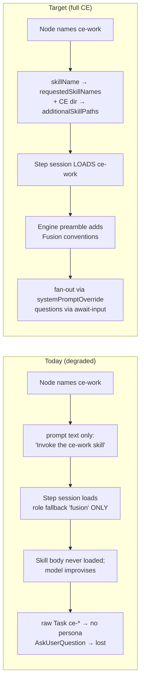
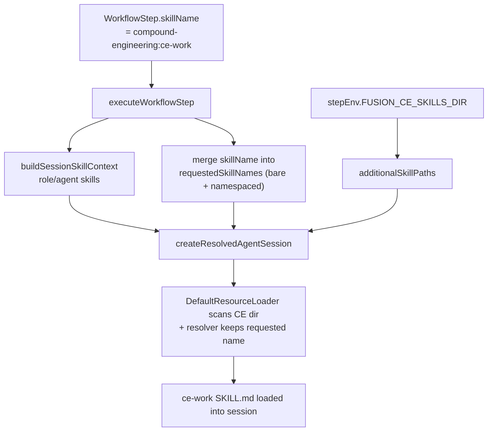
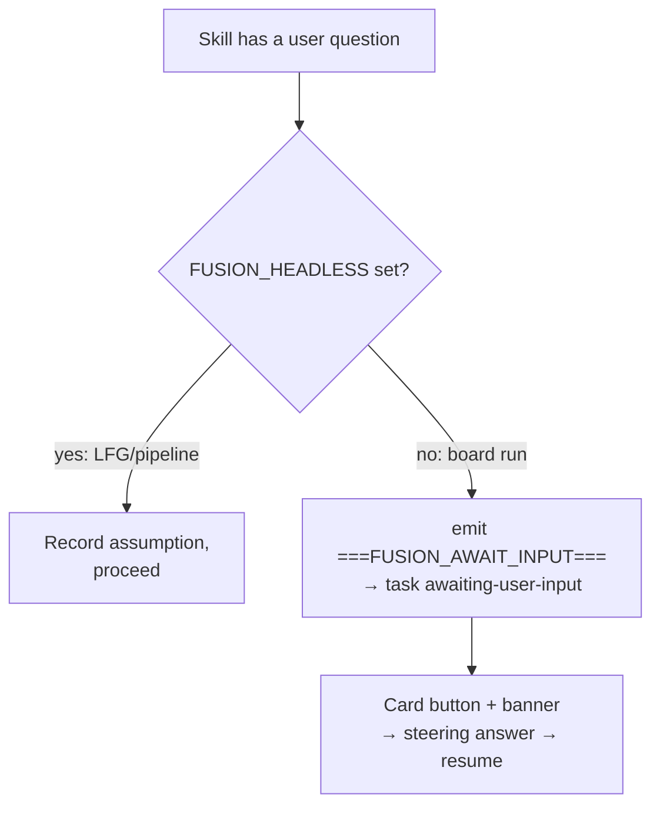

# fix: Make the compound-engineering workflow actually load skills and run the full CE flow

## Summary

The `builtin:compound-engineering` workflow *looks* fully wired — every node names the right CE skill (`ce-plan`, `ce-work`, `ce-code-review`, `ce-commit-push-pr`, `ce-resolve-pr-feedback`, `ce-compound`), the engine ships the enabling primitives (`systemPromptOverride` on `fn_spawn_agent`, `FUSION_WORKFLOW_STEP=1`, `===FUSION_AWAIT_INPUT===` sentinel parsing, `FUSION_CE_AGENTS_DIR`), and the dashboard has a working "Answer questions" card button + resume banner. Most of the 2026-06-13 integration plan shipped.

But a deep dive into the live execution path shows the workflow does **not** actually deliver compound engineering on a board run. Four load-bearing gaps remain:

1. **The named skill is never loaded into the step session (critical).** `executeWorkflowStep` builds skill selection from the assigned agent / role fallback (`executor → fusion`) only — it never forwards the step's `skillName` as a `requestedSkillName`, and never adds the CE install dir to the session's skill-discovery paths. The skill name is injected only as prompt *text* ("Invoke the `compound-engineering:ce-work` skill…") pointing at a skill the session cannot load. The June-3 skill-loading fix was applied to the interactive path, not the workflow-step path.
2. **9 of 11 bundled CE skills are verbatim upstream (critical).** Only `ce-debug` and `ce-resolve-pr-feedback` were adapted for Fusion. The rest — including `ce-plan`, `ce-work`, `ce-code-review`, `ce-commit-push-pr`, `ce-compound` — still call `AskUserQuestion` (no listener → questions lost) and fan out via raw `Task ce-*(...)` with no `systemPromptOverride` / `FUSION_CE_AGENTS_DIR` wiring, so the `ce-*` personas never resolve.
3. **Fan-out / writing steps have the wrong tool mode (high).** `plan` and `code-review` run readonly, which strips `fn_spawn_agent` — so `ce-plan`'s research agents and `ce-code-review`'s reviewer panel cannot spawn at all. `document` runs readonly, so `ce-compound` cannot write to `docs/solutions`.
4. **No genuinely-unattended signal (medium).** `FUSION_HEADLESS` is reserved but never set, so an LFG/pipeline run with no human would park on `awaiting-user-input` forever instead of recording assumptions and proceeding.
5. **The real execution seam is missing the plumbing entirely (critical, root cause).** The built-in workflow runs through the **graph-node path** (`runGraphCustomNode`, `executor.ts:5998`), which synthesizes an ephemeral step at `~6230` and calls `executeWorkflowStep` with `nodeEnv = undefined` for skill nodes (the injected `FUSION_CE_*` runtime env is only threaded on the *legacy* caller at `:12116`). And `fn_spawn_agent` is registered **only** in the main executor session (`:8076`), never in `executeWorkflowStep` — so coding mode grants write/edit but **not** spawn in any workflow step. Without fixing this seam, the skill-loading and fan-out fixes below silently no-op on the real workflow.

This plan closes all five so the workflow genuinely loads and runs the CE skills end-to-end. The foundational fix is the graph-node seam (U8); the rest build on it. Per the scope decision, the fix targets **all 11 bundled skills** via an **engine-injected conventions preamble** (skills stay byte-for-byte upstream; one maintenance point) — even though only 6 are currently workflow nodes (see U5).

**Target repo:** this repo (kb / Fusion). All paths repo-relative.

---

## Problem Frame

The CE skills were authored for an *interactive* Claude Code session: a human answers blocking questions, and the `Agent`/`Task` primitive resolves a rich `ce-*` registry. Fusion runs them in the opposite environment — an autonomous, ephemeral, readonly-by-default workflow-step session with no human attached and no `ce-*` registry. The 2026-06-13 plan added the *primitives* to bridge that gap (`systemPromptOverride`, the await-input sentinel, the bundled persona defs + `FUSION_CE_AGENTS_DIR`, coding tool mode), and the dashboard pause/resume surface. What never landed is the *wiring that makes the primitives fire*:

- The step session never **loads** the skill it names (so the model improvises from a one-line instruction instead of following the skill).
- The skills never **use** the primitives (they still call `AskUserQuestion` and raw `Task ce-*`), because no per-skill adaptation or engine preamble tells them to.
- Three of the steps that must spawn or write are locked **readonly**.
- There is no signal to **degrade honestly** when truly nobody can answer.

The result is a workflow that name-drops compound engineering at each node but executes a degraded, skill-less version of it. The fix has three threads — **load the skill**, **teach every skill the Fusion conventions once (engine preamble)**, and **give each node the capability (tool mode / headless signal) its skill needs** — plus the end-to-end test that would have caught the loading gap.

---

## Requirements

- R1. For every `executor: "skill"` workflow step, the named skill is actually **loaded** into the step session (discovered on a skill path AND selected by name), not merely referenced in the prompt text.
- R2. Every CE skill step receives the Fusion workflow-step conventions — emit `===FUSION_AWAIT_INPUT===` for user questions instead of `AskUserQuestion`; fan out to a `ce-*` persona by reading its def from `FUSION_CE_AGENTS_DIR` and passing the body as `systemPromptOverride` to `fn_spawn_agent` — **without** forking each skill's markdown.
- R3. A genuinely-unattended run (LFG / pipeline / `disable-model-invocation`) sets `FUSION_HEADLESS=1`; skills then record assumptions and proceed instead of parking. A normal board run (human reachable asynchronously) does **not** set it and still pauses for answers via the existing await-input + card-button surface.
- R4. CE steps whose skills fan out can spawn subagents (`ce-plan`, `ce-code-review`), and the `document` step can write to `docs/solutions` (`ce-compound`).
- R5. All 11 bundled skills behave correctly under the preamble: the two already hand-adapted skills (`ce-debug`, `ce-resolve-pr-feedback`) do not double-instruct, and `ce-resolve-pr-feedback`'s resolver fan-out resolves a persona via `systemPromptOverride`.
- R6. An end-to-end test exercises an `executor: "skill"` step **on the graph-node path** and asserts skill loading, coding-mode spawn availability, preamble presence, and the await-input pause; all existing `builtin-workflows` and executor tests stay green.
- R7. On the graph-node execution path (`runGraphCustomNode`), a skill step's session receives the injected CE runtime env (`FUSION_CE_SKILLS_DIR`, `FUSION_CE_AGENTS_DIR`) and — in coding mode — the `fn_spawn_agent` tool, so R1/R2/R3 actually fire on the workflow the plan targets (not only on the legacy `executeWorkflowStep` caller).

---

## Key Technical Decisions

- KTD-1 — **Load the step skill via `requestedSkillNames` + `additionalSkillPaths`, mirroring the interactive fix.** The resolver already works when fed both (proven by `packages/engine/src/__tests__/compound-engineering-skill-resolution.test.ts`); the gap is that `executeWorkflowStep` (`packages/engine/src/executor.ts:12409`, with the skill-context build at `~12532` and `createResolvedAgentSession` at `~12564`) never feeds them. Carry the node's `skillName` onto the `WorkflowStep` and, in the step session, merge it into the resolved `skillSelection`'s requested names and pass the CE skills install root as `additionalSkillPaths`, read from the step env (`FUSION_CE_SKILLS_DIR`, which the plugin exposes via `executorRuntimeEnv`). **Critical ordering:** on the graph-node path that the built-in workflow actually runs, that env key is absent until U8 threads the injected runtime env into `runGraphCustomNode` — so KTD-1 depends on U8, and U6 must assert the dir is present at runtime on the *graph* path, not on a hand-fed `stepEnv`. *Rationale:* the resolver and the discovery seam (`pi.ts` `additionalSkillPaths`) already exist — once the env is threaded (U8), this is the one missing hand-off, and it is exactly the "workflow execution loads skills" requirement.

- KTD-2 — **Engine-injected Fusion-conventions preamble, not per-skill markdown forks.** At the skill-prompt build path (`executor.ts` ~6172, the `executorKind === "skill"` branch) prepend a stable conventions block to the step prompt whenever a skill step runs in a workflow step. The block teaches any skill: (a) you are a Fusion workflow step — `AskUserQuestion` has no listener; surface user questions via a single `===FUSION_AWAIT_INPUT===` block and stop; (b) to fan out to a `ce-<persona>`, read `$FUSION_CE_AGENTS_DIR/<persona>.md`, strip frontmatter, and pass the body as `systemPromptOverride` to `fn_spawn_agent`; when spawn is unavailable, do the work inline. *Rationale:* the chosen approach — skills stay byte-for-byte upstream (trivial re-vendoring on CE updates), and the conventions live in one place that applies to all 11 skills at once. *Idempotency:* `ce-debug` (JSON protocol) and `ce-resolve-pr-feedback` (already emit the sentinel) must not double-instruct — see KTD-5 / U5. *Output-contract coexistence:* `executeWorkflowStep` already injects a system prompt requiring a trailing `{"verdict":...}` JSON object (`executor.ts:12453-12484`); the preamble's "emit a sentinel and stop" / skill-native output must reconcile with that — see KTD-6. *Override correctness:* the preamble must reliably win over 9 unforked skill bodies whose own text still says "call `AskUserQuestion`"; this is asserted behaviorally for at least one skill in U5/U6, not assumed.

- KTD-3 — **`FUSION_HEADLESS` is an explicit opt-in flag threaded through the run, not an inferred origin heuristic.** "Headless" is *not* "running in a workflow step" — a board step is unattended *now* but a human can answer later via the card button. `FUSION_HEADLESS=1` means *no human will ever answer* — LFG / pipeline / `disable-model-invocation` runs. **No such origin signal exists in the executor path today** (verified: no `lfg`/`pipeline`/`disableModelInvocation`/`unattended`/`runOrigin` marker reaches the workflow-step walk — only the existing `FUSION_HEADLESS` reservation comment at `executor.ts:12552`). So this is a threading change, not a lookup: add an explicit `unattended` boolean on the workflow-run options, set it only at the LFG/pipeline/`disable-model-invocation` entrypoints, and thread it through `runGraphCustomNode` → `executeWorkflowStep` → the `stepEnv` build at `executor.ts:12553` (the same threading seam as U8). **Default is unset = board run** — absence of the explicit flag must *always* yield no `FUSION_HEADLESS`, regardless of any other run attribute, so a misdetection can only ever park a task a human can answer (safe direction), never silently skip approval. The preamble's question branch checks `FUSION_HEADLESS`: set → record assumptions and proceed; unset → emit the await-input block. *Rationale:* satisfies "degrade honestly" (R3) without an inference that could regress the board's human-in-the-loop pause.

- KTD-4 — **Bump tool mode on the fan-out / writing nodes — but coding mode alone does not deliver spawn.** `plan` and `code-review` move to `toolMode: "coding"`, and `document` moves to `coding` so `ce-compound` can write `docs/solutions`. **Correction (verified):** coding mode gives write/edit but **not** `fn_spawn_agent` in a workflow step — that tool is registered only in the main executor session (`executor.ts:8076`), never in `executeWorkflowStep`, which passes an empty custom-tool set in coding mode (`:12554-12556, :12581`). The persona fan-out therefore cannot fire in *any* CE step (including the already-coding `execute`/`commit-pr`/`resolve-feedback`) until U8 registers the spawn tool for coding-mode skill steps. So coding mode is necessary but not sufficient; KTD-4 pairs with U8. *Write-capability posture (decision):* coding mode exposes write/edit on `plan`/`code-review`, which those skills are not supposed to use. We accept this for now with **no engine-level guard** — the only protection is skill discipline plus a U6 detection assertion (non-empty diff on plan/code-review is flagged, not blocked). The proper guard, a dedicated readonly-plus-spawn tool mode (spawn without write), stays **deferred** (see Scope Boundaries); the residual risk is documented in Risk-1. *Rationale:* the tool policy is binary today (`workflow-step-tool-policy.ts`), so coding is the only mode that can carry write or (post-U8) spawn.

- KTD-5 — **Persona fan-out stays skill-driven through the preamble + the shipped `systemPromptOverride` primitive.** No new engine surface for personas: the preamble instructs the skill to read the def and pass it as `systemPromptOverride` (the primitive added in the prior plan, `executor.ts` ~958 / ~15217). For `ce-resolve-pr-feedback`, whose await-input branch is already in-place, keep its bespoke question handling but let the preamble supply the persona-fan-out convention for its `ce-pr-comment-resolver` spawn (R5). *Rationale:* reuse the existing primitive; avoid a persona-registry API (still deferred).

- KTD-6 — **Reconcile the preamble with the step's existing verdict-JSON output contract.** `executeWorkflowStep` injects a system prompt requiring every step agent to end with a single trailing `{"verdict":"APPROVE|APPROVE_WITH_NOTES|REVISE",...}` JSON object (`executor.ts:12453-12484`). That collides with the preamble telling a skill to "emit a `===FUSION_AWAIT_INPUT===` block and stop" and with non-gate skills (`ce-plan`, `ce-work`, `ce-compound`) whose output isn't verdict-shaped. Define precedence: the await-input sentinel, when present, takes priority and the verdict is not required that turn; **gate** steps (`code-review`) still emit the verdict after their skill work; **non-gate** skill steps relax the verdict requirement (the executor already runs `parseAwaitInputSentinel` on output regardless). Implement by making the verdict instruction conditional on the step being a gate (or skill-less) step. *Rationale:* without this, the model is told to end two different ways and the gate parsing or the skill output breaks. *Note:* the preamble rides on the node prompt (`~6172`) while the verdict instruction rides on the step system prompt (`~12453`); U2/U6 must confirm both reach the same session and don't contradict.

- KTD-7 — **Confine and trust-bound the persona-def read before injecting it as `systemPromptOverride`.** The preamble has the skill read `$FUSION_CE_AGENTS_DIR/<persona>.md` and inject its body verbatim as a child's system prompt. Guard it: resolve the persona-def path and assert it stays within the install dir (reject `../` traversal in the persona name); require valid frontmatter and a body-size cap before use; and keep `FUSION_CE_AGENTS_DIR` plugin-installer-owned and **outside the repo worktree** — important now that coding-mode `plan`/`code-review` steps can write files and could otherwise reach an in-tree agents dir. *Rationale:* the defs are trusted today (vendored by the plugin installer), but injecting a file body verbatim into a spawned agent's system prompt is a filesystem prompt-injection surface if that dir is ever writable by anything else; the confinement check is cheap insurance.

---

## High-Level Technical Design

### Where the flow breaks today vs. the target



### Skill-loading data flow (KTD-1)



### Question handling: board vs. headless (KTD-3)



---

## Changed Surfaces

```text
packages/
  engine/src/executor.ts                 # U8 runGraphCustomNode (~5998/6247/6252): thread injected
                                          #   env into skill steps + register fn_spawn_agent (~8076/15148);
                                          #   U1 skill loading in executeWorkflowStep (~12409/12532/12564);
                                          #   U2 conventions preamble at skill-prompt build (~6172);
                                          #   KTD-6 verdict-contract reconciliation (~12453-12484);
                                          #   U3 FUSION_HEADLESS on stepEnv (~12553) via explicit flag;
                                          #   U9 systemPromptOverride path-confinement (~15217)
  engine/src/__tests__/                   # NEW e2e graph-path skill-step test (U6)
  core/src/types.ts                       # add skillName to WorkflowStep (~610) + WorkflowStepInput (~734)
  core/src/workflow-compiler.ts           # carry skillName in nodeToStepInput (~240) + comment (~233)
  core/src/workflow-steps-to-ir.ts        # INVERSION CONTRACT: stepInputToNode + parity test (U1)
  core/src/builtin-workflows.ts           # U4 toolMode on plan/code-review/document
  core/src/__tests__/builtin-workflows.test.ts   # updated assertions (U7)
plugins/fusion-plugin-compound-engineering/
  .fusion-ce-skills/ce-debug/SKILL.md            # reconcile vs preamble (U5)
  .fusion-ce-skills/ce-resolve-pr-feedback/...   # reconcile + persona override (U5)
  src/index.ts                                   # FUSION_CE_SKILLS_DIR / FUSION_CE_AGENTS_DIR exposure
```

---

## Implementation Units

**Sequencing:** U8 is foundational — it threads the CE runtime env and registers the spawn tool on the graph-node path the workflow actually runs, and U1/U3/U4/U6 depend on it. Build U8 first, then U1 (skill loading) and U2 (preamble), then U3/U4/U5/U9, with U6/U7 locking the behavior in. Units are listed below in their original numeric order, not build order.

### U1. Load the named skill into the workflow-step session
- **Goal:** The skill a step names is actually discovered and selected in that step's session — the core "workflow execution loads skills" fix.
- **Requirements:** R1
- **Dependencies:** U8 (the graph-node path must thread `FUSION_CE_SKILLS_DIR` into the step env first, or this fix no-ops on the real workflow)
- **Files:** `packages/core/src/types.ts` (add `skillName?: string` to `WorkflowStep` ~610-655 **and** to `WorkflowStepInput` ~734); `packages/engine/src/executor.ts` **`~6230`** (the graph-node step-literal synthesis seam — copy `cfg.skillName` onto the synthesized `WorkflowStep`; this is the seam the built-in workflow runs, and it currently drops the field) and `executeWorkflowStep` (`~12409`, skill-context build `~12532`: merge the step's skill name into the resolved `skillSelection.requestedSkillNames`; pass `additionalSkillPaths: [stepEnv.FUSION_CE_SKILLS_DIR]` into `createResolvedAgentSession` `~12564`); `packages/core/src/workflow-compiler.ts` (`nodeToStepInput` ~240 + the compiler-visible-fields comment ~233 — carry `skillName`) and `packages/core/src/workflow-steps-to-ir.ts` (`stepInputToNode` + the round-trip **parity test** — the INVERSION CONTRACT at `workflow-compiler.ts:237` requires both sides updated together) for the persisted-step path.
- **Approach:** Carry `skillName` onto the `WorkflowStep` at **both** materialization sites — the graph-node literal at `~6230` (where `cfg.skillName` is already in scope from the `~6172` prompt build but not copied onto the step) and the legacy compiler `nodeToStepInput`. In `executeWorkflowStep`, after `buildSessionSkillContext`, if `workflowStep.skillName` is set, add both the namespaced and bare forms (the resolver's `bareSkillName` strips `compound-engineering:`) to the requested-names set, and pass the CE install root (read from `stepEnv.FUSION_CE_SKILLS_DIR`) as `additionalSkillPaths`. Mirror the interactive fix documented in `docs/solutions/integration-issues/plugin-bundled-skills-not-loading-in-interactive-sessions.md` — discovery (path) AND selection (name) must both be satisfied. Honor the INVERSION CONTRACT: any field added to the compiler must be reflected in `stepInputToNode` and the parity test, or persisted-step round-tripping breaks.
- **Patterns to follow:** `compound-engineering-skill-resolution.test.ts` (the proven resolver contract); `pi.ts` `additionalSkillPaths` discovery seam; `index.ts:323` forwarding.
- **Test scenarios:**
  - Happy path: a step with `skillName: "compound-engineering:ce-work"` produces a session whose resolved skills include `ce-work`.
  - Bare-vs-namespaced: requesting `compound-engineering:ce-plan` resolves the bundled `ce-plan` dir.
  - Discovery without selection: CE dir on the path but name not requested → skill not retained (asserts both halves are required).
  - Edge: `FUSION_CE_SKILLS_DIR` unset → no throw; step still runs with role-fallback skills.
  - Non-skill step (prompt executor) is unchanged (no requested name added).
- **Verification:** the named skill appears in the step session's resolved skill set; a real `DefaultResourceLoader` test (not a scripted session) proves it.

### U2. Inject the Fusion workflow-step conventions preamble for skill steps
- **Goal:** Teach every skill the Fusion conventions (await-input for questions; persona fan-out via `FUSION_CE_AGENTS_DIR` + `systemPromptOverride`) in one engine-side place.
- **Requirements:** R2
- **Dependencies:** none (composes with U1)
- **Files:** `packages/engine/src/executor.ts` (skill-prompt build, ~6172-6173).
- **Approach:** When `executorKind === "skill"` and the session is a workflow step, prepend a stable, skill-agnostic conventions block before the existing "Invoke the `<skill>` skill…" line. The block states: (1) you are a Fusion autonomous workflow step; `AskUserQuestion`/`request_user_input` have no listener — to ask the user, emit exactly one `===FUSION_AWAIT_INPUT=== … ===END_FUSION_AWAIT_INPUT===` block and stop (the executor already parses this, `executor.ts` ~974/6254); (2) when `FUSION_HEADLESS=1`, do not ask — record an assumption and proceed; (3) to dispatch a `ce-<persona>` subagent, read `$FUSION_CE_AGENTS_DIR/<persona>.md`, strip frontmatter, and pass the body as `systemPromptOverride` to `fn_spawn_agent`; if `fn_spawn_agent` is absent (readonly), do the persona's work inline. Keep the text short and declarative; it is read by every CE skill step.
- **Patterns to follow:** the existing prompt-prefix construction at 6172-6173; the sentinel grammar in `parseAwaitInputSentinel`; the `systemPromptOverride` param shape (`executor.ts` ~958).
- **Test scenarios:**
  - A compiled skill step's prompt contains the conventions block ahead of the "Invoke the skill" line.
  - A non-skill (prompt/gate) step does not get the block.
  - The block references the await-input sentinel and `FUSION_CE_AGENTS_DIR` / `systemPromptOverride` verbatim (contract assertion so skills and engine agree on the grammar).
- **Verification:** golden-string assertion on the composed step prompt for a skill node.

### U3. Set `FUSION_HEADLESS` for genuinely-unattended runs
- **Goal:** Distinguish "no human now, but reachable async" (board) from "no human ever" (LFG/pipeline) so skills degrade honestly.
- **Requirements:** R3
- **Dependencies:** U2 (the preamble reads the var), U8 (shares the run-options → `runGraphCustomNode` → `stepEnv` threading seam)
- **Files:** `packages/engine/src/executor.ts` (`stepEnv` build `~12553`; thread a new `unattended` boolean from the workflow-run options through `runGraphCustomNode`/`executeWorkflowStep`); the LFG/pipeline run entrypoints that must set the flag (enumerate them — at minimum the `disable-model-invocation`/LFG pipeline caller).
- **Approach:** No origin signal exists to look up (verified — see KTD-3), so add an **explicit `unattended` boolean** on the workflow-run options and set it only at the LFG/pipeline/`disable-model-invocation` entrypoints. Thread it through the same seam U8 adds, and at the `stepEnv` build set `FUSION_HEADLESS=1` **iff** the flag is explicitly true. Default/absent → no `FUSION_HEADLESS` (board run). Leave `FUSION_WORKFLOW_STEP=1` always-on as today. Enumerate the entrypoints in the implementation rather than assuming a single marker.
- **Patterns to follow:** the existing `FUSION_WORKFLOW_STEP` injection at `~12553`; U8's env-threading change.
- **Test scenarios:**
  - Board run (flag unset): `FUSION_HEADLESS` is absent on the step env.
  - LFG/pipeline run (flag explicitly set): `FUSION_HEADLESS=1` on the step env.
  - **Default-safe invariant:** absence of the explicit flag yields no `FUSION_HEADLESS` regardless of any other run-context attribute (guards against a heuristic creeping in).
  - The variable never leaks into interactive (non-workflow) sessions.
- **Verification:** step env carries the var only when the explicit flag is set; combined with U2, a headless skill records assumptions instead of emitting an await-input block, and a board skill still parks.

### U4. Give the fan-out / writing CE nodes the right tool mode
- **Goal:** `ce-plan` and `ce-code-review` can spawn their subagents (paired with U8); `ce-compound` can write `docs/solutions`.
- **Requirements:** R4
- **Dependencies:** U8 (coding mode is necessary but not sufficient for spawn — U8 registers `fn_spawn_agent` for coding-mode skill steps)
- **Files:** `packages/core/src/builtin-workflows.ts` (the `plan`, `code-review`, and `document` nodes in `builtin:compound-engineering` ~186-258).
- **Approach:** Add `toolMode: "coding"` to the `plan`, `code-review`, and `document` node configs (execute/commit-pr/resolve-feedback already coding; merge stays the generic Fusion boundary per the prior plan's KTD-6). Add a short comment on each noting *why* coding is required (spawn for plan/review — once U8 lands; write for document) and that, per the documented write-capability posture (KTD-4), plan/review are not supposed to edit code and U6 asserts they produce no diff.
- **Patterns to follow:** the existing `toolMode: "coding"` execute/commit-pr nodes in the same file; `workflow-step-tool-policy.ts` allow/deny lists.
- **Test scenarios:**
  - `compileWorkflowToSteps` yields `plan`, `code-review`, `document` steps with compiled `toolMode === "coding"`.
  - `execute`, `commit-pr`, `resolve-feedback` remain coding; `merge` remains the generic boundary.
  - Readonly-stripping does not fire for these three steps (no `[readonly-violation]` log).
- **Verification:** updated `builtin-workflows.test.ts` asserts the tool modes; combined with U8, a coding-mode step exposes `fn_spawn_agent` and write tools (before U8, spawn is absent in both modes — see U6).

### U5. Reconcile the two adapted skills and verify all 11 against the preamble
- **Goal:** Cover all 11 bundled skills under the preamble without double-instruction, and close `ce-resolve-pr-feedback`'s persona-override gap.
- **Requirements:** R2, R5
- **Dependencies:** U2
- **Files:** `plugins/fusion-plugin-compound-engineering/.fusion-ce-skills/ce-debug/SKILL.md`, `.fusion-ce-skills/ce-resolve-pr-feedback/SKILL.md` (+ its `references/full-mode.md`), and an audit pass over the remaining nine (`ce-brainstorm`, `ce-code-review`, `ce-commit`, `ce-commit-push-pr`, `ce-compound`, `ce-ideate`, `ce-plan`, `ce-strategy`, `ce-work`).
- **Scope note (all 11, with caveat):** Per the scope decision the audit covers all 11 bundled skills, but only **6 are current `builtin:compound-engineering` nodes** (`ce-plan`, `ce-work`, `ce-code-review`, `ce-commit-push-pr`, `ce-resolve-pr-feedback`, `ce-compound`). The other 5 (`ce-brainstorm`, `ce-ideate`, `ce-strategy`, `ce-commit`, `ce-debug`) are **not** workflow nodes today — the preamble fires only when a skill runs as a workflow step, so R2/R5 coverage for them is **forward-looking** (it pays off if/when they become nodes). State this explicitly rather than implying an active consumer. `ce-debug`'s JSON protocol in particular only matters for standalone/interactive debug invocation, not the workflow — do not put it on the workflow-critical path.
- **Approach:** With the preamble supplying the generic conventions, remove or slim the *duplicated* in-place instructions in `ce-debug` and `ce-resolve-pr-feedback` so the same guidance isn't stated twice (keep only genuinely bespoke behavior — e.g. `ce-debug`'s JSON protocol, which is structurally incompatible with the plaintext sentinel and is a standalone-invocation caveat, not a workflow reconciliation). For `ce-resolve-pr-feedback`, ensure its `ce-pr-comment-resolver` dispatch follows the preamble's persona-override pattern. For the rest, confirm the preamble is sufficient by **enumerating** each skill's persona list and question sites and mapping them onto await-input + `systemPromptOverride`; add a brief per-skill note only where the generic preamble can't express what the skill needs. Do not re-fork skills the preamble already covers.
- **Patterns to follow:** the existing `FUSION_WORKFLOW_STEP` branch in `ce-resolve-pr-feedback/references/full-mode.md`; `ce-debug`'s JSON-protocol section; upstream skill structure (keep diffs minimal for re-vendoring).
- **Test scenarios:**
  - **Override-correctness (behavioral):** for at least one verbatim skill (`ce-plan`), assert at runtime that under the preamble the skill emits a `===FUSION_AWAIT_INPUT===` block (or, headless, records an assumption) rather than calling `AskUserQuestion` — i.e. the preamble wins over the skill's own "call `AskUserQuestion`" text. (Covered in U6.)
  - **Persona override (behavioral):** a `ce-resolve-pr-feedback` step spawns its resolver child with a non-empty `systemPromptOverride` sourced from the persona def. (Covered in U6.)
  - **No double-instruction:** the composed `ce-debug` / `ce-resolve-pr-feedback` step prompt contains the convention guidance exactly once (engine preamble), not duplicated by the skill body.
  - Manifest/install assertions: all 11 skills still install (no regression from edits).
- **Verification:** the U6 behavioral assertions above pass; `ce-debug`/`ce-resolve` do not emit duplicated convention text; the per-skill persona/question mapping is recorded in the implementation notes.

### U6. End-to-end `executor: "skill"` workflow-step test
- **Goal:** Lock in the behavior that silently regressed — prove a skill step loads the skill, can spawn, carries the preamble, and pauses on a question.
- **Requirements:** R6, R7
- **Dependencies:** U1, U2, U4, U8 (the test drives the graph-node path, which only works once U8 threads env + spawn)
- **Files:** `packages/engine/src/__tests__/` (new test mirroring executor/step-session test harnesses), using a real `DefaultResourceLoader` and the bundled CE skill fixtures.
- **Approach:** Drive the **graph-node path** (`runGraphCustomNode` → `executeWorkflowStep`) for a CE skill node — not only the legacy caller — so the test exercises the seam the built-in workflow actually uses. Assert: (1) `FUSION_CE_SKILLS_DIR`/`FUSION_CE_AGENTS_DIR` are present in the step session env at runtime (R7/U8); (2) the resolved session skills include the named skill (U1); (3) the composed step prompt contains the conventions preamble exactly once (U2); (4) a coding-mode skill step exposes `fn_spawn_agent` after U8 (and a readonly step does not) — note this assertion **fails against pre-U8 code where spawn is absent in both modes**, so U8 must land first; (5) emitting `===FUSION_AWAIT_INPUT===` parks the task `awaiting-user-input` with a parseable marker and a steering answer resumes it; (6) the verdict-JSON contract and the sentinel coexist per KTD-6 (a non-gate skill step does not fail for lacking a verdict; a gate step still emits one); (7) a `ce-resolve-pr-feedback` step spawns its resolver child with a non-empty `systemPromptOverride`; (8) `plan`/`code-review` steps produce no working-tree diff (write-capability detection per KTD-4). Reuse the resolver fixtures from `compound-engineering-skill-resolution.test.ts`.
- **Patterns to follow:** `compound-engineering-skill-resolution.test.ts`, the step-session executor tests, the await-input pause/resume assertions.
- **Test scenarios:**
  - Env present at runtime on the graph path: `FUSION_CE_SKILLS_DIR`/`FUSION_CE_AGENTS_DIR` reach the step session.
  - Skill loaded: named CE skill present in resolved session skills.
  - Preamble present exactly once: conventions block in the step prompt, not duplicated.
  - Spawn gating (post-U8): `fn_spawn_agent` present in coding, absent in readonly.
  - Verdict/sentinel coexistence: non-gate skill step OK without verdict; gate step emits verdict.
  - Persona override: `ce-resolve-pr-feedback` resolver child spawned with non-empty `systemPromptOverride`.
  - Override-correctness: `ce-plan` emits the await-input sentinel (board) / records an assumption (headless) instead of calling `AskUserQuestion`.
  - Write detection: `plan`/`code-review` steps leave the tree unmodified.
  - Await-input: sentinel → `awaiting-user-input` + marker; steering reply → resume.
- **Verification:** `pnpm --filter @fusion/engine test` green including the new file.

### U7. Update built-in workflow tests
- **Goal:** Pin the node-level wiring and tool modes.
- **Requirements:** R6
- **Dependencies:** U1, U4
- **Files:** `packages/core/src/__tests__/builtin-workflows.test.ts`.
- **Approach:** Extend the compound-engineering assertions to cover: each skill node carries its `skillName` onto the compiled step; `plan`/`code-review`/`document` compile to `toolMode: "coding"`; step ordering (plan → execute → review → code-review → commit-pr → resolve-feedback → merge → document) is intact; plugin gating still holds.
- **Patterns to follow:** existing assertions in the same file.
- **Test scenarios:**
  - `skillName` present on each skill step.
  - Tool modes for plan/code-review/document/execute/commit-pr/resolve-feedback.
  - Workflow hidden without the plugin, shown with it.
- **Verification:** `pnpm --filter @fusion/core test builtin-workflows` green.

### U8. Thread the injected runtime env and register `fn_spawn_agent` on the graph-node step path
- **Goal:** The seam the built-in workflow actually runs (`runGraphCustomNode`) must hand the skill-step session the injected CE env **and** the spawn tool — without this, U1 (skill loading), U3 (headless), and persona fan-out all silently no-op. **Foundational — U1, U3, U4, U6 depend on it.**
- **Requirements:** R7 (and unblocks R1, R2, R3)
- **Dependencies:** none
- **Files:** `packages/engine/src/executor.ts` — `runGraphCustomNode` (`~5998`; its call site `~4158` and the `executeWorkflowStep` call at `~6252` pass `nodeEnv`, which is `undefined` for skill nodes — `~6247`); the injected `taskEnv` build at `~7445` (`collectExecutorRuntimeEnv`); the spawn-tool registration `createSpawnAgentTool` (`~15148`, today wired only into the main session at `~8076`); the `executeWorkflowStep` custom-tools assembly (`~12554-12581`).
- **Approach:** Two coupled changes on the graph path. **(a) Env:** make the injected runtime env (carrying `FUSION_CE_SKILLS_DIR`/`FUSION_CE_AGENTS_DIR`, built from `collectExecutorRuntimeEnv`) reachable inside `runGraphCustomNode`, and pass it as the `taskEnv` argument to `executeWorkflowStep` for skill nodes (today only CLI nodes get a non-`undefined` env). The legacy caller at `~12116` already passes `taskEnv` — this closes the graph-vs-legacy asymmetry. **(b) Spawn:** register `createSpawnAgentTool` into the custom-tool set for coding-mode skill steps in `executeWorkflowStep`, so `fn_spawn_agent` is actually present where the CE skills fan out (today it's never registered there; coding mode passes an empty custom-tool set). Gate it to coding-mode steps; readonly steps keep no spawn. Account for the per-child git worktree cost the spawn tool incurs (see Deferred: lighter read-only spawn path).
- **Patterns to follow:** the main-session tool assembly at `~8052-8082` (how `createSpawnAgentTool` is constructed and passed); the legacy `executeWorkflowStep` caller at `~12116` that already threads `taskEnv`; the `FUSION_WORKFLOW_STEP` injection at `~12553`.
- **Test scenarios:**
  - Graph-path skill step session env contains the injected `FUSION_CE_*` keys (was empty/`process.env` before).
  - A coding-mode skill step on the graph path has `fn_spawn_agent` available; a readonly one does not.
  - The legacy `executeWorkflowStep` caller behavior is unchanged (no regression).
  - A spawned child still runs with `systemPromptOverride` honored (composes with the existing primitive).
- **Verification:** the U6 end-to-end test (driving the graph path) sees the env keys and the spawn tool; a manual CE board run logs the resolved skills and a successful persona spawn.

### U9. Confine the persona-def read and document the write-capability posture
- **Goal:** Close the filesystem prompt-injection surface KTD-7 names, and make the accepted write-capability risk (KTD-4) explicit in the plan and code comments.
- **Requirements:** R2, R5 (safety of the fan-out path)
- **Dependencies:** U2 (preamble defines the read), U8 (spawn must exist for the override to be used)
- **Files:** `packages/engine/src/executor.ts` (the `systemPromptOverride` consumption path `~15217` — add path-confinement/size validation if the engine ever resolves the def; otherwise the guidance lives in the preamble text from U2); the preamble text (U2) instructing the path-confined read; plugin docs noting `FUSION_CE_AGENTS_DIR` must be installer-owned and outside the worktree.
- **Approach:** Have the preamble (U2) instruct a path-confined read: resolve `<persona>.md` and require it stays within `FUSION_CE_AGENTS_DIR` (reject `../` in the persona name), require valid frontmatter, and cap body size before passing as `systemPromptOverride`. Confirm `FUSION_CE_AGENTS_DIR` resolves outside the repo worktree (so coding-mode `plan`/`code-review` steps can't write into it). Add a code comment + a Risk-1 note documenting that plan/review write capability is model-discipline-only until the readonly-plus-spawn mode ships (the chosen posture).
- **Patterns to follow:** the `assertPluginLocalAgentsTarget` guard already in `plugins/fusion-plugin-compound-engineering/src/agent-installation.ts` (mirror its path-confinement style).
- **Test scenarios:**
  - A persona name containing `../` is rejected before any read.
  - `FUSION_CE_AGENTS_DIR` resolves outside the task worktree.
  - `Test expectation:` the write-posture documentation is prose/comments — no behavioral test beyond U6's plan/code-review no-diff assertion.
- **Verification:** traversal attempt rejected; agents dir confirmed out-of-tree; Risk-1 posture documented.

---

## Scope Boundaries

**In scope:** loading the named skill into step sessions (R1); the engine conventions preamble for all 11 bundled skills (R2); the `FUSION_HEADLESS` unattended signal (R3); tool-mode fixes for plan/code-review/document (R4); reconciling the two already-adapted skills + the resolver persona override (R5); the end-to-end and node-level tests (R6).

### Deferred to Follow-Up Work
- A dedicated **readonly-plus-spawn** tool mode (spawn without write) so `plan`/`code-review` can fan out without exposing edit/write — today coding is the only mode carrying `fn_spawn_agent`.
- A **lighter spawn path** that avoids a full git worktree per child for read-only reviewer personas (the `ce-code-review` panel can fan out wide; each `fn_spawn_agent` child currently gets its own worktree).
- A general **plugin-provided agent-definition registry** API (this plan keeps the file-based `FUSION_CE_AGENTS_DIR` + `systemPromptOverride` approach).
- Applying the preamble / headless signal to the **other** built-in workflows (`builtin:coding`, `builtin:stepwise-coding`, `builtin:marketing`, etc.).
- Evidence-capture / demo-reel integration in the PR flow.

### Out of scope
- Redesigning the workflow engine, the await-input mechanism, or the workflow-owned-merge system.
- Changing the CE skills' interactive (Claude Code) behavior — the preamble only fires in workflow-step sessions.
- The dashboard "Answer questions" button/banner — already shipped and tested.

---

## Risks & Dependencies

- Risk-1 (high, **accepted + documented**) — **Coding mode on `plan`/`code-review` exposes write/edit with no engine guard.** Per the chosen posture (KTD-4), the only protection is skill discipline plus a U6 **detection** assertion (a non-empty diff on plan/code-review is flagged, not blocked). An autonomous run — especially headless, where the skill is told to proceed without asking — could mutate the tree before code is written and corrupt the artifact the next step consumes. *Mitigation:* documented model-discipline-only posture until the proper guard (readonly-plus-spawn tool mode) ships (Deferred); U6 detects violations; re-evaluate before enabling the CE workflow for LFG/pipeline. *This is a knowingly-accepted gap, not a closed one.*
- Risk-2 (high) — **The preamble must override 9 unforked upstream skill bodies that still say "call `AskUserQuestion`" / "`Task ce-*`".** The maintenance win of the preamble approach holds only if a generic block reliably wins over each skill's own contradicting text; the real exposure is these 9, not `ce-debug` (which isn't a workflow node). *Mitigation:* U5/U6 assert override-correctness behaviorally for at least `ce-plan`; each upstream re-vendor needs a re-check that no skill body defeats the preamble. *`ce-debug`'s JSON protocol is a standalone-invocation caveat, not a workflow collision.*
- Risk-3 (med) — **`FUSION_HEADLESS` misdetection.** A wrong signal could make a board run skip questions (proceed on assumptions when a human was available) or an LFG run park forever. *Mitigation:* KTD-3 makes it an **explicit opt-in** flag with a default-safe invariant (absent → board), threaded through U8's seam; both directions covered in U3 tests. The safe default means a miss can only park a recoverable task, never silently skip approval.
- Risk-4 (med) — **The graph-node path doesn't thread the injected env (root cause).** `FUSION_CE_SKILLS_DIR`/`FUSION_CE_AGENTS_DIR` are exported by the plugin (`index.ts`, both confirmed present) but never reach the graph-node step session, so without U8 the skill-loading and fan-out fixes no-op on the real workflow. *Mitigation:* U8 closes the graph-vs-legacy asymmetry; U6 asserts the env at runtime on the graph path (not a hand-fed `stepEnv`).
- Risk-5 (med) — **Persona-def injection surface.** The preamble reads `<persona>.md` and injects its body verbatim as a child `systemPromptOverride`. If `FUSION_CE_AGENTS_DIR` is ever writable by something other than the plugin installer (compromised update, in-tree dir reachable by a coding-mode step, `../` traversal), arbitrary instructions enter a spawned agent's system prompt. *Mitigation:* U9 path-confinement + out-of-tree dir + the existing `assertPluginLocalAgentsTarget` install guard.
- Risk-6 (med) — **Verdict-contract vs. skill output collision.** The step system prompt requires a trailing verdict JSON; the preamble tells skills to emit a sentinel / skill-native output. Unreconciled, gate parsing or skill output breaks. *Mitigation:* KTD-6 defines precedence (sentinel wins; gate steps still emit verdict; non-gate skill steps relax it); U6 asserts coexistence.
- Dependency: U6's e2e test depends on the bundled CE skill fixtures being installable in the test harness (same fixtures `compound-engineering-skill-resolution.test.ts` already uses).

---

## Verification Strategy

- Unit/integration tests per unit, centered on a new engine e2e skill-step test (U6) and `builtin-workflows.test.ts` (U7), plus the existing resolver and await-input tests staying green.
- A manual autonomous board run of `builtin:compound-engineering` on a real task, confirming: (1) each step's named CE skill is actually loaded (log the resolved session skills); (2) `ce-plan` / `ce-code-review` fan out to `ce-*` personas via `systemPromptOverride`; (3) a planning question parks the task and the card button → banner → steering answer resumes it; (4) `ce-compound` writes a `docs/solutions` entry; (5) an LFG run of the same workflow records assumptions instead of parking.
- `pnpm` typecheck + affected package suites (`@fusion/engine`, `@fusion/core`) green before PR.

---

## Sources & Research

- Node wiring + skill nodes: `packages/core/src/builtin-workflows.ts:178-260`; tool policy `packages/engine/src/workflow-step-tool-policy.ts`.
- Skill-prompt build (text-only injection today): `packages/engine/src/executor.ts:6172-6173`.
- Step session + skill selection (no `skillName` / `additionalSkillPaths` forwarded): `executeWorkflowStep` at `packages/engine/src/executor.ts:12409` (skill-context build `~12532`, `createResolvedAgentSession` `~12564`); `session-skill-context.ts` (role fallback `executor → fusion`); resolver `skill-resolver.ts:211-321`.
- **Verified during doc review (root-cause seams):** the built-in workflow runs via the graph-node path `runGraphCustomNode` (`executor.ts:5998`, called `~4158`), which synthesizes the step at `~6230` (no `skillName` copied) and calls `executeWorkflowStep` with `nodeEnv = undefined` for skill nodes (`~6247/6252`) — while the legacy caller at `~12116` passes `taskEnv`. `fn_spawn_agent` (`createSpawnAgentTool` `~15148`) is registered only in the main session (`~8076`), never in `executeWorkflowStep` (coding passes an empty custom-tool set, `~12554-12581`). The step system prompt mandates a trailing `{"verdict":...}` JSON object (`~12453-12484`). The `fusion` role-fallback skill carries no CE behavior (confirmed — no partial-credit fallback). `WorkflowStep`/`WorkflowStepInput` lack `skillName` (`types.ts:610, 734`); compiler INVERSION CONTRACT at `workflow-compiler.ts:237`. `FUSION_HEADLESS` is only a reservation comment (`~12552`); no LFG/pipeline origin marker reaches the step walk.
- `additionalSkillPaths` discovery seam: `packages/engine/src/pi.ts:993, 2077-2078`; `packages/engine/src/index.ts:323`; core seam `packages/core/src/plugin-types.ts:179`.
- `systemPromptOverride` primitive: `packages/engine/src/executor.ts:958-963, 15162-15239` (child gets its own worktree ~15204-15207).
- Await-input sentinel + pause/resume: `packages/engine/src/executor.ts:974-979, 6254-6273` and `runAwaitInputNode` ~5674-5728.
- `FUSION_WORKFLOW_STEP` set / `FUSION_HEADLESS` reserved: `packages/engine/src/executor.ts:12551-12553`.
- Plugin env exposure (`FUSION_CE_AGENTS_DIR`, runtime env hook): `plugins/fusion-plugin-compound-engineering/src/index.ts:148-181`; `agent-installation.ts`; runtime-env merge `executor.ts:7434-7452`.
- Bundled skills (2 adapted, 9 verbatim): `plugins/fusion-plugin-compound-engineering/.fusion-ce-skills/` — `ce-debug` (JSON protocol), `ce-resolve-pr-feedback/references/full-mode.md` (`FUSION_WORKFLOW_STEP` await-input branch); the rest call `AskUserQuestion` + raw `Task ce-*`.
- Dashboard pause/resume (shipped): `packages/dashboard/app/components/TaskCard.tsx:2048-2061`, `WorkflowResultsTab.tsx:68-76, 922-951`, `app/api/legacy.ts:5376-5381`.
- Prior plan + skill-loading learning: `docs/plans/2026-06-13-002-feat-compound-engineering-workflow-integration-plan.md`; `docs/solutions/integration-issues/plugin-bundled-skills-not-loading-in-interactive-sessions.md`.
- Tests: `packages/engine/src/__tests__/compound-engineering-skill-resolution.test.ts`; `packages/core/src/__tests__/builtin-workflows.test.ts`.
