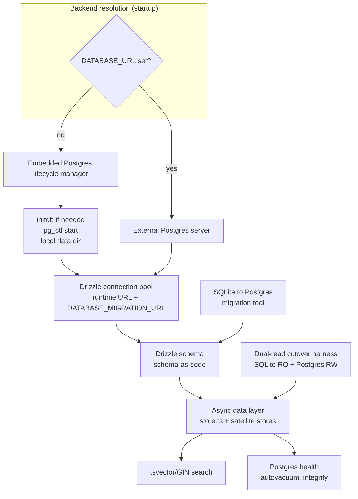
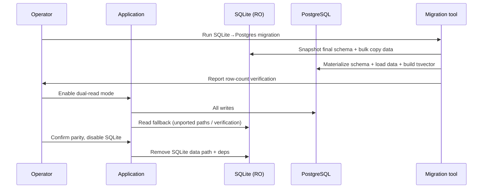

# Migrate storage from SQLite to PostgreSQL (embedded + external)

## Summary

Replace the SQLite storage layer with PostgreSQL following the Paperclip model: a bundled embedded Postgres binary (npm `embedded-postgres`) provides zero-config local storage, `DATABASE_URL` switches to an external server, and SQLite is removed after a dual-read cutover. The data layer is rewritten on Drizzle ORM (schema-as-code, type-safe), which also forces the entire synchronous `DatabaseSync` data-access surface to become async.

## Problem Frame

Fusion persists all project, central, and archive state in three SQLite files (`fusion.db`, `fusion-central.db`, `archive.db`) accessed through a synchronous `DatabaseSync` adapter over `node:sqlite`/`bun:sqlite`. This works for single-machine, multi-process use under WAL, but it couples the application tightly to SQLite-specific features (FTS5 + triggers, JSON1 functions, PRAGMAs, `ATTACH DATABASE`, corruption self-healing) and blocks any multi-host or managed-database deployment. The goal is a single PostgreSQL backend that preserves zero-config local operation while enabling an external server, matching the architecture Paperclip (`github.com/paperclipai/paperclip`) uses: embedded Postgres by default, `DATABASE_URL` to point elsewhere.

The dominant cost is not dialect conversion but the **sync-to-async conversion**: the `DatabaseSync` interface is synchronous and every Postgres client is async, so every database call site across the ~17k-line `store.ts` and ~5.9k-line `db.ts` must become awaited, independent of the query layer.

---

## Requirements

### Backend topology and packaging

- R1. When `DATABASE_URL` is unset, the application starts an embedded PostgreSQL instance (real Postgres process via `embedded-postgres`) into a local data directory, runs migrations, and serves with no external setup required.
- R2. When `DATABASE_URL` is set, the application connects to the specified external PostgreSQL server (local Docker, managed/hosted, or any reachable server) and does not start an embedded instance.
- R3. The embedded PostgreSQL binaries are bundled/shipped so `fn` works fully offline with zero system Postgres install on supported platforms (macOS, Linux, Windows; arm64 and x64).
- R4. A separate `DATABASE_MIGRATION_URL` is honored for startup schema work when the runtime `DATABASE_URL` uses a transaction-pooling connection (Supavisor/PgBouncer), mirroring the Paperclip split.

### Data layer

- R5. All schema is defined as Drizzle ORM code (schema-as-code) and all data access goes through Drizzle against a PostgreSQL backend.
- R6. The synchronous `DatabaseSync` data-access surface is replaced with an async data layer; no blocking/synchronous bridge to PostgreSQL remains.
- R7. Existing behavioral invariants are preserved through the rewrite: soft-delete visibility (`deletedAt IS NULL` filtering across all live readers), task-ID allocator reconciliation on store open, lineage-integrity gates, document/artifact parent-task scoping, and the handoff-to-review `mergeQueue` transactional invariant.

### Full-text search

- R8. The FTS5-backed task and archive search is replaced with PostgreSQL full-text search (`tsvector`/`tsquery`, GIN indexes) preserving search-result parity and the automatic index-sync-on-write behavior that today's FTS5 triggers provide.

### Migration and compatibility

- R9. A migration tool moves existing SQLite data (all three databases) into PostgreSQL idempotently and verifiably.
- R10. A dual-read cutover period is supported: during transition, SQLite is read-only and PostgreSQL is the write target, so deployments can migrate without downtime windows.
- R11. After cutover, SQLite is fully removed (no dual-dialect abstraction retained long-term, no `better-sqlite3`/`node:sqlite`/`bun:sqlite` data-path dependency).

### Health and maintenance

- R12. SQLite-specific health and maintenance surfaces are reworked for PostgreSQL: corruption detection (`PRAGMA integrity_check`/`quick_check`) and the startup rebuild-on-malformed guard, compaction (`VACUUM`), WAL checkpointing, and the schema self-heal via `PRAGMA table_info`/fingerprint reconciliation.

---

## Key Technical Decisions

- **Drizzle ORM for the full data-layer rewrite.** User-confirmed. The existing code is ~700KB+ of hand-written SQL against a sync `prepare()` interface with zero ORM; Drizzle gives schema-as-code, type safety, and a migration system. This is a near-total data-layer rewrite rather than a dialect conversion. Adopted over raw-SQL `postgres.js` (which would have preserved the architecture but offered no schema model).

- **Sync-to-async conversion is mandatory and load-bearing.** The entire data layer is synchronous; every PostgreSQL client is async. Every `db.prepare(sql).get()` call site becomes `await`. Store methods are already `async`, so the boundary exists, but every internal database call must be awaited. This dwarfs all other conversion work and drives sequencing.

- **Bundle embedded PostgreSQL binaries for zero-config default.** User-confirmed. `embedded-postgres` manages `initdb`/`pg_ctl` lifecycle over platform-specific Postgres binaries (~30-50MB per platform). True offline zero-config like SQLite today, at the cost of heavier distribution and known platform edge cases (WSL2, unprivileged LXC containers, macOS dyld loading) that Paperclip also encounters.

- **Backend resolution by `DATABASE_URL` (Paperclip model).** Unset = embedded (real Postgres process, supports multiple concurrent connections and thus preserves the existing multi-process access pattern that PGlite/WASM cannot). Set = external server. `DATABASE_MIGRATION_URL` splits schema work off pooled runtime connections.

- **Snapshot final SQLite schema as the PostgreSQL baseline + fresh Drizzle migrations.** Reimplementing the 128 hand-rolled SQLite migrations (`SCHEMA_VERSION = 128`) in PostgreSQL dialect is pointless for a greenfield Postgres schema. The migration tool materializes the current final schema into PostgreSQL, and Drizzle's migration history starts fresh from that snapshot. The version-gate testing discipline (the institutional learning that fresh-DB tests cannot catch a skipped-on-upgrade migration) is carried forward into the Drizzle migration tests.

- **Dual-read = SQLite read-only + PostgreSQL write target.** During cutover, writes go to PostgreSQL; reads fall back to SQLite for any path not yet ported or for verification. This is lower-risk than a dual-routing query abstraction and avoids two-writer contention. The institutional learning that two engines race task leases over the shared central SQLite DB is respected: the cutover must not run two writers against SQLite, and PostgreSQL's MVCC structurally removes the single-writer contention.

- **Three-database topology preserved as PostgreSQL schemas or databases.** The project/central/archive separation is retained (project state, global registry, cold-storage archive), mapping each to a PostgreSQL schema or database rather than collapsing them.

---

## High-Level Technical Design

### Sync-to-async conversion shape

The current layering is: async store methods (`async createTask`) calling a synchronous DB layer (`this.db.prepare(sql).get()`). The rewrite inverts the inner layer to async Drizzle calls (`await db.select()...` / `await tx.insert()`). Because the store boundary is already async, callers above `TaskStore` are unaffected; the change is contained to the data layer's internal call sites. Transaction semantics move from SQLite `BEGIN IMMEDIATE` + `SAVEPOINT` to Drizzle transaction callbacks (`db.transaction(async (tx) => ...)`), which must preserve the per-mutation atomicity the current `transactionImmediate()` path guarantees.

### Migration and cutover sequence

---

## Scope Boundaries

### In scope

- PostgreSQL connection layer with embedded/external resolution and lifecycle management.
- Drizzle schema definition for all existing tables across project, central, and archive databases.
- Async rewrite of the data layer (`store.ts`, `db.ts`, `central-db.ts`, `archive-db.ts`, and satellite `*-store.ts` files).
- Full-text search replacement (FTS5 to `tsvector`/GIN).
- Health/maintenance surface rework.
- SQLite-to-PostgreSQL data migration tool.
- Dual-read cutover harness and SQLite removal.

### Deferred to Follow-Up Work

- Performance benchmarking and query-plan tuning against production-scale data (after the rewrite lands and real workloads run).
- Managed-host deployment guides (Supabase/RDS connection string specifics beyond the `DATABASE_URL`/`DATABASE_MIGRATION_URL` contract).
- Read-replica or connection-pooler deployment topology recommendations.
- Central-DB multi-host replication across machines (the mesh/node replication that already exists is out of scope; only its storage backend changes).

---

## System-Wide Impact

- **All `@fusion/*` packages** consume the data layer; the async conversion ripples into `@fusion/engine` (worktree DB hydration, self-healing) and `@fusion/dashboard` (health endpoint, DB-corruption banner, routes).
- **Plugin stores** instantiate core's `Database`. The `fusion-plugin-roadmap` plugin has its own store layer on core's `Database` and pins schema versions. The backend swap must stay behind a stable data-layer interface so plugin stores keep working.
- **Backup/restore** changes fundamentally: SQLite file-copy backups become PostgreSQL logical dumps (`pg_dump`/restore). `backup.ts` and the `BackupManager` pairing behavior (project + central pair) are reworked.
- **CLI** (`fn db ...` commands, `--vacuum`, run-audit surfaces) changes surface and behavior.
- **Distribution** grows by ~30-50MB per platform for bundled Postgres binaries; the desktop build (`packages/desktop`) and CLI bundling are affected.
- **Concurrency model** shifts from SQLite WAL multi-process-over-one-file to a PostgreSQL server process, structurally resolving the documented central-DB task-lease race but introducing connection-pool and server-lifecycle management.

---

## Risks & Dependencies

- **Async-conversion correctness.** Missed `await`s, transaction isolation drift from `BEGIN IMMEDIATE`, and changed lock semantics are the highest-severity regression vectors. Mitigation: characterization coverage of current transactional paths before rewrite; the merge gate (`pnpm test:gate`) as the authoritative signal.
- **embedded-postgres platform failures.** Paperclip reports initdb failures on WSL2, unprivileged LXC, and macOS dyld. Mitigation: graceful fallback messaging; document unsupported environments; consider external-server fallback guidance.
- **FTS search parity.** `tsvector` ranking and tokenization differ from FTS5; result ordering and recall may shift. Mitigation: capture current search result fixtures as characterization baselines before replacing.
- **Data-migration fidelity.** Soft-delete visibility, JSON column fidelity (SQLite text-JSON to JSONB), FTS index rebuild, and `AUTOINCREMENT` sequence continuity must survive the copy. Mitigation: idempotent, row-count-verified migration with a dry-run mode.
- **Plugin-store contract drift.** If the data-layer interface narrows, plugin stores break. Mitigation: keep the store contract stable; schema-version pinning continues to work against the new migration history.
- **Distribution size and CI.** Bundled binaries change install size and may affect CI image caching; the desktop build pipeline must fetch/verify platform binaries.
- **Per the standing rule, flaky tests are quarantined on sight.** The rewrite will surface pre-existing flakiness; quarantine, do not appease.

---

## Implementation Units

### Phase 1 — Foundation: backend, connection, schema

### U1. PostgreSQL connection layer and backend resolution

- **Goal:** Resolve the backend at startup (embedded vs external via `DATABASE_URL`) and expose a Drizzle connection pool with the `DATABASE_MIGRATION_URL` split.
- **Requirements:** R1, R2, R4
- **Dependencies:** none
- **Files:** `packages/core/src/postgres/connection.ts` (new), `packages/core/src/postgres/backend-resolver.ts` (new); touches startup wiring in `packages/core/src/central-core.ts` / `packages/dashboard/src/server.ts`
- **Approach:** A resolver reads `DATABASE_URL` (external) or signals embedded mode (U2). Runtime queries use the resolved URL; schema/migration work uses `DATABASE_MIGRATION_URL` when present, else the runtime URL. Connection pooling defaults to a small pool; document the transaction-pooling caveat (prepared-statement incompatibility) that motivates the migration-URL split. **Precondition (de-risk before Phase 2):** validate the chosen Drizzle driver bundles cleanly under the desktop Bun `--compile` build by probing both `postgres.js` and `pg` against the real `packages/desktop` build — the current `sqlite-adapter.ts` exists precisely because Bun `--compile` mishandles certain native modules, so this must be confirmed before the rewrite depends on it.
- **Patterns to follow:** Paperclip `DATABASE.md` connection-mode table; the existing settings-resolution hierarchy in `packages/core/src/settings-schema.ts`.
- **Test scenarios:**
  - Happy path: unset `DATABASE_URL` resolves to embedded mode; set `DATABASE_URL` resolves to external and skips embedded start.
  - `DATABASE_MIGRATION_URL` present routes schema work to it while runtime uses `DATABASE_URL`.
  - Invalid/unreachable `DATABASE_URL` fails loudly with an actionable message.
  - Pooled runtime URL with no `DATABASE_MIGRATION_URL` warns about prepared-statement risk.
  - Security: the connection string (including any password in `DATABASE_URL`) is never written to logs, and connection-error messages redact credentials.
- **Verification:** Startup logs the resolved backend and connection target; a health probe succeeds against the resolved backend.

### U2. Embedded PostgreSQL lifecycle manager

- **Goal:** Manage an embedded Postgres process (`initdb`, ensure database exists, `pg_ctl` start/stop) over a local data directory using `embedded-postgres`.
- **Requirements:** R1, R3
- **Dependencies:** U1
- **Files:** `packages/core/src/postgres/embedded-lifecycle.ts` (new); bundled binary acquisition in `packages/desktop/scripts/build.ts` and `package.json` (`optionalDependencies`/postinstall)
- **Approach:** On first start, `initdb` into the data directory, create the application database, run migrations, then serve. Persist across restarts; deleting the directory resets local state (mirroring the current SQLite reset behavior). Acquire platform/arch binaries (`embedded-postgres` supports macOS/Linux/Windows, arm64/x64). Handle graceful shutdown (`pg_ctl stop`) on process exit.
- **Patterns to follow:** Paperclip embedded flow (`~/.paperclip/instances/default/db/`); the existing process-supervision discipline (`superviseSpawn` from `@fusion/core` — do not use raw detached spawn/nohup per AGENTS.md).
- **Test scenarios:**
  - Happy path: first start runs `initdb`, creates DB, runs migrations; second start reuses the directory without re-init.
  - Existing data directory with prior schema starts without re-running init.
  - Graceful shutdown stops the Postgres process; no orphaned process remains.
  - Corrupt/locked data directory surfaces a clear error rather than hanging.
- **Verification:** The application serves with no external Postgres installed; the data directory persists state across restarts.

### U3. Drizzle schema definition (schema-as-code baseline)

- **Goal:** Define the complete PostgreSQL schema in Drizzle for all existing tables across project, central, and archive databases, materialized from the current final SQLite schema (snapshot, not the 128 incremental migrations).
- **Requirements:** R5
- **Dependencies:** U1
- **Files:** `packages/core/src/postgres/schema/` (new, organized by database: project, central, archive); Drizzle config (`drizzle.config.ts`); fresh migration directory
- **Approach:** Translate every existing table (tasks, branch_groups, mergeQueue, config, workflow_steps, activityLog, task_commit_associations, archivedTasks, automations, agents, agentHeartbeats, approval_requests(+audit), secrets, task_documents(+revisions), artifacts, __meta, goals, missions hierarchy, plugins, routines, roadmaps, todos, chat tables, runAuditEvents, research/eval/experiment tables, etc.) into Drizzle table definitions. Map SQLite types: `INTEGER PRIMARY KEY AUTOINCREMENT` to identity/serial, JSON text columns to `jsonb`, the FTS5 tables to U7's tsvector design. Preserve all CHECK constraints, foreign keys with cascade rules, and unique indexes.
- **Patterns to follow:** Existing schema declarations in `packages/core/src/db.ts` (`SCHEMA_SQL`, `MIGRATION_ONLY_TABLE_SCHEMAS`) as the source of truth for the snapshot; Drizzle schema conventions.
- **Test scenarios:**
  - Happy path: applying the fresh Drizzle migration to an empty database yields a schema matching the current final SQLite schema (column-by-column, constraint-by-constraint).
  - Every foreign-key cascade rule and unique index from the SQLite schema is present.
  - JSON columns round-trip as JSONB with the same shape.
  - Plugin-owned tables (roadmap milestones/features) are included via the plugin schema-init hook.
- **Verification:** A schema-diff between a migrated PostgreSQL database and a fresh-Drizzle-applied database shows no structural differences.

---

### Phase 2 — Data-layer rewrite (sync to async, Drizzle)

### U4. Async data-layer foundation (replace DatabaseSync)

- **Goal:** Replace the synchronous `DatabaseSync` adapter with an async Drizzle-backed connection and the core CRUD/transaction primitives the stores depend on.
- **Requirements:** R5, R6, R7
- **Dependencies:** U1, U3
- **Files:** `packages/core/src/postgres/data-layer.ts` (new); removes the sync `DatabaseSync`/`Statement` surface in `packages/core/src/db.ts`; `packages/core/src/sqlite-adapter.ts` (retained only for the dual-read period, then removed in U11)
- **Approach:** Provide the async primitives stores need: prepared-statement-equivalent query helpers, `db.transaction(async (tx) => ...)` preserving the atomicity of the current `transactionImmediate()` path, and the run-audit-event-within-transaction behavior (`recordRunAuditEvent` inside the shared transaction). Define the stable data-layer interface plugin stores consume so the backend swap is invisible to them. The `getDatabase()` accessor's contract changes: it must return an async-capable connection rather than the synchronous `Database` (U15 converts the direct-`prepare()` consumers that relied on the sync shape).
- **Patterns to follow:** Current transaction helpers (`Database.transaction()`, `transactionImmediate()`) in `packages/core/src/db.ts`; the run-audit-within-transaction pattern.
- **Test scenarios:**
  - Happy path: an insert + matching audit insert commit or roll back together.
  - A failing mutation inside a transaction rolls back all writes including the audit row.
  - Concurrent transactions do not observe partial writes.
  - The plugin-facing data-layer contract compiles against `fusion-plugin-roadmap`'s store usage.
- **Verification:** The foundation supports a representative store mutation (create task + audit) atomically and async.

### U5. Decompose `store.ts` into cohesive modules

- **Goal:** Break the ~17k-line `TaskStore` god-class into cohesive per-responsibility modules behind the existing `TaskStore` facade, as a pure behavior-invariant refactor that makes each subsequent migration independently landable.
- **Requirements:** R5, R7
- **Dependencies:** none (pure refactor, no backend change)
- **Files:** `packages/core/src/store.ts` (extract); new modules under `packages/core/src/task-store/` (e.g. persistence, allocator, settings, lifecycle, merge-coordination, archive-lineage, branch-groups, workflow-workitems, audit, search, comments)
- **Approach:** Extract the distinct responsibility areas into separate modules without changing behavior or the backend: task persistence + allocator reconciliation, settings, task lifecycle/moves + workflow transitions, soft-delete/archive/lineage, merge-queue + merge, branch-groups + PR-entities/threads, workflow work-items + completion handoff, audit/activity-log/run-audit, search, comments/attachments, goal/usage/plugin events, file-watching, task-ID-integrity. Keep the `TaskStore` class as a facade composing the modules so callers are unaffected. No async or Drizzle changes yet.
- **Execution note:** Behavior-invariant by design — the existing gate (`pnpm test:gate`) plus `store-concurrent-writes` / `checkout-claim-mutex` tests verify the extraction for free. Per the mass-migration learning, this is a no-two-agents-share-a-file extraction, not a backend swap.
- **Patterns to follow:** `docs/solutions/architecture-patterns/mass-migration-agent-fleet-orchestration.md` (verification-invariance for mechanical extraction).
- **Test scenarios:**
  - Test expectation: none -- behavior-invariant refactor; the existing gate and concurrent-write/mutex tests are the verification surface.
- **Verification:** `pnpm test:gate` passes with no behavior change; the facade preserves every public method signature.

### U6. Satellite stores and databases rewrite

- **Goal:** Rewrite the central database (`central-db.ts`), archive database (`archive-db.ts`), and satellite stores (`message-store.ts`, `chat-store.ts`, `mission-store.ts`, `insight-store.ts`, `research-store.ts`, `eval-store.ts`, `experiment-session-store.ts`, `routine-store.ts`, `plugin-store.ts`, `goal-store.ts`, `todo-store.ts`, `reflection-store.ts`, `automation-store.ts`, `approval-request-store.ts`, `secrets-store.ts`, `agent-store.ts`) to async Drizzle, plus `worktree-db-hydrate.ts`.
- **Requirements:** R5, R6, R7
- **Dependencies:** U4
- **Files:** the `*-store.ts` files in `packages/core/src/`; `packages/core/src/central-db.ts`, `packages/core/src/archive-db.ts`; `packages/engine/src/worktree-db-hydrate.ts`
- **Approach:** Same sync-to-async, dialect-to-Drizzle conversion as U5, applied per store. The archive database (cold storage, append-only FTS) maps to its PostgreSQL schema with the lighter-touch tsvector maintenance. Worktree DB hydration copies task-scoped metadata into the worktree's connection (now a scoped query against the shared PostgreSQL backend rather than a separate SQLite file hydration).
- **Patterns to follow:** Each store's current SQLite implementation; the central-DB concurrency note from the learnings (two engines racing leases — the new backend removes single-writer contention).
- **Test scenarios:**
  - Happy path per store: representative create/read/update/delete.
  - Central DB: secret encryption round-trips; access-policy CHECK constraints hold.
  - Archive: archived task snapshots persist and are searchable.
  - Worktree hydration: task + dependency metadata is copied for the active graph; binary artifact files are not copied.
- **Verification:** Each store's existing tests pass against PostgreSQL; the worktree-hydrate test passes.

### U12. Migrate TaskStore persistence, allocator, and settings modules

- **Goal:** Migrate the decomposed task-persistence, ID-allocator-reconciliation, and settings modules (from U5) from sync SQLite to async Drizzle.
- **Requirements:** R5, R6, R7
- **Dependencies:** U4, U5
- **Files:** `packages/core/src/task-store/persistence.ts`, `packages/core/src/task-store/allocator.ts`, `packages/core/src/task-store/settings.ts` (from U5); `packages/core/src/distributed-task-id.ts`, `packages/core/src/task-id-integrity.ts`
- **Approach:** Convert the persistence-module call sites to awaited Drizzle queries. Preserve soft-delete visibility (`deletedAt IS NULL`) across all live readers, create-class non-destructive inserts, and allocator reconciliation bumping each prefix sequence to `max(current, max(task suffix)+1, max(archived suffix)+1, max(reservation)+1)` on store open. Settings reads/writes move to Drizzle against the `config` table. Carry FNXC comments forward.
- **Execution note:** Characterization coverage of allocator reconciliation before migration; the merge gate is the authoritative signal.
- **Patterns to follow:** Current allocator reconciliation and soft-delete invariants in `docs/storage.md`.
- **Test scenarios:**
  - Happy path: create/read/update/delete a task end to end.
  - Soft-delete: live readers hide `deletedAt` rows; forensic reads surface them.
  - Allocator reconciliation: stale sequences self-heal to max suffix; soft-deleted/archived IDs stay reserved.
  - Settings: read/update project and global settings round-trip.
- **Verification:** Persistence, allocator, and settings tests pass against PostgreSQL.

### U13. Migrate TaskStore lifecycle and merge-coordination modules

- **Goal:** Migrate the task-lifecycle/moves/workflow-transitions and merge-queue/merge modules (from U5) to async Drizzle, preserving the transactional invariants.
- **Requirements:** R5, R6, R7
- **Dependencies:** U5, U12
- **Files:** `packages/core/src/task-store/lifecycle.ts`, `packages/core/src/task-store/merge-coordination.ts` (from U5)
- **Approach:** Convert move/handoff/merge call sites to awaited Drizzle. Preserve the handoff-to-review `mergeQueue` invariant: the column move, `mergeQueue` insert, and handoff audit fan-out run in one Drizzle transaction (`db.transaction`), so observers never see `column = "in-review"` without the matching queue row. Merge-queue leasing (priority-first + FIFO within priority, recoverable expired leases) maps to Drizzle transactions with row-level locking.
- **Patterns to follow:** The handoff invariant and merge-queue lease semantics in `docs/storage.md` and `packages/core/src/store.ts`.
- **Test scenarios:**
  - Happy path: move a task through columns; hand off to review; acquire/release a merge-queue lease.
  - Handoff invariant: column move + `mergeQueue` insert + audit are atomic; a failure rolls back all three.
  - Merge-queue lease: priority-first ordering; expired leases recover without incrementing attempts.
- **Verification:** Lifecycle and merge-coordination tests pass against PostgreSQL; the checkout-claim-mutex test passes.

### U14. Migrate TaskStore remaining modules (archive/lineage, branch-groups, workflow work-items, audit, comments)

- **Goal:** Migrate the remaining decomposed TaskStore modules (archive/lineage, branch-groups/PR-entities, workflow work-items/completion-handoff, audit/activity-log/run-audit, comments/attachments, goal/usage/plugin events) to async Drizzle.
- **Requirements:** R5, R6, R7
- **Dependencies:** U5, U12
- **Files:** `packages/core/src/task-store/archive-lineage.ts`, `packages/core/src/task-store/branch-groups.ts`, `packages/core/src/task-store/workflow-workitems.ts`, `packages/core/src/task-store/audit.ts`, `packages/core/src/task-store/comments.ts` (from U5)
- **Approach:** Convert each module's call sites to awaited Drizzle. Preserve lineage-integrity gates (live children block parent delete/archive; `removeLineageReferences` clears them), document/artifact parent-task scoping under soft-delete, and run-audit-event-within-transaction behavior. The search module is migrated here for query structure, paired with U7's tsvector index. File-watching and task-ID-integrity detection move to PostgreSQL-backed reads.
- **Patterns to follow:** Lineage children, documents under soft-deleted tasks, and the artifact registry semantics in `docs/storage.md`.
- **Test scenarios:**
  - Lineage: deleting a parent with live children throws; `removeLineageReferences` clears them; archived/soft-deleted children do not block.
  - Archive: archived snapshots persist and are searchable; unarchive restores.
  - Audit: a mutation and its run-audit event commit or roll back together.
  - Comments/attachments: add/update/delete round-trip on an active task.
- **Verification:** Remaining TaskStore module tests pass against PostgreSQL.

### U15. Migrate engine and dashboard direct-`prepare()` consumers

- **Goal:** Convert the `@fusion/engine` and `@fusion/dashboard` consumers that bypass store methods and call the sync `Database`/`prepare()` surface directly, once `getDatabase()` returns an async connection (U4).
- **Requirements:** R5, R6
- **Dependencies:** U4, U6, U12
- **Files:** `packages/dashboard/src/monitor-store.ts`, `packages/dashboard/src/server.ts` (store-construction sites passing `getDatabase()`), `packages/dashboard/src/routes/register-*.ts` (store-construction sites), `packages/engine/src` callers of `store.getDatabase()` and direct `prepare()` (self-healing, worktree hydration); the `packages/engine/src/worktree-db-hydrate.ts` path already covered by U6
- **Approach:** Replace direct `db.prepare(sql).run/get/all` calls in dashboard stores (notably `monitor-store.ts`) and route handlers with awaited Drizzle queries or routed through the relevant async store. Update store-construction sites that pass the raw `Database` (`new ChatStore(store.getDatabase())`, `new AiSessionStore(...)`, `new ApprovalRequestStore(...)`) to pass the async connection or the owning store. Convert engine test/self-healing direct-`prepare()` sites to async Drizzle.
- **Patterns to follow:** The async store-method boundary established in U4/U6; existing route store-construction patterns.
- **Test scenarios:**
  - Happy path: dashboard monitor deployments/incidents/metrics read and write via the async path.
  - Each migrated route store constructs against the async connection and serves requests.
  - Engine self-healing mutations that previously used direct `prepare()` persist via async Drizzle.
- **Verification:** Dashboard and engine tests pass against PostgreSQL; no direct sync `prepare()` call sites remain in `packages/dashboard/src` or `packages/engine/src`.

---

### Phase 3 — SQLite-specific surfaces

### U7. Full-text search replacement (FTS5 to tsvector/GIN)

- **Goal:** Replace the FTS5 external-content tables and triggers (`tasks_fts`, `archived_tasks_fts`) with PostgreSQL `tsvector`/GIN full-text search, preserving result parity and automatic sync-on-write.
- **Requirements:** R8
- **Dependencies:** U3, U5, U6
- **Files:** `packages/core/src/postgres/schema/` (fts columns/indexes); search-query paths in `packages/core/src/store.ts` (`searchTasks`) and the archive store; the FTS maintenance step in self-healing
- **Approach:** Use generated `tsvector` columns over the indexed text columns with GIN indexes, kept in sync via PostgreSQL generated columns/triggers (preserving the automatic sync that today's FTS5 `ai`/`au`/`ad` triggers provide). The value-aware partial-update optimization (only changed text columns touch the index) maps to PostgreSQL only re-generating the tsvector when source text columns change. Replace the FTS5 corruption/maintenance self-healing step with PostgreSQL index health (`REINDEX`/autovacuum) and the bounded rebuild-on-bloat threshold logic.
- **Patterns to follow:** Current FTS5 design and the `rebuildFts5Index()`/merge/optimize thresholds in `packages/core/src/db.ts`; the documented defer rationale in `docs/storage.md` (attached live-FTS investigation).
- **Test scenarios:**
  - Happy path: search returns the same tasks for a representative query set as the FTS5 baseline.
  - Insert/update/delete keep the tsvector in sync automatically.
  - Non-text mutation does not needlessly re-generate the index.
  - Index rebuild on bloat threshold restores search without data loss.
- **Verification:** Search-result fixtures captured pre-rewrite pass post-rewrite.

### U8. Health and maintenance surface rework

- **Goal:** Rework the SQLite-specific health and maintenance surfaces for PostgreSQL: corruption detection, startup rebuild-on-malformed, compaction, WAL checkpointing, and schema self-heal.
- **Requirements:** R12
- **Dependencies:** U4, U5
- **Files:** `packages/core/src/db.ts` (integrity/VACUUM/WAL-checkpoint paths); `packages/dashboard/app/components/DbCorruptionBanner.tsx`; `packages/dashboard/src/routes` (health endpoint `taskIdIntegrity`); `packages/engine/src/__tests__/self-healing-db-corruption.test.ts`
- **Approach:** Replace `PRAGMA integrity_check`/`quick_check` and the startup rebuild-on-malformed guard with PostgreSQL health checks (`pg_stat`/connection liveness) and a restore-from-backup path on corruption. Replace `VACUUM`/WAL checkpoint with autovacuum tuning plus an explicit `VACUUM`/`ANALYZE` operator command. Replace the schema self-heal via `PRAGMA table_info`/fingerprint reconciliation with an `information_schema`/`pg_catalog`-based check driven by Drizzle's known schema. Preserve the task-ID-integrity detector (duplicate IDs, cross-table collisions, sequence drift) against PostgreSQL.
- **Patterns to follow:** Current integrity/VACUUM paths and the schema self-heal fingerprint mechanism in `packages/core/src/db.ts`.
- **Test scenarios:**
  - Happy path: healthy database reports green health.
  - Task-ID integrity anomalies (duplicate IDs, sequence drift) are detected and surface the banner.
  - Schema drift detection catches a missing column and reconciles it.
  - Explicit compaction command runs `VACUUM`/`ANALYZE` and reports stats.
- **Verification:** The health endpoint and corruption banner behave as before; the self-healing-db-corruption test passes in its PostgreSQL form.

---

### Phase 4 — Migration, cutover, removal

### U9. SQLite-to-PostgreSQL data migration tool

- **Goal:** Build a tool that snapshots the current final SQLite schema into PostgreSQL and bulk-copies all data (all three databases), idempotently and with verification.
- **Requirements:** R9
- **Dependencies:** U3, U5, U6, U7
- **Files:** `scripts/migrate-sqlite-to-postgres.mjs` (new); `packages/core/src/db-migrate.ts` (snapshot reference)
- **Approach:** Read each SQLite database, map types (text-JSON to JSONB, integers to appropriate types), stream rows into the PostgreSQL schema via Drizzle, rebuild the tsvector indexes, and verify row counts per table. Support a dry-run mode. Handle the soft-delete/deletedAt rows, JSON column fidelity, and `AUTOINCREMENT` sequence continuity (set sequences to max(id)+1). The tool targets the embedded or external PostgreSQL backend via `DATABASE_URL`.
- **Patterns to follow:** The existing one-shot reconciliation scripts in `scripts/` (e.g. `reconcile-leaked-soft-deletes.mjs`) for the bounded, idempotent, dry-run-default shape.
- **Test scenarios:**
  - Happy path: a populated SQLite database migrates to PostgreSQL with matching row counts per table.
  - Idempotency: re-running against an already-migrated PostgreSQL database is a no-op or a clean re-sync.
  - JSON columns round-trip with identical shape.
  - Sequences are set to max(id)+1 so new inserts do not collide.
  - Dry-run reports the planned copy without writing.
- **Verification:** A migrated PostgreSQL database passes the same store tests as a natively-created one.

### U10. Dual-read cutover harness

- **Goal:** Support a transition window where SQLite is read-only and PostgreSQL is the write target, so deployments migrate without a downtime window.
- **Requirements:** R10
- **Dependencies:** U9
- **Files:** `packages/core/src/postgres/dual-read-harness.ts` (new); backend wiring touched in U1
- **Approach:** A mode flag routes all writes to PostgreSQL while reads fall back to SQLite solely for parity verification (all live data paths are already on PostgreSQL by this point — U10 runs after U5/U6/U7 ported every store). Enforce SQLite read-only (reject writes) to prevent two-writer contention that the learnings warn races task leases. Provide a parity-check command that compares SQLite vs PostgreSQL read results for a sample of queries. The parity check must exclude search-result ordering — FTS5 (SQLite) and tsvector (PostgreSQL, from U7) rank and tokenize differently, so strict search ordering comparison would report false failures; search parity is validated separately against captured fixtures in U7, and the dual-read parity check compares row membership only for search. Document the operator sequence: migrate (U9) → enable dual-read → verify parity → disable SQLite (U11).
- **Patterns to follow:** The dual-engine safety guidance in `docs/solutions/developer-experience/browser-testing-dashboard-from-worktree-safely.md` (the daemon/lease-race hazard).
- **Test scenarios:**
  - Happy path: in dual-read mode, a write lands in PostgreSQL and is readable from PostgreSQL.
  - A write attempt against SQLite in dual-read mode is rejected.
  - Parity check reports matching row membership for sampled queries, excluding search-result ordering.
- **Verification:** A deployment can run in dual-read mode serving live traffic with PostgreSQL as the sole writer.

### U11. SQLite removal, fresh migration baseline, and cleanup

- **Goal:** Remove SQLite entirely after cutover: drop the SQLite data path and dependencies, establish the fresh Drizzle migration history as authoritative, and rework backup/restore for PostgreSQL.
- **Requirements:** R11, R12
- **Dependencies:** U10
- **Files:** `packages/core/src/sqlite-adapter.ts` (remove), `packages/core/src/sqlite-validation.ts` (remove), SQLite paths in `db.ts`/`store.ts` (remove); `packages/core/src/backup.ts` (rework to `pg_dump`/restore); `package.json` (remove `better-sqlite3`); `plugins/fusion-plugin-even-realities-glasses/package.json`, `packages/desktop/scripts/build.ts`; `docs/storage.md`, `AGENTS.md` (SQLite-specific sections)
- **Approach:** Delete the SQLite adapter and validation, the FTS5 probe, the `ATTACH DATABASE` archive path, and SQLite-specific maintenance. Make the fresh Drizzle migration history the sole schema authority with the version-gate testing discipline carried forward. Rework `BackupManager` to PostgreSQL logical dumps (project + central pairing preserved as separate dumps). Update operator docs to reflect the `DATABASE_URL`/embedded model.
- **Patterns to follow:** The version-gate regression-test learning (seed-at-previous-version tests for skipped-on-upgrade detection), applied to Drizzle migrations.
- **Test scenarios:**
  - Happy path: the application starts, runs, and passes the full gate with no SQLite code path reachable.
  - No `better-sqlite3`/`node:sqlite`/`bun:sqlite` import remains in the data path.
  - Backup produces a restorable PostgreSQL dump; restore round-trips.
  - Fresh Drizzle migration history applies cleanly to an empty database.
- **Verification:** `pnpm verify:workspace` passes; grep for SQLite symbols in the data path returns nothing.

---

## Open Questions

- **Project/central/archive as separate databases or schemas in one database.** Both are valid; separate databases mirror today's separate files most closely and simplify backup pairing, while schemas-in-one-database simplify embedded single-instance management. Resolve during U3; the data layer abstracts the choice either way.

- **embedded-postgres version pin and checksum verification.** The bundled Postgres binaries need a pinned version and (per the external-integration evidence rule) a checksum or `upstream-pending-verification` marker. Confirm during U2.

---

## Sources & Research

- Paperclip database model: `github.com/paperclipai/paperclip` `doc/DATABASE.md` — embedded default, `DATABASE_URL` switching, `DATABASE_MIGRATION_URL` split, plugin database namespaces.
- `embedded-postgres` package: `github.com/leinelissen/embedded-postgres`, `npmjs.com/package/embedded-postgres` — `initdb`/`pg_ctl` lifecycle, platform/arch binaries; known failure modes (WSL2, unprivileged LXC, macOS dyld) tracked in `paperclipai/paperclip` issues #1032, #828, #3583.
- Current storage architecture: `docs/storage.md` (hybrid storage model, FTS5 maintenance, attached-FTS defer rationale, write-path lock recovery).
- Migration engine: `packages/core/src/db.ts` (`SCHEMA_VERSION = 128`, `applyMigration`, `SCHEMA_COMPAT_FINGERPRINT`); `docs/solutions/database-issues/schema-version-constant-must-equal-highest-migration.md` (version-gate invariant).
- Concurrency hazard: `docs/solutions/developer-experience/browser-testing-dashboard-from-worktree-safely.md` (two engines racing task leases over the central SQLite DB).
- Plugin store coupling: `docs/solutions/test-failures/schema-version-sweep-must-include-plugin-workspaces.md` (`fusion-plugin-roadmap` instantiates core's `Database`).
