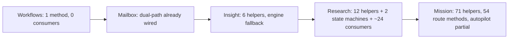

# feat: Port remaining satellite stores to PostgreSQL AsyncDataLayer

## Summary

The embedded-PostgreSQL backend is the default local store, but several satellite stores were never ported off the synchronous SQLite path. Their getters throw `"<Store> is not available in PG backend mode"`, so the dashboard features 500 (now interim-503-guarded). This plan ports the remaining stores so their dashboard surfaces work against real Postgres, sequenced cleanest-first as independent per-store units: **workflow definitions → mailbox (MessageStore) → InsightStore → ResearchStore → MissionStore**. TodoStore (already shipped this session) is the reference pattern.

Each unit lands as its own commit, removes the interim 503/throw for that store, and adds a `*.pg.test.ts` to the blocking `test:pg-gate` lane. Mission autopilot/SSE and CLI-only paths may remain partial — only the dashboard read/write surface is in scope per store.

---

## Problem Frame

In PG backend mode (`store.backendMode === true`), the synchronous `store.db` getter throws. Satellite-store getters (`getInsightStoreImpl`/`getResearchStoreImpl` in `packages/core/src/task-store/remaining-ops-10.ts`, `getMissionStoreImpl` in `packages/core/src/task-store/remaining-ops-8.ts`) construct their store with `store.db` and therefore throw. Dashboard routes were given interim `503` guards this session; `/api/workflows` still 500s because `readAllWorkflowDefinitionsImpl` does a raw `store.db.prepare("SELECT * FROM workflows")`.

Each store already has a partial `async-*-store.ts` helper module targeting the existing `project.*` Postgres tables, plus a shared PG test harness (`packages/core/src/__test-utils__/pg-test-harness.ts`). The work is: fill helper gaps (faithfully replicating stateful lifecycle logic), wrap them in an async store exposing the sync method names, return that wrapper from the getter in backend mode, convert the dashboard routes (and any unconditional non-fallback consumers) to `await`, and remove the interim guard.

---

## Requirements

- **R1.** Each ported store's dashboard routes return HTTP 200 with real data against a live embedded-PG instance (no 500/503).
- **R2.** The server stays up — no uncaught throws from store getters or async misuse on engine/SSE paths.
- **R3.** `test:pg-gate` stays green and gains one `*.pg.test.ts` per ported store covering the dashboard-critical methods, including lifecycle/state-machine behavior where present.
- **R4.** Stateful logic (status-transition validation, terminal-immutability, auto-timestamps, retry gates, fingerprint dedup, auto-seq) is replicated faithfully — the PG path must match the SQLite path's observable semantics.
- **R5.** Legacy SQLite mode is unaffected — the sync store remains the path when `!store.backendMode`.
- **R6.** Interim 503 guards added this session are removed for each store as it is genuinely ported.
- **R7.** Consumers that already wrap the getter in try/catch graceful fallback are left as-is; only unconditional sync consumers reachable in PG mode are converted to `await`.

---

## Key Technical Decisions

- **KTD1 — Async-wrapper-class pattern (mirror TodoStore).** For each store, add an `Async<Store>` class (in the existing `async-*-store.ts`) that holds the `AsyncDataLayer` and exposes the **same public method names** as the sync store, delegating to the module's helper functions. The getter returns it in backend mode; the sync class stays for SQLite. Consumers `await` the result (harmless on sync returns). Rationale: proven this session with `AsyncTodoStore`; keeps a single call path across both backends.
- **KTD2 — Getter return type becomes a union.** `get<Store>Store(): <Store> | Async<Store>`; the cached field widens to `<Store> | Async<Store> | null`. Callers `await`. Rationale: avoids forcing the sync store to become async and avoids an interface extraction.
- **KTD3 — Replicate lifecycle logic in the new helpers, not the routes.** `updateInsightRun`/`updateResearchRun`/`updateResearchStatus`/`createResearchRetryRun` carry the state machines (`VALID_*_TRANSITIONS`, `TERMINAL_*_STATUSES`, auto-timestamps, retry gate). The async helpers must reproduce these checks and throw the same `*LifecycleError` types. Rationale: R4; the routes already assume the store enforces invariants.
- **KTD4 — Leave engine/CLI graceful-fallback consumers untouched; convert only unconditional reachable ones.** Insight's 3 engine reporters and Research's `project-engine` orchestrator init already try/catch — leave them (they degrade). Convert dashboard routes always; convert CLI/agent-tools calls that are unconditional and async-reachable. Rationale: R7, bounds blast radius.
- **KTD5 — Sequence cleanest-first, one commit per store.** Workflows (1 method, 0 consumer changes) → Mailbox (mostly wired) → Insight (6 helpers, engine on fallback) → Research (12 helpers + machines + ~24 consumers) → Mission (71 helpers, 54 route methods, partial). Rationale: ship value early, isolate risk, keep each PR reviewable.
- **KTD6 — Raw async SQL must schema-qualify `project.*` and use snake_case columns.** Per this session's earlier fixes (the connection does not put `project` on `search_path`). New helpers go through Drizzle schema objects (auto-qualified) where possible; raw `sql` must qualify. Rationale: avoids the `relation does not exist` / wrong-column class already fixed once.

---

## High-Level Technical Design

Per-store porting pipeline (applies to U3–U5; U1/U2 are reduced cases):

```mermaid
flowchart TD
    A[Sync store method surface] --> B{Async helper exists?}
    B -- yes --> D[Async&lt;Store&gt; wrapper method delegates to helper]
    B -- no --> C[Write async helper: replicate lifecycle logic faithfully]
    C --> D
    D --> E[get&lt;Store&gt;StoreImpl: backendMode ? new Async&lt;Store&gt;(layer) : new Sync(db)]
    E --> F[Dashboard routes: await store methods; remove 503 guard]
    E --> G{Other consumer}
    G -- try/catch fallback --> H[Leave as-is]
    G -- unconditional + async-reachable --> I[Convert to await]
    F --> J[pg-gate test via shared harness]
    I --> J
    H --> J
```

Store complexity ranking (drives sequence):



---

## Implementation Units

### U1. Port workflow-definitions read to the async layer

**Goal:** `/api/workflows` returns 200 in PG mode (lists builtin + custom workflow definitions).

**Requirements:** R1, R2, R5, R6.

**Dependencies:** none.

**Files:**
- `packages/core/src/task-store/remaining-ops-8.ts` (`readAllWorkflowDefinitionsImpl`)
- `packages/core/src/async-workflow-store.ts` *(new, or add a helper to an existing async module)* — `listWorkflowDefinitions(layer)` reading `project.workflows`
- `packages/core/src/__tests__/postgres/workflow-definitions.pg.test.ts` *(new)*
- `packages/core/package.json` (`test:pg-gate` list)

**Approach:** `readAllWorkflowDefinitionsImpl` is the ONLY sync method in the workflow-definition read path — every caller (`register-workflow-routes.ts`, `board-workflows.ts`, `executor.ts`, `agent-tools.ts`, CLI) already `await`s `listWorkflowDefinitions`/`getWorkflowDefinition`. Add a `store.backendMode` branch that reads rows from `project.workflows` (ordered `created_at ASC`) via the async layer and maps them to `WorkflowDefinition` exactly as the sync branch does (parse `ir`/`layout` jsonb, default `kind`). Builtins are merged from code constants downstream — unchanged. No consumer conversion needed.

**Patterns to follow:** `AsyncTodoStore` row-mapping; the existing sync row→definition mapping in `readAllWorkflowDefinitionsImpl`; schema object `schema.project.workflows`.

**Test scenarios:**
- Happy path: seed two custom workflows via the layer; `store.listWorkflowDefinitions()` in backend mode returns them plus enabled builtins, ordered by `createdAt`.
- Empty: no custom rows → returns builtins only, no throw.
- `kind` filter: `listWorkflowDefinitions({ kind })` filters correctly.
- jsonb round-trip: `ir`/`layout` parse back to the stored object shape.
- Covers R1: `GET /api/workflows` handler resolves (integration-level via the store method).

**Verification:** `GET /api/workflows` → 200 with builtin workflows on a fresh embedded-PG instance; custom workflow created via API then listed; `test:pg-gate` green.

---

### U2. Close the mailbox (MessageStore) PG gap

**Goal:** Mailbox/chat-send routes work in PG mode (the reported "mailbox send error" is gone).

**Requirements:** R1, R2, R4, R5.

**Dependencies:** none.

**Files:**
- `packages/core/src/message-store.ts` (the `isBackendMode()` branches)
- `packages/core/src/async-message-store.ts` (only if a helper is missing)
- `packages/dashboard/src/routes/register-messaging-scripts.ts` / `register-chat-room-routes.ts` (verify await; no expected change)
- `packages/core/src/__tests__/postgres/message-store.pg.test.ts` *(new or extend satellite coverage)*
- `packages/core/package.json` (`test:pg-gate`)

**Approach:** MessageStore is already engine-runtime-owned with **dual-path construction** — `in-process-runtime.ts` builds it with `{ asyncLayer }` in PG mode, the class branches on `isBackendMode()`, and the 11 async helpers exist; consumers already `await`. This is NOT a full port — it is gap-closure. **Execution note:** Start by reproducing the exact mailbox-send failure against a live embedded-PG instance and capture the error; the fix is whichever specific `MessageStore` method still routes to `this.db` (or an unimplemented `isBackendMode()` branch) on the send path. Wire that one method through the matching async helper.

**Patterns to follow:** existing `isBackendMode()` branches in `message-store.ts`; `async-message-store.ts` `sendMessage`/`getConversation` helpers.

**Test scenarios:**
- Happy path: `sendMessage` → `getMailbox`/`getConversation` round-trip in backend mode returns the sent message.
- Read state: `markAsRead`/`markAllAsRead` then `getUnreadAgentToAgentCount` reflects the change.
- Edge: empty inbox returns `[]`, no throw.
- Covers R1: the mailbox send route path returns 200.

**Verification:** Reproduce-then-confirm: the captured send error no longer occurs; mailbox round-trip via API returns 200; `test:pg-gate` green.

---

### U3. Port InsightStore

**Goal:** Insights dashboard (list, runs, run events, cancel, retry, CRUD) works in PG mode.

**Requirements:** R1–R7.

**Dependencies:** none (independent of U1/U2).

**Files:**
- `packages/core/src/async-insight-store.ts` — add 6 helpers + `AsyncInsightStore` class
- `packages/core/src/task-store/remaining-ops-10.ts` (`getInsightStoreImpl`)
- `packages/core/src/store.ts` (`insightStore` field type, `getInsightStore()` return type, import)
- `packages/dashboard/src/insights-routes.ts` (await calls; remove 503 guard at ~L326–333)
- `packages/cli/src/extension.ts` (4 insight tool calls → await)
- `packages/core/src/__tests__/postgres/insight-store.pg.test.ts` *(new)*
- `packages/core/package.json` (`test:pg-gate`)

**Approach:** Write the missing async helpers: `updateInsight`, `updateInsightRun` (**replicate** terminal-immutable check, `VALID_RUN_STATUS_TRANSITIONS`, auto-`completedAt`/`cancelledAt`, `run:completed` semantics), `listInsightRunEvents`, `countInsights`, `listStalePendingRuns`, `countInsightRuns`. Build `AsyncInsightStore` exposing sync names (`getInsight`, `listInsights`, `upsertInsight`, `updateInsight`, `deleteInsight`, `createRun`, `getRun`, `listRuns`, `updateRun`, `findActiveRun`, `appendRunEvent`, `listRunEvents`, `countInsights`, `countRuns`) delegating to helpers; generate ids/timestamps in the wrapper where the sync store does. Wire `getInsightStoreImpl` (backend → `AsyncInsightStore(getAsyncLayer())`). Convert `insights-routes.ts` handlers to `await` and delete the 503 guard. Convert the 4 unconditional CLI tool calls in `extension.ts` to `await`. **Leave** the 3 engine reporters (`backlog-pressure`/`dependency-blocked-todo`/`unlinked-missions`) on their existing try/catch fallback.

**Patterns to follow:** `AsyncTodoStore` (`getTodoStoreImpl` union return, store.ts field widening); the sync `updateRun` lifecycle block in `insight-store.ts` (lines ~537–626) is the spec for `updateInsightRun`.

**Test scenarios:**
- Happy path: `createRun` → `appendRunEvent` → `listRunEvents` (auto-seq 1,2,3) → `updateRun` to `completed` sets `completedAt`.
- Lifecycle: updating a terminal run throws `InsightLifecycleError("terminal_immutable")`; an invalid status transition throws `invalid_transition`.
- Dedup: `upsertInsight` twice with the same `(projectId, fingerprint)` updates in place (same id, preserved `createdAt`).
- Counts: `countInsights`/`listInsights` agree on a filtered set; `findActiveRun` returns the pending/running run.
- Edge: `getInsight`/`getRun` on a missing id → `undefined`; empty list → `[]`.
- Covers R1: `GET /api/insights` and `GET /api/insights/runs` return 200 with seeded data.

**Verification:** `/api/insights`, `/api/insights/runs`, run-events, cancel, retry all 200 on a live embedded-PG instance; create→cancel→verify terminal; server survives; 503 guard gone; `test:pg-gate` green (incl. lifecycle assertions).

---

### U4. Port ResearchStore

**Goal:** Research dashboard (runs CRUD, events, sources, results, status machine, exports, retry, search, stats) works in PG mode.

**Requirements:** R1–R7.

**Dependencies:** none (independent), but sequence after U3 — it reuses the same wrapper/lifecycle pattern and is the highest-friction store.

**Files:**
- `packages/core/src/async-research-store.ts` — add 12 helpers + `AsyncResearchStore` class
- `packages/core/src/task-store/remaining-ops-10.ts` (`getResearchStoreImpl`)
- `packages/core/src/store.ts` (`researchStore` field/return type/import)
- `packages/dashboard/src/research-routes.ts` (await; remove 503 at ~L157–161)
- `packages/dashboard/src/sse.ts` (research subscription — already optional-chained this session; upgrade to real subscription if the async store exposes events, else leave optional)
- `packages/engine/src/agent-tools.ts` (5 research calls → await)
- `packages/cli/src/extension.ts` (research tool calls → await), `packages/cli/src/commands/research.ts` (async-ify handlers)
- `packages/core/src/__tests__/postgres/research-store.pg.test.ts` *(new)*
- `packages/core/package.json` (`test:pg-gate`)

**Approach:** Write 12 helpers: `updateResearchRun`, `listResearchRuns`, `deleteResearchRun`, `appendResearchEvent` (**dual-write**: `run.events` jsonb array + `research_run_events` table), `addResearchSource`, `updateResearchSource`, `setResearchResults`, `updateResearchStatus` (**replicate the full lifecycle machine** — status validation, per-status auto-lifecycle fields, auto-timestamps, lifecycle-event append, status-changed/completed/failed/cancelled/timed_out semantics), `requestResearchCancellation`, `createResearchRetryRun` (**replicate retry gate + lineage**: source must be failed/timed_out, attempt cap → `retry_exhausted`+`not_retryable`, `rootRunId`/`retryOfRunId`), `searchResearchRuns`, `getResearchExport`. Compose via `persistResearchRun` where the sync store does (source/results/status mutate-then-persist). Build `AsyncResearchStore` with all ~23 route method names; wire `getResearchStoreImpl`; convert `research-routes.ts` (await + remove 503). Convert `agent-tools.ts` (5) and CLI (`extension.ts` + `research.ts`) unconditional calls to await; **leave** `project-engine.ts` orchestrator init on its try/catch fallback.

**Execution note:** Implement `updateResearchStatus` and `createResearchRetryRun` test-first against the sync semantics — they are the riskiest (the lifecycle machine spans `research-store.ts` ~377–448 and retry ~570–625).

**Patterns to follow:** U3's `AsyncInsightStore`; the sync `updateStatus`/`createRetryRun` blocks in `research-store.ts` are the spec; `appendResearchRunEvent` helper for the table side of the dual-write.

**Test scenarios:**
- Happy path: `createRun` (status `queued`) → `updateStatus("running")` sets `startedAt` → `updateStatus("completed")` sets `completedAt` + `retryable=false`.
- Lifecycle machine: each status sets its documented auto-lifecycle fields; invalid transition throws `ResearchLifecycleError`; terminal run is immutable for non-event fields; `"pending"` normalizes to `"queued"`.
- Retry gate: retry on a `failed` run within cap creates a lineage-linked `retry_waiting` run; exceeding cap sets source `retry_exhausted` and throws `not_retryable`; retry on non-failed throws.
- Dual-write events: `appendResearchEvent` appears in both `getRun().events` and `listRunEvents`.
- Sources/results: `addSource`/`updateSource`/`setResults` round-trip via `getRun`.
- Search/stats/exports: `searchRuns` matches query/topic/summary; `getStats` groups by status; `createExport`→`getExports`→`getExport` round-trip.
- Covers R1: `GET /api/research/runs`, `PATCH /runs/:id/status`, retry, search all 200.

**Verification:** Full research route surface 200 on live embedded-PG; a queued→running→completed run with events/sources/results persists and reloads; retry produces a lineage child; server survives; 503 gone; `test:pg-gate` green (machine + retry assertions).

---

### U5. Port MissionStore (dashboard surface; autopilot/SSE partial)

**Goal:** Missions dashboard (list/summaries/health, mission+milestone+slice+feature CRUD, reorder, links, contract assertions, validator runs) works in PG mode. Autopilot and SSE mission events may remain disabled.

**Requirements:** R1–R7 (scoped to the dashboard surface).

**Dependencies:** U3, U4 (reuses the established wrapper/lifecycle pattern; largest surface, do last).

**Files:**
- `packages/core/src/async-mission-store.ts` — add `AsyncMissionStore` class over the existing 71 helpers; write any helper gaps for the 54 route methods (e.g. `getMissionWithHierarchy`, `listMissionsWithSummaries`, health rollups, `computeMissionStatus`, interview-state, `triageFeature`, `activateSlice`, `findNextPendingSlice`, `backfillFeatureAssertions` — confirm coverage during implementation)
- `packages/core/src/task-store/remaining-ops-8.ts` (`getMissionStoreImpl`)
- `packages/core/src/store.ts` (`missionStore` field/return type/import)
- `packages/dashboard/src/mission-routes.ts` (await; remove 503 at ~L308), `packages/dashboard/src/goals-routes.ts` (remove mission 503 at ~L57; goal→mission routes)
- `packages/cli/src/extension.ts` (~13 mission tool calls → await)
- `packages/core/src/__tests__/postgres/mission-store.pg.test.ts` *(new)*
- `packages/core/package.json` (`test:pg-gate`)

**Approach:** The 71 helpers cover the entity surface (missions/milestones/slices/features/events/goal-links/assertions/validator-runs/lineage). Build `AsyncMissionStore` exposing the 54 route method names; many are composites (`getMissionWithHierarchy` = mission + milestones + slices + features assembled; `listMissionsWithSummaries` = missions + counts; health rollups = event/validator aggregation) — assemble these in the wrapper from helper reads, mirroring the sync store's composition. Wire `getMissionStoreImpl`; convert `mission-routes.ts` + `goals-routes.ts` (await + remove guards); convert the ~13 unconditional CLI mission calls in `extension.ts`. **Explicitly leave partial:** engine autopilot (`in-process-runtime.ts` try/catch fallback) and SSE mission events (`sse.ts`) — document that mission autopilot/live-SSE stay disabled in PG mode; only request/response dashboard reads/writes are in scope.

**Execution note:** Confirm helper coverage for the composite/health/interview/triage methods before wiring; write missing helpers faithfully (reorder ordering, interview-state transitions, validator-run staleness). Given the surface, consider splitting U5 into read-surface (list/get/hierarchy/health) and write-surface (CRUD/reorder/links/validators) commits if it aids review.

**Patterns to follow:** U3/U4 wrappers; existing `async-mission-store.ts` helper signatures; the sync `mission-store.ts` composition for hierarchy/summaries/health.

**Test scenarios:**
- Happy path: create mission → add milestone → add slice → add feature; `getMissionWithHierarchy` returns the assembled tree; `listMissionsWithSummaries` returns counts.
- Reorder: `reorderMilestones`/`reorderSlices` produce the new order deterministically.
- Links: `linkGoal`/`unlinkGoal` and `listGoalIdsForMission` round-trip; `linkFeatureToTask`/`unlinkFeatureFromTask`.
- Assertions/validators: `addContractAssertion`→`listContractAssertions`; `startValidatorRun`→`getValidatorRunsByFeature`.
- Health/status: `computeMissionStatus`/`getMissionHealth` reflect feature/validator state.
- Edge: empty mission list → `[]`; missing mission → `undefined`/404.
- Covers R1: `GET /api/missions`, `GET /api/missions/:id` (hierarchy), goal→mission routes all 200.

**Verification:** Mission list + a created mission with full hierarchy 200 on live embedded-PG; reorder/link/assertion/validator round-trips; server survives; 503 guards gone from mission + goals routes; `test:pg-gate` green. Autopilot/SSE-partial documented.

---

## Scope Boundaries

**In scope:** Dashboard request/response surfaces for workflow defs, mailbox, Insight, Research, Mission, against embedded/external Postgres; the async helpers and wrappers they require; PG-gate test coverage; removal of the interim 503 guards.

### Deferred to Follow-Up Work
- **GoalStore full port.** Goals routes keep their interim 503 (GoalStore has ~10 sync CLI consumers — `extension.ts`, `commands/mission.ts` — that would need async conversion). Out of this plan's dashboard-surface scope; `async-goal-store.ts` exists for a later unit.
- **Mission autopilot + live SSE mission events in PG mode.** Engine autopilot and `sse.ts` mission subscriptions stay on graceful fallback (U5 ships read/write dashboard only).
- **CLI command full async-ification beyond what each unit's reachable tool calls require** (e.g. `commands/research.ts` sync handler conversion is included only as needed for U4; broader CLI parity is follow-up).
- **`listStalePendingRuns` background sweepers** beyond providing the helper (wiring the sweeper to the async path if it isn't already).
- **SSE live-refresh events from the async wrappers** (Todo/Insight/Research/Mission async stores do not emit store events; UI updates land on next read). Matches the documented TodoStore gap.

---

## System-Wide Impact

- **`store.ts` getter signatures widen to unions** (`<Store> | Async<Store>`) for insight/research/mission (todo already done). Only dashboard routes and the listed CLI calls consume these; engine consumers are on fallback. TypeScript will surface any missed sync consumer at compile time.
- **Engine/CLI behavior in PG mode:** reporters and orchestrator inits continue to degrade gracefully (unchanged); converted CLI tool calls begin actually working in PG mode.
- **Test gate grows** by one `*.pg.test.ts` per store; gate runtime increases modestly (shared harness, per-test DB).

---

## Risks & Dependencies

- **R-RISK1 — Lifecycle-logic drift (high).** `updateInsightRun`, `updateResearchStatus`, `createResearchRetryRun` reimplement state machines; a subtle divergence corrupts run state silently. *Mitigation:* test-first against the sync spec; assert transition rejections and auto-field population explicitly (R4 scenarios).
- **R-RISK2 — Missed sync consumer breaks at runtime, not compile (medium).** A consumer using the union store without `await` gets a `Promise` where it expects a value. *Mitigation:* the union return type makes most misuse a type error; grep each getter's callers per unit; the engine/CLI categorization (convert-vs-fallback) is enumerated in the porting maps.
- **R-RISK3 — Raw SQL schema-qualification regression (medium).** New helpers must qualify `project.*`/snake_case (KTD6). *Mitigation:* go through Drizzle schema objects; reuse the harness; the earlier `deployments`/`agent_runs` fixes are the cautionary precedent.
- **R-RISK4 — Mission surface underestimation (medium).** 54 route methods incl. composites; some helpers may be missing despite the 71-count. *Mitigation:* confirm coverage before wiring; allow U5 read/write split.
- **Dependency:** Live verification needs a fresh embedded-PG instance (force-killing the cluster corrupts `postmaster.pid` → wipe `~/.fusion/embedded-postgres` before relaunch — observed this session). Docker `postgres:15` on a non-5432 port for `test:pg-gate` (a local Postgres already holds 5432).

---

## Verification Strategy

Per unit: (1) `test:pg-gate` green with the new `*.pg.test.ts` (run against Docker `postgres:15`); (2) build, launch the sandboxed embedded-PG dashboard, hit the store's routes and confirm 200 with real data; (3) confirm the server survives past startup (no uncaught throw); (4) confirm the interim 503/throw is gone for that store. The pipeline's browser test (`ce-test-browser`) exercises the dashboard surfaces end-to-end.

---

## Sources & Research

- Reference port (this session): TodoStore — `AsyncTodoStore` in `packages/core/src/async-todo-store.ts`, `getTodoStoreImpl` in `remaining-ops-10.ts`, `todo-store.pg.test.ts` in `test:pg-gate`.
- Porting maps (two reconnaissance sub-agents, 2026-06-27): per-store sync API, async-helper coverage gaps, dashboard route method usage, consumer convert-vs-fallback categorization, and PG schema confirmation for Insight/Research/Mission/Message/workflows.
- Prior session fixes informing KTD6: schema-qualification of `project.deployments`/`project.incidents`/`project.agent_runs`/`project.experiment_session_records`.
- Shared PG test harness: `packages/core/src/__test-utils__/pg-test-harness.ts` (`createSharedPgTaskStoreTestHarness`, `pgDescribe`).
