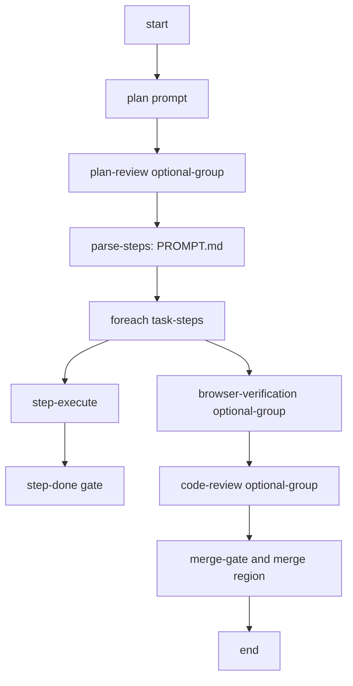

# feat: Add final-review stepwise workflow and fix workflow selection

## Goal Capsule

| Field | Value |
|---|---|
| Objective | Make default Coding use stepwise execution with default-on optional Plan Review before execution and default-on optional Code Review at the end, keep the original monolithic graph as Legacy coding, rename old Stepwise coding to Coding (per-step review), and fix workflow selection so new tasks actually attach to selected built-ins such as Coding (per-step review) and Compound engineering. |
| Authority | User requests in this session: "create a built in stepwise coding version that doesn't review each step but just does a review of everything at the end"; "in the new default stepwise the plan review should be an optional step also like code review"; "make sure plan review is also an optional step before a task moves from plan to execution"; "plan review should be default on"; "per step coding should get plan review also"; "creating a new task in stepwise coding don't attach it to the workflow. it goes to the default coding built in workflow"; "and the compound engineering workflow doesn't work." |
| Execution profile | Standard code change across `@fusion/core`, dashboard task creation surfaces/routes, docs, and focused tests. |
| Stop conditions | Do not change existing `builtin:stepwise-coding` per-step review semantics; do not mask workflow selection bugs by only changing display labels; do not alter runtime primitives unless validation proves a missing generic capability. |
| Tail ownership | Implementation should add focused core tests and run file-scoped verification, not the full suite. |

---

## Product Contract

### Summary

Fusion's default Coding workflow should use graph-owned step execution without the overhead of per-step AI review. The workflow should preserve the stepwise execution model (`PROMPT.md` parsing plus one-step-at-a-time execution), run a default-on optional Plan Review before moving from planning to execution, and run exactly one end-of-work review surface through the default-on optional Code Review gate. The original monolithic coding graph should remain available as Legacy coding, and the old per-step-review Stepwise workflow should display as Coding (per-step review) while also gaining the same default-on optional Plan Review before execution.

Workflow selection must also be reliable. When an operator creates a task from a workflow lane or picker, the selected workflow must persist onto the task's `task_workflow_selection` row and govern execution. The reported failures are that creating a new task in Stepwise coding falls back to `builtin:coding`, and the Compound engineering workflow does not work. Those are selection/materialization bugs, not just labeling issues.

### Problem Frame

`builtin:stepwise-coding` currently demonstrates step inversion by parsing `PROMPT.md`, iterating through `Task.steps[]`, running each step, and routing each step through `step-review` with approve/revise/rethink outcomes. That remains useful when every step needs independent review. It now also needs the same default-on optional Plan Review gate before execution as the new default Coding workflow.

The default `builtin:coding` already performs a whole-task execution seam followed by optional pre-merge gates and final review, but it does not expose per-step execution as authored workflow graph structure. The requested variant fills the middle: graph-owned step execution, default-on optional plan review before execution, no per-step review, and a single optional code review gate after the full implementation.

During initial investigation, the store-level explicit/default workflow paths already have tests for default `builtin:stepwise-coding` selection seeding. That makes the likely failure surface the dashboard create-task path: the UI may display a selected lane while submitting `workflowId` as `undefined`, or it may submit optional-step state in a way that suppresses `input.workflowId` in `TaskStore.createTask`. Compound engineering adds another dimension because it is plugin-gated (`fusion-plugin-compound-engineering`) and can fail either at visibility/selection time or at runtime if the required bundled plugin/skills are unavailable.

### Requirements

- R1. `builtin:coding` uses the Stepwise-derived final-review graph and remains the default coding workflow/fallback.
- R2. The new workflow preserves stepwise planning and execution: planning produces `PROMPT.md`, a `parse-steps` node parses it, and a `foreach(source:"task-steps")` region runs one `step-execute` node per planned step.
- R3. The new workflow must not include a `step-review` node in the foreach template and must not include per-step revise/rethink routing.
- R4. `builtin:coding` and `builtin:stepwise-coding` include a `plan-review` optional group between `plan` and `parse-steps`; it is default-on and toggleable per task.
- R5. After all planned steps complete, `builtin:coding` runs the same pre-merge optional groups as the coding built-ins: `browser-verification` default off and `code-review` default on.
- R6. `builtin:coding` has no mandatory final `review` seam; the end-of-work review is controlled by the `code-review` optional group, and success/disabled pass-through routes to the merge gate.
- R7. The existing `builtin:stepwise-coding` graph keeps per-step review and rework for users who rely on that behavior, gains the default-on optional Plan Review before execution, and its user-facing name becomes Coding (per-step review).
- R8. The original monolithic coding graph remains selectable as `builtin:legacy-coding` with user-facing name Legacy coding.
- R9. Creating a task while Coding (per-step review) is selected must persist `workflowId: "builtin:stepwise-coding"` and not silently resolve the task to `builtin:coding`.
- R10. Creating a task while Compound engineering is selected must either persist `workflowId: "builtin:compound-engineering"` and execute that workflow, or clearly block selection/create with a plugin-gating explanation when the required plugin is unavailable. It must not silently fall back to `builtin:coding`.
- R11. Task creation surfaces must preserve the distinction between `workflowId: undefined` (inherit project default), `workflowId: null` (explicit no workflow), and `workflowId: string` (explicit selected workflow).
- R12. Explicit enabled optional steps must not accidentally suppress an explicit workflow selection unless the caller intentionally opts into trusted low-level behavior. User-facing create flows must be able to submit both the selected workflow and enabled optional-group IDs.
- R13. Board workflow lane task creation, global New Task modal creation, list view creation, quick-entry creation, planning/subtask/mission task creation, and agent/tool-created tasks must be enumerated and tested according to the workflow selection contract.

### Scope Boundaries

- In scope: a Stepwise-derived default Coding IR module, built-in registry/export updates, docs catalog updates, and tests that prove default Coding has Plan Review before execution, no per-step review node, no mandatory final review seam, and only optional Code Review at the end.
- In scope: diagnose and fix create-time workflow selection loss for Stepwise coding and Compound engineering across dashboard/API/store boundaries.
- In scope: add regression coverage proving selected workflow IDs are persisted, returned, and used to resolve the task workflow IR.
- Out of scope: runtime changes to `WorkflowGraphExecutor`, per-step parallelization, new reviewer verdict semantics, dashboard redesign, or changes to `builtin:coding` / `builtin:stepwise-coding` behavior.
- Out of scope: removing the default-on pre-merge `code-review` optional group. The request removes per-step review and the mandatory final review seam from default Coding; the whole-task pre-merge code review remains the "review of everything at the end" gate.
- Out of scope: redesigning plugin installation. This plan may add a clearer gating/error path for Compound engineering, but it should not rebuild the plugin manager.

### Acceptance Examples

- AE1. Given a task selects `builtin:coding`, when workflow selection resolves, then the built-in registry returns a v2 IR with `plan-review`, `parse-steps`, `foreach`, `browser-verification`, `code-review`, and merge nodes, and no `review` seam node.
- AE2. Given the `builtin:coding` IR, when its foreach template is inspected, then it contains `step-execute` and a pass-through exit node, but no `step-review`.
- AE3. Given optional-step defaults are resolved for `builtin:coding`, then `plan-review` and `code-review` are seeded by default and `browser-verification` is not.
- AE3b. Given optional-step defaults are resolved for `builtin:stepwise-coding`, then `plan-review` and `code-review` are seeded by default and `browser-verification` is not.
- AE4. Given docs list built-in workflows, then `builtin:coding`, `builtin:legacy-coding`, and `builtin:stepwise-coding` are documented as distinct selectable workflows with their actual graph shapes.
- AE5. Given the board/list workflow selector is set to Stepwise coding, when a new task is created from that workflow context, then `store.getTaskWorkflowSelection(task.id)?.workflowId` is `builtin:stepwise-coding`.
- AE6. Given the board/list workflow selector is set to Compound engineering and the required plugin is available/enabled, when a new task is created from that workflow context, then `store.getTaskWorkflowSelection(task.id)?.workflowId` is `builtin:compound-engineering`.
- AE7. Given Compound engineering is unavailable because `fusion-plugin-compound-engineering` is not installed/enabled, when a user tries to create/select a Compound engineering task, then the UI/API reports the plugin requirement instead of creating a default coding task.
- AE8. Given a user toggles optional steps while selecting a non-default workflow, when the task is created, then the selected workflow persists and the enabled optional-group IDs reflect the user's toggles.

### Symptom Verification

- **Original symptom 1:** Creating a new task from/with Stepwise coding selected attaches the task to default `builtin:coding` instead of `builtin:stepwise-coding`.
- **Exact reproduction 1:** In a project with built-in workflows enabled, select Stepwise coding in a task creation surface, create a task, then inspect `GET /api/tasks/:id/workflow` or `TaskStore.getTaskWorkflowSelection(task.id)`.
- **Assertion it is gone 1:** The created task's workflow selection row has `workflowId: "builtin:stepwise-coding"` and `enabledWorkflowSteps` is seeded according to that workflow (`["plan-review", "code-review"]` by default).
- **Original symptom 2:** Compound engineering workflow "doesn't work".
- **Exact reproduction 2:** Select/create a task with `workflowId: "builtin:compound-engineering"` through the same surfaces and inspect both selection persistence and the first workflow resolution/execution failure.
- **Assertion it is gone 2:** With the CE plugin available/enabled, the task persists `workflowId: "builtin:compound-engineering"` and resolves to the CE IR; without the plugin, creation/selection fails visibly with the required plugin ID rather than silently falling back.

### Surface Enumeration

- **Create surfaces:** New Task modal (`packages/dashboard/app/components/NewTaskModal.tsx`), TaskForm workflow picker (`packages/dashboard/app/components/TaskForm.tsx`), board/list workflow lane quick create (`packages/dashboard/app/components/Column.tsx`, `packages/dashboard/app/components/QuickEntryBox.tsx`, `packages/dashboard/app/components/ListView.tsx`), mission triage (`packages/dashboard/app/components/MissionManager.tsx` and `packages/dashboard/src/mission-routes.ts`), planning/subtask routes (`packages/dashboard/src/routes/register-planning-subtask-routes.ts`), and agent/API creation (`packages/dashboard/src/routes/register-task-workflow-routes.ts`, `packages/engine/src/agent-tools.ts`).
- **Workflow IDs:** `builtin:coding`, `builtin:legacy-coding`, `builtin:stepwise-coding`, `builtin:compound-engineering`, custom workflow IDs, `null` no-workflow, and `undefined` inherit-default.
- **Plugin states:** Compound engineering plugin installed/enabled, installed/disabled, unavailable, and bundled path resolution failure.
- **Optional-step states:** `enabledWorkflowSteps` omitted, empty array, default-on only, custom toggled values, and explicit values combined with non-default workflow ID.
- **Board states:** task starts in default `triage`/workflow intake column, workflow-specific custom columns, and workflow lane selected independently from project default.
- **Breakpoints/surfaces:** desktop and mobile New Task / inline-create affordances, since workflow selection must not be display-only on one viewport.

---

## Planning Contract

### Key Technical Decisions

- KTD-1. Make `builtin:coding` the Stepwise-derived final-review workflow and preserve the old graphs under explicit names.
  The default Coding ID is the resolver fallback, so mapping it to the Stepwise-derived final-review graph makes new ordinary coding tasks use the requested workflow. The original monolithic graph remains available as `builtin:legacy-coding`, while `builtin:stepwise-coding` keeps its graph behavior and displays as Coding (per-step review).

- KTD-2. Model step completion as `step-execute -> step-done` inside the foreach template.
  The existing stepwise workflow uses `step-review` as the authority that marks a step done. Without per-step review, the foreach template should let `step-execute` complete the step through the existing step-execution primitive. The template still needs a single exit, so use a config-less `gate` node as the pass-through sink, mirroring the existing `step-done` pattern.

- KTD-3. Make Plan Review a default-on optional gate before execution in both stepwise-style coding workflows.
  `plan-review` belongs between `plan` and `parse-steps`, so the plan can be reviewed before planned steps are parsed into executable work. It is default-on and task-toggleable like `code-review`.

- KTD-4. Make default Coding's end review controlled only by the optional Code Review gate.
  The new default workflow keeps `browser-verification`, `code-review`, and the merge region after the foreach, but removes the mandatory final `review` seam. This satisfies the requested "review of everything at the end" while letting the operator turn it off via the `code-review` optional step.

- KTD-5. Register as a normal selectable built-in.
  Add the new workflow to `BUILTIN_WORKFLOWS` with `kind: "workflow"` and let `defaultEnabledBuiltinWorkflowIds()` include it by default, matching non-plugin-gated selectable built-ins.

- KTD-6. Focus verification on IR shape and registry behavior.
  This is primarily a built-in graph definition change. Targeted tests should validate parse/round-trip, registry presence, non-compilable built-in classification, optional-group defaults, docs-adjacent catalog expectations, and the exact absence of `step-review`.

- KTD-7. Fix workflow selection at the boundary where intent is lost.
  Store-level explicit workflow creation already records `task_workflow_selection` for built-ins, including Stepwise coding, when `workflowId` reaches `TaskStore.createTask` and `enabledWorkflowSteps` is omitted. The implementation must prove whether the lost value happens in the UI submit payload, API normalization, duplicate-reconcile response, or store precedence rule. The fix should be at that boundary, not by changing resolver fallback behavior.

- KTD-8. User-facing create flows must support workflow ID plus optional-step toggles together.
  Current store logic intentionally treats explicit `enabledWorkflowSteps` as a trusted override that can suppress `input.workflowId`. That is dangerous for UI create flows because the workflow picker and optional-step toggles are independent controls. Either the UI/API must omit `enabledWorkflowSteps` unless the user explicitly changed them, or the store/API must preserve `workflowId` while applying explicit optional IDs for that selected workflow. The chosen fix must keep low-level backward compatibility explicit and tested.

- KTD-9. Compound engineering must fail closed on missing plugin requirements.
  `builtin:compound-engineering` is plugin-gated by `fusion-plugin-compound-engineering`. A missing plugin should prevent selection/execution with a visible requirement, not degrade into default coding. Tests should cover both the persistence path and plugin-gated availability semantics.

### High-Level Technical Design

### Existing Patterns To Follow

- `packages/core/src/builtin-stepwise-coding-workflow-ir.ts` for columns, artifacts, parse/foreach structure, optional groups, and merge region.
- `packages/core/src/builtin-coding-workflow-ir.ts` for the standard post-execute optional-group and review/merge suffix.
- `packages/core/src/builtin-workflows.ts` for built-in registry metadata, layouts, and stable timestamp conventions.
- `packages/core/src/__tests__/builtin-workflows.test.ts` for registry and selectable built-in assertions.
- `packages/core/src/__tests__/workflow-optional-steps.test.ts` and `packages/core/src/__tests__/builtin-code-review-group.test.ts` for optional-group default behavior.
- `docs/workflow-steps.md` and `docs/workflow-editor.md` for built-in catalog descriptions.

### Assumptions

- The existing `step-execute` primitive marks the active step done on success when no `step-review` node is present. This is documented in `packages/engine/src/step-runner.ts` and should be confirmed with a focused graph test if implementation exposes uncertainty.
- The Stepwise-derived graph is implemented as a reusable IR module but registered under `builtin:coding`; the original monolithic graph is registered as `builtin:legacy-coding`.
- `plan-review` and `code-review` are default-on optional groups for `builtin:coding` and `builtin:stepwise-coding`; `browser-verification` remains default-off.
- Pre-merge `code-review` is the only final whole-task review gate in default Coding.

### Sequencing

1. Diagnose workflow selection loss with a failing test that reproduces Stepwise task creation through the affected UI/API path.
2. Fix the selection boundary and add Compound engineering plugin-gating regression coverage.
3. Add and export the new built-in IR.
4. Register it in `BUILTIN_WORKFLOWS` with layout and description.
5. Extend tests for registry, optional defaults, and IR shape.
6. Add the new workflow to the now-fixed create/selection matrix.
7. Update docs catalog and built-in workflow descriptions.
8. Add the changeset and run targeted verification.

---

## Implementation Units

### U1. Add the stepwise-final-review default Coding IR

- **Goal:** Create a Stepwise-derived default Coding IR that is registered under `builtin:coding`, mirrors `builtin:stepwise-coding` through planning/Plan Review/parse/foreach, omits per-step `step-review`, and routes the final optional Code Review directly to merge.
- **Requirements:** R1, R2, R3, R4, R5, R6
- **Files:**
  - Create `packages/core/src/builtin-stepwise-final-review-coding-workflow-ir.ts`
  - Modify `packages/core/src/index.ts`
- **Approach:** Derive from the stable lifecycle skeleton in `packages/core/src/builtin-stepwise-coding-workflow-ir.ts`: same columns, `PROMPT.md` artifact declaration, planning/plan-review/parse/foreach, optional groups, merge region, and settings. Inside the foreach template, include only `step-execute` and `step-done` with a success edge. Remove per-step `step-review`, `outcome:revise`, `outcome:rethink`, rework-hold routing, and the mandatory final `review` seam. Register the derived IR as `builtin:coding`, not as a separate selectable workflow ID.
- **FNXC comment requirement:** Add or update a concise FNXC comment in the new IR file explaining that this built-in exists because operators need graph-owned step execution with one whole-task review at the end rather than per-step review.
- **Test Scenarios:**
  - The IR parses and round-trips.
  - The top-level graph contains `plan-review`, `parse-steps`, `foreach`, `browser-verification`, `code-review`, and merge nodes, with no mandatory final `review` node.
  - The foreach template contains `step-execute` and `step-done`.
  - The foreach template contains no `step-review`.
  - No template edge carries `kind: "rework"`.
- **Verification:** Add assertions in `packages/core/src/__tests__/builtin-coding-workflow-ir.test.ts` or a new focused `packages/core/src/__tests__/builtin-stepwise-final-review-coding-workflow-ir.test.ts`.

### U2. Register and expose the new built-in workflow

- **Goal:** Make the new default Coding graph discoverable through the existing `builtin:coding` registry entry and package exports.
- **Requirements:** R1, R6, R7
- **Files:**
  - Modify `packages/core/src/builtin-workflows.ts`
  - Modify `packages/core/src/index.ts`
  - Possibly modify `packages/core/src/types.ts` if the enabled built-in IDs type or docs list is closed over explicit IDs.
- **Approach:** Import the derived IR, point the existing `builtin:coding` `BUILTIN_WORKFLOWS` entry at it, preserve the old monolithic IR as `builtin:legacy-coding`, and provide layouts that include the real node sets for default Coding and Coding (per-step review). Update tests or type-level inventories that enumerate selectable built-ins.
- **Test Scenarios:**
  - `getBuiltinWorkflow("builtin:coding")` returns the derived Stepwise default Coding IR.
  - `getBuiltinWorkflow("builtin:legacy-coding")` returns the old monolithic coding IR.
  - `NON_COMPILABLE_BUILTIN_IDS` includes `builtin:coding` and `builtin:stepwise-coding` because the graphs use interpreter-only node kinds.
  - Built-in registry tests distinguish existing `builtin:stepwise-coding` as per-step-review and default `builtin:coding` as final-code-review-only.
- **Verification:** Extend `packages/core/src/__tests__/builtin-workflows.test.ts`.

### U3. Preserve optional-gate behavior for the new workflow

- **Goal:** Ensure the default Coding and Coding (per-step review) workflows expose the required optional gates.
- **Requirements:** R4, R5, R7, AE3
- **Files:**
  - Modify `packages/core/src/__tests__/workflow-optional-steps.test.ts`
  - Modify `packages/core/src/__tests__/builtin-code-review-group.test.ts`
  - Modify `packages/core/src/__tests__/builtin-coding-workflow-ir.test.ts` if it asserts "both coding built-ins"
- **Approach:** Expand test matrices so default Coding and Coding (per-step review) both include default-on `plan-review`, default-off `browser-verification`, and default-on `code-review`, while Legacy coding continues to expose its original optional browser/code review gates.
- **Test Scenarios:**
  - `resolveWorkflowOptionalSteps(newIr)` returns plan review default on, browser verification default off, and code review default on.
  - `resolveDefaultOnOptionalGroupIds(newIr)` returns `["plan-review", "code-review"]`.
  - The default Coding workflow routes `browser-verification -> code-review -> merge-gate`.
  - Coding (per-step review) routes `browser-verification -> code-review -> review`.
  - Code review failure routes to `end` as in the other coding built-ins.
- **Verification:** Run focused core tests listed in the Verification Contract.

### U4. Update operator-facing docs

- **Goal:** Document the new built-in so users understand when to choose it instead of `builtin:coding` or `builtin:stepwise-coding`.
- **Requirements:** R7, AE4
- **Files:**
  - Modify `docs/workflow-steps.md`
  - Modify `docs/workflow-editor.md`
  - Modify `docs/getting-started.md`
- **Approach:** Add a catalog row and short runtime note. Phrase the difference plainly: `Stepwise coding` reviews each step; the new workflow executes steps one by one and reviews the full result at the end.
- **Test Scenarios:**
  - Existing docs inventory tests, if any, still pass.
  - Docs mention the new workflow ID exactly once in the built-in catalog and use consistent naming elsewhere.
- **Verification:** Run any focused docs/lazy inventory test only if affected by the docs change; otherwise rely on core tests plus markdown review.

### U5. Add a changeset

- **Goal:** Record the new published CLI/operator-visible built-in workflow for `@runfusion/fusion`.
- **Requirements:** R1, R7
- **Files:**
  - Create `.changeset/<descriptive-name>.md`
- **Approach:** This affects published `@runfusion/fusion`, so add a minor changeset with the required labeled body format.
- **Test Scenarios:**
  - Changeset body passes `pnpm check:changesets` format expectations.
- **Verification:** Include the changeset in review; run `pnpm check:changesets` if available and fast enough for the focused pass.

### U6. Reproduce and fix Stepwise coding create-task selection loss

- **Goal:** Ensure a task created while Stepwise coding is selected persists `builtin:stepwise-coding` instead of falling back to `builtin:coding`.
- **Requirements:** R8, R10, R11, R12, AE5, AE8
- **Files:**
  - Modify `packages/dashboard/app/components/TaskForm.tsx`
  - Modify `packages/dashboard/app/components/NewTaskModal.tsx`
  - Modify `packages/dashboard/app/components/Board.tsx`
  - Modify `packages/dashboard/app/components/Column.tsx`
  - Modify `packages/dashboard/app/components/ListView.tsx`
  - Modify `packages/dashboard/app/components/QuickEntryBox.tsx`
  - Modify `packages/dashboard/src/routes/register-task-workflow-routes.ts` if payload normalization is the loss boundary
  - Modify `packages/core/src/store.ts` only if the root cause is the `workflowId` + `enabledWorkflowSteps` precedence rule
  - Add/update tests in `packages/dashboard/app/components/__tests__/TaskForm.test.tsx`, `packages/dashboard/app/components/__tests__/NewTaskModal.test.tsx`, `packages/dashboard/app/components/__tests__/ListView.test.tsx`, `packages/dashboard/app/components/__tests__/QuickEntryBox.test.tsx`, `packages/dashboard/app/components/__tests__/board-quickcreate-workflow-lane-visibility.test.tsx`, `packages/dashboard/app/__tests__/api-tasks.test.ts`, `packages/dashboard/src/routes/__tests__/task-create-workflow-route.test.ts`, and/or `packages/core/src/__tests__/builtin-workflows.test.ts` depending on the confirmed loss boundary
- **Approach:** Start with a failing test that simulates selecting `builtin:stepwise-coding` in the same create surface the user used. Assert the request payload includes `workflowId: "builtin:stepwise-coding"` and the created task selection resolves to that workflow. Trace whether `selectedWorkflowId` is `undefined` despite the visible workflow label, whether `enabledWorkflowSteps` is always sent and suppresses `workflowId`, or whether the API response drops the workflow metadata and causes a client-side reclassification.
- **FNXC comment requirement:** Add/update FNXC comments at the fixed boundary explaining that visible workflow lane selection is user intent and must persist as `workflowId`, while optional-group toggles are a separate control.
- **Test Scenarios:**
  - New Task modal selecting Stepwise coding submits `workflowId: "builtin:stepwise-coding"`.
  - Board/list workflow lane create submits the lane workflow ID, not the project default.
  - Optional-step toggles do not erase the selected workflow.
  - `workflowId: undefined`, `null`, and string each preserve their distinct meanings.
- **Verification:** Run focused dashboard/core tests for the changed create surface and store selection behavior.

### U7. Reproduce and fix Compound engineering workflow create/selection failure

- **Goal:** Make Compound engineering workflow selection either work end-to-end when the required plugin is available or fail visibly when unavailable.
- **Requirements:** R9, R10, R12, AE6, AE7
- **Files:**
  - Modify `packages/core/src/builtin-workflows.ts` only if plugin-gated metadata is incomplete
  - Modify `packages/dashboard/src/routes/register-workflow-routes.ts` if task workflow selection should reject unavailable plugin-gated built-ins
  - Modify `packages/dashboard/src/routes/register-task-workflow-routes.ts` if task creation accepts unavailable plugin-gated workflows silently
  - Modify dashboard picker components if disabled/gated built-ins are shown as selectable without explanation
  - Add/update tests in `packages/core/src/__tests__/builtin-workflows.test.ts`, `packages/dashboard/src/routes/__tests__/task-create-workflow-route.test.ts`, `packages/dashboard/src/routes/__tests__/workflow-design-route.test.ts`, or a new focused route test if neither existing file owns the confirmed failure boundary
- **Approach:** First define "doesn't work" mechanically by reproducing whether CE fails at list visibility, create payload, selection persistence, workflow resolution, skill loading, or plugin runtime. Use the existing plugin-gated map (`PLUGIN_GATED_BUILTIN_WORKFLOWS`) as the source of truth. If unavailable CE workflows are currently selectable, either filter/disable them with a visible required-plugin reason or reject create/select requests with a 4xx that names `fusion-plugin-compound-engineering`. If the plugin is available but execution fails, trace skill loading through `FUSION_CE_SKILLS_DIR` and the CE skill-backed workflow nodes.
- **FNXC comment requirement:** Add/update FNXC comments where CE plugin gating is enforced, explaining that plugin-gated built-ins must not silently degrade to coding because that hides operator workflow intent.
- **Test Scenarios:**
  - With CE plugin available/enabled, create/select persists `builtin:compound-engineering`.
  - With CE plugin unavailable, create/select returns a clear client error or disabled option naming `fusion-plugin-compound-engineering`.
  - CE workflow resolution does not fall back to `builtin:coding` after explicit selection.
  - Skill-backed CE nodes still request CE skills by both namespaced and bare forms.
- **Verification:** Run focused core/route tests for CE gating and selection.

### U8. Add the new default Coding workflow to the fixed creation matrix

- **Goal:** Ensure the new default Stepwise-derived Coding workflow benefits from the same fixed creation path and appears in workflow selectors.
- **Requirements:** R1, R7, R10, R11, R12
- **Files:**
  - Modify the tests added in U2, U3, U6, and U7 to include the new workflow ID once U1/U2 create it
- **Approach:** After the selection bug is fixed for existing Stepwise and Compound engineering workflows, include the new default Coding workflow in the same create/select matrix so future built-ins do not regress.
- **Test Scenarios:**
  - Creating a task with the new workflow selected persists the new workflow ID.
  - Optional-step defaults seed `code-review` and do not erase the selected workflow.
- **Verification:** Covered by the focused create/selection tests.

---

## Verification Contract

| Scope | Command | Proves |
|---|---|---|
| Built-in registry and IR shape | `pnpm --filter @fusion/core exec vitest run src/__tests__/builtin-workflows.test.ts src/__tests__/builtin-coding-workflow-ir.test.ts --silent=passed-only --reporter=dot` | New workflow registers, parses, round-trips, has Plan Review before execution, and has no per-step or mandatory final review in default Coding. |
| Optional groups | `pnpm --filter @fusion/core exec vitest run src/__tests__/workflow-optional-steps.test.ts src/__tests__/builtin-code-review-group.test.ts --silent=passed-only --reporter=dot` | Browser verification and code review defaults/wiring match other coding built-ins. |
| Stepwise create regression | `pnpm --filter @fusion/dashboard exec vitest run app/components/__tests__/TaskForm.test.tsx app/components/__tests__/NewTaskModal.test.tsx app/components/__tests__/ListView.test.tsx app/components/__tests__/QuickEntryBox.test.tsx app/components/__tests__/board-quickcreate-workflow-lane-visibility.test.tsx app/__tests__/api-tasks.test.ts src/routes/__tests__/task-create-workflow-route.test.ts --silent=passed-only --reporter=dot` | Selected workflow ID survives picker, quick-create, UI/task-create payload, and route boundaries and does not fall back to `builtin:coding`. |
| Store workflow selection | `pnpm --filter @fusion/core exec vitest run src/__tests__/builtin-workflows.test.ts --silent=passed-only --reporter=dot` | `TaskStore.createTask` and reserved-ID creation persist explicit/default workflow selections correctly. |
| Compound engineering gating | `pnpm --filter @fusion/dashboard exec vitest run src/routes/__tests__/task-create-workflow-route.test.ts src/routes/__tests__/workflow-design-route.test.ts --silent=passed-only --reporter=dot` | Plugin-gated CE create/select works when available and fails visibly when unavailable. If implementation creates a more focused route test, run that file instead of the broader existing route-design file. |
| Changeset format | `pnpm check:changesets` | Published package changeset uses required labeled fields. |
| Type safety if exports/types changed | `pnpm --filter @fusion/core typecheck` | New exports and registry changes typecheck in core. |

Do not run `pnpm test:full` or `pnpm verify:workspace` for this scoped change. Use the merge gate later if the branch is being prepared for merge.

---

## Definition of Done

- The new workflow is available from `getBuiltinWorkflow` under a stable `builtin:` ID.
- The new workflow executes planned steps through `parse-steps` and `foreach` without any `step-review` node.
- The new workflow keeps browser verification, code review, and merge behavior aligned with existing coding built-ins while removing the mandatory final review seam from default Coding.
- Existing `builtin:stepwise-coding` behavior and tests remain intact.
- Creating a task from Stepwise coding persists `builtin:stepwise-coding` and never silently falls back to `builtin:coding`.
- Creating/selecting Compound engineering either persists `builtin:compound-engineering` when available or gives a clear plugin-gating error when unavailable.
- Workflow creation tests cover UI/API/store surfaces where workflow intent can be lost.
- Docs describe the distinction between per-step-review stepwise coding and default Coding's final-code-review-only path.
- A valid changeset exists for `@runfusion/fusion`.
- Focused tests in the Verification Contract pass.
