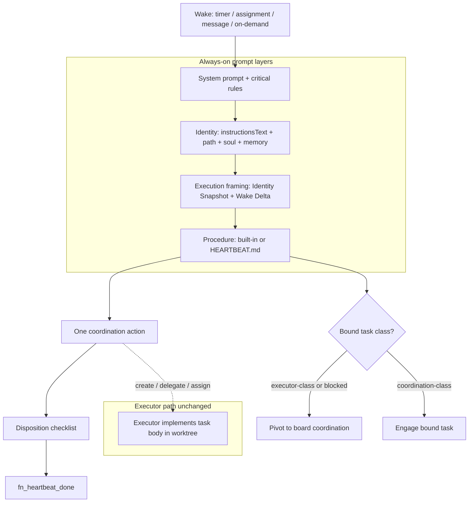
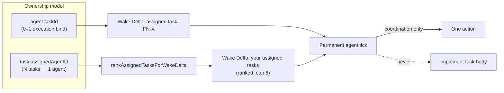

# Permanent Agent Heartbeat and Standing Instructions Hardening

## Summary

Harden permanent-agent operating law without changing Fusion’s heartbeat/executor split: ship a stronger always-on procedure and system-prompt contract (disposition, blocked dedup, critical rules, scoped-wake, progress style, checkout no-retry), seed structured standing-instruction templates for new agents only, improve multi-task visibility in Wake Delta, and document playbooks + CONCEPTS so operators and implementers share one model.

---

## Main refresh notes (2026-07-13)

`feature/better-agent-instructions` was fast-forwarded to `origin/main` at `8e4514e58`. Plan paths and tests were re-audited against that tip. **Product intent of U1–U7 is unchanged.** Implementation file pointers below supersede earlier paths when they conflict.

| Area | Change on main | Plan impact |
|---|---|---|
| Storage | SQLite → PostgreSQL cutover (#1793 and follow-ups) | Still use `TaskStore` facade APIs (`getTasksByAssignedAgent`, `selectNextTaskForAgent`). Impl bodies live under `packages/core/src/task-store/`. Prefer facade in engine code; touch impl files only if ranking helpers need colocation. |
| Heartbeat prompt tests | `heartbeat-session-prompt.test.ts` **removed** | FN-5053 / system-prompt / no-task tool alignment lives in `packages/engine/src/__tests__/heartbeat-executor.test.ts` (~2950+). U1/U2 tests extend **that** file + procedure snapshots. |
| Ranking APIs | Facades in `store.ts`; impls split out | `getTasksByAssignedAgentImpl` → `packages/core/src/task-store/remaining-ops-6.ts`; `selectNextTaskForAgentImpl` → `packages/core/src/task-store/branch-group-ops.ts`. Pure Wake Delta ranker still recommended as new module (not necessarily inside those ops files). |
| Heartbeat ops | FN-7939 timer-audit supervision; FN-7878/error recovery hardening | Do not fight timer/zombie supervision. U1–U5 stay in prompt/Wake Delta/procedure text + conflict coverage. |
| Multi-assign still missing | Wake Delta still singular `- assigned task:` | U5 still required; no preemption by main. |
| Procedure snapshots | Still `agent-heartbeat-procedures.test.ts` + `.snap` | Unchanged approach for U2. |
| Gap-analysis doc | Local delete of `docs/agent-paperclip-gap-analysis.md` + README row (uncommitted WIP on this branch) | Orthogonal cleanup; keep deleted; not part of U1–U7 product scope. |

**Implementer rule after refresh:** run file-scoped tests under current names only. Do not reintroduce `heartbeat-session-prompt.test.ts`.

---

## Problem Frame

Permanent agents already wake on timers, assignment, messages, and on-demand runs with identity + procedure injection. In practice, ticks still thrash (re-commenting blockers, vague exits, weak multi-task pick visibility), standing instructions are freeform and uneven across presets, and existing per-agent `HEARTBEAT.md` files freeze old procedure text because upgrade does not overwrite. Operator docs describe composition well but lack worked playbooks and accurate upgrade semantics.

The goal is not to make heartbeats into coding sessions. Task-body work stays on the executor path. The goal is **reliable coordination ticks**: clear ownership discipline, one concrete action, durable handoff, and consistent identity structure for new permanent agents.

---

## Requirements

- **R1.** Default task-scoped and no-task heartbeat procedures (`strict` at minimum) include a final disposition checklist before `fn_heartbeat_done`.
- **R2.** Procedures and/or system prompts include blocked-task dedup guidance (no re-chase when blocker context is unchanged).
- **R3.** A compact critical-rules block exists in system prompts (survives custom `HEARTBEAT.md`) and is reinforced in default procedure text.
- **R4.** Scoped-wake fast path: message/comment/`task_assigned` wakes prioritize that signal and skip ambient board thrash when a single clear action is available.
- **R5.** Progress note style guidance for `fn_task_log` / ambient persist tools (status line + done / remaining / next owner + task ids).
- **R6.** Checkout/claim conflict no-retry language is agent-visible; existing engine exit on `checkout_conflict` remains the authority.
- **R7.** New permanent agents can be created with a six-section standing instructions skeleton (Description, Expertise, Priorities, Boundaries, Communication, Collaboration & Escalation) without migrating existing agents.
- **R8.** Custom blank create prefill and empty-state “insert template” do not overwrite non-empty instructions.
- **R9.** Heartbeat/executor separation remains: no procedure text directs coding/tests/commits from heartbeat under default strict discipline.
- **R10.** No-task procedures never reference task-only tools (`fn_task_log`, task documents) — FN-5053 remains green.
- **R11.** Operator docs gain worked playbooks and CONCEPTS glossary entries; `docs/agents.md` upgrade wording matches create-if-missing seed behavior (or product changes upgrade to force re-seed with explicit operator action).
- **R12.** Phase-1 engine: Wake Delta can surface a compact ranked multi-assignment list for agents with multiple `assignedAgentId` rows (reuse inbox ranking / store helpers; no second claim system).

---

## Key Technical Decisions

1. **Keep coordination default; do not fold executor work into heartbeat.** Rationale: worktree/executor/reviewer/merge pipeline is Fusion’s implementation path; heartbeats remain ambient control.

2. **Dual placement for critical rules: system prompt + default procedure.** Rationale: custom `HEARTBEAT.md` fully replaces procedure text on task-scoped runs; system prompts still load. Critical safety language must survive operator-edited procedure files.

3. **Prefer procedure constants as source of truth; seed `HEARTBEAT.md` is create-if-missing.** Rationale: mode variants (strict/lite/off, task/no-task) are code-selected; snapshot tests pin constants. Do not silently overwrite operator-edited files. Optional force re-seed is a separate product action with explicit UI label.

4. **Standing instructions template seeds `instructionsText`, not a new default file and not `HEARTBEAT.md`.** Rationale: all 20 presets, onboarding, and interview already use inline instructions; engine concatenates opaque markdown.

5. **Template lives in dashboard agent-presets first.** Rationale: create/edit/onboarding surfaces are dashboard-owned; core/engine need no schema change for v1.

6. **Multi-task visibility is Wake Delta injection only in U5; assignee-filtered tools stay deferred.** Rationale: multi-assign is needed at procedure pick time before agents reliably call tools. `getTasksByAssignedAgent` already exists. `fn_task_list({ assignedTo: "me" })` only if mid-run re-query is proven later.

7. **Multi-assign membership is `assignedAgentId === me`, not lease-owned only.** Lease is an annotation (`held-by-other`), not the membership filter. Checkout is an execution lease often absent on `todo`; lease-only would hide most multi-assign backlog.

8. **Multi-assign cap is fixed at 8 with `+N more`; no per-agent setting in U5.** Rationale: between auto-claim default density (5) and max (10); owned tasks are higher-signal than optional pickup candidates.

9. **Ranked multi-assign lines follow inbox actionability; fully unactionable blocked are count-only.** Align with `selectNextTaskForAgent`: titled lines for `in_progress`, ready `todo`, partially blocked. Fully blocked / pure wait → aggregate count line only (avoids re-chase thrash). Optional later: include `in-review`/`triage` as low-rank titled rows if operators need them.

10. **Multi-assign list is coordination inventory, not an implement-from-heartbeat queue.** Header framing + U1/U2 pivot law required. Bound task line stays singular; list marks `(bound)` on the matching row.

11. **Multi-assign and auto-claim stay separate prompt sections with disjoint universes.** Auto-claim candidates require unassigned ready todos; multi-assign requires `assignedAgentId`. Never merge headers.

12. **Compact self-only fields in multi-assign rows.** `id`, column, rank tag, short title snippet (~60–80 chars), optional lease annotation. No PROMPT.md, comments, or other agents’ boards.

13. **Delivery order: U1+U2 before or same PR as U5.** List injection is code-independent of prompt law, but shipping multi-list without pivot/critical-rules regresses thrash.

14. **Blocked dedup is prompt-first.** Rationale: thrash is behavioral; store fingerprints only if production still re-chases after procedure ships.

15. **Do not auto-attach the published `fusion` skill to heartbeats.** Rationale: heartbeat skill policy has no role fallback; stuffing playbooks into `fusion` would hit operators, not permanent agents, and bloat every tick if forced.

16. **User-facing docs never name external control-plane competitors.** Rationale: product framing is Fusion-native permanent-agent quality.

17. **Existing agents: no silent instruction or HEARTBEAT rewrite.** Rationale: operator edits and production hearts must not regress on deploy.

18. **Prefer `getTasksByAssignedAgent` + pure rank helper over `listTasks` for Wake Delta.** Do not re-call `selectNextTaskForAgent` solely to build the multi-list (it full-board scans). Coarse dep tiering on assigned rows is acceptable for v1.

---

## High-Level Technical Design



**Layer responsibilities**

| Layer | Owns |
|---|---|
| System prompt | Invariants that survive custom HEARTBEAT.md |
| Procedure constants / seeded HEARTBEAT.md | Per-tick ritual (strict/lite/off) |
| Standing instructions | Role identity and operating orders |
| Wake Delta | Tick-local facts: wake reason, bound task, inbox, multi-assign list |
| Docs playbooks | Worked scenarios operators can cite; not every-tick injection |

**Procedure precedence (unchanged contract, documented clearly)**

1. No-task + custom file present → built-in **no-task** procedure (`default-no-task-override`)
2. Task-scoped + custom file loads → custom fully replaces built-in
3. Else → mode-selected built-in (`strict` / `lite` / `off`)

### U5 multi-assign / pick-work design (deepened)



**Cardinalities (implementer must not confuse these)**

| Field | Cardinality | Role |
|---|---|---|
| `task.assignedAgentId` | Many tasks → one agent | Durable ownership inventory |
| `agent.taskId` | 0–1 | Singular execution bind for this tick |

**Data source**

- Primary: `TaskStore.getTasksByAssignedAgent(agentId, { excludeArchived: true })` (facade: `packages/core/src/store.ts` → `getTasksByAssignedAgentImpl` in `packages/core/src/task-store/remaining-ops-6.ts`)
- Soft-deleted already excluded via `ACTIVE_TASKS_WHERE`
- **Do not** use `listTasks` full board just to render the list
- **Do not** re-call `selectNextTaskForAgent` only for list building (facade → `selectNextTaskForAgentImpl` in `packages/core/src/task-store/branch-group-ops.ts`; still full-board scan)

**Ranking / tiers (aligned with inbox, extended for visibility)**

Order within titled ranked lines (FIFO by `columnMovedAt ?? createdAt` within tier):

1. `in_progress` — `column === "in-progress"`, annotate `paused` if set
2. `ready_todo` — `todo`, not paused, deps empty or treat as ready when unresolved (v1 coarse); foreign checkout → annotate `lease: held-by-other`, still list but not “pick to claim”
3. `partial_blocked` — `todo` with deps and partial progress (v1: deps non-empty is enough coarse signal if full dep hydrate is expensive)
4. Optional low-rank titled: `in-review`, `triage` (product may omit in v1 and fold into count-only)
5. **Exclude from titled lines:** `done`, `archived`
6. **Count-only line:** fully unactionable blocked / pure wait / optionally paused-only piles — e.g. `also assigned not actionable now: N (fully blocked/paused)`

**Render format (authoritative sketch)**

```markdown
## Wake Delta
- source: timer
- wake reason: timer
- assigned task: FN-100
- your assigned tasks (coordination inventory — not an implement-from-heartbeat queue; ranked, 3 of 3):
  1. FN-100 [in_progress] (bound) Fix checkout lease renew
  2. FN-220 [ready_todo] Draft board hygiene follow-up
  3. FN-301 [partial_blocked] Wait on schema — lease: held-by-other
- also assigned not actionable now: 2 (fully blocked/paused)
- inbox snapshot: …
```

| Condition | Behavior |
|---|---|
| 0 open assigned after filters | Omit multi-list block entirely |
| ≥2 open assigned **or** ≥1 sibling besides bound | Show ranked list |
| Exactly 1 open assigned and it is bound | Optional one-line list or omit; prefer omit to reduce noise |
| Cap 8 with total > 8 | Show 8 lines + `(+N more assigned open tasks; do not auto-retry checkout/claim)` |
| No-task run but assigned rows exist | Keep `- assigned task: none` + multi-list (recovery visibility) |
| Auto-claim candidates also present | Separate header; never merge sections |

**checkout_conflict (independent of list)**

Path in `HeartbeatMonitor.executeHeartbeat` (`packages/engine/src/agent-heartbeat.ts`): bound task has `checkedOutBy` set and ≠ agent → `completeRun` with `resultJson.reason: "checkout_conflict"`, **before** session create. No Wake Delta that tick. U5 must add unit coverage; U1 supplies no-retry language for tool paths.

**Pure helper extract (recommended)**

- New: `packages/core/src/assigned-task-ranking.ts` exporting `rankAssignedTasksForWakeDelta(...)`
- Or private helpers colocated with heartbeat if export surface is undesirable
- Keep `selectNextTaskForAgent` behavior byte-compatible in the same PR unless sharing is free

**Mocks**

- `createMockTaskStore` must include `getTasksByAssignedAgent: vi.fn().mockResolvedValue([])` so existing heartbeat tests do not throw once the monitor starts calling it

**Known pre-existing drift (document in U5 / U6, do not necessarily fix in U5)**

- Inbox `assignTask` path may set `agent.taskId` without ensuring `task.assignedAgentId` consistency on every path. Multi-list makes drift visible; fix as follow-up if observed.

---

## Scope Boundaries

### In scope

- Engine procedure + system prompt text and tests/snapshots
- Optional Wake Delta multi-assign list + checkout_conflict coverage test
- Dashboard standing-instructions template constant, custom prefill, empty-state insert, optional preset restructure
- Onboarding interview prompt guidance to fill six sections
- Docs: playbooks, CONCEPTS, agents.md accuracy, README index
- i18n for new template button/placeholder strings (en + type defs; other locales follow project convention)

### Out of scope

- Making heartbeats implement task bodies by default
- Auto-loading repo root `AGENTS.md` into permanent agents
- Silent migration of existing `instructionsText` or `HEARTBEAT.md`
- Full budget hard-stop product (usage APIs already exist; policy thresholds are follow-up)
- New parallel claim/ownership ledger
- Expanding published `fusion` skill into permanent-agent runtime law
- Typed board interaction redesign beyond existing `fn_ask_question` guidance in prompts/docs

### Deferred to Follow-Up Work

- Force re-seed / overwrite `HEARTBEAT.md` with backup from upgrade button
- Store-level blocker fingerprint for blocked dedup
- `fn_task_list({ assignedTo: "me" })` or `fn_agent_inbox` tool
- Compact opt-in heartbeat skill via `metadata.skills`
- lite/off procedure parity for every new checklist line (strict is mandatory; lite/off get critical safety subset)
- Engine self-improve prompts preserving section headings

---

## Phased Delivery

| Phase | Theme | Units | Landability |
|---|---|---|---|
| **P0** | Always-on law (prompt) | U1, U2 | Single engine PR |
| **P1** | Standing identity template | U3, U4 | Dashboard PR (can parallel P0) |
| **P2** | Agent-visible pick work | U5 | Engine PR after P0 |
| **P3** | Docs + glossary | U6 | Docs PR anytime after P0 text settles |
| **P4** | Optional upgrade truth | U7 | Only if product wants force re-seed |

---

## Implementation Units

### U1. Harden heartbeat system prompts (critical rules, checkout, dedup, note style)

- **Goal:** Put durable operating law into `HEARTBEAT_SYSTEM_PROMPT` and `HEARTBEAT_NO_TASK_SYSTEM_PROMPT` so custom `HEARTBEAT.md` cannot erase it.
- **Requirements:** R2, R3, R5, R6, R9, R10
- **Dependencies:** none
- **Files:**
  - `packages/engine/src/agent-heartbeat.ts`
  - `packages/engine/src/__tests__/heartbeat-executor.test.ts` (system-prompt / FN-5053 / no-task tool alignment lives here after main refresh; former `heartbeat-session-prompt.test.ts` removed)
- **Approach:**
  - Add a short **Critical Rules** section (bullet list, ~8–12 lines) covering: one action; no implement-from-heartbeat; blocked dedup; no checkout/claim retry on conflict; no duplicate `fn_task_create` without scan; escalate via reports-to when stuck; prefer delegate/create over human for agent-capable work; progress notes structured; no-op must be explicit.
  - Reinforce existing no-pause-on-failure language in system prompts (still present as “Do NOT call fn_task_pause…” in `HEARTBEAT_SYSTEM_PROMPT` / no-task variant).
  - Keep no-task tool inventory consistent with FN-5053 forbidden list (asserted in `heartbeat-executor.test.ts`).
- **Patterns:** Existing no-task tool alignment + system-prompt containment tests in `heartbeat-executor.test.ts` (~2950+ and related describe blocks).
- **Test scenarios:**
  - Happy path: task system prompt contains critical-rules anchors (checkout no-retry, blocked dedup, disposition or progress-note language).
  - Happy path: no-task system prompt contains ambient-safe critical rules and still omits task-only tool directives in forbidden set.
  - Regression: no-pause-on-failure language still present.
  - Regression: FN-5053 no-task tool alignment still passes (existing executor tests).
- **Verification:** File-scoped vitest on `heartbeat-executor.test.ts`; no full suite.

---

### U2. Harden default procedures (disposition, scoped-wake, strict self-check)

- **Goal:** Update `HEARTBEAT_PROCEDURE_*` and `HEARTBEAT_NO_TASK_PROCEDURE_*` so default/seeded procedure paths get the full tick ritual.
- **Requirements:** R1, R2, R4, R5, R9, R10
- **Dependencies:** U1 (shared wording anchors; can land same PR)
- **Files:**
  - `packages/engine/src/agent-heartbeat.ts`
  - `packages/engine/src/__tests__/agent-heartbeat-procedures.test.ts`
  - `packages/engine/src/__tests__/__snapshots__/agent-heartbeat-procedures.test.ts.snap`
  - `packages/engine/src/__tests__/heartbeat-executor.test.ts`
- **Approach:**
  - **STRICT task:** After wake delta, add scoped-wake branch (if message/comment/`task_assigned` with clear single action → act and exit without broad board scan). Before exit: **Final disposition checklist** (acted with evidence / delegated / follow-up created / blocked with owner / explicit no-op reason). Keep executor-class/blocked pivot. Add blocked dedup under classify/persist. Progress note style under persist step.
  - **STRICT no-task:** Same disposition + scoped-wake; ambient-only persist tools; no `fn_task_log`.
  - **LITE / OFF:** Subset — disposition + critical no-retry/dedup lines minimum; full classify matrix only in strict.
  - Seed content remains `HEARTBEAT_PROCEDURE` (= strict); new agents and missing files get new text; **existing files unchanged**.
- **Patterns:** Snapshot suite `agent-heartbeat-procedures.test.ts`; executor asserts for `executor-class`, inbox order, no-task override.
- **Test scenarios:**
  - Snapshot update for all six procedure templates when text changes.
  - Executor: task-scoped strict still contains classify + new disposition phrases.
  - Executor: no-task still overrides custom procedure file (`default-no-task-override`).
  - Edge: no-task procedure must not mention `fn_task_log` / task document tools.
- **Verification:** Snapshot + file-scoped engine tests green.

---

### U3. Standing instructions template constant + create/edit UX

- **Goal:** Provide a six-section markdown skeleton for permanent-agent standing instructions without breaking existing agents.
- **Requirements:** R7, R8
- **Dependencies:** none (parallel to U1/U2)
- **Files:**
  - `packages/dashboard/app/components/agent-presets/standing-instructions-template.ts` (new)
  - `packages/dashboard/app/components/agent-presets/agentCreatePayload.ts`
  - `packages/dashboard/app/components/NewAgentDialog.tsx`
  - `packages/dashboard/app/components/AgentDetailView.tsx` (Instructions tab empty-state insert)
  - `packages/dashboard/app/components/__tests__/standing-instructions-template.test.ts` (new)
  - `packages/dashboard/app/components/__tests__/agent-presets.test.ts` (only if presets restructured)
  - `packages/i18n/locales/en/app.json` (+ `resources.d.ts` as required)
- **Approach:**
  - Export `STANDING_INSTRUCTIONS_TEMPLATE` with headings: Description, Expertise, Priorities, Boundaries, Communication, Collaboration & Escalation.
  - Helpers: empty detection; apply only when blank.
  - Custom create path: prefill skeleton.
  - Detail tab: “Insert template” when inline empty; never auto-run on load for non-empty.
  - Do **not** write template into `heartbeatProcedurePath`.
- **Patterns:** `agentCreatePayload.ts` mapping; Instructions tab save via `updateAgentInstructions`.
- **Test scenarios:**
  - Custom blank create shows six headings in draft.
  - Non-empty instructions: insert does not silently replace (disabled or confirm-only).
  - Template helper: empty → skeleton; non-empty → unchanged.
  - Heartbeat path still independent of instructions save.
- **Verification:** Dashboard component unit tests file-scoped.

---

### U4. Seed new agents and interview drafts with structured instructions

- **Goal:** Improve quality of **new** permanent agents (presets + onboarding interview) without migrating live agents.
- **Requirements:** R7
- **Dependencies:** U3
- **Files:**
  - `packages/dashboard/app/components/agent-presets/index.ts` (optional: rewrite `instructionsText` into six sections)
  - `packages/dashboard/src/agent-onboarding.ts` (system prompt: fill six sections inside `instructionsText`)
  - `packages/dashboard/app/components/__tests__/agent-presets.test.ts`
  - `packages/dashboard/src/__tests__/agent-onboarding.test.ts` (if prompt text asserted)
  - Setup/Model onboarding tests only if payload shape assertions change
- **Approach:**
  - Prefer structured preset bodies for all 20 presets **or** soft-merge: keep role bullets under Priorities inside the skeleton (product call during implement: structured rewrite is cleaner for new installs).
  - Interview system prompt: require six headings when generating `instructionsText`; accept freeform for backward compatibility (no hard validation).
  - Soul remains character; template sections remain operating rules (avoid duplicating long communication essays in both).
- **Patterns:** `mapPresetToAgentDraft`, `mapOnboardingSummaryToAgentDraft`, `AGENT_ONBOARDING_SYSTEM_PROMPT`.
- **Test scenarios:**
  - CEO preset create payload includes non-empty instructions with required headings (if restructure lands).
  - Preset integrity suite still enforces minimum guidance length.
  - Onboarding summary with freeform instructions still validates as today.
- **Verification:** Preset + onboarding tests; manual smoke optional.

---

### U5. Wake Delta multi-assignment list + checkout_conflict test coverage

- **Goal:** Make multi-task ownership visible to permanent agents without a parallel claim system; lock checkout_conflict early-exit with a regression test.
- **Requirements:** R6, R12
- **Dependencies:** **U1+U2 before or same engine PR** (soft product dependency: list without pivot/critical-rules induces implement-from-heartbeat thrash). Code can land same PR as U1/U2.
- **Files:**
  - `packages/engine/src/agent-heartbeat.ts` — Wake Delta assembly (task-scoped + no-task branches); FNXC comment; checkout_conflict still ~2628
  - `packages/core/src/assigned-task-ranking.ts` (new, recommended pure helper) + export if public
  - `packages/core/src/store.ts` — facade only; prefer not to bloat; optional thin re-export
  - `packages/core/src/task-store/remaining-ops-6.ts` / `branch-group-ops.ts` — only if sharing sort/dep helpers without behavior change
  - `packages/engine/src/__tests__/heartbeat-executor.test.ts` — multi-list + checkout_conflict; mock `getTasksByAssignedAgent` (already used for pause-cascade paths)
  - `packages/engine/src/__tests__/heartbeat-test-helpers.ts` — ensure `createMockTaskStore` defaults include `getTasksByAssignedAgent`
  - `packages/core/src/__tests__/assigned-task-ranking.test.ts` (new, if helper extracted)
  - Optional docs line in `docs/agents.md` (or leave to U6)
- **Approach:** See **U5 multi-assign / pick-work design (deepened)** above. Summary:
  1. After bound task resolution and **after** early exits that never prompt, call `getTasksByAssignedAgent(agentId, { excludeArchived: true })`.
  2. Rank with pure helper; cap **8**; inject after `- assigned task:` under **coordination inventory** framing.
  3. Count-only line for fully unactionable blocked/paused piles.
  4. Keep auto-claim section separate and unlabeled as ownership.
  5. Unit-test `checkout_conflict` early exit (`createFnAgent` not called).
  6. **Do not** add `fn_task_list` assignee filter in this unit.
  7. **Do not** auto-claim/checkout from list rendering.
- **Patterns:** Auto-claim candidate injection style; inbox early-exit tests that assert `resultJson` + no session.
- **Test scenarios:**
  - **Happy path:** agent with two assigned open todos; bound `FN-A`; prompt contains both ids; `(bound)` only on `FN-A`; singular `- assigned task: FN-A` unchanged.
  - **Empty omit:** `getTasksByAssignedAgent` → `[]` → no `your assigned tasks` / `assigned open tasks` block.
  - **Cap + overflow:** 12 open tasks → 8 numbered lines + `+4 more` (or equivalent) + no-retry wording.
  - **No-task + assigned backlog:** `taskId` unset, inbox/auto-claim null, assigned rows present → `- assigned task: none` **and** multi-list.
  - **Foreign lease annotation:** assigned row with `checkedOutBy` other → `lease: held-by-other` (or equivalent) without claim attempt.
  - **Fully blocked:** titled ranked lines exclude fully unactionable blocked; count-only line includes them.
  - **checkout_conflict:** `agent.taskId` set, `getTask` returns foreign `checkedOutBy` → `status: completed`, `resultJson.reason === "checkout_conflict"`, `createFnAgent` not called; multi-list not required that tick.
  - **Regression:** existing no-task auto-claim header still distinct from multi-assign header when both appear.
- **Verification:** File-scoped engine (+ optional core ranking) tests green; no marathon suite.

---

### U6. Operator docs: playbooks, CONCEPTS, agents.md accuracy

- **Goal:** Document permanent-agent tick behavior for operators and for implementers of U1–U5.
- **Requirements:** R11
- **Dependencies:** U1/U2 text should be near-final so docs match shipped procedure language
- **Files:**
  - `docs/agents-playbooks.md` (new)
  - `docs/agents.md` (link playbooks; fix upgrade create-if-missing wording; clarify heartbeat skill policy: no `fusion` role fallback)
  - `docs/README.md` (index row)
  - `CONCEPTS.md` (Permanent/durable agent, Heartbeat run, Checkout lease, Heartbeat procedure, Auto-claim, assignmentPolicy)
- **Approach:**
  - Playbooks: manager health tick; IC/no-task claim-or-delegate; blocked bound task; message wake; empty wake no-op; stale in-review chase; anti-patterns (implement-from-heartbeat, blocked spam, self-review theater).
  - No external competitor names.
  - Optional short pointer in `packages/cli/skill/fusion/references/` for operators only — not full playbook paste.
- **Patterns:** Existing `docs/agents.md` composition section; plan doc style from first-run onboarding.
- **Test scenarios:**
  - Test expectation: none for pure docs — unless existing doc inventory tests assert README rows; if so, update inventory/assertions.
- **Verification:** Links resolve; wording matches engine (especially upgrade and skill policy).

---

### U7. Optional: explicit force re-seed of default HEARTBEAT.md

- **Goal:** Give operators a deliberate path to pull new built-in procedure text when product wants it.
- **Requirements:** R11 (only if product chooses overwrite semantics)
- **Dependencies:** U2 (new default content exists)
- **Files:**
  - `packages/engine/src/agent-instructions.ts` or upgrade route handler
  - `packages/dashboard/src/routes/register-agent-core-routes.ts`
  - `packages/dashboard/app/components/AgentDetailView.tsx`
  - i18n strings for confirm dialog
  - Route + UI tests
- **Approach:**
  - Keep `ensureDefaultHeartbeatProcedureFile` create-if-missing for create.
  - Upgrade endpoint gains explicit `force: true` (or separate action) that overwrites with `HEARTBEAT_PROCEDURE`, with UI confirm “replaces your edits.”
  - Default upgrade without force remains path-fix + create-if-missing.
- **Execution note:** Only implement if product confirms force re-seed; otherwise document-only fix in U6 is enough.
- **Test scenarios:**
  - Force true: existing file content becomes current `HEARTBEAT_PROCEDURE`.
  - Force false / default: existing custom content preserved.
- **Verification:** Route unit tests + UI confirm path.

---

## Risks and Mitigations

| Risk | Mitigation |
|---|---|
| Existing `HEARTBEAT.md` stays on old text | U1 system-prompt critical rules still apply; U6 documents; U7 optional force |
| Procedure bloat burns tokens | Keep critical rules short; playbooks stay in docs |
| Breaking FN-5053 no-task tool alignment | Dual edit of no-task procedure + tests |
| Preset rewrite churn for tests | Prefer template helpers first; restructure presets as explicit sub-decision in U4 |
| Multi-assign list noise | Cap 8 + rank; omit when zero; count-only for fully blocked |
| Multi-list induces implement-from-heartbeat | Coordination-inventory header + U1/U2 first |
| Dual lists (multi-assign + auto-claim) confuse agents | Distinct headers; disjoint membership |
| Agents still implement in heartbeat | Keep strict pivot language; system-prompt forbid |
| assignTask vs assignedAgentId drift | Multi-list makes visible; follow-up fix if production shows gap |
| Coarse blocked tier vs inbox | Acceptable for v1; optional dep hydrate later |

---

## Alternatives Considered

1. **Inject large permanent-agent skill every heartbeat** — Rejected for token cost and skill policy (no fusion fallback on heartbeat). Opt-in compact skill deferred.
2. **Overwrite all HEARTBEAT.md on deploy** — Rejected; destroys operator edits. Force upgrade only with confirm.
3. **Put standing template into core createAgent** — Deferred; dashboard seeding covers create UI paths; API-only creates can adopt later.
4. **Collapse heartbeat into implement-in-wake sessions** — Rejected; fights executor/worktree/merge model.

---

## Assumptions

- Permanent agents remain primarily **coordinators** under default strict discipline.
- Snapshot-based procedure tests are the intended lock for procedure text.
- `getTasksByAssignedAgent` (TaskStore facade; PG-backed after main cutover) is sufficient for Wake Delta injection without new schema.
- System-prompt / FN-5053 regressions are owned by `heartbeat-executor.test.ts` after main removed `heartbeat-session-prompt.test.ts`.
- No changeset required (docs + internal engine/dashboard behavior; no published package API marketing change unless `@runfusion/fusion` skill pointer is shipped — skill pointer is optional and docs-only preferred).
- Plan authored against branch tip `8e4514e58` (`origin/main` as of 2026-07-13 refresh).

---

## Success Metrics

- Reduced blocked-task re-comment loops in agent logs (qualitative / sample tasks).
- New agents from custom create show structured instructions by default.
- Heartbeat procedure snapshots and FN-5053 / no-pause prompt regressions in `heartbeat-executor.test.ts` green.
- Operators can follow playbooks without reading engine source.
- Multi-assign agents see more than a single bound id in Wake Delta when multiple tasks are assigned.

---

## Sources and Research

Internal exploration (this plan’s research pass + 2026-07-13 main refresh):

- Heartbeat constants, assembly, seed/upgrade: `packages/engine/src/agent-heartbeat.ts`, `agent-instructions.ts`, `heartbeat-procedure-resolver.ts`
- Prompt/procedure tests: `packages/engine/src/__tests__/heartbeat-executor.test.ts`, `agent-heartbeat-procedures.test.ts` (+ snapshots), `heartbeat-test-helpers.ts`
- Standing instructions surfaces: `packages/dashboard/app/components/agent-presets/`, `NewAgentDialog.tsx`, `AgentDetailView.tsx`, `agent-onboarding.ts`
- Ownership/claim/inbox: `packages/core/src/agent-store.ts`; TaskStore facades in `store.ts`; `getTasksByAssignedAgentImpl` / `selectNextTaskForAgentImpl` under `packages/core/src/task-store/`; docs checkout leasing in `docs/agents.md`
- Skill injection: `packages/engine/src/session-skill-context.ts` (heartbeat has no role fallback)
- Main tip at refresh: `8e4514e58` (PG cutover and follow-ups)

Prior art framing (private to planning): control-plane style agents emphasize disposition checklists, blocked dedup, checkout no-retry, and progressive skill packaging — adapted here to Fusion’s coordinator/executor split without competitor branding in product docs.

---

## Documentation Plan

| Doc | When |
|---|---|
| `docs/agents-playbooks.md` | U6 |
| `docs/agents.md` updates | U6 (and U7 if force re-seed) |
| `CONCEPTS.md` entries | U6 |
| FNXC comments on procedure/system-prompt edits | U1/U2 implementation |

---

## Open Questions

### Resolved by deepening (U5)

| Question | Decision |
|---|---|
| Multi-assign cap | **8** fixed + `+N more` |
| Wake Delta vs new tool | **Wake Delta only** in U5 |
| Membership filter | **`assignedAgentId`**, lease annotated |
| Fully blocked in ranked lines | **No** — count-only |
| U1/U2 before U5 | **Yes** (same PR OK) |
| `fn_task_list` assignee filter | **Defer** |

### Still open (non-blocking)

1. Should all 20 presets fully restructure to six headings in U4, or only blank/custom + interview?  
   *Default if unanswered:* blank/custom + interview first; expand presets if timeboxed room remains.
2. Should U7 force re-seed ship in the same release as U2?  
   *Default:* **defer U7**; U6 documents create-if-missing truth.
3. Include `in-review` / `triage` as low-rank titled multi-assign rows in v1, or count-only only?  
   *Default:* **count-only / omit titled** for non-actionable columns in v1; only in_progress / ready_todo / partial_blocked titled.
