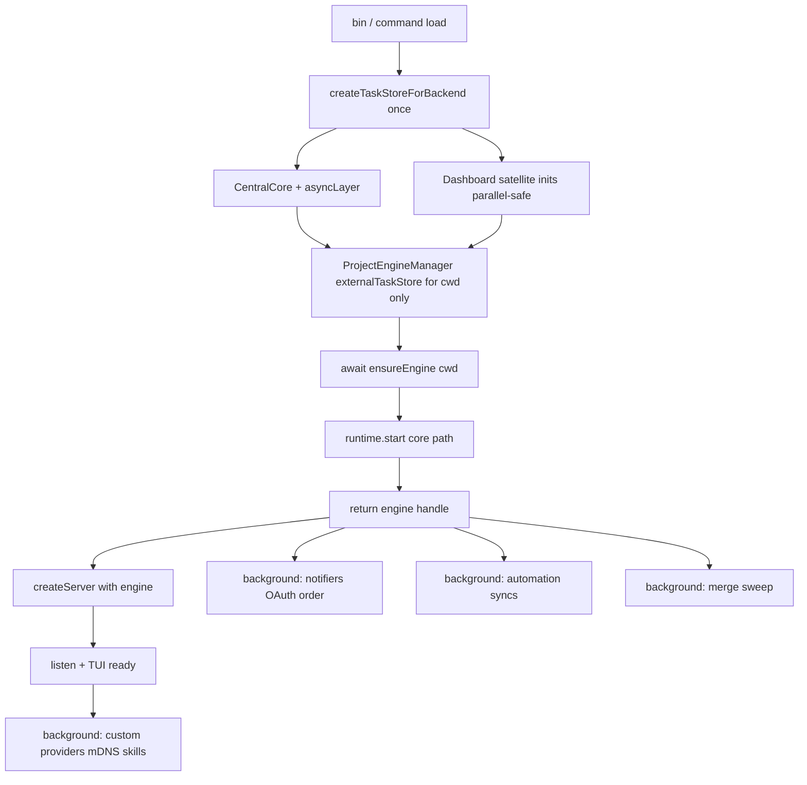

# feat: Faster dashboard and serve startup

## Summary

Shorten **time-to-HTTP-ready / TUI-usable** for `fn dashboard` and `fn serve` by eliminating dual TaskStore boots, moving non-route-critical engine work off the pre-listen path, parallelizing independent satellite inits, and extending phase timing — without reintroducing the historical 3s cwd-engine race that degraded webhooks, and without weakening PostgreSQL migration integrity.

## Problem Frame

After the PostgreSQL cutover, local startup is dominated by:

1. **Backend boot** — embedded PG (cold `initdb` / warm `pg_ctl`) plus schema baseline and optional SQLite→PG auto-migration.
2. **Dual store construction on dashboard** — dashboard already boots a PostgreSQL `TaskStore`, then `ensureEngine(cwd)` boots a **second** factory path because `externalTaskStore` is not wired (serve already shares one store).
3. **Serial engine bring-up** — `ProjectEngine.start()` awaits notifiers, OAuth refresh/monitor, automation syncs, and `startupMergeSweep` before returning, which blocks `createServer` / listen on the dashboard critical path.
4. **Extension resolution** — `packageManager.resolve()` is called out in-code as a slow dashboard phase; serve blocks on the same walk before listen.
5. **Incomplete phase metrics** — dashboard logs coarse `startup phase *` labels; serve and engine internals lack matching substep timing, so regressions are hard to attribute.

Primary success metric: **time from process start to HTTP listening (and TUI `setReady`)** on warm multi-project and single-project boots. Full orchestration readiness may lag slightly if deferred work remains fail-soft and does not leave route closures unbound.

## Requirements

- R1. `fn dashboard` with engine on reuses a single PostgreSQL-backed `TaskStore` (and connection pool) for the cwd project HTTP layer and cwd engine — parity with serve’s `externalTaskStore` wiring.
- R2. Multi-project engines must not receive a cwd-bound store for a different project root; store injection is cwd/path-matched (or projectId-matched), not “one store for every registered project.”
- R3. `createServer` always receives a live cwd `options.engine` when engine mode is on — no timed race / partial-undefined engine that unbinds webhook, automation, mission, or routine routes.
- R4. PostgreSQL schema baseline and first-boot SQLite auto-migration remain pre-first-write, single-owner, and fatal on verification failure.
- R5. Non-route-critical engine startup work (merge sweep, notification/OAuth stack, automation schedule syncs) may complete after the engine object is returned / after HTTP listen, with fail-soft logging and no silent permanent skip.
- R6. OAuth refresh-before-expiry-monitor order is preserved whenever both run (avoids false “token expired” ntfy on restart).
- R7. Plugin module load may remain pre-`createServer` while plugin routes depend on a loaded `pluginLoader`; schema init failures stay integrity-critical (serve fatal; dashboard must not leave a half-bound plugin schema silently).
- R8. Operators and developers can see per-phase wall times for backend factory substeps, engine blocks, and total time-to-listen on both dashboard and serve (extend existing `phaseTime` style; optional EL lag via `FUSION_TRACE_EL_LAG`).
- R9. Boot smoke and thin merge gate remain green: real `fn serve` → `/api/health` on ephemeral port, clean SIGTERM; no binding/killing port 4040.
- R10. Regression tests prove single factory boot for dashboard engine-on cwd path and that deferred work still eventually runs; tests stay file-scoped and free of real-network / slow full-suite habits (FN-5048).

## Scope Boundaries

### In scope

- `fn dashboard` and `fn serve` process startup critical path.
- `ProjectEngine` / `InProcessRuntime` pre-return awaits that are not required for route closures.
- Satellite store init ordering on dashboard after shared layer boot.
- Phase timing instrumentation and lightweight extension-path improvements (cache/defer only where chat/provider readiness is not blocked incorrectly).

### Deferred to Follow-Up Work

- Desktop embedded runtime dual-store parity (`packages/cli/src/commands/desktop.ts`, Electron local-runtime) — same seams, not primary.
- Embedded PG keep-alive daemon / always-on external `DATABASE_URL` as the default operator workflow (document as operational tip; no product redesign here).
- Full CLI bundle code-split / 14MB `bin.js` parse cost.
- Deep SQLite→PG migration throughput rewrite (bulk copy algorithms) beyond ensuring progress remains visible.
- Capturing the 3s webhook race as a dedicated `docs/solutions/` entry (recommended after land via ce-compound).

### Out of scope

- Re-enabling HybridExecutor for ordinary local multi-project (prior ~7s duplicate runtime cost).
- Changing engine singleton lock semantics (`has` vs `hasRunningEngine`).
- Dashboard query/index load work already covered by `docs/performance/dashboard-load.md`.
- Product UX redesign of TUI loading copy beyond accurate phase status.

## Assumptions

- Confirmed primary metric is **time-to-HTTP-ready / TUI usable**, not full orchestration quiet-state.
- Surfaces: **dashboard + serve**; desktop only if a unit can reuse the same API without expanding risk.
- Aggressiveness includes **backgrounding non-route-critical engine work** after a correct engine handle exists, not only store-sharing.

## Key Technical Decisions

1. **Share store via existing `externalTaskStore` seam, not a new abstraction.** Serve already proves the pattern: factory once → CentralCore `asyncLayer` → `ProjectEngineManager({ externalTaskStore })` → single shutdown. Dashboard adopts the same seam.

2. **Prefer cwd-scoped injection over manager-global blind share.** Manager today forwards one `externalTaskStore` to every engine in `buildEngineOptions`. For multi-project correctness under project-partitioned PG, inject only when the engine’s working directory / projectId matches the booted store’s root (cwd-only override on `ensureEngine`, or clear/undefined for other projects so they factory-boot their own bound store). Do not leave multi-project engines silently writing through the cwd partition.

3. **Engine handle before `createServer` remains a hard invariant.** Defer work **inside** `ProjectEngine.start()` / post-`start()` background phases so `options.engine` is non-null and route closures bind real subsystem getters. Do **not** reintroduce `Promise.race(ensureEngine, 3s)`.

4. **Deferral allowlist (post engine object, preferably post-listen for pure side effects):**
   - `startupMergeSweep` (self-healing / periodic merge retry already cover related cases; accept brief stale `merging*` window)
   - NotificationService + OAuth refresh/monitor/validity + NtfyNotifier (preserve refresh→monitor order inside the deferred chain)
   - Automation schedule sync helpers (CronRunner can start; syncs fill in with degraded→ready health)
   - Already allowed: custom provider `/models` refresh, mDNS (needs bound port), Claude skill FS backfill, runtime startup recovery sequence

5. **Keep pre-listen:** PostgreSQL factory + migration, store init/watch (or equivalent ownership), plugin load required for `getPluginRoutes()`, cwd `ensureEngine` completion for engine mode, HybridExecutor only when gate enables multi-node.

6. **Serve: stop awaiting `startAll()` before listen.** Match dashboard: `void startAll()` + reconciliation + await only primary/cwd engine needed for `createServer`’s primary store/engine. Multi-project engines warm in background.

7. **Instrumentation first-class but cheap.** Shared helper (or duplicated minimal `phaseTime`) for serve; add factory substeps (`embedded.start`, `schema.baseline`, `sqlite.migrate?`, `taskStore.construct`) and engine blocks (`runtime.start`, `notifiers`, `automations`, `mergeSweep`) behind normal log lines — not a new metrics product.

8. **Tests stay mock-first.** Assert factory call count / `externalTaskStore` wiring in CLI unit tests (extend serve/dashboard tests). Use `pnpm smoke:boot` / `verify:fast` for real process proof; avoid new real embedded-PG cold boots in the CLI vitest suite.

## High-Level Technical Design

### Target boot topology (cwd project)

### Critical-path vs deferred

| Phase | Pre-listen / pre-engine-return | Deferred |
|-------|--------------------------------|----------|
| Embedded PG + schema + migrate | Yes | Never |
| TaskStore + CentralCore layer | Yes | Never |
| Satellite inits (agent/plugin/automation for HTTP) | Yes (parallelize) | — |
| Plugin load for routes | Yes | Module-only defer only with route readiness redesign (out of scope) |
| `InProcessRuntime` scheduler/executor/self-healing construct | Yes | Recovery sequence already deferred |
| Notifiers / OAuth stack | No (after handle) | Yes |
| Automation sync ×4 | No | Yes |
| `startupMergeSweep` | No | Yes |
| `packageManager.resolve` | Prefer overlap; cache if safe | Non-essential providers post-listen |
| Non-cwd `startAll` engines | Background | Yes |

### Ownership rules when sharing store

- **One** `createTaskStoreForBackend` for cwd on dashboard engine-on path.
- Engine `InProcessRuntime` takes `externalTaskStore` and skips factory + does not own `backendShutdown`.
- Process teardown: engines stop → then factory `shutdown()` once (serve pattern).
- Dashboard continues to pass the **same** store instance into `createServer(store, …)` so HTTP and engine see one writer.

## Sequenced Delivery (phases)

Land as dependency-ordered commits/PRs. Each phase is independently shippable and measurable.

| Phase | Units | Outcome | Risk |
|-------|-------|---------|------|
| **P0 — Measure & share store** | U1, U2 | Factory substep + serve timing; dashboard single store for cwd engine | Low |
| **P1 — Serve multi-project non-block** | U3 | Serve listens without awaiting every project engine | Medium |
| **P2 — Defer non-route-critical engine work** | U4 | Shorter `ensureEngine` / `ProjectEngine.start` critical path | Medium–High |
| **P3 — Parallel satellite inits** | U5 | Shorter dashboard pre-engine path | Low |
| **P4 — Extension path** | U6 | Reduce `packageManager.resolve` wall time / blocking | Medium |
| **P5 — Verification & docs** | U7 | Boot smoke, gate, FNXC, optional solutions capture | Low |

Do not start P2 until P0 is green: store sharing is the largest structural win and simplifies measuring engine-internal deferrals.

---

## Implementation Units

### U1. Extend startup phase instrumentation (dashboard factory + serve + engine hooks)

**Goal:** Make time-to-listen and bottleneck attribution first-class on both surfaces so later units can be validated with numbers, not guesswork.

**Requirements:** R8, R9

**Dependencies:** None

**Files:**

- `packages/cli/src/commands/dashboard.ts` (extend labels / wrap factory)
- `packages/cli/src/commands/serve.ts` (add phase logging)
- `packages/core/src/postgres/startup-factory.ts` (optional substep logs)
- `packages/engine/src/project-engine.ts` and/or `packages/engine/src/runtimes/in-process-runtime.ts` (block timings)
- `packages/cli/src/commands/__tests__/dashboard.test.ts` or a small new helper test if extracting `phaseTime`
- Prefer extracting a tiny shared helper under `packages/cli/src/` only if both commands can import without cycles

**Approach:**

- Keep cheap wall-clock logs (`startup phase <label>: Nms`).
- Cover at least: `backend.factory` (and if easy: embedded start, schema, migrate, construct), `engine.ensureEngine`, total time-to-listen on serve (mirror dashboard `startupDurationMs`).
- Engine: log durations for `runtime.start`, `notifiers+oauth`, `automations`, `mergeSweep` even before deferral so before/after is comparable.

**Patterns to follow:** Existing `phaseTime` in `dashboard.ts`; `FUSION_TRACE_EL_LAG` for optional EL stalls.

**Test scenarios:**

- Happy path: helper or command test that a phase label is emitted around a stubbed async step (mock logger/logSink).
- Edge: phase logs still emit when the wrapped function throws (use `finally`).
- Test expectation if pure log wiring without extract: cover via existing dashboard/serve tests that still boot under mocks without asserting every label.

**Verification:** Manual or scripted dashboard/serve log shows labeled phases; no behavior change.

---

### U2. Dashboard cwd TaskStore sharing (`externalTaskStore` serve parity)

**Goal:** One factory boot and one connection pool for dashboard HTTP + cwd engine.

**Requirements:** R1, R2, R3, R4, R10

**Dependencies:** U1 helpful but not hard-required

**Files:**

- `packages/cli/src/commands/dashboard.ts` — pass `externalTaskStore: store` (or cwd-only ensure override); align shutdown with `dashboardBackendShutdown`
- `packages/engine/src/project-engine-manager.ts` — if needed, support **cwd/project-matched** injection so non-cwd engines do not inherit the wrong store
- `packages/cli/src/commands/__tests__/dashboard.test.ts` — assert single `createTaskStoreForBackend` (or equivalent) when engine on; assert manager receives external store for cwd
- `packages/cli/src/commands/__tests__/serve.test.ts` — keep/extend as regression for serve single-owner pattern
- FNXC comments on ownership / multi-project matching

**Approach:**

- Mirror serve’s `ProjectEngineManager(..., { externalTaskStore: boot.taskStore })` for the dashboard-owned store.
- Fix multi-project hazard: either document that the shared store is multi-tenant-safe for all projects under current PG binding **only if proven**, or inject store only for the matching projectId/path (preferred if binding is per-store).
- Ensure `store.init()` / `watch()` ownership remains single: engine must not re-init/close the shared store destructively; teardown order matches serve (engines → backend shutdown once).
- `--no-engine` path unchanged (no manager share required).

**Patterns to follow:** `serve.ts` externalTaskStore + `serve.test.ts` single-owner factory mock; `InProcessRuntime` external branch.

**Test scenarios:**

- Happy path: dashboard engine-on path constructs factory once for cwd; engine receives external store; `createServer` still gets engine + same store.
- Multi-project: second registered project engine does **not** use cwd store when roots differ (assert factory called for other project or explicit projectId bind — depending on implementation choice).
- Error path: factory failure still aborts boot; no orphan engine without shutdown.
- Integration with mocks: engine `ensureEngine(cwd)` does not call `createTaskStoreForBackend` again for cwd when share is wired.
- `--no-engine`: factory still once; no engine share requirements.

**Verification:** Unit tests green; optional local dashboard log shows shorter `engine: ensureEngine(cwd)` and no second embedded “starting” for same data dir from a second owner path; `pnpm smoke:boot` still green.

---

### U3. Serve: non-blocking multi-project `startAll`

**Goal:** `fn serve` becomes HTTP-ready after primary/cwd engine is ready, not after every registered project engine finishes.

**Requirements:** R3, R5, R8, R9

**Dependencies:** U1 recommended; U2 independent

**Files:**

- `packages/cli/src/commands/serve.ts` — `void engineManager.startAll()` (or await only primary), keep reconciliation; resolve primary store/engine for `createServer`
- `packages/cli/src/commands/__tests__/serve.test.ts`
- FNXC: serve readiness vs multi-project engine warmup

**Approach:**

- Align with dashboard: background `startAll`, await only the engine whose store backs `createServer`.
- Preserve hybrid executor gate behavior; do not enable HybridExecutor for local-only multi-project.
- Health endpoint must still report engine availability correctly for external singleton ownership (`hasRunningEngine`).

**Test scenarios:**

- Happy path: serve listen path does not await slow secondary project engines (mock second `ensureEngine` delayed; listen proceeds after primary).
- Edge: zero projects / cwd unregistered — fail-soft or existing serve registration behavior preserved.
- Error path: primary engine failure still fails boot (or existing policy); secondary failure is logged, not fatal to listen.
- Regression: single-project serve still one factory + externalTaskStore.

**Verification:** Serve unit tests; boot smoke.

---

### U4. Defer non-route-critical `ProjectEngine` startup work

**Goal:** Shrink wall time of `ProjectEngine.start()` / `ensureEngine` by moving merge sweep, notifier/OAuth stack, and automation syncs off the return-critical path while keeping route-bound engine subsystems constructed.

**Requirements:** R3, R5, R6, R10

**Dependencies:** U2 (preferred so measurements isolate engine internals)

**Files:**

- `packages/engine/src/project-engine.ts` — split critical vs deferred phases; readiness/health signals if needed
- `packages/engine/src/__tests__/project-engine.test.ts` (and related soft-delete/merge tests that use `skipNotifier`)
- Possibly notification/oauth unit tests if start timing changes
- FNXC comments documenting deferral allowlist and OAuth order

**Approach:**

- After `runtime.start()` and wiring required for routes (PR monitor config, settings listeners, auto-merge wiring as required), return-capable engine may complete deferred chain via `void this.startDeferredSubsystems().catch(...)`.
- Deferred chain order for OAuth: **refresh scheduler start → expiry monitor → validity logger** (same relative order as today).
- `startupMergeSweep`: background; document stale merging status window; keep unconditional stale status clear eventually.
- Automation: prefer `cronRunner.start()` then background the four `sync*` calls; keep degraded health messaging if sync fails.
- Do **not** defer plugin schema integrity or TaskStore factory/migration.
- Do **not** use a wall-clock race on `ensureEngine` from dashboard/serve.

**Execution note:** Characterization-first for `ProjectEngine.start` ordering tests — capture what routes need from `options.engine` at construction time before moving awaits.

**Patterns to follow:** Existing deferred `resumeStartupRecoverySequence` in `InProcessRuntime`; post-listen custom provider refresh; `skipNotifier` test pattern for isolating notifier-free starts.

**Test scenarios:**

- Happy path: `start()` resolves before deferred notifiers complete (mock delayed OAuth start); engine methods used by routes remain defined.
- OAuth order: when deferred chain runs, refresh is invoked before expiry monitor check (spy call order).
- Merge sweep: deferred sweep still clears stale `merging` / `merging-pr` on in-review tasks.
- Automation: sync failures leave degraded health but do not reject `start()`.
- Error path: deferred chain failure logs and does not crash process / does not leave unhandled rejection.
- Regression: `skipNotifier: true` tests still pass; auto-merge wiring still present for task:moved paths after start.

**Verification:** Engine unit tests; dashboard phase log for `ensureEngine` drops vs baseline; boot smoke.

---

### U5. Parallelize independent dashboard satellite inits

**Goal:** Reduce serial `store.init → automation → plugin → agent → watch` wall time where dependencies allow.

**Requirements:** R1, R8

**Dependencies:** U2 recommended (shared store already init’d once)

**Files:**

- `packages/cli/src/commands/dashboard.ts`
- `packages/cli/src/commands/__tests__/dashboard.test.ts` if ordering assertions exist
- FNXC on init dependency order

**Approach:**

- After core `store.init()` (and layer available): `Promise.all` for independent `automationStore.init`, `pluginStore.init`, `agentStore.init` if safe.
- `store.watch()` can overlap with extension resolution / plugin loading where event races are acceptable (today watch is early; keep correctness if TUI/subscriptions need watch before events).
- Do not parallelize with factory/migration.

**Test scenarios:**

- Happy path: dashboard boot under mocks still initializes all satellites.
- Failure path: one satellite init rejection still surfaces (no swallowed partial boot unless existing fail-soft policy).

**Verification:** Phase logs show overlapping satellite durations; unit tests green.

---

### U6. Extension / packageManager critical-path reduction

**Goal:** Cut dashboard/serve wall time spent in `packageManager.resolve` and extension discovery without breaking provider registration for chat.

**Requirements:** R5, R8

**Dependencies:** U1 (measure first); can ship after P0–P2

**Files:**

- `packages/cli/src/commands/dashboard.ts`
- `packages/cli/src/commands/serve.ts`
- `packages/cli/src/commands/claude-cli-extension.ts` / droid / llama path resolvers (single settings read)
- Optional small cache module under `packages/cli/src/`
- Tests colocated under `packages/cli/src/commands/__tests__/`

**Approach:**

- Collapse triple `getGlobalSettings()` for Claude/Droid/Llama into one read.
- Overlap `packageManager.resolve` with work that does not depend on its result (already partly true for plugins).
- Optional: fingerprint cache of resolved extension paths (agentDir + settings mtime/hash) with safe invalidation.
- Defer only provider registration that is already safe post-listen (custom providers already post-listen); do not defer self-extension `fn_*` tools required for agent sessions if chat can start immediately.

**Test scenarios:**

- Happy path: extensions still load; self-extension path still set via `setHostExtensionPaths`.
- Cache (if implemented): second resolve with unchanged fingerprint skips full walk; settings change busts cache.
- Failure path: resolve failure still fails soft as today (dashboard creates empty extension runtime).

**Verification:** Phase log `packageManager.resolve` reduced on warm restart; unit tests for cache invalidation if added.

---

### U7. Gate verification, changesets, and operator-facing notes

**Goal:** Prove the sequenced work does not break boot smoke or published CLI contracts; document measurement how-to.

**Requirements:** R9, R10

**Dependencies:** U2–U6 as landed

**Files:**

- `.changeset/*.md` when `@runfusion/fusion` user-visible performance/behavior changes (category `performance`)
- Optional short note in `docs/cli-reference.md` or `docs/getting-started.md` on reading startup phase logs / preferring `DATABASE_URL` for faster warm ops (only if product-facing)
- FNXC updates kept current

**Approach:**

- Run file-scoped vitest for touched packages + `pnpm smoke:boot` / `pnpm verify:fast`.
- Changeset body: labeled `summary` / `category: performance` / optional `dev`.
- Do not quarantine flakes by widening timeouts.

**Test scenarios:**

- Boot smoke: CLI help + serve health + clean shutdown.
- Gate-shaped: no new dependence on port 4040.

**Verification:** `pnpm verify:fast` and scoped tests green on the branch.

---

## Risks & Dependencies

| Risk | Mitigation |
|------|------------|
| Dual writers / split HTTP vs engine store | U2 single store; single shutdown; tests on factory call count |
| Multi-project wrong partition via global externalTaskStore | U2 matching rule; tests for second project |
| Webhook/route degradation if engine undefined | Hard invariant: await cwd engine; no 3s race |
| Stale merging status if sweep deferred | Background sweep ASAP after start; self-healing / retry still run |
| False OAuth expiry ntfy | Preserve refresh→monitor order in deferred chain |
| Plugin routes empty if load deferred naively | Keep plugin load pre-createServer in this plan |
| Serve multi-project race on first request to cold project | `onProjectFirstAccessed` + reconciliation already exist |
| Measurement noise | U1 before claiming wins |

**Dependencies:** PostgreSQL embedded binaries available for default boot smoke; existing serve single-store pattern.

## System-Wide Impact

- **Operators:** Faster dashboard/serve start; logs gain more phase lines.
- **Multi-project:** Background engine warmup for non-cwd projects on serve may mean first touch is slightly colder — acceptable under existing on-access ensure.
- **Health banner:** Must keep `hasRunningEngine` semantics when another process owns the lock.
- **Published CLI:** performance changeset if user-visible.

## Open Questions (implementation-time)

- Exact multi-tenant safety of a single TaskStore instance across projectIds under current RLS/bind model — resolve in U2 by reading `TaskStore` bind behavior; default to path/projectId-matched injection if ambiguous.
- Which `createServer` closures require notifier/cron **instances** at construction vs lazy getters — inventory during U4 characterization.

## Success Metrics

- Warm single-project dashboard: measurable drop in `engine: ensureEngine(cwd)` and total `startupDurationMs` after U2+U4.
- Serve: time-to-listen no longer scales linearly with registered project count after U3.
- Zero dual `createTaskStoreForBackend` for same cwd on dashboard engine-on path after U2.
- Boot smoke remains green; no increase in false OAuth expiry notifications.

## Alternative Approaches Considered

| Approach | Why not chosen |
|----------|----------------|
| Race `ensureEngine` with deadline, createServer with optional engine | Previously shipped and regressed webhooks/automations; hard ban |
| “UI shell first” without engine handle; rebind routes later | Requires large `createServer` redesign; out of scope |
| Always require external `DATABASE_URL` | Good ops tip; not a code fix for default embedded path |
| Full min-engine / full-engine process split | Higher complexity; defer after P0–P2 wins measured |

## Sources & Research

- Local: `packages/cli/src/commands/dashboard.ts`, `serve.ts`, `packages/core/src/postgres/startup-factory.ts`, `embedded-lifecycle.ts`, `packages/engine/src/project-engine.ts`, `project-engine-manager.ts`, `runtimes/in-process-runtime.ts`, `packages/dashboard/src/server.ts`
- Tests: `packages/cli/src/commands/__tests__/serve.test.ts`, `dashboard.test.ts`
- Learnings: `docs/solutions/integration-issues/engine-already-running-is-not-no-engine.md`, `docs/solutions/logic-errors/terminal-bootstrap-list-serialized-before-auto-create.md`, `docs/solutions/architecture-patterns/thin-trusted-merge-gate.md`, in-code FNXC on 3s race and CustomProviders post-listen
- Prior perf note (query-level only): `docs/performance/dashboard-load.md`
- External research: skipped — strong in-repo serve parity pattern and documented readiness constraints

## Execution Posture

- U2/U3/U4: characterization-first around store ownership and engine start ordering before moving awaits.
- Prefer file-scoped vitest + `pnpm smoke:boot` / `verify:fast` over full-suite.
- FNXC comments required for ownership, deferral allowlist, and multi-project injection rules.
