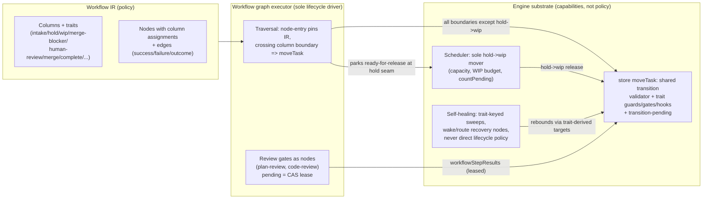

# refactor: IR-driven lifecycle cutover — workflow as the single source of truth

## Summary

Complete the workflow-native cutover: the workflow IR (columns, traits, node column assignments, edges) becomes the only authority over task lifecycle. The graph moves tasks between columns as traversal crosses node column boundaries; the scheduler, self-healing, merger, and dashboard derive behavior from column traits instead of literal column ids; the graph exclusively owns Plan Review; `reviewLevel` becomes a creation-time preset; and the legacy execution machinery (graph re-entry interceptors, triage's out-of-graph Plan Review gate, per-step review injection, parity/authoritative cutover scaffolding) is deleted in one big-bang change. Acceptance is a user-authored 6-column workflow — Ideas → Todo → In-progress → In-review → Merging → Done — building in the editor and running end-to-end with the card visibly driven through every column by the workflow alone.

---

## Problem Frame

A user report (verified against the code) demonstrated three architectural failures of the current mixed state:

1. **The executor hardcodes column names and ignores the IR.** The merge boundary always calls `moveTask(id, "in-review")` (`packages/engine/src/executor.ts` ~6956, explicitly allowlisted); the v1→v2 upgrade maps the merge seam to `"in-review"`; `packages/engine/src/workflow-graph-executor.ts` contains zero `moveTask` calls — node column assignments are cosmetic. A custom "Merging" column never receives the task; Code Review runs while the card sits in whatever column it happens to occupy.
2. **Triage and the graph race on Plan Review.** Triage owns an out-of-graph pre-release gate (`runPlanReviewBeforeExecution`) that writes a `pending` step result; the graph's dedup honors only `status === "passed"` (`workflow-graph-executor.ts:663`), so interleavings launch duplicate reviewers, and the losing verdict is silently discarded.
3. **Review Levels (0–3) are vestigial.** `fn_review_step` is never injected for graph tasks; group enablement comes from `enabledWorkflowSteps`/`defaultOn` only; `reviewLevel` survives as dead runtime state and misleading prompt text.

This plan is the completion of the active `docs/plans/2026-06-09-001-refactor-big-bang-workflow-native-execution-plan.md` arc — its U6 (runtime column moves), U7 (recovery re-keying), and U9 (legacy deletion) remainder — under the operator's directive: no more mixed state; the workflow drives execution.

---

## Requirements

**IR as runtime authority**

- R1. Node column assignments move tasks at runtime: when graph traversal crosses from a node in column A to a node in column B, the task moves to column B through the store's trait-hook `moveTask` path (transition-pending crash-safe), attributed `workflowMoveSource: "workflow-graph"`.
- R2. No engine lifecycle code selects a move target or enumerates tasks by literal column id or legacy status string. All lifecycle predicates re-key on column traits (`intake`, `hold`, `wip`, `merge-blocker`, `human-review`, `merge`, `complete`, `archived`, `timing`, `abort-on-exit`, `reset-on-entry`, `stall-detection`) and workflow step state. (Step statuses like `step.status === "done"` are not columns and are out of scope of this rule.)
- R3. Failure edges terminating at `end` park the task `failed` in its current column; the `complete` trait's semantics (dependency release, timing stop) fire only on success-path terminal arrival, never on mere column entry.

**Single ownership of review gates**

- R4. The graph exclusively owns Plan Review. Triage's role reduces to authoring PROMPT.md; `runPlanReviewBeforeExecution` and the triage-owned statuses `planning`, `needs-replan`, and `plan-review-unavailable` are deleted, their semantics re-owned by graph nodes (plan-review group, plan-replan node, reviewer-outage retry) and workflow step state.
- R5. Exactly one reviewer session runs per review gate per attempt: `pending` step results are CAS-claimed leases with owner and staleness floor; graph re-entry after crash/restart honors or reclaims the lease instead of dispatching a second reviewer.
- R6. `reviewLevel` becomes a creation-time preset that writes `enabledWorkflowSteps` and has zero runtime reads in the engine. Existing tasks are backfilled once.

**Invariants preserved (non-configurable)**

- R7. The following contracts survive the cutover, restated in trait terms: user hard-cancel on backward move out of a wip/merge column (`abort-on-exit` + user-paused semantics); `autoMerge:false` terminal-until-human (FN-5147/FN-5819, additive gating via `allowsAutoMergeProcessing`); done-only-on-confirmed-merge; FN-8141 blocked/skip-bypass taint guards; triple-proof backward moves in self-healing; file-scope/squash guards; FN-7863-style bounded requeue caps.
- R7b. **Confirmed-merge-must-finalize (dual of done-only-on-confirmed-merge).** Once a merge is confirmed (commit landed on the target branch), finalization to the complete column is unblockable: implementation-proof and step-checklist gates run strictly PRE-merge (merge-gate / implementation-proof nodes); post-merge, a stale or incomplete step checklist is reconciled (steps auto-completed/skipped with a run-audit event), never a park. A task must never sit `failed` with its code already merged. Motivating incident (operator screenshot, 2026-07-18): "Merge confirmed but finalization blocked: task has incomplete steps" with only manual Retry as the exit.
- R8. `builtin:coding` keeps its column ids and observable behavior byte-compatible: an untouched default-workflow project behaves identically before and after the cutover (characterization oracle pins this).

**Big-bang deletion**

- R9. Deleted outright, with tombstone assertions: `graphCompletionInterceptors` re-entry machinery (`graphStepRunOnce`, `graphSeamGoverningNodeId`, etc.), `fn_review_step` injection and per-step review prompt scaffolding, `runPlanReviewBeforeExecution`, the legacy workflow-steps runner path, `packages/core/src/workflow-cutover.ts`, `packages/engine/src/workflow-authoritative-driver.ts`, `packages/engine/src/workflow-parity-observer.ts` and parity evidence machinery, and the executor merge-boundary hardcoded move plus its `handoff-invariant-violation-allowlist` mechanism.

**Migration and acceptance**

- R10. No silently frozen tasks: every legacy (column, status) combination at upgrade time maps to a graph node via an explicit adoption table; unmappable rows park `paused` with a run-audit reconcile event. Orphaned `pending` Plan Review results are swept. A schema-baseline version gate refuses writes from pre-cutover binaries.
- R11. The 6-column benchmark workflow (Ideas intake/no-AI → Todo hold+triage+Plan Review → In-progress wip/execute → In-review code-review+completion-summary → Merging merge-gate/merge/squash → Done complete) is buildable in the workflow editor and runs end-to-end in an automated acceptance test asserting the observability contract in U11.
- R12. Benchmark column-role purity: each column runs only its own role's sessions. No reviewer session runs while the card is in In-progress; no executor session runs while the card is in In-review; nothing runs in Ideas or Done. The acceptance test asserts this from session/run records.

### Benchmark column contract (operator-specified)

The operator's authoritative description of the benchmark's per-column behavior. U11 encodes it as assertions; U2's editor validation must permit this exact shape.

- **Ideas** — intake, no AI. Task waits with title only; operator manually promotes to Todo. Nothing else fires.
- **Todo** — triage writes PROMPT.md (mission, steps, files, tests, acceptance criteria); an independent reviewer validates it. On REVISE, triage rewrites and the reviewer re-checks **exactly once** (benchmark replan cap = 1; a second REVISE parks awaiting-approval). On APPROVE, the card moves to In-progress.
- **In-progress** — pure execution: isolated worktree, steps executed one by one, each step tested and committed. No Code Review, no summary. All steps done → card moves to In-review.
- **In-review** — senior reviewer analyzes the entire diff. Pass → completion summary (2–4 sentences) is generated, then the card moves to Merging. Bugs found → card moves **back to In-progress** (visible backward move) for fixes, then re-review, up to **3 cycles**; a fourth failure parks.
- **Merging** — clean-room copy of main, dependency install, final diff review, squash merge. Transient failure (model unavailable, conflict) retries up to **3 times**. `autoMerge:false` → the card **waits in Merging** for manual approval (settles the `human-review` trait placement: Merging, not In-review). Merge lands → Done.
- **Done** — terminal. Nothing else happens.

---

## Key Technical Decisions

- KTD-1. **Failure-terminal ≠ complete-column entry, with an explicit failure-class taxonomy.** `end` is a graph terminal, not a column destination. Success-path arrival at `end` (or a success node in a `complete` column) triggers the complete trait. Failure classes split: **recoverable failures** (worktree repair, tool-failure retry budgets, abort/stuck with retries remaining) are node-internal outcomes that rebound via KTD-10 and never traverse a failure edge; **only terminal exhaustion** (budgets spent, FN-8141 blocked, non-recoverable errors) traverses the failure edge and parks `failed` in place. The ~30 legacy executor rebound sites map to the recoverable class. Rationale: the builtin IR routes `execute → end` on failure; naive column-following would display failed work as Done, while routing all failures down the edge would delete today's retry behavior and break R8.
- KTD-2. **Single mover at the hold→wip seam.** The graph parks the task at a "ready-for-release" seam (workflow run state, not a legacy status string) **only when the boundary being crossed is hold→wip**; the scheduler's capacity sweep remains the sole actor that crosses hold→wip via `moveTask`. Every other boundary — including hold→hold and hold→non-wip exits — is graph-moved, so nodes running inside a hold column (the benchmark's Plan Review in Todo) can never strand a task at a seam the scheduler doesn't serve. Rationale: capacity/WIP arbitration is a substrate concern (in-txn slot counting, KTD-10 of the capacity design); two movers at the busiest seam means double-dispatch or deadlock.
- KTD-3. **IR resolution pinned per node-entry, durably.** A task resolves its workflow IR when entering a node, persists the resolved IR version/content hash on the workflow run state, and holds that resolution until the node settles. Restart recovery compares the stored pin against the current IR and takes the drift-park path on mismatch — the pin survives crashes. The pin field is carried by U9's migration and `getTaskSelectClause` slim projections. If an edit deleted the current node or its column, the task parks with a `task:reconcile-workflow-drift` run-audit event instead of traversing a mutated graph. Rationale: `resolveWorkflowIrForTask` is currently live-per-call; mid-flight edits changing the graph under a running task is the largest determinism hole found in flow analysis.
- KTD-4. **Pending step results are leases.** A `pending` `WorkflowStepResult` carries owner (session/run id) and `startedAt`; claiming is compare-and-set; re-entry honors a live lease and reclaims only past a staleness floor (FN-6736 pattern). Rationale: "also match pending" alone still double-dispatches after crash-restart.
- KTD-5. **One shared transition validator: pure logic in `packages/core/src/workflow-transition-policy.ts`, sole call site in `moves.ts`.** The policy module holds the pure trait-invariant logic (unit-testable without a store); `packages/core/src/task-store/moves.ts` is the single in-lock enforcement point every mover — graph, scheduler release, self-healing rebound, heartbeat, operator drag, dashboard routes — flows through, with return-guard postconditions. No other module may call the policy directly. For direct graph entry into a `wip` column (no-hold workflows), the validator invokes the same `workflow-capacity` counter the scheduler uses, in-txn, so there is exactly one capacity-counting authority; a move into a saturated wip column is rejected and the task parks ready at the boundary. Branch-local checks are defense-in-depth only. Rationale: `docs/solutions/logic-errors/repo-root-task-worktree-requeue-loop.md` — invariants enforced at one branch of one gate loop forever.
- KTD-6. **Additive gating for trait predicates.** Processing gates keep the `allowsAutoMergeProcessing` shape (`X !== false || override === true`), never `task.x ?? settings.x` effective-value collapse. Rationale: `docs/solutions/logic-errors/per-task-auto-merge-override-ignored-by-trigger-gates.md` — plain resolution starves manual-required parking branches.
- KTD-7. **`builtin:coding` is the characterization oracle.** Column ids stay the legacy enum values (zero task-row migration, per the existing KTD-1 of the builtin IR); a parity test pins the default-workflow task pipeline byte-compatible across the cutover.
- KTD-8. **Adoption table over drain-before-upgrade.** Store-open migration maps every legacy (column, status) row to a graph node/run-state; `planning` → planning node re-entry, `needs-replan` → plan-replan node, `plan-review-unavailable` → plan-review retry, replan-cap park → preserved awaiting-approval, mid-flight in-progress/in-review → equivalent seam nodes. Unmappable → `paused` + audit. Rationale: big-bang deletes the legacy runner; there is nothing left to finish un-adopted tasks.
- KTD-9. **WIP accounting: shared budget, pending counts.** Multiple `wip` columns share the `maxConcurrent`/maxWorktrees-style budget via `limitSetting`; per-column `limit` overrides remain available; `countPending: true` semantics are read by the scheduler's single counter. Rationale: operator-visible concurrency must not silently multiply when a workflow has two wip columns.
- KTD-10. **Trait-derived rebound targets with fallback ordering.** Self-healing "requeue to backlog" targets the task's workflow's `hold` column; if absent, the `intake` column; if absent, the first column. Rationale: every `task:reconcile-*` rule currently says literal `"todo"`; custom workflows may lack it.
- KTD-11. **`reviewLevel` preset writes go through the optional-group id pass-through.** The mapper resolves via `resolveAllOptionalGroupIds`/`optionalGroupIdSet` so ids reach `enabledWorkflowSteps` identity-stable; regression tests use a colliding id through the store's create and update paths. Rationale: `docs/solutions/logic-errors/optional-group-toggle-id-remapped-by-step-materializer.md` — the exact mechanism failed silently once.
- KTD-12. **Run-audit stays ids/counts/outcomes-only.** New events (`task:column-transition`, `task:reconcile-workflow-drift`, lease claim/reclaim events) follow the established metadata policy; no prose, no model ids.

---

## High-Level Technical Design

### Ownership after the cutover



### Benchmark card lifecycle (success + principal failure paths)

```mermaid
stateDiagram-v2
  [*] --> Ideas: create (intake, no AI)
  Ideas --> Todo: operator promote
  Todo --> Todo: triage writes PROMPT.md,\nPlan Review node (in hold column)
  Todo --> Todo: Plan Review REVISE -> plan-replan\n(loops in Todo; replan-cap parks awaiting-approval)
  Todo --> InProgress: Plan Review PASS ->\nready-for-release; scheduler releases (sole mover)
  InProgress --> InProgress: execute (wip, timing)
  InProgress --> InProgress: execute failure -> park failed in place (KTD-1)
  InProgress --> InReview: execute success (graph move)
  InReview --> InProgress: Code Review REVISE ->\nremediation node's column (visible backward move)
  InReview --> Merging: Completion Summary -> merge-gate (graph move)
  Merging --> Merging: merge retry / manual hold\n(autoMerge:false parks terminal-until-human here)
  Merging --> Merging: merge failure exhausted -> park failed in place
  Merging --> Done: merge confirmed -> success terminal;\ncomplete trait fires (deps release, timing stop)
  Done --> [*]
```

Prose is authoritative where the diagrams compress: the hard-cancel contract applies to any operator backward move out of a wip/merge-orchestration column regardless of target; `reset-on-entry` fires only where the trait exists on the target column.

---

## Scope Boundaries

**In scope:** engine lifecycle (executor, scheduler, hold-release, self-healing, triage, merger/auto-merge-finalization), store move/transition layer, workflow IR validation, reviewLevel preset + backfill, dashboard/API lifecycle routes and ColumnId typing, the acceptance benchmark, legacy deletion.

**Out of scope (true non-goals):** dashboard visual redesign; merge machinery internals (conflict resolution strategies, squash policy, scope-partition rules — they are invoked by merge nodes but not rewritten); multi-node/PG storage architecture (the cutover must be PG-correct but does not change storage design); mission/autopilot model.

### Deferred to Follow-Up Work

- `needs-replan` reader migration: post-cutover, the durable replan signal is written solely by the graph's plan-replan seam but still carries the legacy status name, with 14 readers (triage discovery, surgical-revision seed selection, hold-release gating, merge-block, dashboard). Migrating readers to a purpose-built workflow run-state signal is deferred as its own unit — implementation-time tracing showed the write is already graph-owned, so this is naming/purity, not legacy machinery (coordinator ruling during U10b).
- Workflow editor UX affordances beyond validation (e.g., visual trait palette polish, guided templates for the 6-column shape).
- Plugin-facing trait hook surface expansion (`gate` verdict UX) beyond what the cutover requires.
- Multi-node lease-sweep hardening beyond the FN-6736 staleness-floor standard (full liveness-proof protocol for cross-node transition-pending recovery) — the cutover ships the single-node-safe + staleness-floor form.
- Capturing the landed design into `docs/solutions/` and `CONCEPTS.md` (post-land `/ce-compound`).

---

## Implementation Units

Phased for dependency order. Big-bang means one release contains all phases; the phases sequence the work, not the rollout.

**Landing strategy (operator-decided):** all units land on a single long-lived feature branch in a dedicated worktree (`wt switch --create` per the standing worktree rule — the primary checkout stays on `main`), merged to main once, at the end, as the one cutover moment. Working agreement for surviving concurrent main commits: rebase the branch against main at least at every phase boundary (A→B→C→D→E), and immediately after any main commit touching `executor.ts`, `self-healing.ts`, `scheduler.ts`, `triage.ts`, or `moves.ts`; the merge itself happens in a declared operator freeze window with the U9 baseline bump making downgrade-writes impossible. Main never carries a mixed state.

### Phase A — Transition foundation

### U1. Graph-driven column transitions and the shared transition validator

- **Goal:** Crossing a node column boundary moves the task; all movers share one in-lock validator; failure edges park in place.
- **Requirements:** R1, R2, R3
- **Dependencies:** none
- **Files:** `packages/core/src/task-store/moves.ts`, `packages/core/src/transition-pending.ts`, `packages/core/src/workflow-ir-resolver.ts` (per-node-entry pinning, KTD-3), `packages/engine/src/workflow-graph-executor.ts`, `packages/engine/src/workflow-graph-task-runner.ts`, new `packages/core/src/workflow-transition-policy.ts` (single validator seam), tests `packages/engine/src/__tests__/workflow-graph-column-moves.test.ts`, `packages/core/src/task-store/__tests__/transition-validator.test.ts`
- **Approach:** Add a boundary-crossing step to graph traversal: on entering a node whose column differs from `task.column`, call `moveTask(id, node.column, { moveSource: "engine", workflowMoveSource: "workflow-graph" })`; transition-pending marks in-txn, hooks run post-commit. `end` and failure edges never produce moves (KTD-1). Pin IR per node-entry; deleted node/column parks with `task:reconcile-workflow-drift` (KTD-3, KTD-12). Emit `task:column-transition` with `{taskId, fromColumn, toColumn, nodeId, workflowId}`. The validator hosts trait invariants (terminal columns never re-enter wip; merge-blocker on complete-bound entry) with return-guard postconditions (KTD-5).
- **Patterns to follow:** existing trait guard/gate machinery in `moves.ts` (U8/KTD-2 comments); `transition-pending.ts` recovery; run-audit metadata policy in AGENTS.md.
- **Test scenarios:**
  - Happy path: traversal across a graph-owned boundary (execute success, In-progress→In-review) moves the card once, emits one `task:column-transition`, transitionPending settles null. Hold→wip boundaries are excluded from graph moves from the start (the graph parks at the ready-for-release seam; scheduler release is U4's surface) so this unit's tests survive U4 unchanged.
  - Same-column node chain (code-review → completion-summary both in In-review) produces zero moves.
  - Failure edge from execute to `end`: card stays in wip column with `failed`; no move event; complete trait does not fire.
  - Kill/restart mid-transition: pending marker recovered, move settles exactly once (single event).
  - IR edited mid-flight deleting the current node: task parks, `task:reconcile-workflow-drift` emitted, no traversal of the mutated graph.
  - Validator postcondition: any mover attempting complete-column entry with unresolved merge-blocker is rejected identically (graph, self-healing, operator route).
  - Soft-deleted task racing a graph move: skip-don't-park (FN-8004 shape).
- **Verification:** file-scoped vitest for the new tests; `pnpm verify:fast`.

### U2. Workflow IR validation hardening

- **Goal:** The editor cannot save an IR the runtime can't drive; runtime degrades defined-safely when it happens anyway.
- **Requirements:** R1, R11
- **Dependencies:** none
- **Files:** `packages/core/src/workflow-ir.ts` (parse/validate), `packages/core/src/trait-registry.ts` (`validateColumnTraits`), dashboard editor validation surfaces (`packages/dashboard/app` workflow editor components, `packages/dashboard/src/routes/` workflow save routes), tests `packages/core/src/__tests__/workflow-ir-validation.test.ts`
- **Approach:** Save-time hard errors: node assigned to nonexistent column; `merge-blocker` present with no reachable merge-class node; column deletion while tasks occupy it (route-level guard listing occupant count); workflows must declare a creation column (intake if present, else first column is the documented default). Runtime tolerance: unknown node column → no-move + drift event (from U1). Capability floor: validation must **permit** the operator's benchmark shape — review nodes placed in a hold column (Plan Review in Todo), per-workflow bounded revise/retry caps as node config (replan cap 1, code-review cycles 3, merge retries 3), a remediation edge that moves the card backward across a column boundary (In-review → In-progress), and a completion-summary node ordered after a review node within the same column. If any of these is expressible in the editor but rejected by validation (or vice versa), that is a U2 bug.
- **Test scenarios:** each validation rejects a crafted IR with a specific error; the 6-column benchmark IR passes; a merge-less docs-only workflow with no merge-blocker passes; column-delete-with-occupants returns the occupant guard error.
- **Verification:** file-scoped vitest.

### Phase B — Ownership cutover

### U3. Graph-exclusive Plan Review with leased pending results

- **Goal:** One owner for Plan Review; duplicate reviewers impossible by construction; triage-owned statuses retired.
- **Requirements:** R4, R5
- **Dependencies:** U1
- **Files:** `packages/engine/src/triage.ts` (delete `runPlanReviewBeforeExecution`, `retryUnavailablePlanReview`, planning-status lifecycle), `packages/engine/src/workflow-graph-executor.ts` (plan-review group claim semantics at the ~663 dedup site), `packages/core/src/workflow-step-results.ts` (lease fields + CAS claim), `packages/engine/src/hold-release.ts` (`isUnplannedForExecution` re-keyed to workflow step state), `packages/engine/src/replan-target.ts`, tests `packages/engine/src/__tests__/plan-review-single-owner.test.ts`, `packages/engine/src/__tests__/plan-review-lease.test.ts`
- **Approach:** Triage becomes a planning-node runner: it writes PROMPT.md and returns; the graph's plan-review group runs where the IR places it (in the benchmark, inside the hold column Todo). Pending results gain `{owner, startedAt}`; claim is CAS; re-entry with a live lease waits/adopts, reclaim past staleness floor (KTD-4). Statuses `planning`/`needs-replan`/`plan-review-unavailable` are replaced by workflow run state + step results; the replan-cap awaiting-approval park is preserved as a graph-node outcome. "Unplanned never releases" re-keys on: bootstrap-stub PROMPT.md OR plan-review group enabled-and-not-passed (replacing the `status === "planning"` check).
- **Execution note:** Start with a failing regression test reproducing the duplicate-reviewer interleaving from the user report (triage-pending + graph re-entry → assert exactly one reviewer session).
- **Test scenarios:**
  - Covers the report's race: pending result exists → graph waits/adopts; zero second reviewer sessions in the session store.
  - Crash after reviewer dispatch, restart before verdict: lease honored within staleness floor; reclaimed after it; never two live reviewers.
  - REVISE loops within the hold column; replan-cap parks awaiting-approval and survives restart.
  - Reviewer-provider outage: retry stays in the plan-review node with backoff; PROMPT.md not rewritten.
  - Plan Review disabled (`enabledWorkflowSteps` empty): card releases without any reviewer.
- **Verification:** file-scoped vitest; symptom verification — the exact FN-1315-shaped double "Starting workflow step: Plan Review" interleaving asserted gone.

### U4. Scheduler and hold-release trait cutover (single mover)

- **Goal:** Dispatch derives from traits; the scheduler is the sole hold→wip mover; WIP accounting is trait-configured.
- **Requirements:** R2, R7
- **Dependencies:** U1, U3
- **Files:** `packages/engine/src/scheduler.ts` (literal `"todo"` watch, `moveTask(id,"in-progress")` sites ~1888/2185/2268–2311), `packages/engine/src/hold-release.ts`, `packages/core/src/workflow-capacity.ts`, tests `packages/engine/src/__tests__/scheduler-trait-dispatch.test.ts`
- **Approach:** Scheduler selects candidates by `hold` trait + ready-for-release run state (KTD-2), counts WIP by `wip`-trait columns against the shared budget with `countPending` (KTD-9), and releases into the edge-adjacent wip column from the IR (`resolveColumnAdjacency`), not `"in-progress"`. Graph parks at the hold seam instead of moving. `isUnplannedForExecution` loses its literal-`"todo"` OR-branch. Workflows with no hold column: graph moves straight across; the wip trait's own limit is the only gate (documented).
- **Test scenarios:**
  - Capacity saturation: benchmark card waits in Todo until a slot frees; release moves it to In-progress exactly once (no graph/scheduler double-move under interleaving).
  - Pending transition counts toward the cap (`countPending`).
  - Two wip columns share one budget; per-column `limit` override respected.
  - No-hold workflow dispatches without scheduler involvement; at wip saturation the graph move is rejected by the in-txn validator capacity check (KTD-5) and the task parks ready at the boundary until a slot frees — never unbounded parallelism, never a second counter.
  - Ready-for-release + paused/user-paused never releases.
- **Verification:** file-scoped vitest; `scheduler-workflow-cutover` gate suite stays green.

### U5. Executor cutover: IR-driven boundaries, legacy re-entry machinery deleted

- **Goal:** The executor is a node runner; the graph owns all lifecycle boundaries; the hardcoded merge-boundary move and interceptor re-entry are gone.
- **Requirements:** R1, R2, R9
- **Dependencies:** U1, U3, U4
- **Files:** `packages/engine/src/executor.ts` (merge boundary `ensureWorkflowMergeBoundaryTask` ~6908–6963, `graphCompletionInterceptors` ~5200/6353/10445/11384/12048/12237/12465–12554, `fn_review_step` injection ~11682, review-level prompt scaffolding ~19841–19994, the ~30 `moveTask(id,"todo")` rebound sites re-keyed), `packages/engine/src/workflow-graph-task-runner.ts`, tests `packages/engine/src/__tests__/executor-graph-boundary.test.ts` plus updates to `executor-graph-requeue-gate`, `task-pipeline-smoke`
- **Approach:** The merge node's own column assignment drives the pre-merge handoff (U1 machinery); delete the hardcoded `"in-review"` move and the `handoff-invariant-violation-allowlist` mechanism. Replace interceptor-based re-entry with a direct node-runner call path (the 06-09 plan's KTD-6 deletion list). Executor requeue/rebound targets derive from KTD-10. FN-8141 blocked exit parks `failed` in the wip column with dependency edges, restated on traits. Legacy test-fake seams: minimal executor-core fakes without workflow-selection APIs are the expected breakage surface — update fakes to the workflow-aware store shape rather than keeping a legacy characterization path.
- **Test scenarios:**
  - Benchmark merge handoff lands in Merging (not In-review) because the IR says so; builtin:coding still lands in `in-review` (KTD-7 parity).
  - Interceptor tombstone: no `graphCompletionInterceptors` symbol; graph tasks complete through the node-runner path.
  - `fn_review_step` absent from graph-task tool lists; prompt contains no per-step review instructions.
  - Execute failure/abort/stuck rebounds to the trait-derived backlog target preserving progress per flavor.
  - FN-8141: `fn_task_done(outcome="blocked")` parks failed-in-place, requeues behind blocker deps, never auto-recovers to review.
- **Verification:** `task-pipeline-smoke` (builtin parity canary) green; file-scoped vitest; `pnpm verify:fast`.

### Phase C — Recovery and merge re-key

### U6. Self-healing trait re-key

- **Goal:** All recovery sweeps enumerate and rebound by trait with unchanged invariants.
- **Requirements:** R2, R7, R8 (characterization oracle: the pre/post byte-identical sweep-decision suite on builtin:coding fixtures is R8's primary evidence for the recovery surface)
- **Dependencies:** U1, U5
- **Files:** `packages/engine/src/self-healing.ts` (the ~206-hit surface: `listTasks({column: ...})` sites 2859–5414, rebound legality matrices 1302–1317/4202–4206, `moveTask("todo")` rebounds, heartbeat progression 5007–5012), `packages/engine/src/agent-heartbeat.ts`, tests `packages/engine/src/__tests__/self-healing-trait-rekey.test.ts`
- **Approach:** Sweeps enumerate by trait predicates (wip columns, merge-orchestration columns, complete/archived terminal); backward-rebound legality re-keys as "wip/merge column → hold/intake column" with triple-proof unchanged; rebound targets via KTD-10; `autoMerge:false` gating keeps additive shape (KTD-6) across all 19 sweep sites; per-row predicates verify slim-projection columns exist in `getTaskSelectClause` before reading new fields. Sweeps route recovery through workflow nodes (wake/route), never direct lifecycle policy (06-09 plan R6). Every AGENTS.md `task:reconcile-*` event keeps its name; docs re-keyed in U10.
- **Execution note:** Characterization-first — pin the current sweep outcomes on builtin:coding fixtures before re-keying, then assert byte-identical decisions post-cutover.
- **Test scenarios:**
  - Matrix: each documented reconcile rule (missing-worktree, phantom-binding, dependency-blocking-lease, stranded-completed, in-review-unmet-deps, workspace variants) fires identically on builtin:coding pre/post cutover.
  - `autoMerge:false` in-review/merging task: sweeps provably do not move it (assert `-no-action` events) while per-task `autoMerge: true` override still processes.
  - Custom workflow without a hold column: rebound lands per KTD-10 fallback ordering.
  - Task in a deleted column: orphan-column reconcile parks + surfaces (not invisible to trait-keyed sweeps).
  - Bounded retries: requeue caps and exhaustion events preserved (FN-7863 shape).
- **Verification:** file-scoped vitest; characterization suite green.

### U7. Merger and finalization trait re-key

- **Goal:** Merge failure rebounds, finalization moves, and human-review parking derive from the IR — and a confirmed merge always finalizes.
- **Requirements:** R2, R7, R7b
- **Dependencies:** U1, U5, U6
- **Files:** `packages/engine/src/merger.ts` (rebound sites 6281/7375–7682), `packages/engine/src/auto-merge-finalization.ts` (finalize-to-done 246–254, done-without-merge guard), `packages/engine/src/workflow-merge-nodes.ts`, tests `packages/engine/src/__tests__/merger-trait-rekey.test.ts` plus `merger-merge-lifecycle` updates
- **Approach:** Merge failure rebounds target KTD-10; finalization success arrival at the success terminal fires the complete trait and moves to the complete column via the graph (KTD-1, R3 — dependents unblock on terminal arrival, not column entry, covering post-merge-verification living in the done column); `human-review` parks terminal-until-human in the column carrying the merge-gate node; `merge-blocker` guards the complete-bound boundary. Recovery-rehome tolerates custom merge-column ids.
- **Test scenarios:**
  - Benchmark: manual-hold and retry loop stay in Merging; confirmed merge → Done; merge-failure-exhausted parks failed in Merging.
  - Done-only-on-confirmed-merge: no path enters a complete-trait column without merge confirmation (or `noCommitsExpected`).
  - autoMerge:false benchmark variant: card parks in Merging terminal-until-human; operator release proceeds.
  - Dependents of the benchmark task unblock only after the success terminal, not at Done-column entry mid post-merge-verification.
  - R7b regression: merge confirmed while the task carries an incomplete/stale step checklist → finalization reconciles the steps (audit event, ids-only), the card reaches the complete column, and no `failed` park occurs. Reproduces the "Merge confirmed but finalization blocked: task has incomplete steps" incident and asserts it is impossible by construction (checklist gates are pre-merge only; assert no post-merge code path can return a blocking verdict from step state).
- **Verification:** `merger-*` gate suites green; file-scoped vitest.

### Phase D — Data, presets, deletion

### U8. reviewLevel as a creation-time preset

- **Goal:** `reviewLevel` maps to `enabledWorkflowSteps` at creation; zero runtime reads.
- **Requirements:** R6
- **Dependencies:** U5 (runtime reads deleted there; mapper lands here)
- **Files:** `packages/core/src/task-store/task-creation.ts` (three creation paths), new `packages/core/src/review-level-preset.ts`, `packages/engine/src/executor.ts` (remove reads at 920/14471–14598), `packages/engine/src/triage.ts` (remove `Review level:` parse at 3011), dashboard forms `packages/dashboard/app/components/TaskForm.tsx`, `NewTaskModal.tsx`, `packages/dashboard/app/api/tasks.ts`, tests `packages/core/src/__tests__/review-level-preset.test.ts`
- **Approach:** Level mapping (0 → no optional groups; 1 → code-review; 2 → plan-review + code-review; 3 → plan-review + browser-verification + code-review) applied only when `enabledWorkflowSteps` is not explicitly provided; writes flow through the optional-group id pass-through (KTD-11). Post-creation `reviewLevel` mutation becomes a no-op field (create-only); dashboard forms present it as the preset it now is. Scope-leak enforcement mode (the level-1 read) re-keys on an explicit task field set by the preset.
- **Test scenarios:**
  - Each level produces the documented step set through all three creation paths.
  - Explicit `enabledWorkflowSteps` wins over `reviewLevel`.
  - Colliding-id regression: a preset id colliding with a legacy `WORKFLOW_STEP_TEMPLATES` entry survives store create + update untouched (KTD-11).
  - No engine file reads `task.reviewLevel` at runtime (tombstone grep test).
- **Verification:** file-scoped vitest.

### U9. Legacy data adoption and old-binary guard

- **Goal:** Every pre-cutover row wakes owned; stale binaries cannot write.
- **Requirements:** R10
- **Dependencies:** U3, U5, U6 (adoption targets exist)
- **Files:** new PG forward migration under `packages/core/src/postgres/` (+ `SCHEMA_BASELINE_VERSION` bump), store-open reconcile in `packages/core/src/task-store/persistence.ts`-adjacent open path, `packages/engine/src/self-healing.ts` (startup adoption sweep), tests `packages/core/src/__tests__/legacy-adoption.test.ts`
- **Approach:** Adoption table (KTD-8): `planning` → planning node; `needs-replan` → plan-replan node; `plan-review-unavailable` → plan-review retry; replan-cap park → awaiting-approval preserved; in-progress with live steps → execute seam; in-review merge-substates → corresponding merge nodes; orphaned `pending` step results without live sessions → cleared with audit; `reviewLevel`-only tasks → one-time `enabledWorkflowSteps` backfill (never both set). Because `task.status` is an open string (not a closed enum), the table is derived from a **write-site census**: grep every `status` literal written anywhere in core/engine/dashboard, and a build-failing assertion test verifies every written status literal has an adoption-table row — a status added during the cutover window fails the build instead of mass-parking rows paused at upgrade. Baseline version gate refuses old-binary writes (established PG forward-migration pattern; also mitigates the known stale-Homebrew-binary failure mode). The durable IR-pin field (KTD-3) is added here alongside the adoption columns.
- **Test scenarios:**
  - Fixture DB with every legacy (column, status) combination: post-migration, each task resumes at the mapped node; zero frozen rows.
  - Unmappable contrived row parks `paused` with reconcile audit.
  - Orphaned pending plan-review result cleared; a live-leased one preserved.
  - Backfill: reviewLevel-only task gains the preset step set; task with both fields untouched-and-warned.
  - Old-binary simulation (stale baseline) is refused at open.
- **Verification:** migration test suite; file-scoped vitest.

### U10. Legacy deletion sweep and tombstones

- **Goal:** The old world is gone and provably stays gone.
- **Requirements:** R9
- **Dependencies:** U3, U4, U5, U6, U7, U8, U9
- **Files:** delete `packages/core/src/workflow-cutover.ts`, `packages/engine/src/workflow-authoritative-driver.ts`, `packages/engine/src/workflow-parity-observer.ts` (+ parity evidence machinery in `packages/core/src/workflow-parity.ts` if unreferenced), legacy workflow-steps runner remnants, dead statuses from `packages/core/src/types.ts` and row-mappers/serialization, stale tests; update `AGENTS.md`, `docs/architecture.md`, `docs/testing.md`, `CONCEPTS.md` (re-key event docs to traits); new tombstone test `packages/engine/src/__tests__/legacy-tombstones.test.ts`
- **Approach:** Deletion list from R9 plus flow-analysis M3 additions. Tombstone test asserts the deleted symbols/files are absent (grep-level, cheap). Quarantine-on-sight discipline applies to destabilized lifecycle tests — but treat repeat flakes in graph/scheduler seams as race evidence first (learnings #6/#7); gate allow-list evictions recorded in `packages/engine/vitest.config.ts` as needed.
- **Test scenarios:** tombstone assertions for each deleted symbol/file; typecheck/build clean across packages; no `vi.mock` of deleted modules remains.
- **Verification:** `pnpm verify:fast`; `pnpm test:gate`.

### Phase E — Acceptance and surfaces

### U11. 6-column benchmark acceptance test

- **Goal:** Automated proof that the workflow drives the lifecycle end-to-end.
- **Requirements:** R11, R12, R3, R5, R7, R8 (a builtin:coding end-to-end variant runs alongside the 6-column benchmark and must be byte-compatible with the pre-cutover `task-pipeline-smoke` trace — R8's evidence for the pipeline surface)
- **Dependencies:** U1–U7
- **Files:** new `packages/engine/src/__tests__/benchmark-six-column-workflow.test.ts` (mock provider/testMode, modeled on `task-pipeline-smoke`), fixture IR `packages/engine/src/__tests__/fixtures/six-column-workflow-ir.ts`
- **Approach:** Scripted-mock end-to-end run asserting the observability contract: (1) ordered `task:column-transition` trail exactly Ideas→Todo→In-progress→In-review→Merging→Done with zero literal-fallback moves; (2) transitionPending null at end, kill/restart variant settles exactly once; (3) exactly one plan-review step result, graph-authored, zero triage-authored, restart variant proves the lease; (4) trait evidence — hold respected capacity, wip counted pending, abort-on-exit fired on the hard-cancel variant, timing excluded hold time; (5) autoMerge:false variant parks in Merging with `-no-action` sweep events; (6) failure variants park in place (never Done).
- **Test scenarios:** as enumerated in Approach (the six assertions are the scenarios), plus the operator contract variants:
  - Plan Review REVISE loop: exactly one rewrite+re-review cycle inside Todo; a second REVISE parks awaiting-approval (benchmark replan cap = 1, expressed as workflow config, not engine constant).
  - Code Review REVISE round-trip: card visibly moves In-review → In-progress → In-review; up to 3 cycles; the fourth failure parks (bounded, counted — no unbounded loop).
  - Completion summary is generated only after Code Review passes and only while the card is in In-review, before the move to Merging.
  - Column-role purity (R12): session/run records show zero reviewer sessions while in In-progress, zero executor sessions while in In-review, zero AI sessions while in Ideas or Done.
  - Merge retry: 3 bounded retries inside Merging on transient failure; exhaustion parks failed in Merging (never Done).
  - `autoMerge:false`: card waits in Merging; operator approval releases the merge; self-healing emits only no-action events while it waits.
- **Verification:** the test itself; candidate for gate admission only after demonstrating value (gate policy).

### U12. Dashboard and API trait re-key

- **Goal:** Operator surfaces render and act on any IR's columns; no closed column enum remains.
- **Requirements:** R2, R11
- **Dependencies:** U1, U4
- **Files:** `packages/dashboard/src/routes/register-task-workflow-routes.ts` (retry/re-engage `moveTask` targets 731/2469–2647, drift check 2654), `packages/dashboard/src/triage-trait.ts`, `packages/dashboard/src/routes/board-workflows.ts` (client counterpart `packages/dashboard/app/api/board-workflows.ts`), GitHub state mapping (`github-tracking-*`), board rendering + status badges in `packages/dashboard/app`, `packages/core/src/types.ts` (ColumnId open-string audit), tests `packages/dashboard/src/__tests__/routes-trait-rekey.test.ts`
- **Approach:** Audit ColumnId end-to-end for open-string typing (flow-analysis S8 — any closed enum is a cutover blocker, fix here); retry endpoints derive targets from the task's IR (`workflowHasColumn` pattern already exists at 2378–2390); status badges replace `planning`/`needs-replan` vocabulary with workflow-step-state derived labels; board renders columns from the resolved IR (already largely true) including novel ids like Merging; GitHub state mapping keys on `complete`/`archived` traits.
- **Test scenarios:** retry-specification on a plan-in-place workflow targets its intake/hold column; a novel "merging" column id flows through REST list/filter/board APIs untyped-error-free; badge for a card in Plan Review shows the step-derived label; done-mapping to GitHub closed keys on the complete trait; **editor buildability (R11's first half):** the 6-column benchmark workflow is constructed through the editor API (six columns with their documented traits, review nodes in the hold column, remediation edge, per-node caps), passes save validation, and the saved IR is byte-usable by U11's runner — plus a negative case where an invalid configuration (node → missing column) is rejected at save.
- **Verification:** file-scoped vitest (`tsconfig.app.json` for app-side typecheck).

---

## Risks & Dependencies

- **Blast radius.** ~450 literal column references across four engine files plus dashboard routes. Mitigation: KTD-5 single validator + U6 characterization-first + the per-subsystem inventory above; the surface-enumeration discipline (AGENTS.md) applies to each unit's review.
- **Test-fake breakage.** The prior cutover's documented main breakage surface. Mitigation: named in U5; fakes upgraded to workflow-aware store shape.
- **Concurrent operator use of this checkout.** Fusion runs against this repo; the tree is never assumed clean — stage by explicit path, never `git add -A`.
- **Lifecycle test flakes.** The cutover will destabilize timing-sensitive tests. Policy: quarantine-on-sight, but repeat flakes in graph/scheduler seams are treated as race evidence before quarantine (learnings #6/#7).
- **Mid-flight PG cutover.** Storage is mid-migration to embedded PG; U9's migration must follow the forward-migration + baseline-bump pattern, and new task fields must appear in `getTaskSelectClause` slim projections (learning #3d).
- **Dependency:** the active 06-09 plan's landed units (primitives, run-state, builtin IR full lifecycle, hold/release sweep, trait guards in `moves.ts`) are the foundation this plan builds on; if any is less complete than the research indicates, the affected unit inherits the gap (implementation-time discovery).

---

## Deferred Implementation Notes

Execution-time unknowns, recorded rather than faked:

- Exact shape of the "ready-for-release" run-state marker (field on workflow run state vs. task facet) — decide in U4 against the real hold-release sweep code.
- Whether `workflow-parity.ts` evidence tables have remaining consumers (U10 checks before deleting).
- The precise adoption-node mapping for rare in-review merge substates (`merging-pr`, `merging-fix`) — enumerate against live enum values during U9.
- Whether scope-leak enforcement (executor 14471–14598) keeps a preset-derived flag or is absorbed into a workflow setting — decide in U8.

---

## Sources & Research

- User report verification (this session): `packages/engine/src/executor.ts:6956` hardcoded move; `packages/core/src/workflow-ir.ts:146` seam mapping; `packages/engine/src/workflow-graph-executor.ts:663` passed-only dedup; `packages/engine/src/triage.ts:2542–2561` pending write + reviewer dispatch; `packages/core/src/task-store/task-creation.ts` reviewLevel/enabledWorkflowSteps independence.
- Prior art: `docs/plans/2026-06-09-001-refactor-big-bang-workflow-native-execution-plan.md` (active; this plan completes its U6/U7/U9), `docs/plans/2026-06-07-001-refactor-workflow-runtime-cutover-plan.md` (completed, superseded direction), `docs/plans/workflow-owned-merge-stack/` (draft handoffs; merge nodes landed in code).
- Institutional learnings: `docs/solutions/architecture-patterns/workflow-native-runtime-primitives.md`, `docs/solutions/architecture-patterns/per-entity-execution-principal-override-blast-radius.md`, `docs/solutions/logic-errors/per-task-auto-merge-override-ignored-by-trigger-gates.md`, `docs/solutions/logic-errors/optional-group-toggle-id-remapped-by-step-materializer.md`, `docs/solutions/logic-errors/repo-root-task-worktree-requeue-loop.md`, `docs/solutions/architecture-patterns/thin-trusted-merge-gate.md`.
- Domain vocabulary: `CONCEPTS.md` (Column, Trait, Hold node, Transition Pending, Coding Workflow, Runtime Primitive).
- Trait/IR system: `packages/core/src/trait-types.ts`, `builtin-traits.ts`, `trait-registry.ts`, `builtin-coding-workflow-ir.ts`, `workflow-capacity.ts`, `workflow-transitions.ts`, `workflow-ir-resolver.ts`, `transition-pending.ts`.
