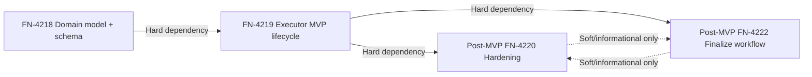

# Problem

The current Experiment Session initiative is split across four large tasks (FN-4218, FN-4219, FN-4220, FN-4222) that together mix foundational schema work, executor lifecycle, hardening, and finalize workflows. Shipping all four at once increases coordination risk and delays learning.

A smaller MVP gives stakeholders a usable try-measure-keep-revert loop quickly: persistent session storage, benchmark execution, metric parsing, and keep/discard git behavior. That enables real operator feedback before adding hardening and branch-finalize surfaces.

# Capability Overlap Matrix

| Capability | FN-4218 | FN-4219 | FN-4220 | FN-4222 | Overlap class |
|---|---|---|---|---|---|
| Session domain types/statuses/records | ✅ | ✅ (consumes) | ✅ (consumes) | ✅ (consumes) | Core overlap (must-have) |
| Persistent store + schema (`experiment_sessions`, `experiment_session_records`) | ✅ | ✅ (uses) | ✅ (uses) | ✅ (uses) | Core overlap (must-have) |
| `initExperiment` config/session bootstrap | ⚪ | ✅ | ✅ (extends lifecycle) | ⚪ | Overlap (must-have) |
| `runExperiment` benchmark execution + metric parse | ⚪ | ✅ | ✅ (adds checks/hooks/cap) | ⚪ | Overlap (must-have) |
| `logExperiment` keep/discard outcome + git policy | ⚪ | ✅ | ✅ (adds checks_failed/revert paths) | ⚪ | Overlap (must-have) |
| Post-benchmark checks (`autoresearch.checks.sh`) | ⚪ | ⚪ | ✅ | ⚪ | Single-task (deferrable) |
| Before/after hooks + steer messages | ⚪ | ⚪ | ✅ | ⚪ | Single-task (deferrable) |
| Resume from artifacts/compaction | ⚪ | ⚪ | ✅ | ⚪ | Single-task (deferrable) |
| `maxIterations` hard cap to `finalizing` | ⚪ | ⚪ | ✅ | ⚪ | Single-task (deferrable) |
| Finalize plan/group/split branches | ⚪ | ⚪ | ⚪ | ✅ | Single-task (deferrable) |
| CLI command surface (`fn experiment ...`) | ⚪ | ⚪ | ⚪ | ✅ | Single-task (deferrable) |
| Pi-extension experiment tools | ⚪ | ⚪ | ⚪ | ✅ | Single-task (deferrable) |
| Dashboard experiment finalize/session APIs/UI | ⚪ | ⚪ | ⚪ | ✅ | Single-task (deferrable) |

# MVP Scope

## In scope (ship in MVP)

1. **FN-4218 minimal domain surface**: types, store APIs, and SQLite schema for `experiment_sessions` and `experiment_session_records` with tests.
2. **FN-4219 minimal executor slice**:
   - `initExperiment`
   - `runExperiment`
   - `logExperiment({ outcome: "keep" | "discard" })`
   - METRIC parser (`METRIC name=value`)
   - async benchmark runner (non-blocking process execution)
   - keep/revert git policy for run outcomes

No CLI, pi-extension, or dashboard experiment UI/API shipping in this increment.

## MVP user flow (end-to-end)

1. Operator initializes an experiment session (name + metric definition + working directory).
2. Executor persists session row in `experiment_sessions` and appends a `config` record in `experiment_session_records`.
3. Operator runs a benchmark command through `runExperiment`.
4. Executor runs the command asynchronously, captures stdout/stderr, and parses first valid `METRIC` line as primary metric.
5. Operator reviews run output and chooses `keep` or `discard` via `logExperiment`.
6. Executor appends a `run` record to `experiment_session_records` with metric/result payload.
7. If `keep`: executor commits changes and records the kept run linkage (`bestRunId` / kept run IDs). If `discard`: executor reverts to baseline commit while preserving `autoresearch.*` artifacts.
8. Session remains `active` for additional manual iterations.

## Minimal API/domain surface (verbatim contract names)

### `@fusion/core`
- `ExperimentSessionStore`
- `ExperimentSession`
- `ExperimentSessionRecord`
- `ExperimentSessionCreateInput`
- `ExperimentSessionUpdateInput`
- `ExperimentSessionRecordAppendInput`
- `ExperimentSessionListOptions`
- `ExperimentMetricDefinition`
- `ExperimentRunRecordPayload`
- `ExperimentConfigRecordPayload`
- `EXPERIMENT_SESSION_STATUSES`
- `EXPERIMENT_RECORD_TYPES`
- `EXPERIMENT_RUN_OUTCOMES`

### `@fusion/engine`
- `ExperimentExecutor`
- `initExperiment`
- `runExperiment`
- `logExperiment`
- `parseMetricLines`
- `runBenchmark`
- `commitKept`
- `revertDiscarded`

## MVP “shipped” definition

MVP is shipped when a Fusion operator can complete one persisted experiment iteration (init → run → parse metric → keep/discard log → commit/revert) with no manual DB edits and with passing lint/test/build gates.

# Non-Goals

1. **FN-4220 checks/hook/resume/maxIterations hardening** — defer to a post-MVP hardening slice because these behaviors add failure-mode complexity and are not required to validate the base operator loop.
2. **FN-4222 finalize-into-branches workflow** — defer because branch grouping/cherry-pick orchestration is a second-phase workflow after teams first validate that kept/discarded runs are being produced consistently.
3. **Dashboard experiment session UI (views/modals/cards)** — defer to FN-4221/FN-4222 follow-up surface work; MVP can be validated from engine/store level without adding new frontend maintenance burden.
4. **Pi-extension `fn_experiment_*` tools** — defer to FN-4221 so API/tool ergonomics are designed after core runtime behavior stabilizes.
5. **CLI `fn experiment ...` command surface** — defer to FN-4222 after finalize semantics settle, to avoid reworking command contracts twice.
6. **Steer-message and advanced observability enrichment** — defer to FN-4220 hardening where hook execution is introduced.

# Metrics

1. **Adoption metric (schema-verifiable):** At least **15 `experiment_sessions` rows** created within **8 weeks** of MVP release.
   - **Source:** `experiment_sessions.createdAt` (FN-4218 schema), counted from opt-in telemetry or per-node periodic export.
   - **Threshold rationale:** conservative first target because MVP intentionally excludes CLI/UI surfaces; we expect lower initial volume than existing multi-surface research flows documented in the audit (`docs/research/pi-autoresearch-audit-2026-05.md`, “Dashboard / CLI / extension are out of sync”).

2. **Reliability metric (schema-verifiable):** At least **99% of appended `run` records** reach terminal outcomes in `{keep, discard, errored}` (no stuck `pending`) within **10 minutes** of record creation.
   - **Source:** `experiment_session_records` (`type='run'`, payload status, `createdAt`), plus executor logs from `createLogger("experiment-executor")` for timeout/error diagnostics.
   - **Threshold rationale:** AGENTS.md Engine Process Rules require async execution paths (no blocking `execSync` for user commands), so terminal completion rates should stay high under normal engine load.

3. **Operational reliability metric:** At least **99% of `runExperiment` invocations** return a structured result object (including parse warnings when needed) without unhandled rejection.
   - **Source:** `experiment-executor` logger error/info counts and run invocation counters.
   - **Threshold rationale:** minimal MVP loop has limited branches; high structured-return rate is expected before hardening features are introduced.

# Dependencies

- **Hard dependency:** FN-4218 → FN-4219 (executor imports core types/store contracts).
- **Hard dependency:** FN-4220 depends on FN-4218 + FN-4219.
- **Hard dependency:** FN-4222 depends on FN-4218 + FN-4219.
- **Independence note:** FN-4220 and FN-4222 are independent of each other and can run in parallel after MVP lands.

# Follow-ups

1. **Slice A — Core experiment schema + store baseline (FN-4218, Size M)**  
   Scope: land only the minimum session/record types, store CRUD, and SQLite migration for `experiment_sessions` + `experiment_session_records`, plus focused core tests. This intentionally excludes extra convenience APIs not required by `init/run/log`.  
   Touched packages: `@fusion/core`  
   Parent: FN-4218

2. **Slice B — Executor lifecycle skeleton (FN-4219, Size M)**  
   Scope: implement `ExperimentExecutor` with `initExperiment`, `runExperiment`, and `logExperiment` for keep/discard only, including session status guards and run-record append behavior. Exclude checks/hooks/resume/max-iteration.  
   Touched packages: `@fusion/engine` (and `@fusion/core` only if a tiny additive store contract patch is unavoidable)  
   Parent: FN-4219

3. **Slice C — Metric parser + benchmark runner hard contract (FN-4219, Size S)**  
   Scope: isolate parser grammar (`METRIC ...`) and async benchmark runner semantics (timeout, truncation, warning behavior) with dedicated unit tests; wire into Slice B. This is materially smaller than the full FN-4219 parent.  
   Touched packages: `@fusion/engine`  
   Parent: FN-4219

4. **Slice D — Keep/discard git policy module (FN-4219, Size S)**  
   Scope: implement and test `commitKept`/`revertDiscarded` and `GitOps` wrapper behavior for baseline MVP outcomes only. Defer conflict-specialization and finalize branch splitting.  
   Touched packages: `@fusion/engine`  
   Parent: FN-4219

5. **Slice E — Post-MVP hardening pack (FN-4220, Size M)**  
   Scope: add checks runner, before/after hooks, compaction-resume helpers, and `maxIterations` enforcement after the MVP loop is validated in production-like usage.  
   Touched packages: `@fusion/engine`  
   Parent: FN-4220

# Open Questions

1. Should MVP include a minimal API endpoint for operations teams, or remain engine-internal only until FN-4221/FN-4222 surfaces are ready?
2. Should `logExperiment` persist explicit baseline commit provenance per run in MVP, or leave provenance solely to git history + kept run IDs?
3. Does product want `pending` run statuses visible to users in MVP, or hidden behind internal executor/state APIs until hardening lands?
4. If adoption is below the 15-session/8-week target, should next investment go first to CLI ergonomics or dashboard UI?
5. Audit reference file `docs/research/pi-autoresearch-audit-2026-05.md` is present; no missing-audit fallback needed.
